## Problem-Solving Through Search {.center}

**Gustavo Reis**

Based on chapters 3 & 4 of *Artificial Intelligence: A Modern Approach*

**Collaboration:**

- Carlos Grilo
- Catarina Silva
- Pedro Gago

---

# Steps in Problem-Solving

## Steps in Problem-Solving

::: {.incremental}
1. **Goal Formulation** — Define the set of states or abstract property the agent must achieve.
2. **Problem Formulation** — Decide which actions and states to consider; choose a level of abstraction.
3. **Search** — Find a sequence of actions that leads from the initial state to the goal.
4. **Execution** — Carry out those actions in the real world.
:::

. . .

::: {.callout-note}
Search happens in a **model** of the world — the agent reasons before acting. Execution is only after a plan is found.
:::

## The Problem-Solving Loop

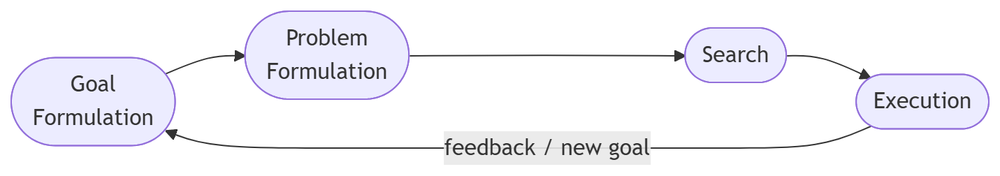{width=85% .plain}


. . .

::: {.callout-tip}
**Game relevance:** NPC AI follows exactly this loop — perceive the game state, formulate a goal (attack player, reach checkpoint), search for a plan, execute it, and adapt when the environment changes.
:::

---

# Problem Formulation

## Problem Formulation — The Four Components

. . .

**Initial State:** The agent's starting point — a complete description of the world at time 0.

. . .

**Operators (Actions):** What the agent can do. Each operator maps a state to a successor state.

$$\text{successor}(s, a) \rightarrow s'$$

. . .

**Goal Test:** Determines whether a given state $s$ satisfies the goal — either an explicit target state or a property.

. . .

**Path Cost:** A function assigning a numeric cost to a path — typically the sum of individual action step costs.

$$g(n) = \sum_{i} c(s_i, a_i, s_{i+1})$$

## State Space

. . .

The **State Space** is the set of all states reachable from the initial state by applying any sequence of operators.

. . .

Represented as a **directed graph**: nodes = states, edges = operators.

. . .

::: {.callout-note}
**Solving a problem = searching the state space** for a path from the initial state to a goal state.
:::

. . .

The state space can be **explicit** (enumerable) or **implicit** (generated on demand during search). Most real problems use implicit state spaces — they are far too large to enumerate upfront.

## Problem Formulation: 8-Puzzle

::: {.columns}
::: {.column width="40%"}
{width=85% .plain}
:::
::: {.column width="60%"}
::: {.incremental}
- **Initial State:** a particular scrambled board configuration
- **Operators:** slide the blank tile in one of up to 4 directions
- **Goal Test:** tiles arranged in order 1–8 with blank in corner
- **Path Cost:** number of moves (each step costs 1)
- **State space size:** $9!/2 = 181{,}440$ reachable configurations
:::

::: {.fragment}
::: {.callout-tip}
**Why not solve it by hand?** The 15-Puzzle (4×4) has $10^{13}$ states — A\* is needed for optimal solutions.
:::
:::
:::
:::

## Problem Formulation: Cryptarithmetic

::: {.columns}
::: {.column width="45%"}
```
  FORTY     →    29786
+   TEN     →  +   850
+   TEN     →  +   850
-------          -------
  SIXTY     →    31486
```
:::
::: {.column width="55%"}
::: {.incremental}
- **Initial State:** 10 letters, no digit assignments
- **Operators:** assign an unused digit to an unassigned letter
- **Goal Test:** all letters assigned; arithmetic sum holds
- **Path Cost:** typically zero — all valid solutions are equally good
- **State space:** up to $10!$ assignments ($\approx 3.6\text{M}$)
:::

::: {.fragment}
::: {.callout-note}
This is a **Constraint Satisfaction Problem (CSP)**. Backtracking with forward checking is far more efficient than naive search.
:::
:::
:::
:::

---

# Evaluating Agent Performance

## Evaluating Agent Performance

::: {.incremental}
- Does the agent **find** a solution at all? *(Completeness)*
- Is the solution found **good or optimal**? *(Solution quality)*
- What is the **search cost** in time and memory? *(Efficiency)*
:::

. . .

$$\text{Total Cost} = \underbrace{\text{Solution Cost}}_{\text{quality of path found}} + \underbrace{\text{Search Cost}}_{\text{time + memory used}}$$

. . .

::: {.callout-warning}
**The fundamental trade-off:** an algorithm that finds a shorter path may expand more nodes to do so. An algorithm that expands fewer nodes may return a suboptimal path. No free lunch.
:::

---

# Search Methods

## The Search Tree

. . .

Search builds a **tree** rooted at the initial state by expanding nodes — generating their successors.

::: {.columns}
::: {.column width="50%"}
::: {.incremental}
- **Node:** a state plus bookkeeping (parent, action, path cost, depth)
- **Leaf nodes:** unexpanded nodes — the **frontier**
- **Explored set:** states already expanded — prevents revisiting
:::
:::
::: {.column width="50%"}
::: {.fragment}
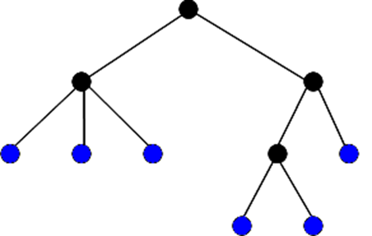{width=90% .plain}
:::
:::
:::

. . .

::: {.callout-note}
The **search tree** can be much larger than the state space — the same state may appear in multiple branches. The explored set (closed list) prevents this in graph search.
:::

## State Space Map

{width=70% .plain}

## Expanding the Search Tree

::: {.fragment}
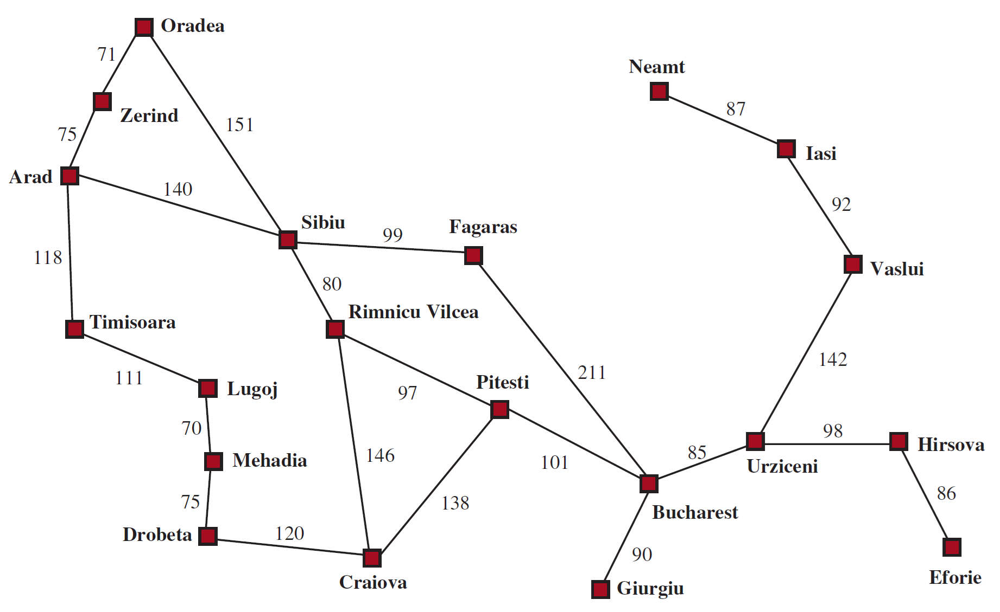{width=60% .plain}
:::

## Search Strategy — Frontier Data Structures

. . .

Every search method decides **which frontier node to expand next**. This is controlled by the choice of data structure:

| Data Structure | Order | Search Method |
|---|---|---|
| Queue (FIFO) | Shallowest first | Breadth-First Search |
| Stack (LIFO) | Deepest first | Depth-First Search |
| Priority Queue (by $g$) | Cheapest path first | Uniform-Cost Search |
| Priority Queue (by $h$) | Closest to goal first | Greedy Best-First |
| Priority Queue (by $g+h$) | Best estimated total | A\* |

---

::: {.fragment}
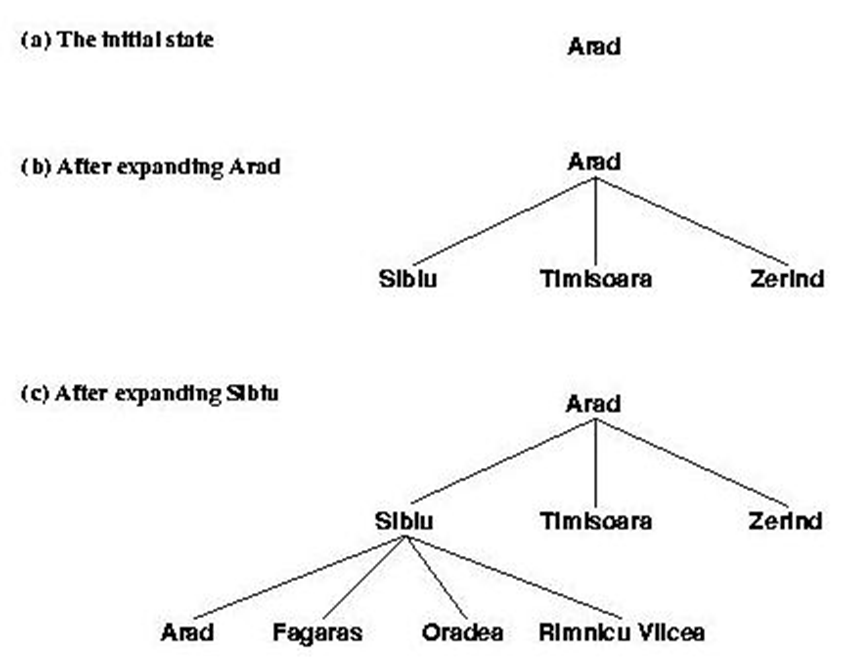{.plain}
:::

## Avoiding Pitfalls

::: {.incremental}
- **Avoid** returning to the immediate predecessor state (trivial backtrack loop).
- **Avoid** generating cycles in the search path (e.g., A→B→A→B…).
- **Avoid** regenerating states already in the frontier or explored set.
:::

. . .

**Tree search vs. Graph search:**

| | Tree Search | Graph Search |
|---|---|---|
| Explored set | ❌ Not maintained | ✅ Maintained |
| Memory | Lower | Higher |
| Duplicate states | May revisit | Never revisits |
| Preferred for | Finite acyclic spaces | General graphs |

## Evaluation of Search Methods

::: {.columns}
::: {.column width="50%"}
::: {.incremental}
- **Completeness:** Does it always find a solution if one exists?
- **Optimality:** Does it always find the *best* solution?
:::
:::
::: {.column width="50%"}
::: {.incremental}
- **Time Complexity:** Number of nodes generated/expanded.
- **Space Complexity:** Maximum nodes stored simultaneously.
:::
:::
:::

. . .

**Standard parameters:**

- $b$ — branching factor (max successors per node)
- $d$ — depth of the shallowest solution
- $m$ — maximum depth of the state space (may be $\infty$)

## Two Main Types of Search

::: {.columns}
::: {.column width="50%"}
### Uninformed (Blind) Search
No additional domain knowledge — explores based on structure alone.

::: {.incremental}
- Breadth-First Search (BFS)
- Uniform-Cost Search (UCS)
- Depth-First Search (DFS)
- Depth-Limited Search (DLS)
- Iterative Deepening Search (IDS)
- Bidirectional Search
:::
:::
::: {.column width="50%"}
### Informed (Heuristic) Search
Uses domain knowledge via a heuristic $h(n)$ to guide expansion.

::: {.incremental}
- Greedy Best-First Search
- A\*
- Beam Search
- IDA\* (Iterative Deepening A\*)
- SMA\* (Simplified Memory-Bounded A\*)
- Local search methods
:::
:::
:::

---

# Uninformed Search

## General Graph-Search Algorithm

```python
def graph_search(problem):
    frontier = PriorityQueue([Node(problem.initial_state)])
    explored = set()
    while frontier:
        node = frontier.pop()                   # ← ordering defines the method
        if problem.goal_test(node.state):
            return solution(node)
        explored.add(node.state)
        for child in expand(node, problem):
            if child.state not in explored | frontier:
                frontier.add(child)
    return failure
```

. . .

::: {.callout-note}
**The only difference between search methods** is how `frontier.pop()` selects the next node — i.e., the ordering criterion of the priority queue.
:::

## Uninformed Search — Overview

::: {.incremental}
1. **Breadth-First Search** — expand shallowest node first
2. **Uniform-Cost Search** — expand lowest $g(n)$ first
3. **Depth-First Search** — expand deepest node first
4. **Depth-Limited Search** — DFS with a depth cutoff $l$
5. **Iterative Deepening Search** — repeated DLS with increasing $l$
6. **Bidirectional Search** — simultaneous forward + backward search
:::

## Breadth-First Search

. . .

Expands nodes **level by level**: all states at depth $d$ before any state at depth $d+1$.

Uses a **queue** (FIFO) for the frontier.

::: {.fragment}
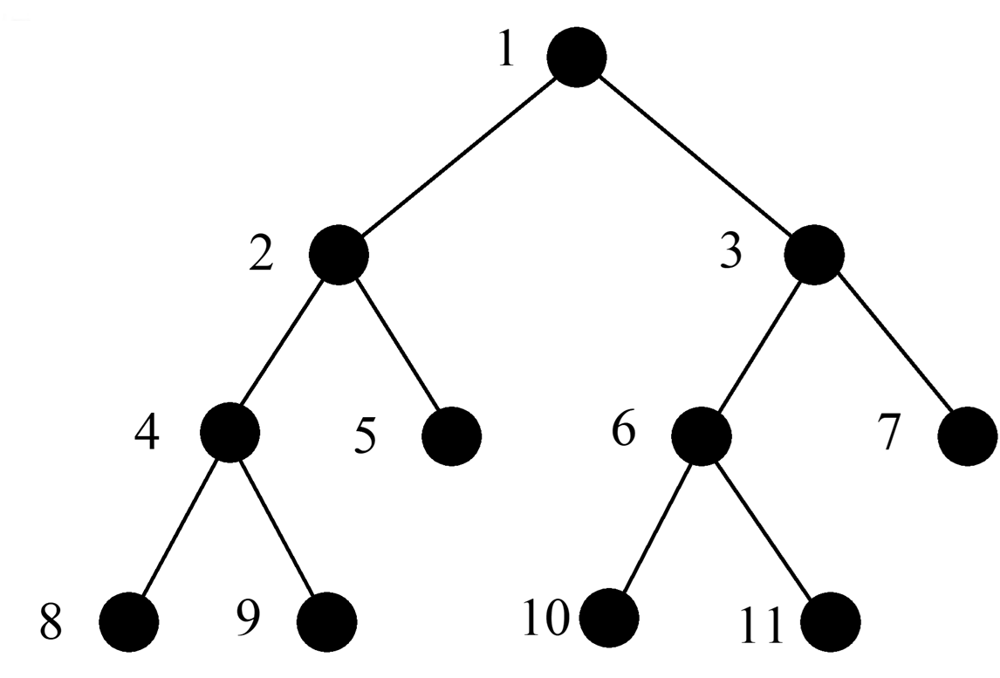{width=50% .plain}
:::

## Breadth-First Search — Properties

| Property | Value |
|---|---|
| **Complete** | Yes (if $b$ is finite) |
| **Optimal** | Yes, if all step costs are equal |
| **Time Complexity** | $O(b^d)$ |
| **Space Complexity** | $O(b^d)$ — **the critical bottleneck** |

. . .

::: {.callout-warning}
**Memory is the killer.** BFS must store all nodes at the current frontier level. At depth $d=12$, $b=10$: over $10^{12}$ nodes — terabytes of RAM.
:::

## BFS — Scalability in Practice

::: {.fragment}
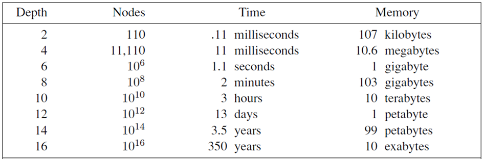{width=50% .plain}
:::

. . .

$b = 10$; 1 million nodes/second; 1000 bytes/node

| Depth | Nodes | Time | Memory |
|---|---|---|---|
| 2 | 110 | 0.11 ms | 107 KB |
| 4 | 11,110 | 11 ms | 10.6 MB |
| 6 | $10^6$ | 1.1 s | 1 GB |
| 8 | $10^8$ | 2 min | 103 GB |
| 10 | $10^{10}$ | 3 hours | 10 TB |

## Uniform-Cost Search

. . .

Always expands the node in the frontier with the **lowest path cost** $g(n)$.

- **Frontier:** priority queue ordered by $g(n)$
- Equivalent to BFS when all step costs are equal to 1

. . .

| Property | Value |
|---|---|
| **Complete** | Yes (assuming step costs $> 0$) |
| **Optimal** | Yes — finds least-cost solution |
| **Time & Space** | $O(b^{1+\lfloor C^*/\epsilon \rfloor})$ where $C^*$ = optimal cost, $\epsilon$ = min step cost |

---

::: {.fragment}
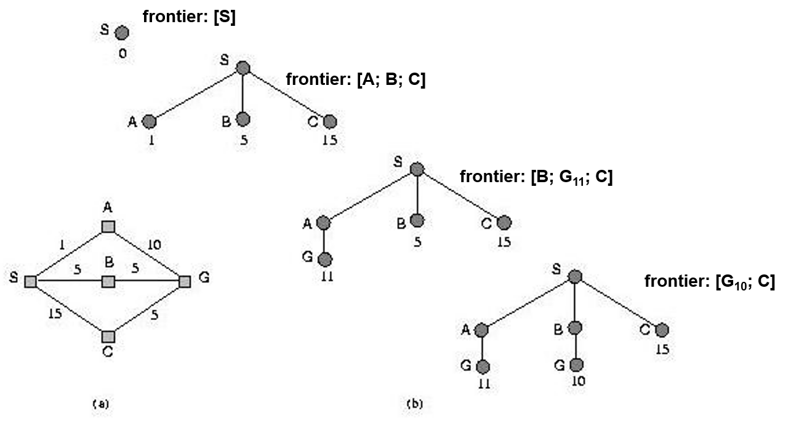{width=70% .plain}
:::

## Depth-First Search

. . .

Expands the **deepest** unexpanded node first; backtracks when reaching a dead end or goal.

Uses a **stack** (LIFO) for the frontier.

::: {.fragment}
{width=50% .plain}
:::

## Depth-First Search — Properties

| Property | Value |
|---|---|
| **Complete** | Only in finite, acyclic spaces |
| **Optimal** | No — may find longer paths first |
| **Time Complexity** | $O(b^m)$ — can be much worse than BFS |
| **Space Complexity** | $O(b \cdot m)$ — **linear** in depth |

. . .

::: {.callout-tip}
DFS is memory-efficient — it only stores nodes on the current path. This makes it practical when memory is the binding constraint.

**Game relevance:** DFS underlies backtracking algorithms used in minimax game tree search and constraint solving.
:::

## Depth-Limited Search

Performs DFS but only down to a predefined depth limit $l$ — preventing infinite descent.

**Complete** if $l \geq d$; **incomplete** otherwise.

| Property | Value |
|---|---|
| **Optimal** | No |
| **Time Complexity** | $O(b^l)$ |
| **Space Complexity** | $O(b \cdot l)$ |

. . .

::: {.callout-warning}
**The challenge:** choosing $l$ without knowing $d$ in advance. Too small → misses solutions. Too large → wastes time. **Iterative Deepening** solves this.
:::

## Iterative Deepening Search (IDS)

. . .

Run Depth-Limited Search repeatedly with **increasing depth limits**: $l = 0, 1, 2, \ldots$ until a goal is found.

::: {.fragment}
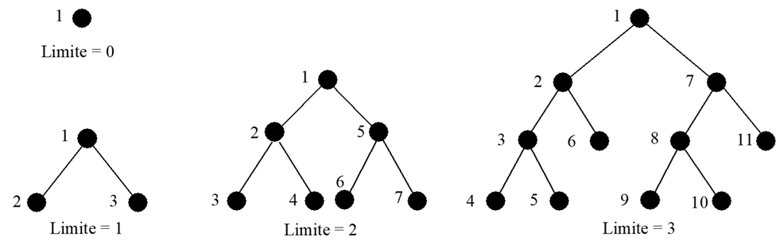{width=80% .plain}
:::

## IDS — Properties

| Property | Value |
|---|---|
| **Complete** | Yes |
| **Optimal** | Yes (uniform step costs) |
| **Time Complexity** | $O(b^d)$ |
| **Space Complexity** | $O(b \cdot d)$ — linear, like DFS |

. . .

::: {.callout-tip}
**Best of both worlds:** BFS's completeness and optimality + DFS's linear memory. **Preferred uninformed method** for large, unknown-depth state spaces.
:::

## IDS — The Cost of Re-Expansion

. . .

**Doesn't re-expanding nodes waste time?**

. . .

DFS single pass ($d=5$, $b=10$): $\;\; 1 + 10 + 100 + 1000 + 10000 + 100000 = 111{,}111$

. . .

IDS cumulative re-expansions:

$$(d+1)\cdot 1 + d\cdot b + (d-1)\cdot b^2 + \ldots + 1\cdot b^d$$

$$= 6 + 50 + 400 + 3000 + 20000 + 100000 = 123{,}456$$

. . .

::: {.callout-note}
Only **~11% overhead** — negligible given the dramatic memory savings. Upper nodes are re-expanded many times but there are exponentially fewer of them.
:::

## Bidirectional Search

. . .

Simultaneously searches **forward** from the initial state and **backward** from the goal, stopping when the two frontiers meet.

::: {.fragment}
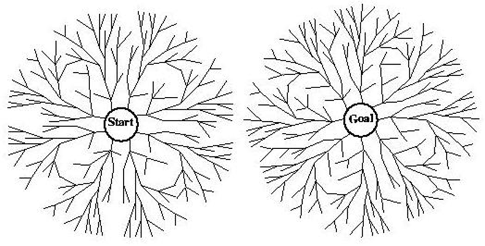{width=80% .plain}
:::

## Bidirectional Search — Properties

| Property | Value |
|---|---|
| **Complete** | Yes |
| **Optimal** | Yes (with BFS or UCS in both directions) |
| **Time & Space** | $O(b^{d/2})$ — exponentially better than $O(b^d)$ |

. . .

**Requirements and limitations:**

::: {.incremental}
- Must be able to **generate predecessor states** (reverse operators)
- Goal state must be **explicit** — hard when goal is defined by a property
- Need an efficient way to **detect intersection** between the two frontiers
:::

---

# Informed (Heuristic) Search

## From Uninformed to Informed

. . .

Uniform-Cost Search finds the cheapest path — but expands nodes in all directions without any sense of which way the goal lies.

. . .

**Informed search** uses an **evaluation function** $f(n)$ incorporating domain knowledge via a heuristic $h(n)$:

$$f(n) = \text{some combination of } g(n) \text{ and } h(n)$$

. . .

The frontier is always ordered by $f(n)$ — the most promising node is expanded first.

## Heuristic Function $h(n)$

. . .

$h(n)$ estimates the cost of the **cheapest path** from node $n$ to the goal:

::: {.incremental}
- $h(n) \geq 0$ for all non-goal nodes
- $h(n) = 0$ if $n$ is a goal state
- $h(n) = \infty$ if the goal is unreachable from $n$
:::

## Heuristic Examples — 8-Puzzle

::: {.columns}
::: {.column width="50%"}
**$h_1$ — Misplaced Tiles**

Count tiles not in their goal position.

Simple, fast to compute, but coarse — does not account for *how far* tiles are from their goal.
:::
::: {.column width="50%"}
**$h_2$ — Manhattan Distance**

Sum of horizontal + vertical distances of each tile from its goal position:

$$h_2(n) = \sum_{i=1}^{8} |row_i - row_i^*| + |col_i - col_i^*|$$

Finer estimate — **dominates** $h_1$: $h_2(n) \geq h_1(n)$ always.
:::
:::

. . .

::: {.callout-note}
**Dominance:** if $h_2(n) \geq h_1(n)$ for all $n$ and both are admissible, $h_2$ is **always preferred** — it expands fewer nodes.
:::

## Heuristic Examples — Other Problems

::: {.incremental}
- **Missionaries & Cannibals:** number of people still on the starting bank — a rough lower bound on moves needed.
- **Route planning:** straight-line distance (Euclidean) to the goal — always an underestimate if roads are not perfectly straight.
- **TSP:** minimum spanning tree of unvisited cities — admissible lower bound on the remaining tour cost.
:::

## Types of Informed Search Methods

::: {.incremental}
- **Greedy Best-First Search** — $f(n) = h(n)$
- **A\*** — $f(n) = g(n) + h(n)$
- **Beam Search** — width-limited Best-First
- **IDA\*** — iterative deepening on $f(n)$
- **SMA\*** — memory-bounded A\*
- **Local search methods** — Hill-Climbing, SA, GA (no path maintained)
:::

## Greedy Best-First Search

. . .

Expands the node **closest to the goal** according to the heuristic:

$$f(n) = h(n)$$

::: {.incremental}
- **Complete** in finite state spaces
- **Not optimal** — easily misled by heuristic inaccuracies
- **Time & Space:** $O(b^m)$ worst case
:::

## Greedy Best-First — Example

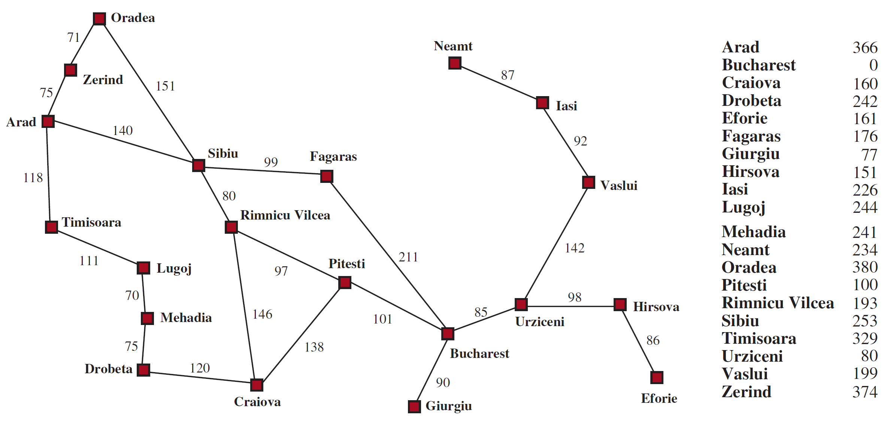{width=70% .plain}

. . .

$h_{SLD}(n)$ = straight-line distance from $n$ to Bucharest

## Greedy Best-First — Expansion

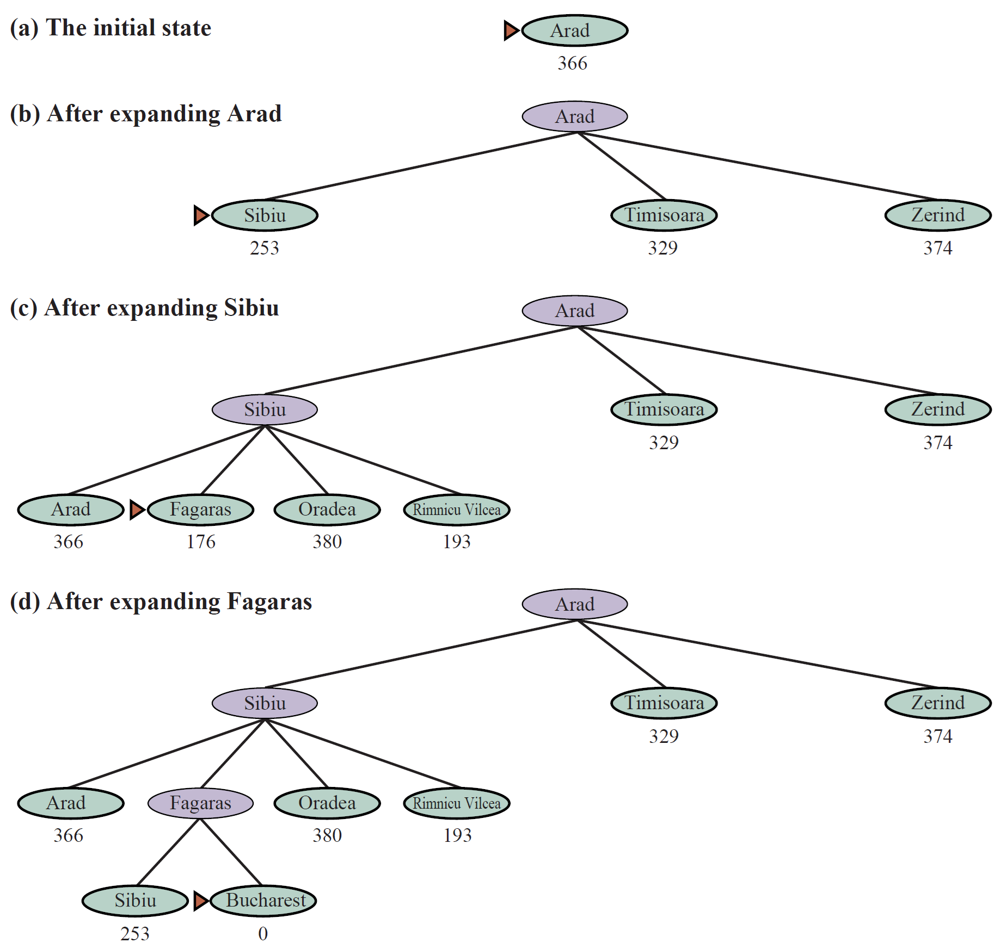{width=50% .plain}

## A\* Search

. . .

Expands the node with the smallest **combined estimate**:

$$f(n) = g(n) + h(n)$$

- $g(n)$: actual cost from start to node $n$
- $h(n)$: estimated cost from $n$ to goal

. . .

::: {.callout-note}
$f(n)$ estimates the **total cost** of the cheapest solution through $n$. A\* always expands the node most likely to be on the optimal path.
:::

## A\* — Admissibility & Optimality

. . .

**Admissible heuristic:** $h(n)$ never overestimates the true cost to the goal.

$$h(n) \leq h^*(n) \quad \forall n$$

where $h^*(n)$ is the true optimal cost from $n$.

. . .

::: {.callout-important}
If $h$ is **admissible**, A\* is **complete** and **optimal** on trees. On graphs, **consistency** is additionally required.
:::

## A\* — Consistency (Monotonicity)

. . .

A heuristic is **consistent** if for every node $n$ and successor $n'$:

$$h(n) \leq c(n, a, n') + h(n')$$

This is the **triangle inequality** for heuristics.

::: {.columns}
::: {.column width="50%"}
::: {.fragment}
::: {.callout-note}
Consistency ⟹ Admissibility (but not vice versa).

If $h$ is consistent, A\* with graph search is optimal — the first time a node is expanded, the path to it is guaranteed cheapest.
:::
:::
:::
::: {.column width="50%"}
::: {.fragment}
**Consequence:** $f(n)$ is non-decreasing along any path A\* follows — nodes are expanded in order of increasing $f$ value.
:::
:::
:::

## A\* — Step by Step (1)

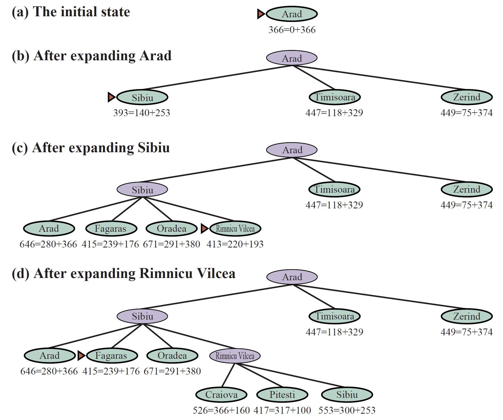{width=50% .plain}

## A\* — Step by Step (2)

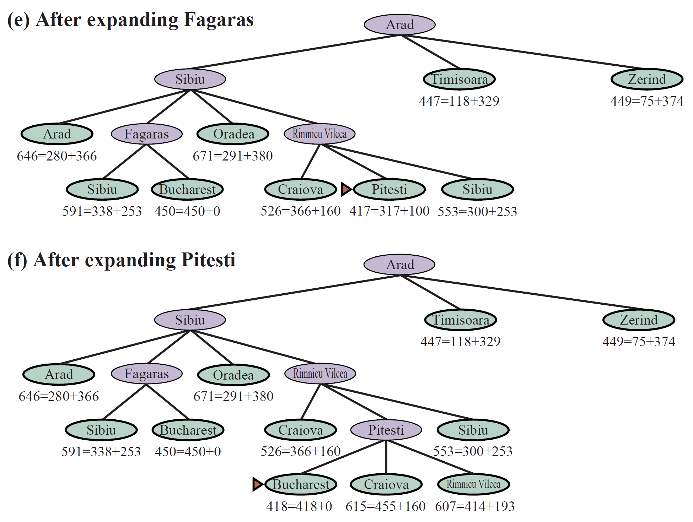{width=50% .plain}

## Beam Search

::: {.incremental}
- Similar to A\*, but keeps only up to $W$ best nodes in the frontier (the **beam width**)
- Discards all other generated nodes — trades completeness for memory
- **Not complete** or **optimal**, but often very effective on large spaces
:::

. . .

| Width $W$ | Behaviour |
|---|---|
| $W = 1$ | Equivalent to Greedy Best-First |
| $W = \infty$ | Equivalent to A\* (full frontier) |
| $1 < W < \infty$ | Trade-off: memory vs. solution quality |

. . .

::: {.callout-tip}
**Game relevance:** Beam Search is used in game AI for dialogue generation, strategy planning, and anytime NPC decision-making under time pressure.
:::

## IDA\* (Iterative Deepening A\*)

. . .

Uses iterative deepening, but the cutoff is on **$f(n) = g(n) + h(n)$** rather than depth:

::: {.incremental}
1. Set threshold $F = h(\text{initial state})$
2. DFS, pruning any node with $f(n) > F$
3. If goal found: return solution
4. Set $F \leftarrow \min\{f(n) : f(n) > F\}$ — smallest $f$ that exceeded the threshold
5. Repeat
:::

. . .

| Property | Value |
|---|---|
| **Complete & Optimal** | Yes (admissible $h$) |
| **Memory** | $O(b \cdot d)$ — DFS-level |
| **Re-expansions** | Yes — similar overhead to IDS |

## SMA\* (Simplified Memory-Bounded A\*)

. . .

Runs A\* within a **fixed memory budget**:

::: {.incremental}
- Uses all available memory for the frontier
- When memory is full: drop the node with the **worst $f(n)$**
- Store the dropped node's $f$ value in its parent (backup cost)
- Re-expand only if all other paths look worse
:::

. . .

| Property | Value |
|---|---|
| **Complete** | Yes, if shallowest solution fits in memory |
| **Optimal** | Yes, if memory is sufficient |

. . .

::: {.callout-note}
SMA\* is the practical choice when you want A\* behaviour but must operate within a strict RAM limit.
:::

---

# Heuristics

## Admissible vs. Non-Admissible

::: {.columns}
::: {.column width="50%"}
**Admissible**

Never overestimates the true cost to the goal.

$$h(n) \leq h^*(n)$$

- Guarantees A\* optimality
- May require more node expansions if the estimate is loose
:::
::: {.column width="50%"}
**Non-Admissible**

May overestimate — guides search more aggressively.

- Faster in practice if a suboptimal solution is acceptable
- A\* is no longer guaranteed optimal
- **Weighted A\*:** $f(n) = g(n) + w \cdot h(n)$, $w > 1$ — bounded suboptimality
:::
:::

. . .

::: {.callout-warning}
Never use a non-admissible heuristic with A\* accidentally. Choose deliberately based on whether optimality is required.
:::

## Good Heuristic Properties

::: {.incremental}
- **Fast to compute** — overhead must not outweigh the savings in node expansions.
- **Tight estimate** — the closer $h(n)$ is to $h^*(n)$, the fewer nodes are expanded.
- **Admissible and consistent** — guarantees correctness and optimality with A\*.
- **Dominating** — if you have multiple admissible heuristics, always take the max.
:::

## Deriving Heuristics from Relaxations

. . .

A heuristic can be derived by solving a **relaxed version** of the problem — a version with fewer constraints.

. . .

**8-Puzzle examples:**

| Relaxation | Heuristic |
|---|---|
| Tiles can move to *any* square (ignore blocking) | $h_1$ = misplaced tiles |
| Tiles can move through each other | $h_2$ = Manhattan distance |
| No constraints at all | $h = 0$ (trivially admissible, useless) |

. . .

::: {.callout-note}
The **optimal solution** to the relaxed problem is always an admissible lower bound on the original — because any solution to the original is also a (possibly non-optimal) solution to the relaxed problem.
:::

## Combining Multiple Heuristics

. . .

If you have several admissible heuristics $h_1, h_2, \ldots, h_k$ that do not dominate each other, combine them:

$$h(n) = \max\bigl(h_1(n),\; h_2(n),\; \ldots,\; h_k(n)\bigr)$$

. . .

This composite heuristic is still **admissible** and **dominates** each individual $h_i$, leading to fewer node expansions at no additional cost (just a max operation).

## Statistical and Learned Heuristics

. . .

**Statistical heuristics** are not strictly admissible but are derived empirically from solved instances. They can be faster in practice even if they occasionally overestimate.

. . .

**Learned heuristics** — trained via supervised or reinforcement learning:

::: {.incremental}
- **Pattern databases:** precompute exact costs for subproblems; use as lookup table
- **Neural network heuristics:** learn $h^*(n)$ directly from experience — used in AlphaZero, game solvers
- Can dramatically outperform hand-crafted heuristics for complex domains (Rubik's Cube, protein folding, Go)
:::

---

# Scope & Limitations

## Scope of Classical Search

. . .

Classical search algorithms apply cleanly in environments that are:

::: {.incremental}
- **Fully observable** — the agent can see the complete state at all times
- **Deterministic** — actions have perfectly predictable outcomes
- **Static** — the environment does not change while the agent is planning
- **Discrete** — a finite (or countably infinite) number of states and actions
:::

. . .

::: {.callout-warning}
Real-world (and game) environments often violate one or more of these. Extensions are needed: **probabilistic planning**, **partial observability (POMDP)**, **real-time search (LRTA\*)**, **continuous action spaces**.
:::

## Real-Time Search in Games

. . .

Games impose strict **time budgets** — the AI cannot pause the game to think.

. . .

**Anytime algorithms** return the best solution found so far and can be interrupted at any point:

::: {.incremental}
- **Anytime A\*:** run weighted A\* with decreasing $w$, refining the solution over time
- **LRTA\* (Learning Real-Time A\*):** interleaves search and execution — the agent acts, learns $h$ values from experience, and improves over repeated runs
- **MCTS (Monte Carlo Tree Search):** simulates random playouts to estimate node value; used in Go (AlphaGo), chess, and many commercial games
:::

## Beyond Classical Search — MCTS

. . .

**Monte Carlo Tree Search** is the dominant game AI algorithm for adversarial and large-state-space problems:

::: {.incremental}
1. **Selection:** traverse the tree using UCB1 to balance exploration/exploitation
2. **Expansion:** add a new child node
3. **Simulation:** run a random (or guided) playout to a terminal state
4. **Backpropagation:** update win statistics up the tree
:::

. . .

::: {.callout-tip}
**Game relevance:** MCTS powers AlphaGo/AlphaZero, is used in Civilization, Total War, and many others. It requires no heuristic — it learns value estimates from self-play.
:::

## Limitations of Informed Search

. . .

The "intelligence" in informed search partly resides in **how the heuristic is designed**, not only in the algorithm.

. . .

::: {.callout-important}
**Real intelligence = heuristic design.** The hardest part is engineering or learning a $h(n)$ that guides search efficiently without over- or underestimating systematically.
:::

. . .

A poor heuristic can make A\* perform **worse than BFS** — it expands nodes in a misleading order while also paying the overhead of computing $h(n)$.

---

# Conclusion

## Final Observations

::: {.incremental}
- The choice of search algorithm depends on **problem constraints**: branching factor, solution depth, cost structure, memory budget, and time budget.
- The **quality of the heuristic** is often more impactful than the choice of algorithm.
- Uninformed search is essential when **no domain knowledge** is available.
- For game AI: **A\* + NavMesh** for pathfinding, **MCTS** for decision-making, **local search** for configuration problems.
:::

## Algorithm Comparison Summary

| Algorithm | Complete | Optimal | Time | Space |
|---|---|---|---|---|
| BFS | ✅ | ✅\* | $O(b^d)$ | $O(b^d)$ |
| Uniform-Cost | ✅ | ✅ | $O(b^{C^*/\epsilon})$ | $O(b^{C^*/\epsilon})$ |
| DFS | ⚠️ | ❌ | $O(b^m)$ | $O(bm)$ |
| Depth-Limited | ⚠️ | ❌ | $O(b^l)$ | $O(bl)$ |
| IDS | ✅ | ✅\* | $O(b^d)$ | $O(bd)$ |
| Bidirectional | ✅ | ✅\* | $O(b^{d/2})$ | $O(b^{d/2})$ |
| Greedy | ⚠️ | ❌ | $O(b^m)$ | $O(b^m)$ |
| A\* | ✅ | ✅† | $O(b^d)$ | $O(b^d)$ |
| IDA\* | ✅ | ✅† | $O(b^d)$ | $O(bd)$ |
| SMA\* | ⚠️ | ⚠️ | — | bounded |

\* uniform step costs &nbsp;&nbsp; † admissible heuristic &nbsp;&nbsp; ⚠️ conditional

---

# References

## References & Further Reading

- Russell, S. & Norvig, P., *Artificial Intelligence: A Modern Approach*, 4th ed. (Ch. 3 & 4)
- Millington, I. & Funge, J., *Artificial Intelligence for Games*, 2nd ed. — Part I: Movement & Pathfinding
- Hart, P.E., Nilsson, N.J., Raphael, B. (1968). *A Formal Basis for the Heuristic Determination of Minimum Cost Paths.* IEEE Trans. Systems Science and Cybernetics.
- Korf, R.E. (1985). *Depth-first iterative-deepening: An optimal admissible tree search.* Artificial Intelligence, 27(1).
- Coulom, R. (2006). *Efficient Selectivity and Backup Operators in Monte-Carlo Tree Search.* CG 2006.
- Silver, D. et al. (2016). *Mastering the game of Go with deep neural networks and tree search.* Nature, 529.
- Slides by Gustavo Reis, revised by Carlos Grilo, Catarina Silva & Pedro Gago
