## Solving Problems by Searching {.center}

**Gustavo Reis**

Based on chapters 3 & 4 of *Artificial Intelligence: A Modern Approach*

**Collaboration:**

- Carlos Grilo
- Catarina Silva
- Pedro Gago

---

# Sample Problems

## Sample Problems

In AI, many problems can be viewed as search tasks. Examples include:

::: {.incremental}
- **The 8-Puzzle**
- **Cryptarithmetic:** e.g. FORTY + TEN + TEN = SIXTY
- **N-Queens**
- **Missionaries & Cannibals**
- **Timetabling & Scheduling**
- **Space Optimization**
- **Traveling Salesman Problem (TSP)**
- **VLSI Design Layout**
- **Pathfinding** (e.g. route planning on maps)
:::

## 8-Puzzle

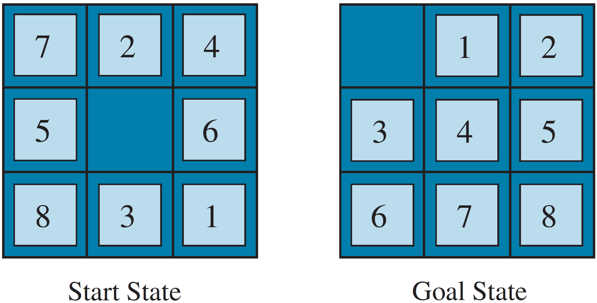{width=50% .plain}

## Cryptarithmetic

```
FORTY       29786
+ TEN       +  850
+ TEN       +  850
-------    -------
SIXTY       31486
```

## N-Queens

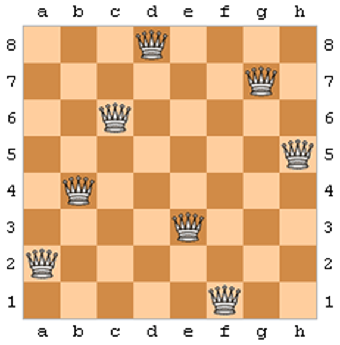{width=40% .plain}

## Missionaries and Cannibals

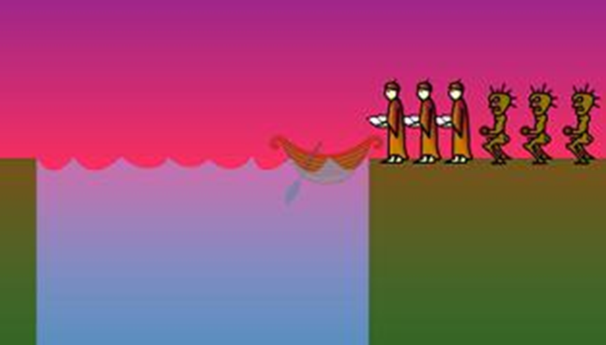{width=40% .plain}

## Timetabling

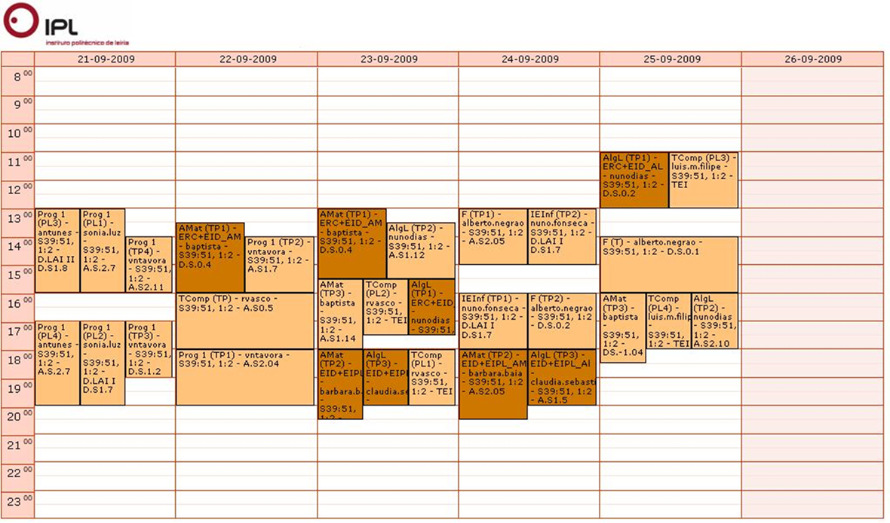{width=70% .plain}

## Space Optimization

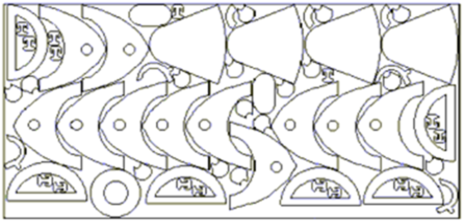{width=70% .plain}

## Traveling Salesman Problem

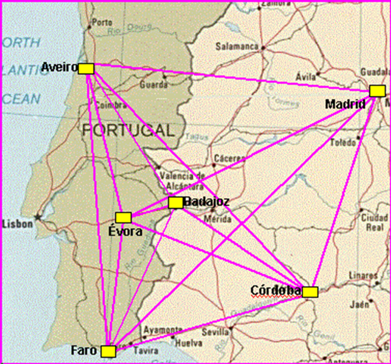{width=40% .plain}

## VLSI Design Layout

{width=70% .plain}

## Path Finding

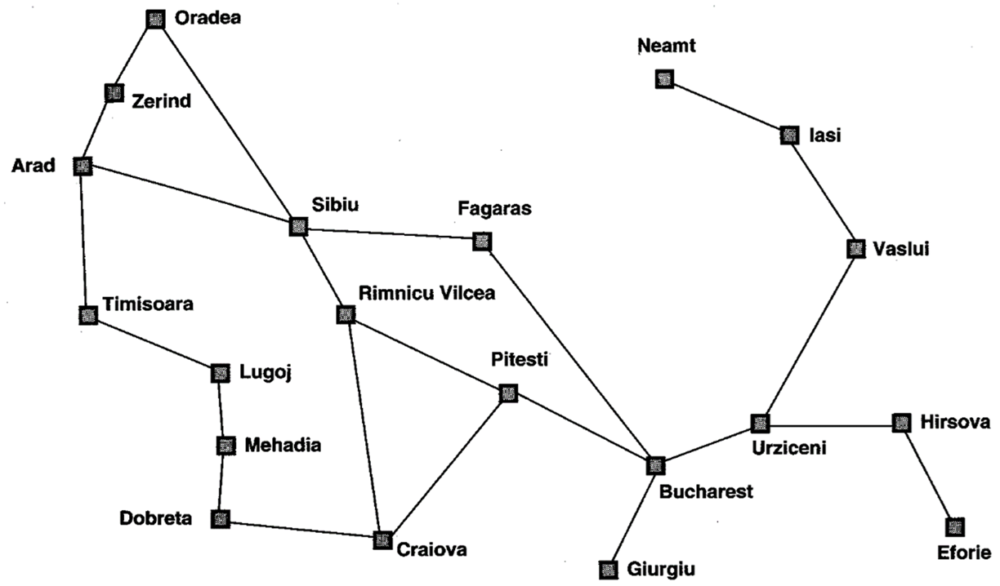{width=80% .plain}

---

# Two Major Problem Types

## Two Major Problem Types

. . .

**Type 1:** The agent starts from an initial state and seeks a sequence of actions that leads to a goal state.

*(Examples: 8-Puzzle, Missionaries & Cannibals, Pathfinding)*

. . .

**Type 2:** The agent is searching for a specific configuration of the problem itself. We only need the final "state," not the sequence of actions.

*(Examples: N-Queens, VLSI, Timetabling)*

. . .

In Type 2 problems, we often use *iterative improvement* approaches that start with a complete configuration and refine it until we find a satisfactory solution.

---

# Iterative Improvement

## Iterative Improvement

. . .

In this type of problem, the solution consists in a state with some specific properties and **not** a sequence of actions (operators) that allows the agent to reach a goal state departing from an initial state.

. . .

The algorithms used in these problems start with a **complete configuration** of the problem (state) and proceed by making modifications to that configuration in order to improve it.

. . .

These algorithms belong to a class of algorithms called **iterative improvement** search.

## Iterative Improvement

. . .

Iterative improvement algorithms keep a complete configuration of the problem (sometimes called a *solution*) and change it incrementally to seek better solutions.

::: {.incremental}
- These algorithms are also known as **local search methods**.
- Unlike standard tree/graph searches, they don't build paths from start to goal; rather, they refine a single state.
- Examples include Hill-Climbing, Simulated Annealing, Beam Search, Tabu Search, Evolutionary Algorithms, etc.
:::

## Nomenclature

. . .

In the previous slides, the terms [state]{style="color:#8be9fd"}, [configuration]{style="color:#ff5555"} and [solution]{style="color:#50fa7b"} are used reciprocally.

. . .

Depending on the algorithm or the context, the terms [node]{style="color:#ffb86c"} and *individual* are also used with the same meaning.

. . .

In these slides we will use the term [**solution**]{style="color:#50fa7b"}.

## Iterative Improvement — Formal Definition

. . .

Let us consider a function $y = f(x_1, x_2, \dots, x_n)$

::: {.incremental}
- $y$ may represent, for example, profit, number of produced units, etc.
- $x_1, x_2, \dots, x_n$ may represent, for example, the pressure level, temperature, etc.
:::

. . .

Suppose that we want to know the combination of $x_1, x_2, \dots, x_n$ values that **maximize** the value of $y$.

::: {.fragment}
Notice that the combination $x_1, x_2, \dots, x_n$ represents a possible **solution**.
:::

. . .

**Question:** How can we do this?

. . .

We will call $f$ the **evaluation function** since it evaluates the quality of the solution (also called the **objective function**).

## Solution Space

. . .

**Solution space:** set of possible combinations of the $x_1, x_2, \dots, x_n$ values.

. . .

The solution space is also called **search space:**

::: {.fragment}
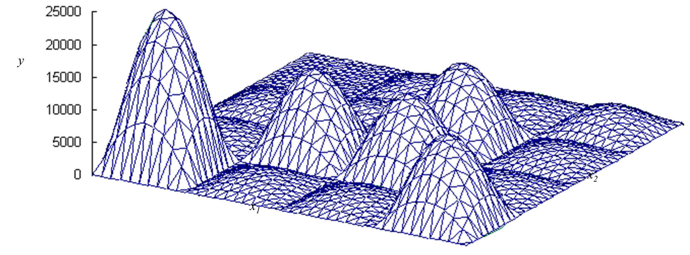{width=40% .plain}
:::

::: {.fragment}
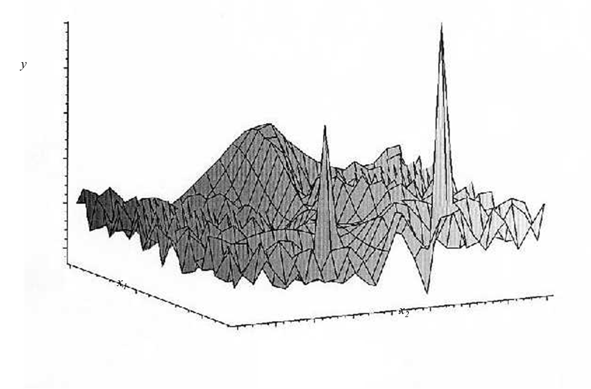{width=40% .plain}
:::

## Exhaustive Search

. . .

**Approach 1:** exhaustive analysis of the solution space.

. . .

**Problem:** the solution space is often too large or even infinite, whereby it is not possible to exhaustively analyse it.

## Random Search

. . .

**Approach 2:** search the solution space randomly.

. . .

**Problems:**

::: {.incremental}
- Extremely inefficient.
- It doesn't take into account any information about already explored solutions.
:::

## Differential Calculus

. . .

**Approach 3:** differential calculus.

. . .

**Problems:**

::: {.incremental}
- What if $f(x_1, x_2, \dots, x_n)$ is discontinuous, as is common in real problems?
- Local maxima.
:::

---

# The "Landscape" Analogy

## The "Landscape" Analogy

. . .

We can imagine each possible solution as a point in a "landscape."

::: {.incremental}
- The height/elevation of that point represents the quality (value) of the solution.
- Our goal: find the **global maximum** (best solution) in this landscape.
:::

. . .

Challenges: local maxima, plateaus, and ridges can trap simple algorithms like naïve Hill-Climbing.

::: {.fragment}
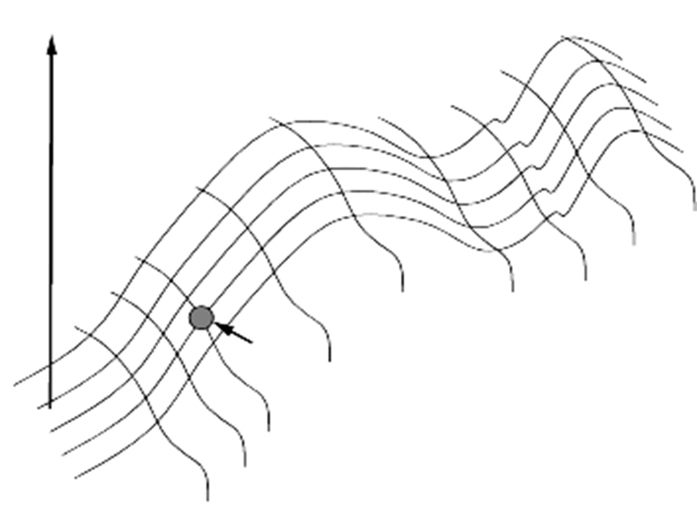{width=40% .plain}
:::

---

# Hill-Climbing

## Hill-Climbing

::: {.incremental}
1. Start with a random solution.
2. Evaluate all "neighboring" solutions (small modifications).
3. Move to the neighbor with the best improvement.
4. Repeat until no better neighbor exists.
:::

. . .

*Weaknesses:* it can get stuck on local maxima, plateaus, or ridges.

. . .

Common remedy: restart from another random solution whenever progress stalls.

## Hill-Climbing

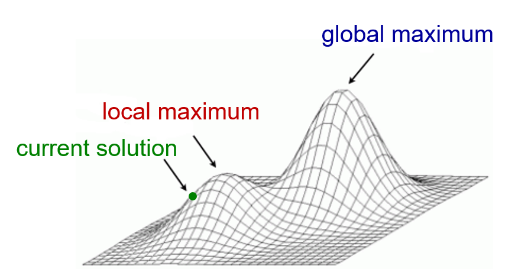{width=40% .plain}

. . .

A local maximum is a point in the space $x$ for which the value of $f$ is the highest in the neighbourhood of $x$, existing, however, another point outside the neighbourhood of $x$ for which the value of $f$ is largest.

---

# Simulated Annealing

## Simulated Annealing

. . .

A modified form of Hill-Climbing that occasionally accepts **worse moves**.

::: {.incremental}
- New solutions are always accepted if they are better.
- Worse solutions are sometimes accepted (with a probability that decreases over time).
- A "temperature" parameter $T$ controls how likely we are to accept worse moves.
:::

. . .

By allowing occasional bad moves, Simulated Annealing can "escape" local maxima, but it requires careful tuning of the **cooling schedule**.

---

# Beam Search

## Beam Search

. . .

An iterative improvement method that keeps a **population** of solutions:

::: {.incremental}
- Maintain $n$ current solutions.
- Generate successors for each solution (e.g., $k$ new variants per solution).
- Select the best $n$ among all generated successors to form the new population.
:::

. . .

Similar to a "multi-track" Hill-Climbing, but still can get trapped in local maxima if the population converges prematurely.

---

# Other Iterative Improvement Methods

## Other Iterative Improvement Methods

::: {.incremental}
- **Tabu Search:** Maintains a memory of recently visited solutions to avoid revisiting them.
- **Evolutionary Algorithms (Genetic Algorithms):** Based on selection, crossover, and mutation to evolve better solutions over generations.
- **Ant Colony Optimization:** Uses paths and pheromone trails for combinatorial optimization.
- **Particle Swarm Optimization:** Models solutions as moving "particles" that guide each other via velocity and position updates.
- **Bees Algorithm:** Mimics honeybee foraging strategies.
:::

---

# Conclusion

## Conclusion

. . .

We've seen two main types of problems in AI:

**(1)** Sequence-of-actions problems.

**(2)** Configuration or iterative-improvement problems.

. . .

Iterative improvement offers a powerful way to handle large or complex search spaces, especially when a single end-state is needed instead of a full path.

. . .

*Key takeaway:* Choosing the right search algorithm depends on the problem type, the size of the space, and the nature of the objective function.

---

# References

## References & Further Reading

::: {.incremental}
- Stuart Russell & Peter Norvig, *Artificial Intelligence: A Modern Approach*
- Wikipedia:
  - "Hill Climbing"
  - "Simulated Annealing"
  - "Beam Search"
- Additional slides by Gustavo Reis
:::
