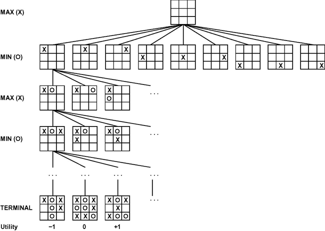
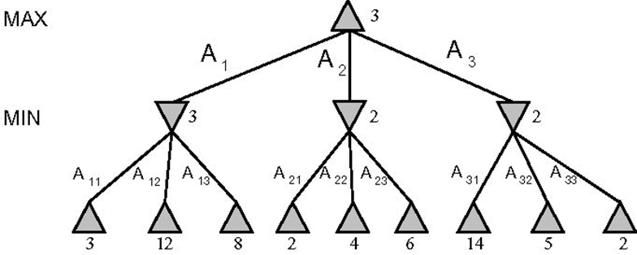
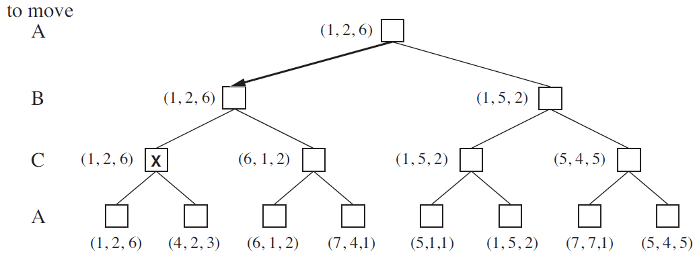
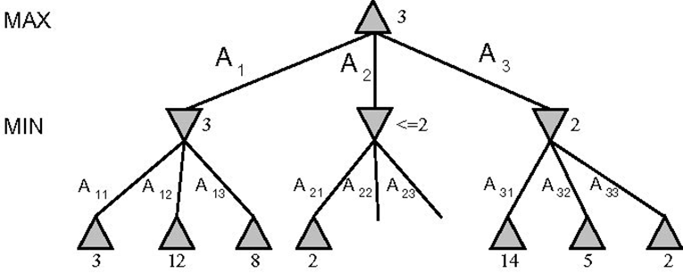
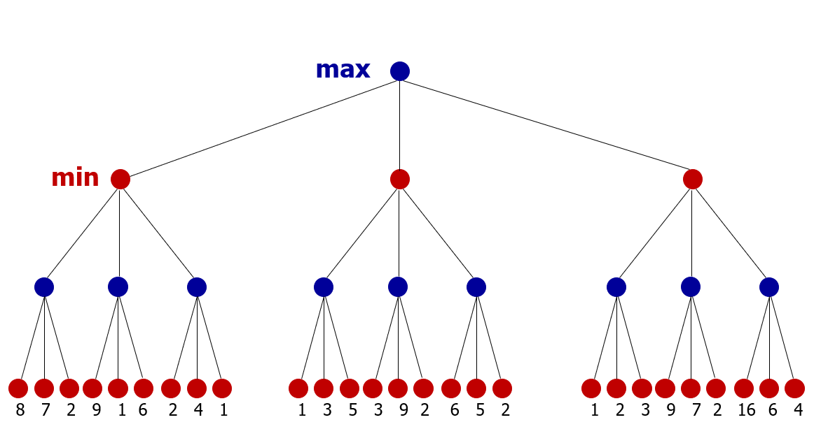
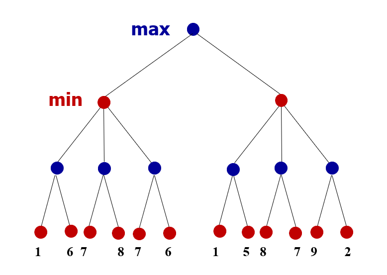
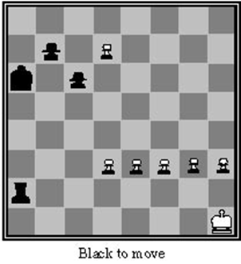
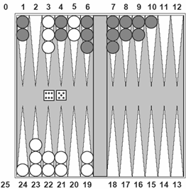
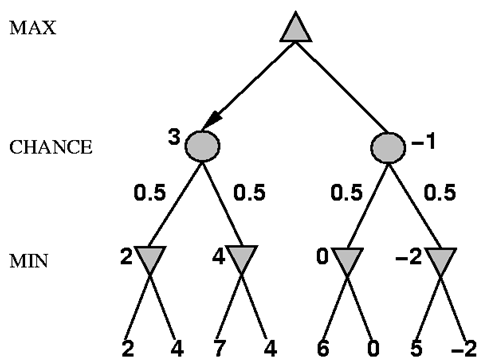
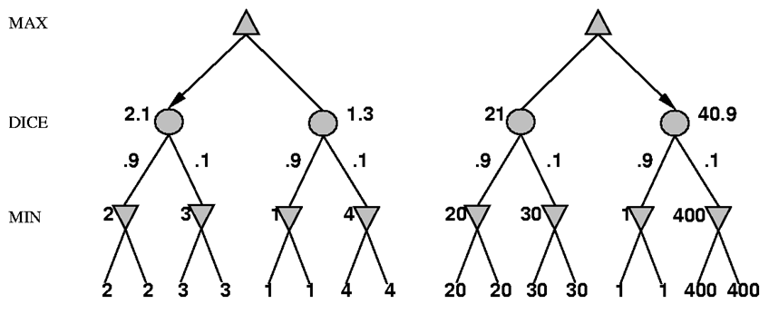

## Introduction to AI in Games

::: {.fragment}
Games provide idealized worlds where opponents actively try to diminish the welfare of our agent
:::

::: {.fragment}
The presence of opponents introduces uncertainty into decision-making, as we cannot predict with 100% certainty what they will do
:::

---

## Challenges in Game AI

::: {.fragment}
Game search spaces are typically very large, making complete exploration impossible
:::

::: {.fragment}
Time constraints limit our ability to evaluate all possibilities
:::

::: {.fragment}
These limitations create uncertainty about the consequences of our decisions
:::

---

## Why Study Games in AI?

::: {.fragment}
Games have clear, well-defined rules and boundaries
:::

::: {.fragment}
They offer enormous state spaces, making them ideal for testing search algorithms
:::

::: {.fragment}
Game AI techniques can be transferred to other domains (robotics, planning, optimization)
:::

::: {.fragment}
They provide controlled environments for developing and testing new AI approaches
:::

---

## Key Characteristics of Games

::: {.fragment}
**Environmental Access:** Complete or partial information about the game state
:::

::: {.fragment}
**Contingency:** The opponent can disrupt our plans
:::

::: {.incremental}
- An agent may formulate a winning strategy but cannot guarantee its execution
- This often requires developing new plans in response to opponent moves
:::

---

## Additional Game Characteristics

::: {.fragment}
**Large State Spaces:** Chess has approximately $10^{43}$ legal positions
:::

::: {.fragment}
**Time Constraints:** Decisions must be made within specific time limits
:::

::: {.fragment}
**Randomness:** Some games include elements of chance (dice, cards)
:::

---

## Formal Definition of a Game

::: {.incremental}
- **Initial State:**
  - Starting configuration of the game
  - Determination of which player moves first
- **Actions(state):** Returns valid operators in a state or resulting states
- **Terminal_Test(state):** Returns true if the state is an end game position
- **Utility_Function(state):** Returns a numeric value for terminal states
:::

---

## Max and Min Players

::: {.fragment}
In two-player games, we refer to the players as **Max** and **Min**
:::

::: {.fragment}
**Max** represents our AI agent (trying to maximize the score)
:::

::: {.fragment}
**Min** represents the opponent (trying to minimize the score)
:::

---

## The Challenge of Game AI

::: {.fragment}
In standard search problems, **Max** seeks a sequence of moves leading to victory
:::

::: {.fragment}
In adversarial games, **Min** actively counters our strategy
:::

::: {.fragment}
**Max** must find a strategy that leads to victory regardless of **Min's** actions
:::

---

## Game Tree Representation



::: {.fragment}
Alternating layers represent Max's and Min's turns
:::

---

## The Minimax Algorithm

::: {.fragment}
Minimax determines the optimal strategy by assuming both players play perfectly
:::

::: {.fragment}
It works by analyzing the entire game tree to find the best possible move
:::

::: {.fragment}
The algorithm recursively evaluates positions from the perspective of alternating players
:::

---

## Minimax Characteristics

::: {.fragment}
**Principle:** Generate the complete game tree and determine the best move for Max
:::

::: {.fragment}
**Complexity Analysis:**
:::

::: {.incremental}
- Space complexity: $O(b \times m)$
- Time complexity: $O(b^{m})$
:::

::: {.fragment}
Where $b$ = branching factor (number of legal moves) and $m$ = maximum tree depth
:::

---

## Minimax Procedure

::: {.incremental}
1. Generate the complete game tree down to terminal nodes
2. Apply the utility function to evaluate all terminal positions
3. Propagate values upward according to player type:
   - **Max nodes:** Take the maximum value from child nodes
   - **Min nodes:** Take the minimum value from child nodes
4. Continue propagation until the root node
5. Select the move that leads to the highest value for Max
:::

---

## Minimax Example



::: {.fragment}
Values propagate upward based on player type (Max or Min)
:::

---

## Minimax Implementation

```
function MINIMAX-DECISION(state) returns an action
    max_value = -∞
    best_action = null
    for each action in ACTIONS(state) do
        v = MIN-VALUE(RESULT(state, action))
        if v > max_value then
            max_value = v
            best_action = action
    return best_action

function MAX-VALUE(state) returns a utility value
    if TERMINAL-TEST(state) then return UTILITY(state)
    v = -∞
    for each action in ACTIONS(state) do
        v = max(v, MIN-VALUE(RESULT(state, action)))
    return v

function MIN-VALUE(state) returns a utility value
    if TERMINAL-TEST(state) then return UTILITY(state)
    v = +∞
    for each action in ACTIONS(state) do
        v = min(v, MAX-VALUE(RESULT(state, action)))
    return v
```

---

## Minimax in Multi-Player Games



::: {.fragment}
With more than two players, each level of the tree represents a different player's turn
:::

::: {.fragment}
Each player attempts to maximize their own utility value
:::

---

## The Alpha-Beta Pruning Algorithm

::: {.fragment}
Minimax is effective but computationally expensive for real games
:::

::: {.fragment}
For example, in chess (branching factor ≈ 35), examining 150,000 positions allows looking only 3–4 moves ahead
:::

::: {.fragment}
Human chess players can typically plan 7–8 moves ahead
:::

::: {.fragment}
Alpha-Beta pruning dramatically improves efficiency while preserving optimality
:::

---

## Alpha-Beta Pruning Concept

::: {.fragment}
Alpha-Beta computes the same result as Minimax but avoids exploring branches that cannot affect the final decision
:::

::: {.fragment}
It maintains two bounds during the search:
:::

::: {.incremental}
- **Alpha (α):** Best value found so far for Max (starts at $-\infty$)
- **Beta (β):** Best value found so far for Min (starts at $+\infty$)
:::

::: {.fragment}
When $\alpha \geq \beta$, we can safely prune (skip) the remaining branches
:::

---

## Alpha-Beta Pruning Illustration



::: {.fragment}
Crossed-out branches are pruned without evaluation
:::

---

## Alpha-Beta Implementation

```
function ALPHA-BETA-DECISION(state) returns an action
    max_value = -∞
    best_action = null
    for each action in ACTIONS(state) do
        v = MIN-VALUE(RESULT(state, action), -∞, +∞)
        if v > max_value then
            max_value = v
            best_action = action
    return best_action

function MAX-VALUE(state, α, β) returns a utility value
    if TERMINAL-TEST(state) then return UTILITY(state)
    v = -∞
    for each action in ACTIONS(state) do
        v = max(v, MIN-VALUE(RESULT(state, action), α, β))
        if v ≥ β then return v
        α = max(α, v)
    return v

function MIN-VALUE(state, α, β) returns a utility value
    if TERMINAL-TEST(state) then return UTILITY(state)
    v = +∞
    for each action in ACTIONS(state) do
        v = min(v, MAX-VALUE(RESULT(state, action), α, β))
        if v ≤ α then return v
        β = min(β, v)
    return v
```

---

## Optimizing Alpha-Beta Performance

::: {.fragment}
Alpha-Beta's efficiency heavily depends on the order in which moves are examined
:::

::: {.fragment}
**Best-case time complexity:** $O(b^{\frac{d}{2}})$ with optimal move ordering
:::

::: {.fragment}
**Average-case time complexity:** $O(b^{\frac{3d}{4}})$ with random move ordering
:::

::: {.fragment}
With optimal ordering, Alpha-Beta can effectively examine trees twice as deep as Minimax
:::

---

## Search Optimization Techniques

::: {.incremental}
- **Move Ordering:** Examine most promising moves first
  - In chess: captures first, then threats, then developing moves
  - Use iterative deepening to inform move ordering at deeper levels
- **Transposition Tables:**
  - Hash tables that store previously evaluated positions
  - Avoid redundant evaluation of positions reached via different move sequences
  - Particularly valuable in games with symmetries or multiple paths to the same state
:::

---

## Practice Exercises {.section-title}

---

## Exercise 1: Apply Minimax



::: {.fragment}
Apply the Minimax algorithm to this game tree to determine the optimal move
:::

---

## Exercise 2: Apply Alpha-Beta Pruning



::: {.fragment}
Apply Alpha-Beta pruning to this tree and identify which branches can be pruned
:::

---

## Practical Limitations and Solutions

::: {.fragment}
Even with Alpha-Beta pruning, searching to terminal nodes is often impossible in complex games
:::

::: {.fragment}
Solution: Limit search depth and apply heuristic evaluation functions to non-terminal nodes
:::

---

## Modifications to Basic Algorithms

::: {.fragment}
Two key adaptations to Minimax/Alpha-Beta for practical implementation:
:::

::: {.incremental}
- Replace the **utility function** with a **heuristic evaluation function**
- Replace **terminal test** with a **depth limit test**
:::

---

## Heuristic Evaluation Functions

::: {.fragment}
A heuristic evaluation function estimates the expected utility of a non-terminal position
:::

::: {.fragment}
The quality of this function significantly impacts an AI's performance
:::

::: {.fragment}
Poor evaluation functions can lead the AI into seemingly advantageous but actually disadvantageous positions
:::

---

## Designing Effective Evaluation Functions

::: {.fragment}
Key criteria for high-quality evaluation functions:
:::

::: {.incremental}
- Must match the actual utility function on terminal nodes
- Must be computationally efficient (fast to calculate)
- Must accurately reflect winning probabilities
- Should capture important strategic and tactical elements of the game
:::

---

## Linear Weighted Functions

::: {.fragment}
Many game AI systems use linear weighted functions of the form:
$$w_1 f_1 + w_2 f_2 + \cdots + w_n f_n$$
:::

::: {.fragment}
Where:
:::

::: {.incremental}
- $f_i$ represents features/characteristics of the game position
- $w_i$ represents the weight (importance) of each feature
:::

---

## Example: Chess Evaluation

::: {.incremental}
- Common features in chess evaluation:
  - $f_1$ = material balance (e.g., number of pawns)
  - $f_2$ = piece activity and mobility
  - $f_3$ = king safety
  - $f_4$ = pawn structure
- Traditional piece values: pawn=1, knight=3, bishop=3, rook=5, queen=9
- Challenge: How to determine optimal weights?
  - Expert knowledge, machine learning, self-play
:::

---

## Non-linear Evaluation Functions

::: {.fragment}
Linear functions assume independence between features, which is rarely true in complex games
:::

::: {.fragment}
Examples of feature interactions in chess:
:::

::: {.incremental}
- Two bishops are often worth more than twice one bishop
- A bishop's value increases as the board opens up
- Knight pairs are less valuable than bishop pairs in open positions
:::

::: {.fragment}
Non-linear functions (neural networks, decision trees) can capture these complex relationships
:::

---

## Search Depth Management

::: {.fragment}
Several approaches to managing search depth:
:::

::: {.incremental}
- **Fixed depth:** Search to a predetermined depth limit
- **Time-based:** Search as deeply as possible within a time constraint
- **Iterative deepening:** Progressively increase search depth until time runs out
  - Used by most modern chess engines (e.g., Deep Blue)
  - Provides good move ordering information for deeper searches
:::

---

## Horizon Effect and Quiescence Search

::: {.fragment}
**Problem:** A position may appear favorable but lead to disaster just beyond the search depth
:::

::: {.fragment}
**Solution — Quiescence Search:**
:::

::: {.incremental}
- Apply evaluation function only to "quiet" positions (stable states)
- For unstable positions (e.g., during captures or checks), continue searching beyond the depth limit
- This helps avoid the "horizon effect" where problems are pushed just beyond the search depth
:::

---

## The Horizon Effect Illustrated

::: {.fragment}
Chess example: An AI might postpone an inevitable loss by making pointless moves
:::



::: {.fragment}
Without quiescence search, the AI might not see the impending mate beyond its search depth
:::

---

## Forward Pruning

::: {.fragment}
Unlike Alpha-Beta pruning (which maintains optimality), forward pruning sacrifices optimality for efficiency
:::

::: {.fragment}
It involves selectively ignoring certain branches deemed unlikely to be optimal
:::

::: {.fragment}
Common approaches:
:::

::: {.incremental}
- **Beam search:** Examine only the N most promising moves at each level
- **Null-move pruning:** Skip a player's turn to quickly identify strong positions
- **Futility pruning:** Ignore moves unlikely to improve the position
:::

::: {.fragment}
**Risk:** May inadvertently prune the optimal move
:::

---

## Games with Randomness

{width=40%}

::: {.fragment}
Stochastic games include elements of chance (dice, cards, etc.)
:::

::: {.fragment}
Search trees must incorporate chance nodes in addition to Max and Min nodes
:::

::: {.fragment}
Expectiminimax algorithm handles randomness by calculating expected values
:::

---

## Expectiminimax Algorithm

::: {.fragment}
Extends Minimax to handle stochastic games by adding chance nodes:
:::

::: {.incremental}
- If Terminal-Test(state) = true, return Utility(state)
- If Player(state) = Max, return maximum of successors' values
- If Player(state) = Min, return minimum of successors' values
- If Player(state) = Chance, return weighted average of successors' values
:::

---

## Expectiminimax Example



::: {.fragment}
Circular nodes represent chance events with their probabilities
:::

---

## Importance of Absolute Values

{width=60%}

::: {.fragment}
In games with chance, the magnitude of evaluation values matters, not just their relative ordering
:::

::: {.incremental}
- The behavior is preserved only for positive linear transformations of the evaluation function
- Values must be proportional to the expected utility
- Risk assessment becomes important in decision-making
:::

---

## Complexity in Stochastic Games

::: {.fragment}
Randomness significantly increases the branching factor:
:::

::: {.incremental}
- **Backgammon example:**
  - 21 possible dice roll combinations
  - Approximately 20 possible moves per position
  - For a 4-ply search: $20 \times (21 \times 20)^{2} = 1.2 \times 10^{9}$ nodes
:::

---

## Practical Approaches (Stochastic Games)

::: {.incremental}
- The advantage of looking ahead diminishes more quickly in stochastic games
- Alpha-beta pruning is less effective due to the chance nodes
- **TD-Gammon example:**
  - Searches only 2–3 plies ahead
  - Uses a sophisticated neural network evaluation function
  - Trained through temporal difference learning
  - Plays at world champion level despite shallow search
:::

---

## Games with Imperfect Information

::: {.fragment}
In games like poker, bridge, or Stratego, players lack complete information about the game state
:::

::: {.fragment}
Approaches to handling imperfect information:
:::

::: {.incremental}
- **Probabilistic models:** Calculate probabilities of different hidden states
- **Determinization:** Sample possible game states and analyze each one
- **Information set search:** Search over sets of indistinguishable states
- **Opponent modeling:** Infer information from opponent behavior
:::

::: {.fragment}
These games often involve psychological elements (bluffing, deception)
:::

---

## Real-World Applications of Game AI

::: {.fragment}
Dana S. Nau: *"AI games techniques: are they useful for anything other than games?"*
:::

::: {.fragment}
Alpha-beta search research established the foundation for AI theories of heuristic search, applicable in many domains
:::

---

## Knowledge Transfer from Games

::: {.fragment}
Schaeffer's CHINOOK (checkers) research led to parallel algorithms for information storage and retrieval now used in DNA sequencing
:::

::: {.fragment}
Tesauro's TD-Gammon inspired reinforcement learning applications in:
:::

::: {.incremental}
- NASA space shuttle job-shop scheduling
- Elevator dispatch control systems
- Cellular network channel assignment
- Manufacturing optimization
:::

---

## Modern AI Game Advances

::: {.fragment}
Recent breakthroughs continue to advance AI techniques:
:::

::: {.incremental}
- DeepMind's AlphaGo/AlphaZero: Deep reinforcement learning + Monte Carlo Tree Search
- OpenAI Five (Dota 2): Multi-agent reinforcement learning
- Pluribus (Poker): Counterfactual regret minimization
:::

::: {.fragment}
These advances are being applied to protein folding, drug discovery, robotics, and more
:::

---

## References and Further Reading

::: {.incremental}
- Russell, S. & Norvig, P. *Artificial Intelligence: A Modern Approach*
- Millington, I. & Funge, J. *Artificial Intelligence for Games*
- Silver, D. et al. *Mastering Chess and Shogi by Self-Play with a General Reinforcement Learning Algorithm*
- Schaeffer, J. et al. *Checkers Is Solved*
- Tesauro, G. *Temporal Difference Learning and TD-Gammon*
:::

---

## Summary

::: {.incremental}
- Games provide idealized environments for developing and testing AI algorithms
- Key algorithms include Minimax, Alpha-Beta pruning, and Expectiminimax
- Practical implementations rely on heuristic evaluation functions and search depth limits
- Advanced techniques handle special cases like quiescence search and transposition tables
- Game AI techniques have diverse applications beyond gaming
:::

::: {.fragment}
The field continues to advance with machine learning and neural network approaches
:::

---

## Questions?

Thank you for your attention
