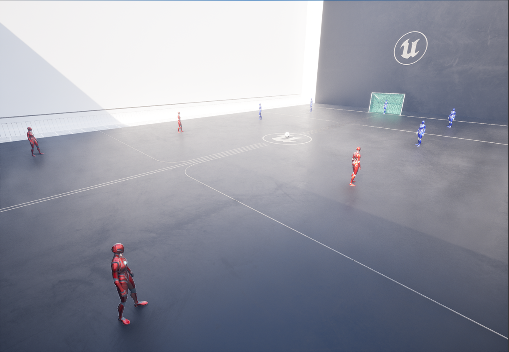
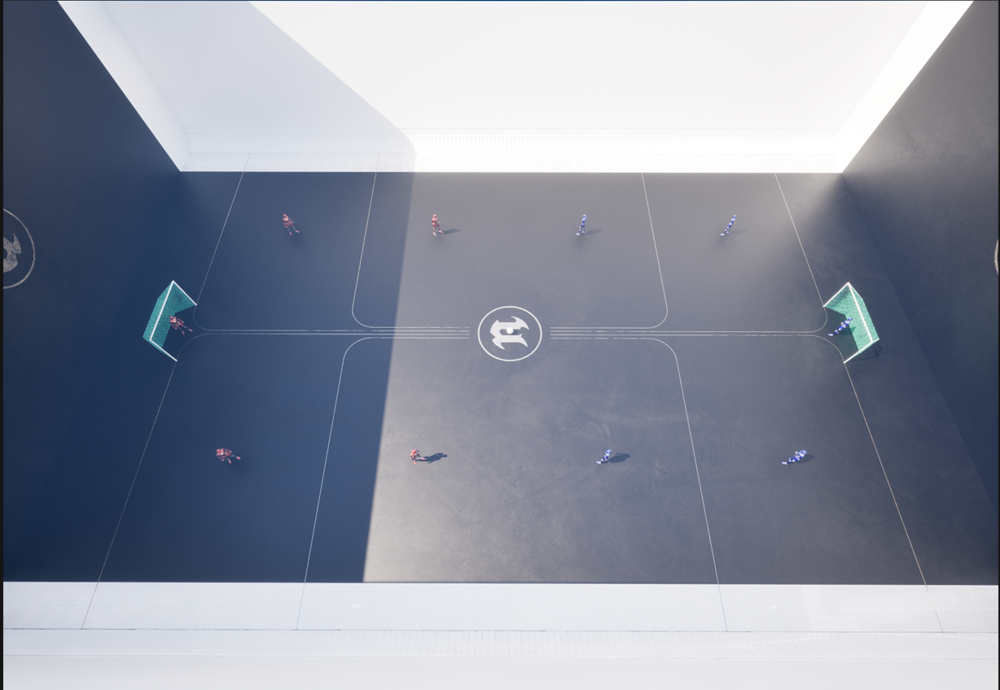
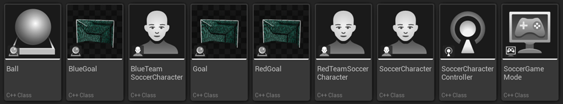
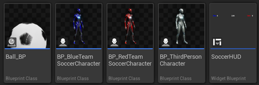

{width=100% fig-align="center"}

## Objective

The objective of this project is to develop a team of intelligent agents capable of playing **5-a-side Futsal**. Each agent must be controlled by an AI controller built on top of the provided `SoccerCharacterController` base class.

Unlike a traditional Behavior Tree approach, this project requires the use of Unreal Engine 5 **State Trees** as the core decision-making mechanism for all agents.

The pitch where the intelligent agents train and compete is the following:

{width=100% fig-align="center"}

---

## Rules

### Character Classes

It is strictly forbidden to change any of the `SoccerCharacter` C++ code. The project provides the following C++ assets:



- **`SoccerCharacter`** — base character class controlled by your AI controller
- **`BlueTeamSoccerCharacter`** and **`RedTeamSoccerCharacter`** — extend `SoccerCharacter` for each team. **Cannot be changed.**
- Corresponding Blueprint classes (`BP_BlueTeamSoccerCharacter`, `BP_RedTeamSoccerCharacter`) set skeletal meshes and colors. **Cannot be changed.**



### Pitch and Ball

- The pitch walls are **always in play** — the ball bounces off boundaries (no out-of-bounds stoppages).
- The ball follows standard UE5 physics; no dribbling mechanic exists. Possession is determined by proximity.
- A goal is scored when the ball enters the goal trigger volume.

### AITeams Folder

The **`AI/Teams`** folder is where students place their work. Each student should create a subfolder named after their student number containing all AI assets (State Trees, Team State components, controller Blueprints).

---

## SoccerCharacterController

The `SoccerCharacterController` C++ class is the **mandatory base class** for your AI controller. Your controller inherits all implemented functionality from this class.

### Inherited Events

```cpp
/** Notifies the AI controller whether the possessed character can kick the ball */
UFUNCTION(BlueprintNativeEvent)
void CanKick(bool NewKickState);
virtual void CanKick_Implementation(bool NewKickState);

/** Notifies the AI controller that its team scored a goal */
UFUNCTION(BlueprintNativeEvent)
void GoalScored();
virtual void GoalScored_Implementation();

/** Notifies the AI controller that the opposing team scored a goal */
UFUNCTION(BlueprintNativeEvent)
void OpponentTeamGoalScored();
virtual void OpponentTeamGoalScored_Implementation();
```

### Available Actions

The only action that can be triggered on the character is **`Kick`**:

```cpp
/** Kick the ball
 * @param Pitch    Height angle of the kick (degrees)
 * @param Azimuth  Horizontal direction to kick (degrees)
 * @param Power    Kick strength [0.0 – 1.0]
 */
UFUNCTION(BlueprintCallable, Category = "Soccer")
void Kick(float Pitch, float Azimuth, float Power);
```

---

## State Trees

This is the core requirement that differentiates this project from previous editions.

### Behavior Trees vs. State Trees

State Trees are the modern UE5 replacement for Behavior Trees. Understanding the key differences is essential for this project:

| Feature | Behavior Trees | State Trees |
|---|---|---|
| Data storage | Separate Blackboard asset with global keys | Parameters and Context Data bound directly to Actor/Controller |
| Logic flow | Continuously ticking all nodes | Event-driven; states run on-demand via Transitions |
| Performance | Higher memory overhead from Blackboard keys | Lower overhead; data lives in actors or schema objects |
| Flexibility | Limited to what the Blackboard supports | Fully modular via UObject context and per-instance Parameters |

### Mandatory: State Tree Controllers

All agent roles **must** be implemented using **UE5 State Trees** (not Behavior Trees). Roles are **fixed at spawn** based on each character's starting position. Each role must have its **own dedicated AI Controller and State Tree asset**.

The three mandatory roles are:

**Goalkeeper** — `BP_GoalkeeperController` + `GoalkeeperStateTree`

```
GoalkeeperStateTree
├── Idle        (position between ball and goal centre)
├── Intercept   (move toward ball when in danger zone)
└── Distribute  (kick to open teammate after gaining possession)
```

**Defender** — `BP_DefenderController` + `DefenderStateTree`

```
DefenderStateTree
├── Mark        (track nearest opponent)
├── Press       (close down ball carrier)
└── Support     (cover defensive space)
```

**Striker** — `BP_StrikerController` + `StrikerStateTree`

```
StrikerStateTree
├── Attack      (move toward ball)
├── Shoot       (when CanKick == true and shooting angle is favourable)
└── OffBall     (find open space / create passing lane)
```

Optionally, students may use just one or two **State Trees** as long as they cover all 3 roles. For example:

```
Root
├── GoalkeeperState
|   ├── Idle        (position between ball and goal centre)
|   ├── Intercept   (move toward ball when in danger zone)
|   └── Distribute  (kick to open teammate after gaining possession)
├── DefenderState
|   ├── Mark        (track nearest opponent)
|   ├── Press       (close down ball carrier)
|   └── Support     (cover defensive space)
└── StrikerState
    ├── Attack      (move toward ball)
    ├── Shoot       (when CanKick == true and shooting angle is favourable)
    └── OffBall     (find open space / create passing lane)
```

Students may extend or modify these structures, but **all three roles must be implemented and distinct**. The team formation (how many defenders and strikers) is left to the student.

---

## Tournament

After the delivery deadline, matches will be run where the AI teams submitted by students compete for the title of **AIG Futsal Champion**. The result of this tournament reflects **10% of the project grade**.

---

## Report

The report must be written using the template provided on Moodle and must include:

- Description of the State Tree architecture for each role (Goalkeeper, Defender, Striker)
- Description of each State Tree's states, transitions, and conditions
- Description of the training/evaluation process (if RL/genetic algorithms were used)
- Presentation and discussion of results
- Any other aspects relevant to understanding and evaluating the work

---

## Grading

| Component | Weight |
|---|---|
| Goalkeeper State Tree implementation | 15% |
| Defender State Tree implementation | 15% |
| Striker State Tree implementation | 15% |
| Overall team behaviour and performance | 20% |
| Tournament results | 10% |
| Report | 25% |

---

## Delivery

1. **Deadline:** 3rd July, 2026.
2. On the day of delivery, students must present their work in a **5-minute presentation** explaining the implemented AI controllers, State Tree design, and coordination strategy.
3. The project is **individual**.
4. The report must use the Moodle template and be delivered in **PDF format**.
5. The file name format for both the zip and the report is: `AIG_Project_#StudentNumber`.
6. Deliverables:
   - Report (PDF)
   - Zip/rar/7z containing all State Tree assets, and Blueprint controllers from the `AITeams` folder
7. Submission is through the **Moodle delivery mechanism**. In case of doubt, consult the teachers.

::: {.callout-note}
**Note:** Only assets inside your `AI/Teams/#StudentNumber/` subfolder will be evaluated. Do not modify any base C++ classes or Blueprint classes outside this folder.
:::
