## Overview

The **Unreal Engine Navigation System** provides pathfinding capabilities to Artificial Intelligence Agents. To make it possible to find a path between a start location and a destination, a Navigation Mesh is generated from the world's collision geometry. This simplified polygon mesh represents the navigable space in the Level. Default settings subdivide the Navigation Mesh into tiles to allow rebuilding localized parts of the Navigation Mesh. The resulting mesh is made of polygons and a cost is associated with each polygon. While searching for a path, the pathfinding algorithm will attempt to find an optimal path with the lowest cost to the destination. The system includes a variety of features that you can use to customize the Agent's navigation behavior based on your specific needs.

## Goals

In this Quick Start guide, you will learn how to create a simple Agent that will use the Navigation System to roam around the Level.

## Objectives

- Use a Navigation Mesh Actor in your Level to build the navigation.
- Learn to visualize the navigation mesh in your Level and adjust it to cover your needs.
- Modify the ThirdPersonCharacter Blueprint to roam around the Level using the Navigation System.

## Required Setup

In the **New Project Categories** section of the Unreal Project Browser, select **Games** and the **Third Person** template.

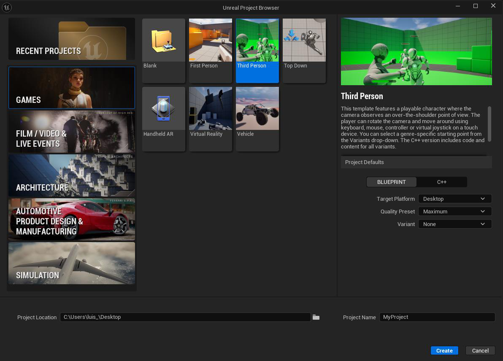

Under **Project Details** chose **Blueprint** and for the **Variant** option, select **None**, name your project **"NavSystem"** and click **Create**:

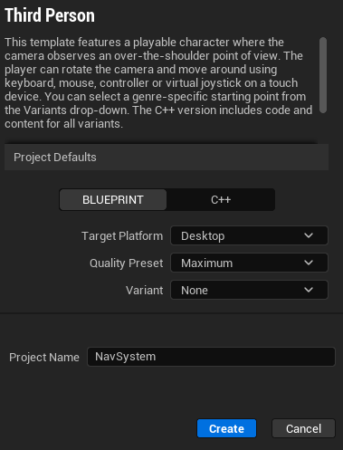

You have created a new Third Person project and are now ready to learn about the Navigation System.

## Building the Navigation Mesh

In this section, you will use a **Navigation Mesh Bounds Volume** to specify the area in your Level where navigation needs to be generated. This information is used by Agents to navigate the Level and get to their destinations.

On the default **ThirdPersonExampleMap** of your project, go to the **Place Actors** dropdown menu and search for **NavMeshBoundsVolume**, and drag it into your Level.

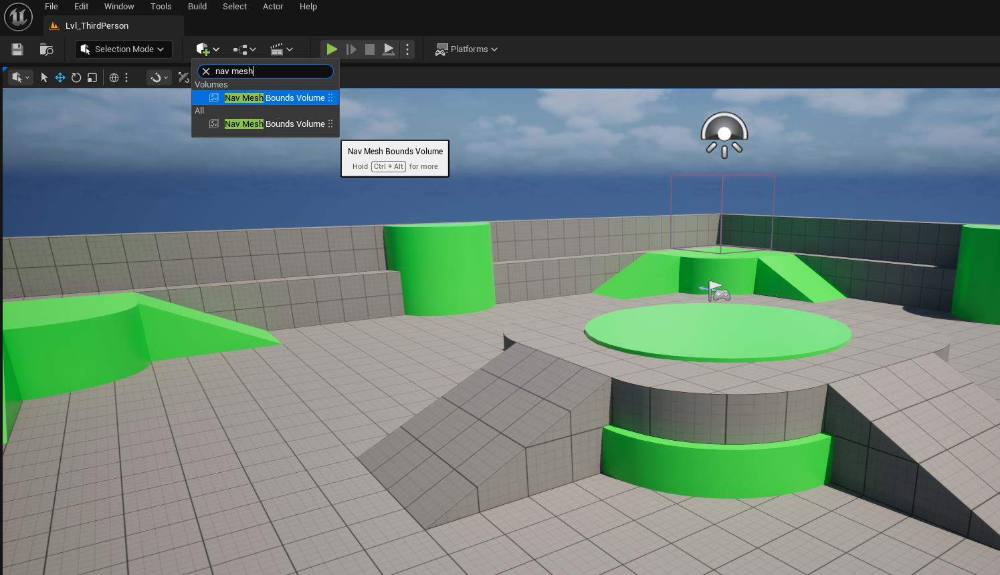

With the **NavMeshBoundsVolume** selected, position it at the center of the level (x:0, y:0 z:0), then go to the **Details** panel and scale the volume to X = 20, Y= 20, and Z = 5. Move the volume so it covers the entire play area, as seen below:

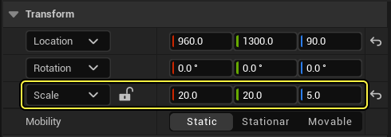

Select the **PlayerStart** in the **Outliner** window and remove it from the Level.

Press the **P key** on your keyboard to visualize the Navigation Mesh in your Level. As you can see from the image below, the Navigation Mesh is visualized in green by default.

> **Note:** Unreal Engine automatically generates the Navigation Mesh as soon as a Nav Mesh Bounds Volume Actor is added to the Level or is resized.

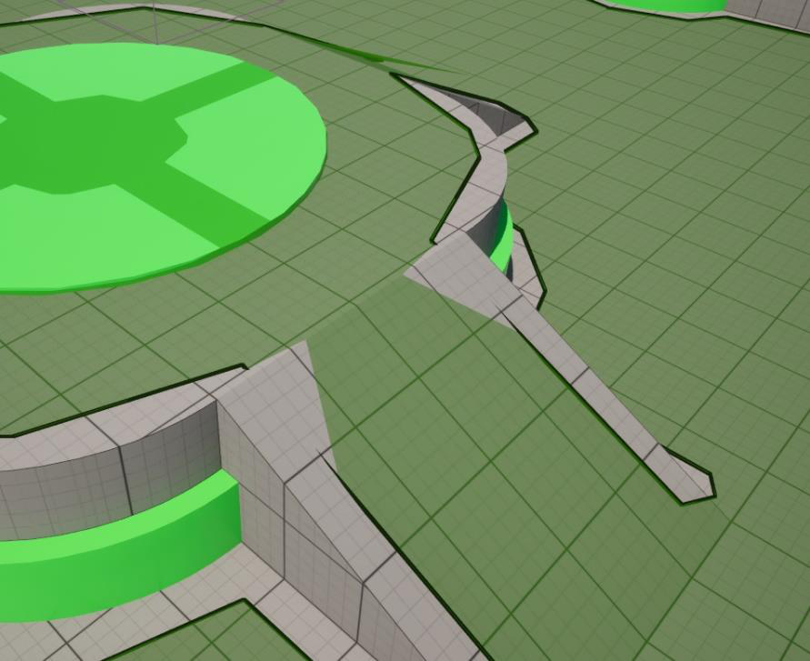

The Navigation Mesh might contain some visual artifacts at places such as stairs or ramps. This can happen because the Navigation Mesh is a simplified representation of the collision in the Level. Select the **RecastNavMesh-Default** Actor in the **Outliner** window and go to the **Details** panel. Go to the **Display** section and increment the **Draw Offset** value until there are no visual artifacts. This adjusts the height offset where the Navigation Mesh is drawn for better readability.

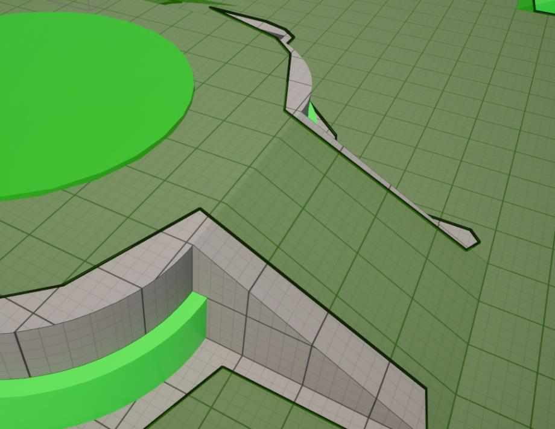

## Visualizing the Navigation Mesh

In this section, you will learn how to modify various Navigation Mesh settings, as well as how to change the way you can visualize the mesh in the Level.

Go to the **Outliner** and select the **RecastNavMesh-Default** Actor.

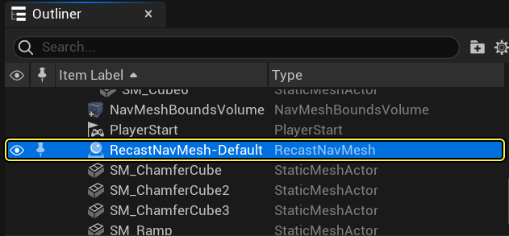

With the Actor selected, go to the **Details** panel and scroll down to the **Display** section. Here you will find a variety of options to better visualize the generated Navigation Mesh. In the example below, **Draw Poly Edges** was selected to see the polygons that make up the nav mesh.

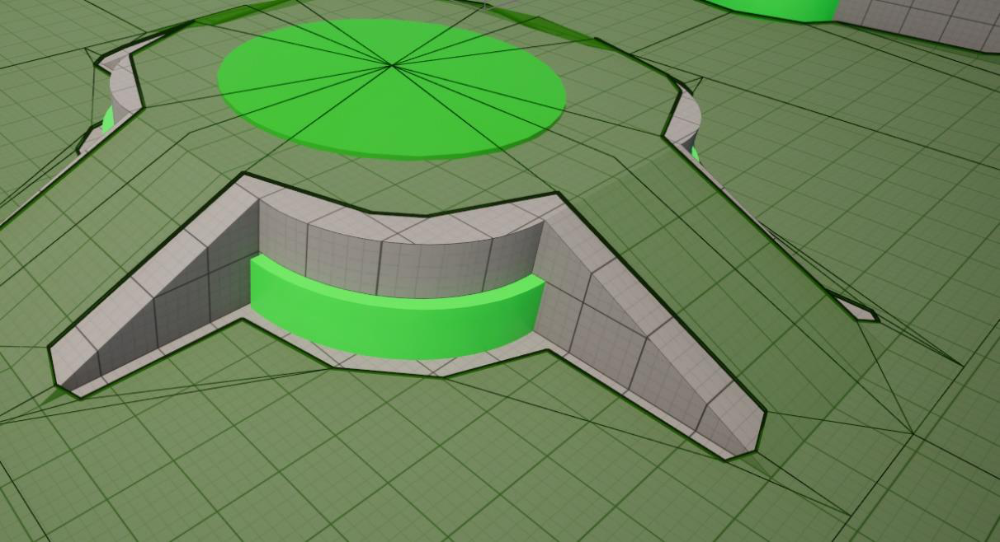

You can also visualize the individual Navigation Tiles by enabling the **Draw Tile Bounds** checkbox.

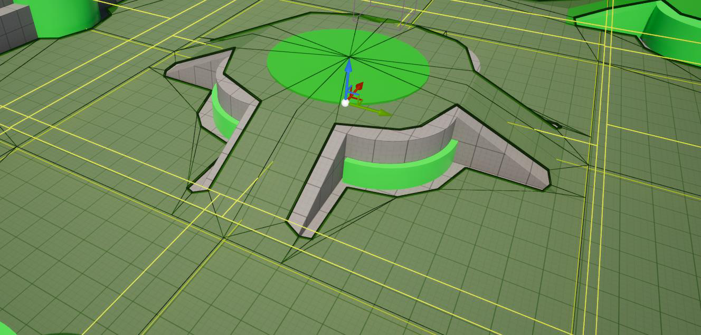

You can even check build times for each nav mesh tile using the **Draw Tile Build Times** + **Draw Tile Build Times Heat Map** options.

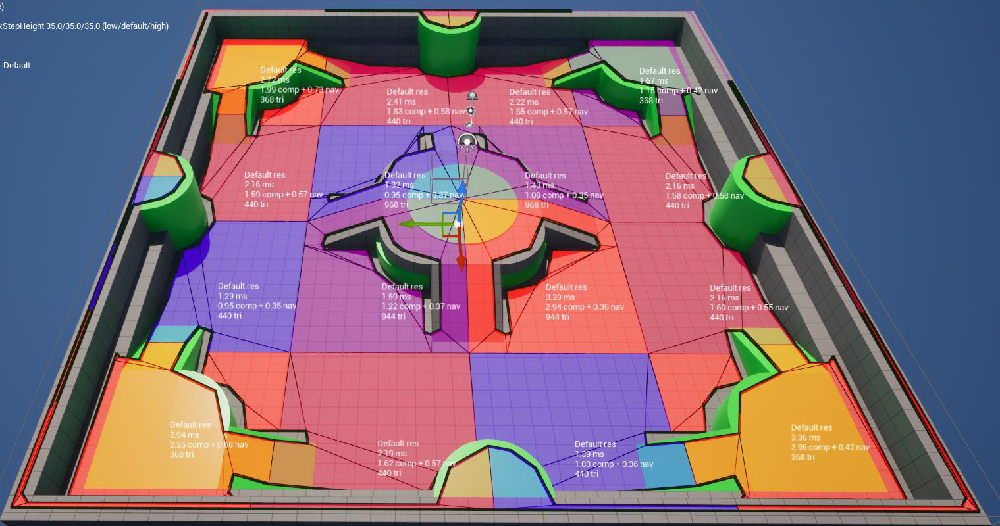

You can modify the way the Navigation Mesh is generated by going to the **Generation** section and changing its options. Play around with some of the values such as **"Tile Size UU"** and **"Agent Radius"**, and take note of the impacts they have on the nav mesh both visually and in build times.

## Creating your First Agent

In this section, you will create a simple Agent that will roam around your Level by selecting a random location nearby and navigating to it. The Agent will wait a few seconds when it arrives at its destination before repeating the process.

In the **Content Drawer**, right-click and select **New Folder** to create a new folder. Name the folder **"NavigationSystemWorksheet"**.

In the **Content Drawer**, go to **ThirdPerson > Blueprints** and select the **BP_ThirdPersonCharacter** Blueprint. Drag it to the **NavigationSystem** folder and select the option **Copy Here**.

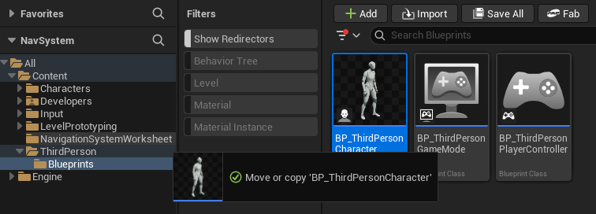

Go to the **NavigationSystemWorksheet** folder and rename the character blueprint you just copied to **"BP_NPC_NavMesh"**.

Double-click the Blueprint to open it and go to the **Event Graph**. Select all nodes and delete them.

Now open the **Viewport** and delete both the **CameraBoom** and **FollowCamera** components.

Back in the **Event Graph**, right-click then search for and select **Add Custom Event**. Name the resulting event **"MoveNPC"**.

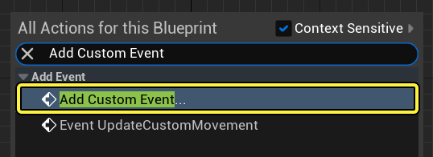

Right-click the **Event Graph**, then search for and select **Get Actor Location**.

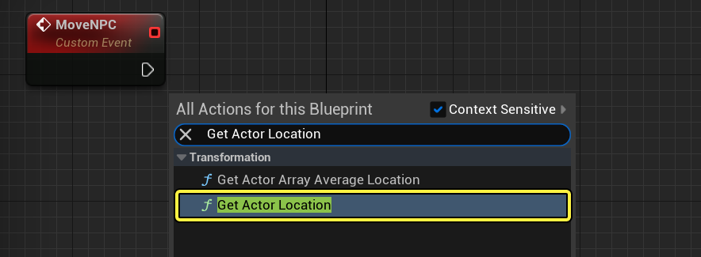

Drag from the **GetActorLocation** node and search for and select **Get Random Reachable Point In Radius**. Set the **Radius** to **5000** units, which corresponds to 50 meters.

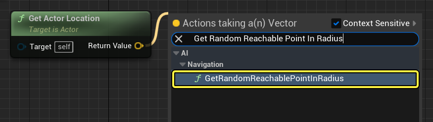

Drag from the **Random Location** pin of the **GetRandomReachablePointInRadius** node and select **Promote to variable**.

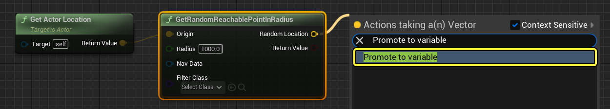

Connect the **MoveNPC** node to the **RandomLocation** node you just created.

Right-click the **Event Graph**, then search for and select **AI Move To**. Connect the **RandomLocation** node to the **AI Move To** node.

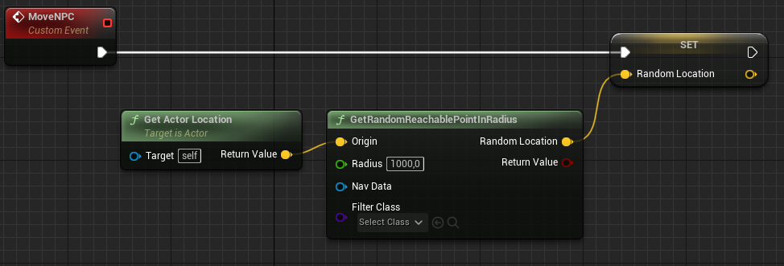

Right-click the **Event Graph** and search for and select **Get a reference to self**.

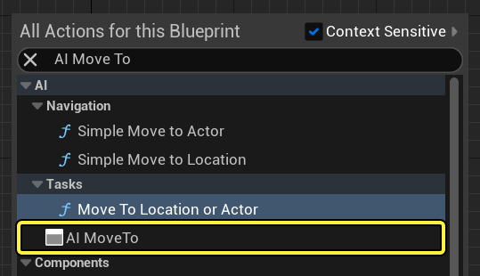

Connect the **Self** node to the **Pawn** pin of the **AI Move To** node. Connect the **yellow** pin of the **Random Location** node to the **Destination** pin of the **AI Move To** node, as seen below:

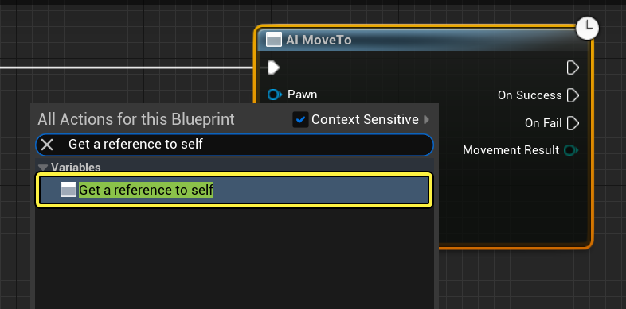

Drag from the **On Success** pin of the **AI Move To** node, then search for and select **Delay**. Set the **Duration** of the node to **4**. Drag from the **Completed** pin of the **Delay** node, then search for and select **MoveNPC**, as seen below:

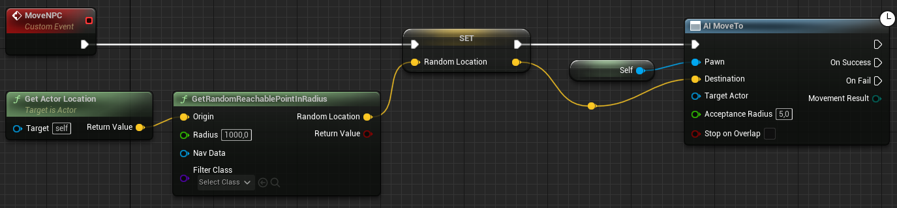

Repeat the steps above to add the nodes to the **On Fail** pin of the **AI Move To** node. Set the **Duration** of the **Delay** node to **0.1**.

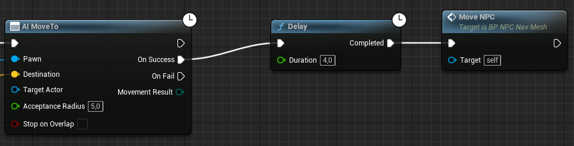

Right-click the **Event Graph**, then search for and select **Event Begin Play**. Drag from the **Event Begin Play** node, then search for and select **MoveNPC**.

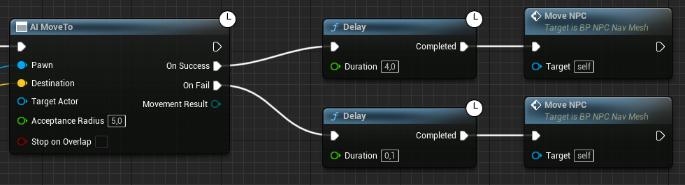

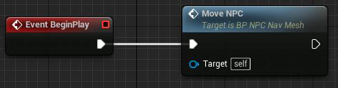

**Compile** and **Save** the Blueprint. Drag your **BP_NPC_NavMesh** Blueprint to your Level and click **Simulate**. You should see your Agent roam around the Level.

## Nav Modifier Volume

One key feature of the NavMesh system is the **cost attribute**. The **total cost** to move from one point to another using NavMesh is the **sum of all the area costs the path moves through**. The NavMesh system solver will always try to **find the cheapest path available**.

By increasing the cost of certain areas of the navigation mesh, we can have our agents **avoid certain areas** (like rough terrain or hazardous ground). To change the cost of a certain area, we can use the **Nav Modifier Volume**.

You can also attach these modifier volumes as components to dynamic objects, for example a rotating wall.

By default, UE5 has four different area classes:

| Area Class | Description |
|---|---|
| **Default** | Default NavMesh areas |
| **Null Area** | Deletes the nav mesh inside that volume |
| **Obstacle Area** | Represents obstacles, such as hazardous terrain |
| **Low Height Area** | Zones where a character must be crouched to navigate |

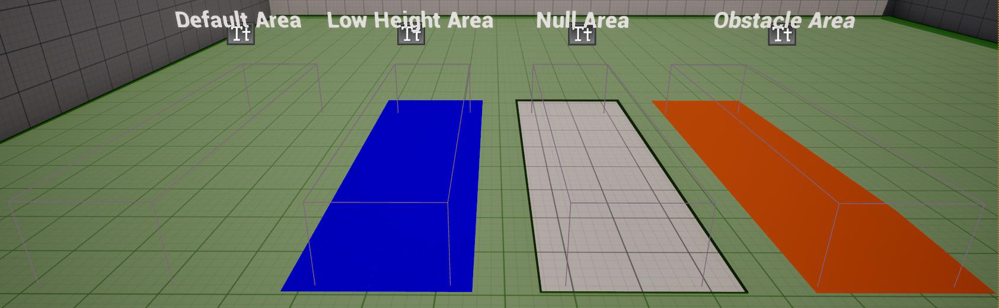

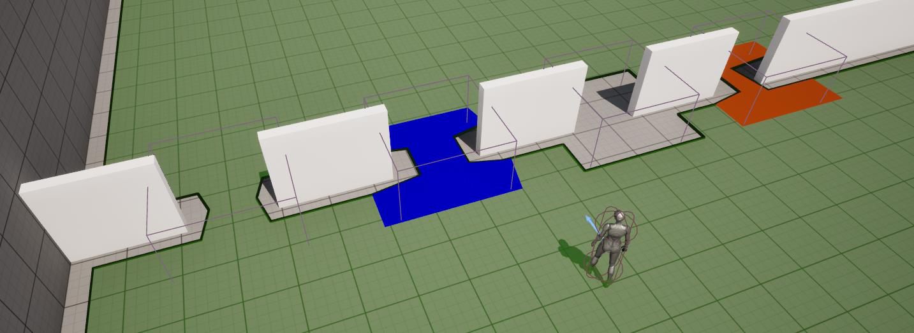

> **Important:** If no other path is available, the agent will travel through a High-Cost area since it's the only available path.

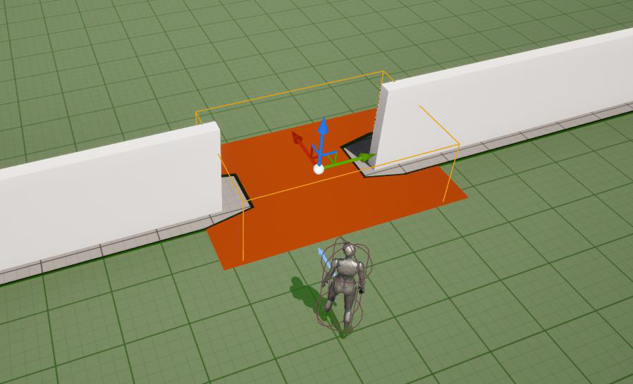

You may also **create your own custom area classes** with different costs, by creating a class that inherits from the **"Nav Area"** class. If you want different kinds of agents to prefer different area classes for navigation, you can use **Navigation Query Filters** — these allow you to override navigation area properties on a per-agent basis.

## Navigation Mesh Runtime Generation

If you try to move objects around the map while playing the game, you'll see that the navigation mesh does not update automatically since it was baked previously.

To visualize the navigation mesh in the editor, press the **"P"** key. To be able to move objects in the map you may need to change their mobility in the **Details** panel.

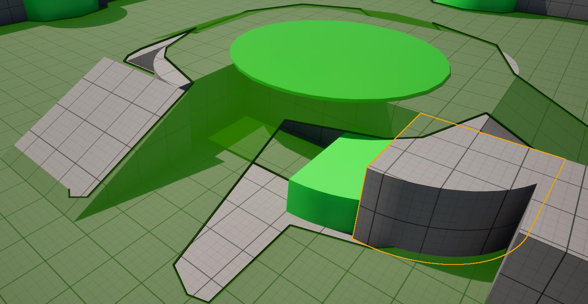

To enable navigation mesh runtime generation, go to:

> **Project Settings → Navigation Mesh → Runtime → Runtime Generation → Dynamic**

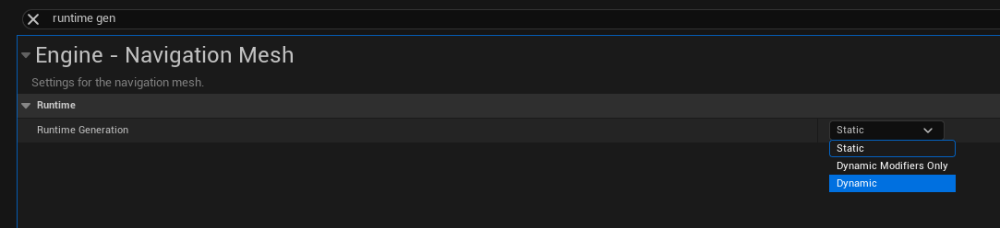

Now if you move objects in runtime, the navigation mesh should update dynamically to the changes in real time.

You can also set the runtime generation to **"Dynamic Modifiers Only"**, which will rebuild in runtime the navigation mesh affected by Nav Modifier Volumes attached to dynamic objects. This is a good compromise between performance and mechanics — combining the best of baked navigation with runtime generation for dynamic modifiers.

## Creating the AI Controller

Until now all the logic you've added to your agent was done inside the character blueprint. However, that is not entirely correct.

As humans our brain is embedded in our body, but it is our brain that controls our body. In Unreal Engine the agent's brain is separated from their body, and we are left with two key actors:

- **AIController** — the brain
- **Character** — the body

To create an **AIController**, create a new blueprint that is inherited from the **"AIController"** class, and call it **AICon_Patrol**:

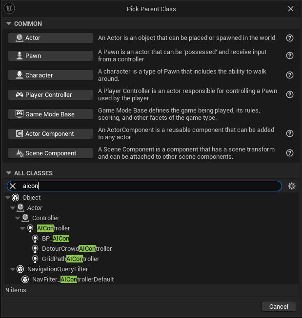

## Adding Logic to the AI Controller

To be more accurate with our agent implementation, move the logic that you created in the Character blueprint (**BP_NPC_NavMesh**) to the AI Controller (**AICon_Patrol**) you created.

If done correctly, now the agent's **brain** (the AIController) should tell the **body** what to do, when necessary.

This means that a lot of the code for our agents will for now be implemented in the AIController, and that's fine. Later on we'll explore other features that will allow us to extract some of that logic away from the Controller.

## Exercises

1. Implement the following behavior using the **AIController** and the **Character** blueprints:

   i) When the player gets within a certain radius of the agent, the agent should **start following the player**.

   ii) When the player manages to get away from the radius of the agent, the agent should **go back to wandering**.

2. When patrolling, the AI Character should **run when his destination is far**, and **start walking when the destination is closer**. The agent's walking speed should change **gradually**.

3. Add an alternative way of patrolling based on **hand-placed waypoints** in the level.
