**Behavior Trees** assets in Unreal Engine are widely used to create artificial intelligence (AI) agents for non-playable characters (NPCs) in your projects. The Behavior Tree asset is used to execute branches containing logic, but to determine which branches of the tree should be executed, it frequently relies on another asset called a **Blackboard** which serves as a repository for data to be used by the Behavior Tree.

The blackboard can hold a variety of information, that is stored in user-defined keys. The information stored in these keys is what is used by the behavior tree to make decisions.

The behavior tree can be used for simple AI such as a rat that roams and flees from the player, or for complex agents in multiplayer player-versus-player games.

Both behavior trees and blackboards can have their own uses outside of creating NPCs as well.

## Setting up the Basis

Create a new project based on the Third Person template and name it: **BT_Basics**.

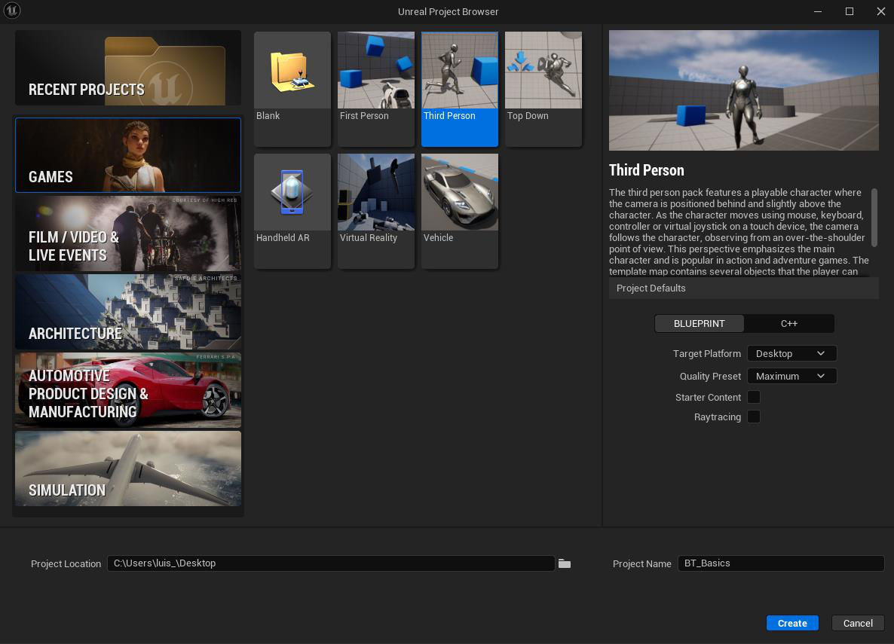

In the **Content Drawer**, inside the **ThirdPerson\Blueprints** folder create a new folder and name it **"AI"**.

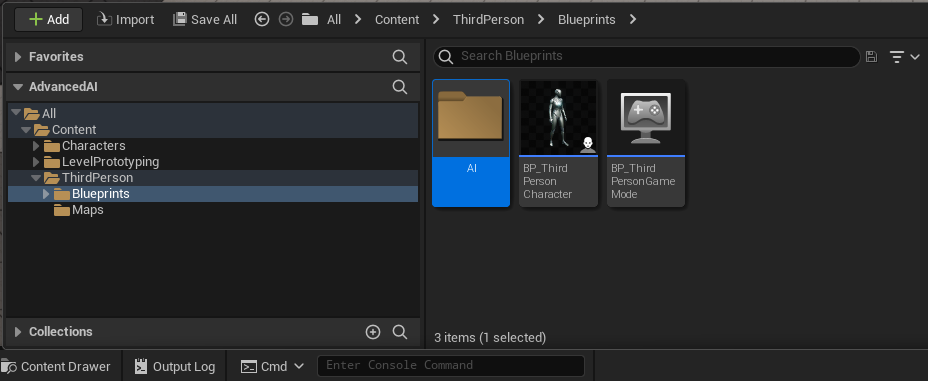

**Copy** the **BP_ThirdPersonCharacter** blueprint into the **AI** folder by dragging the blueprint into the AI folder and select **Copy Here**.

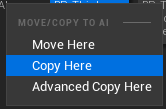

Now, go to the **AI** folder and rename the blueprint to **"BP_AICharacter"**.

**Double-click** on the **BP_AICharacter** blueprint to open it. Then, go to the **Event Graph** and delete the entire content: select everything and press **DELETE** key:

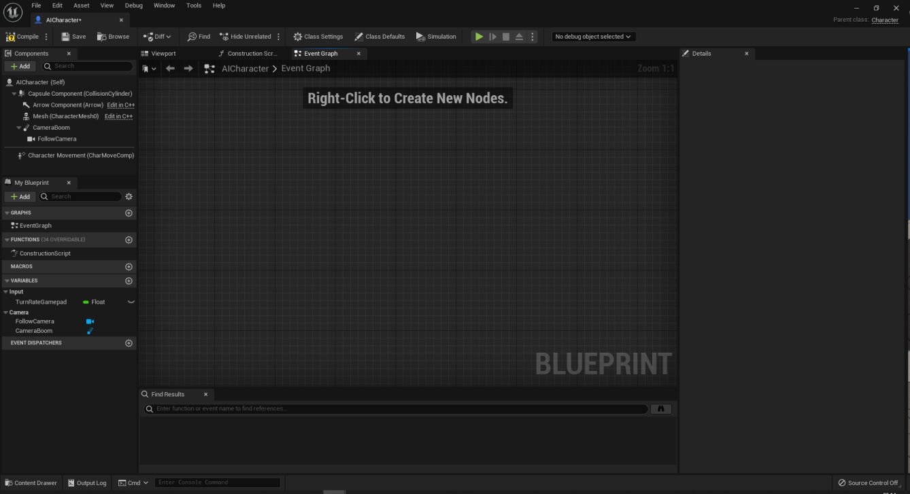

Also, go to the **Viewport** tab and delete the **Camera Boom** and the **Follow Camera** components, since the AI character will not need all that.

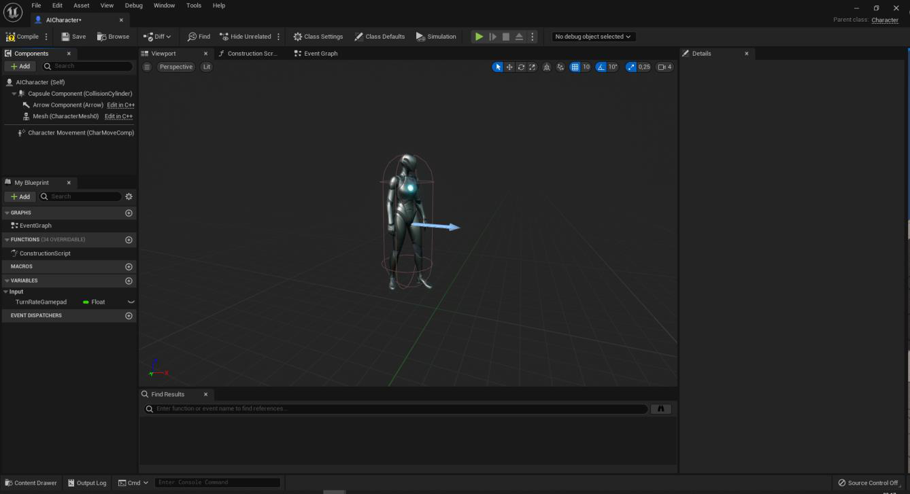

**Compile** and **save** the **BP_AICharacter** blueprint by clicking on **Compile** and **Save** buttons.

## Creating the AI Controller

Now, let's create an **AIController** for this Character. If you look into its **Class Defaults**, more specifically into the **AI Controller Class** option, you will see that this Character already has a default AI Controller Class, which is the **"AIController"**:

However, what you need is a **new** AI Controller. To create a new **AI Controller**, go the **Content Drawer**, and inside the **AI** folder, right-click and select **"Blueprint Class"**. Click on **ALL CLASSES** to expand, go to the **Search** box and type: **"AICon"**. Finally, select **AIController** class.

Name the created **AI Controller** as **"BP_AIC_Seeker"**.

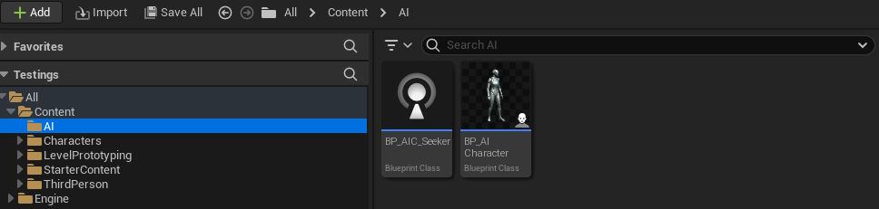

Go to the **Content Drawer** and open the **BP_AICharacter**. Now, on the **Class Defaults**, set the **AIController Class** to **BP_AIC_Seeker**. This way, you are specifying that this is the controller that will be controlling the **Character**.

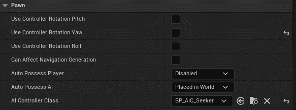

Click **Compile** and **Save**. Now that everything is all set up on your **AI Character**, you can go to the **Content Drawer** and drag it into the Level, like so:

If you run your game, the **AI Character** will be standing still because he does not have any behavior — he simply exists in the world and does not follow any commands.

## Adding Behavior to the AICharacter

Start by creating a blackboard, name it **"BB_Seeker"**, add 3 keys:

- an **Object** key named **"TargetActor"**
- a **Boolean** key named **"HasLOS"**
- a **Vector** key named **"TargetPosition"**

and save it.

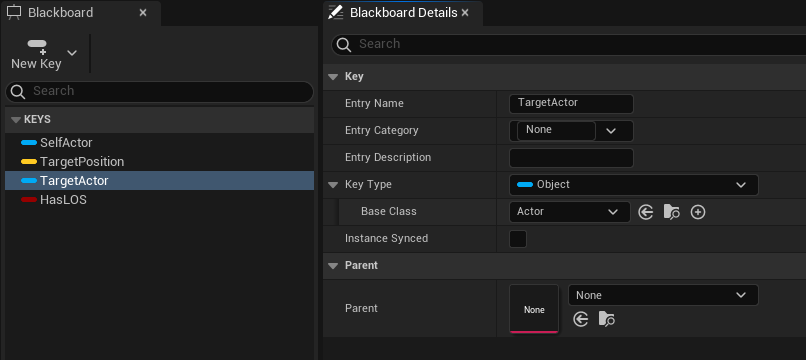

Make sure your **TargetActor** key has its **Base Class** set to **Actor**.

Now create the **Behavior Tree**, name it **"BT_Seeker"** and assign it the blackboard you previously created.

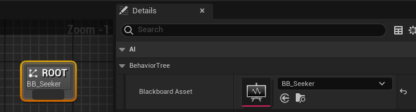

## Patrol Behavior

In the **Behavior Tree** start by adding a **Selector** and a **fallback behavior** (in case all the previous nodes fail) — in our case a simple **Wait** node will work.

Add a **Sequence** and rename it to **"Patrol"**, in the **Details** panel.

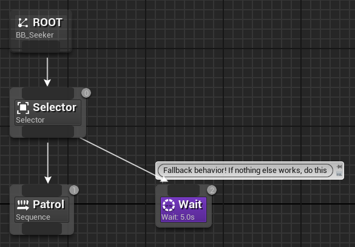

Next, we'll create our first custom task, click on the **New Task** button on the toolbar and select **"BTTask_BlueprintBase"**.

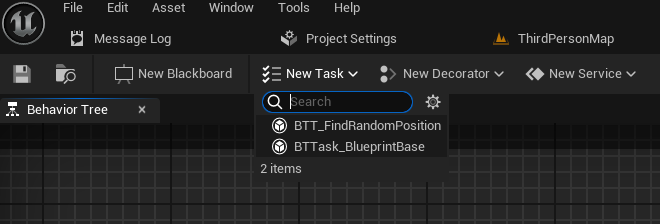

Name your new task **"BTT_FindRandomPosition"**, save it inside the AI folder created earlier and open it. On the functions tab override the **"Receive Execute AI"** function.

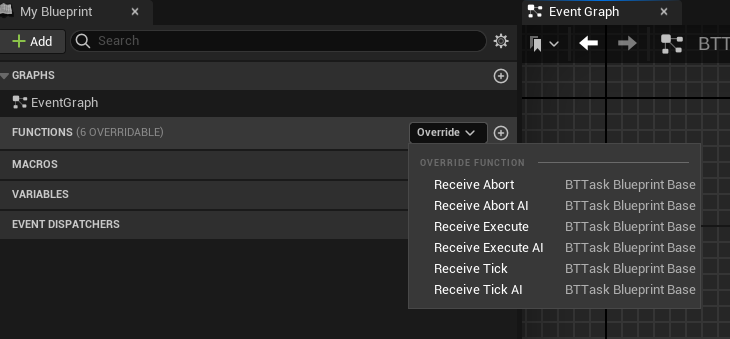

Start this function by using the **GetRandomReachablePointInRadius** node, and storing its result in a variable. Make sure you also promote the **Radius** parameter to a variable and make it public.

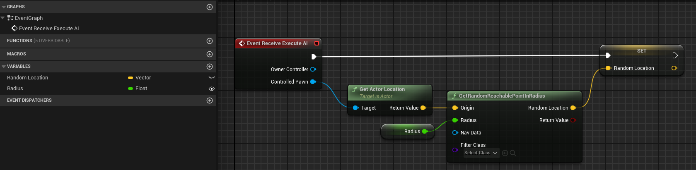

Afterwards, check the return value with a branch. If the value is true, we will store the **Random Location** result in the blackboard we created earlier, using the **"Set Blackboard Value as Vector"** node. This node requires a **Key parameter**, which refers to a blackboard key — promote this parameter to a variable and make it public. By making variables in our tasks public, we can assign them values directly from our Behavior Tree.

Behavior Tree tasks need to know whether they were successful or not, therefore every execution branch from our task must finish with the node **"Finish Execute"** with the respective value. If you fail to do this, your agent may become completely unresponsive.

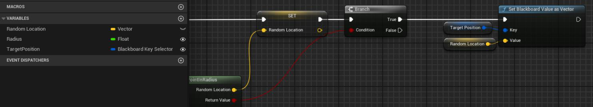

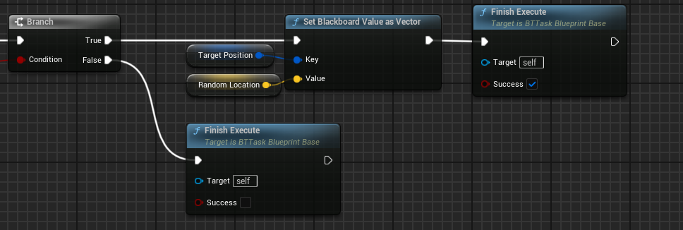

Save your task and add it to the Behavior Tree. If you don't see the variables from the task exposed on the details panel, it means they are not public, therefore cannot be edited. Assign your variables the values as in the following image.

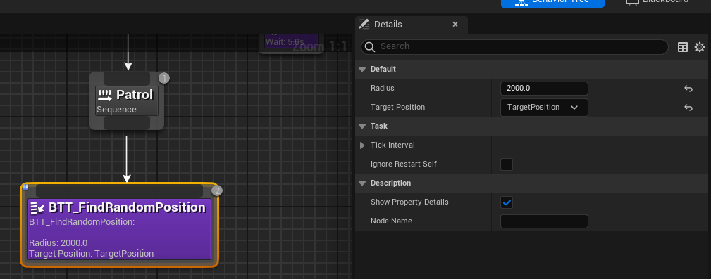

Now, add a **Move To** and a **Wait** nodes to the **patrol sequence**. The Move To node should have the **Blackboard Key** value set to the **TargetPosition** key.

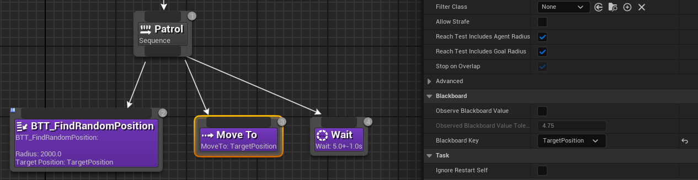

So far, your Behavior Tree should look like this:

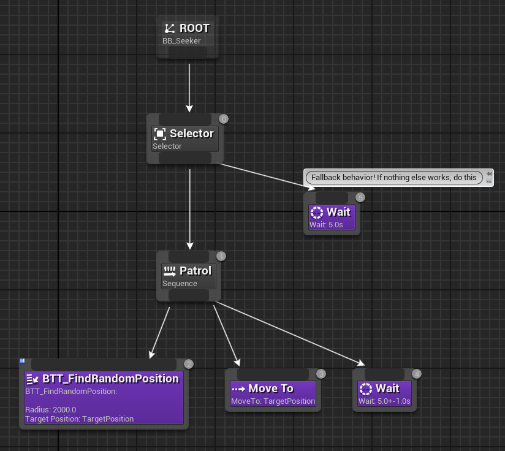

However, we still haven't told the AI Controller we created earlier that he should use this Behavior Tree. To do this, open your AI Controller, add the **"Event On Possess"** and the **"Run Behavior Tree"** nodes, and select your behavior tree under the **BBTAsset** parameter.

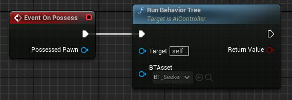

At this point play the game to check your agent's behavior. If he runs to a random location, waits and proceeds to repeat this behavior, everything is working as intended.

## Chase Behavior

Let's add more behavior to make the agent chase the player character. To do this we'll need to create a **Service** that will check Line of Sight between the AI Character and the Player character.

Create a new **Service**, name it **"BTS_CheckLos"** and store it in the AI Folder.

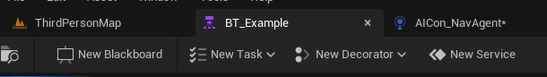

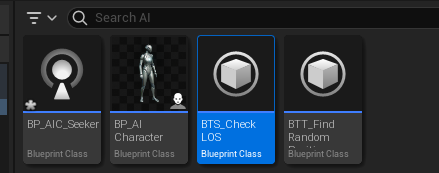

Open your service blueprint and override the **"Receive Tick AI"** function.

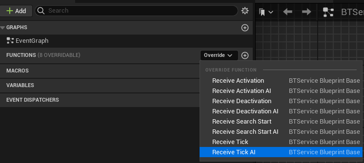

Start by promoting the **"Controlled Pawn"** parameter to a variable, add the **"Get Blackboard Value as Actor"** node and **promote** both **input** and **output** to **variables**. Add an **"IsValid"** to check the value of the LOS Target variable and add a **"Set Blackboard Value as bool"** node promoting its key input to a variable, and the bool value to false.

The result should be 4 different variables — make sure the blackboard key variables are public.

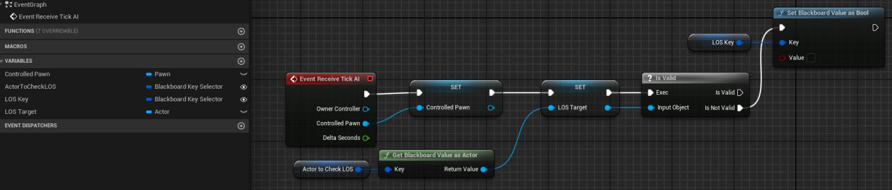

Add the following logic to perform the **Trace** that will check line of sight — this will trace from the agent to the target actor (player character).

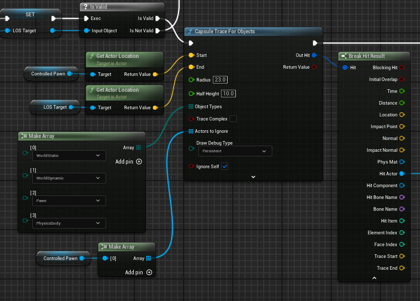

If the trace is valid and hits the target actor, we'll set the LOS Key to **true**, otherwise we set it to **false**.

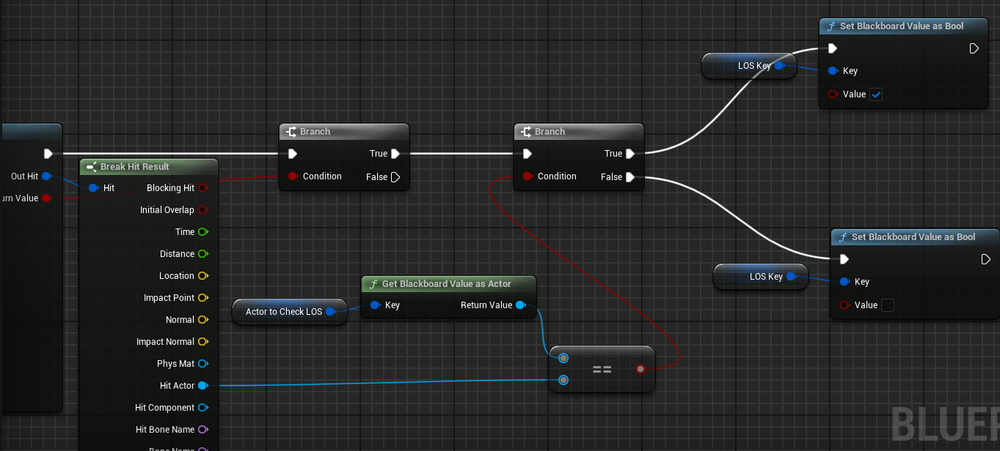

This concludes the service — compile and save it.

Services are attached to composite nodes. To add the service to the behavior tree, **right click the first Selector node → Add Service → BTS_CheckLOS**.

Make sure you configure the service variables correctly: the **Actor to Check LOS** should be the blackboard key **"TargetActor"**, and the **LOS Key** should be the **"HasLOS"** blackboard key.

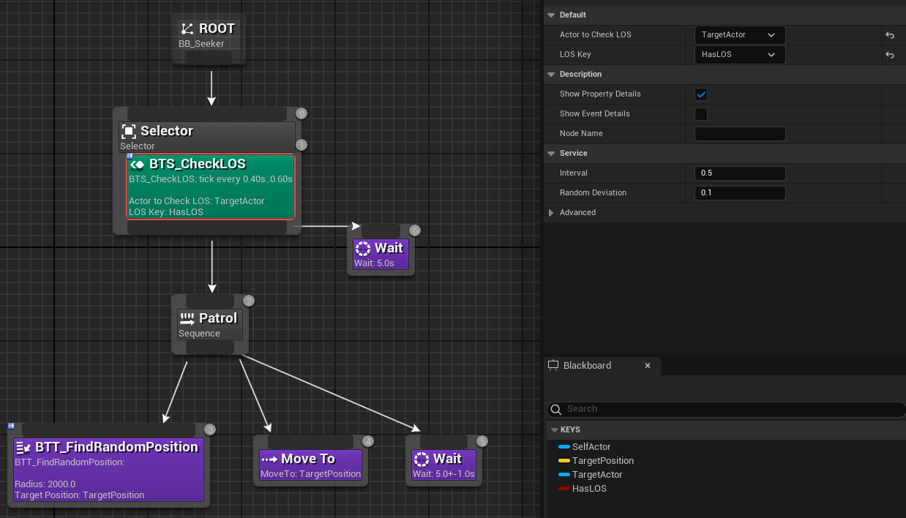

To make our agent chase the player, under the Root Selector, add a new **Sequence** and rename it **"Chase Player"**. Then **right click this new sequence → Add Decorator → Blackboard**.

This will add a blackboard decorator to the sequence — a conditional node that will execute or not depending on the value of the selected blackboard key. With the decorator selected, change the **Blackboard Key** value to the **"HasLOS"** key.

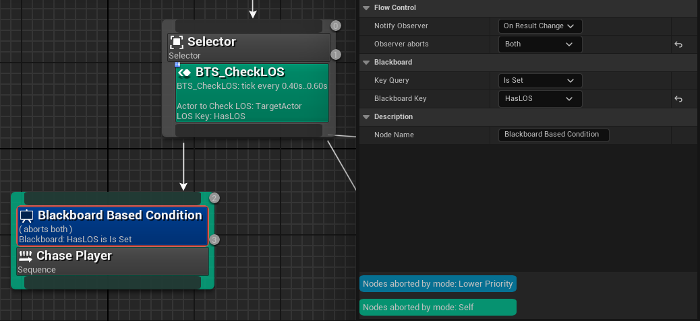

Now, under the **Chase Player** sequence add a **"Move To"** task and set the **Blackboard Key** value to the **"TargetActor"** key.

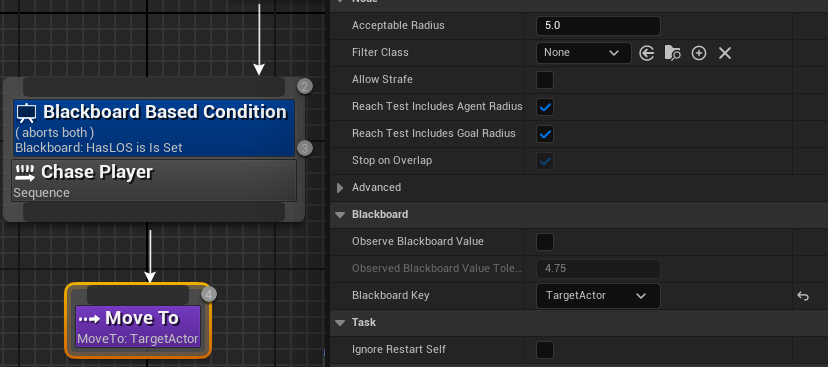

At this point the chase behavior is finished. However, we never told the Blackboard who is the **TargetActor**, therefore the behavior will not work.

Open the **AI Controller** and add the following logic:

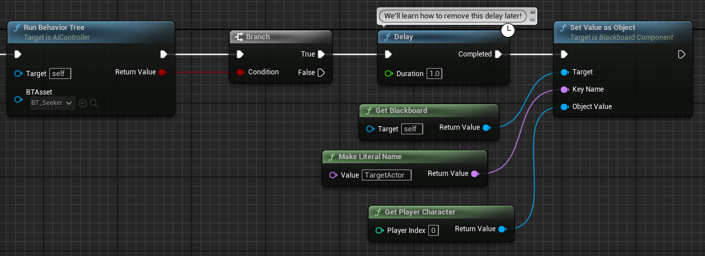

The **"Set Value as Object"** node is used to store values to the blackboard. In this case we're storing the player character into the **"TargetActor"** key, however it could be any other actor.

> **Important:** Make sure the text you type in the **"Make Literal Name"** node is **EXACTLY** the same as the blackboard key name.

The delay is temporary to avoid possible errors at the start of the game — we'll learn how to remove this delay later.

Test your agent again — he should now follow the player when in line of sight.

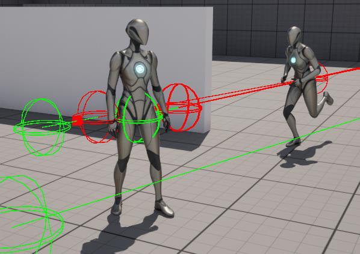

## Adding a Range Limit

However, the agent can detect the player from really far away. Let's add a limit to that range.

To do that, **create a new Decorator**, name it **"BTD_CheckRange"** and store it in the AI folder.

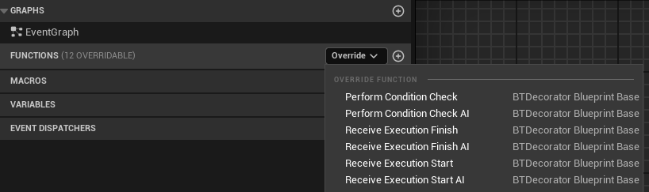

Open the decorator and override the function **"Perform Condition Check AI"**.

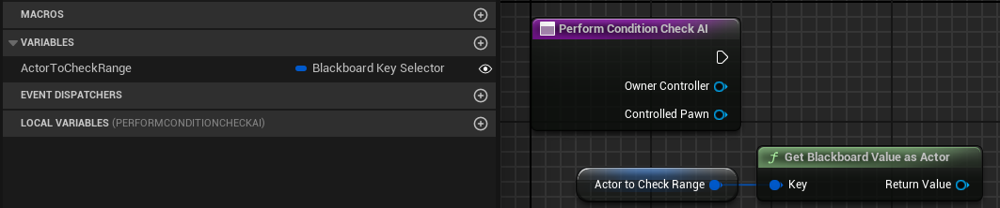

Start by adding a **"Get Blackboard Value as Actor"** and promoting the input key to a variable, name that variable **"ActorToCheckRange"** and make it **public**.

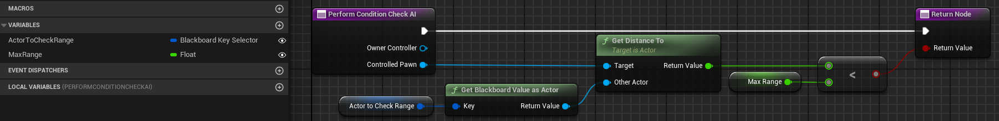

Add the **"Get Distance To"** node to get the distance between the controlled pawn and the target actor, and check if that distance is less than a float variable named **"MaxRange"** — this variable should also be **public**. Return the Boolean value from the less than operator.

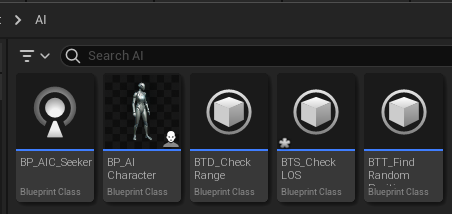

With that the decorator is finished. It checks a condition: if the distance from the agent to the target actor is less than the variable's value, it returns **true**, otherwise it returns **false**.

Add the **"BTD_CheckRange"** decorator to the **"Chase Player"** sequence and configure it like so:

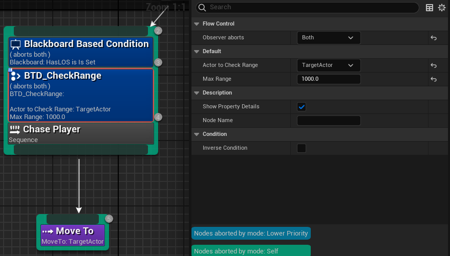

This should limit the range at which the agent can detect the player character, and everything is configurable from the Behavior Tree.

One last decorator we can add is the **"Does path exist"** to check if a path from the AI character to the player character exists. This decorator can be added directly to the **Move To** task.

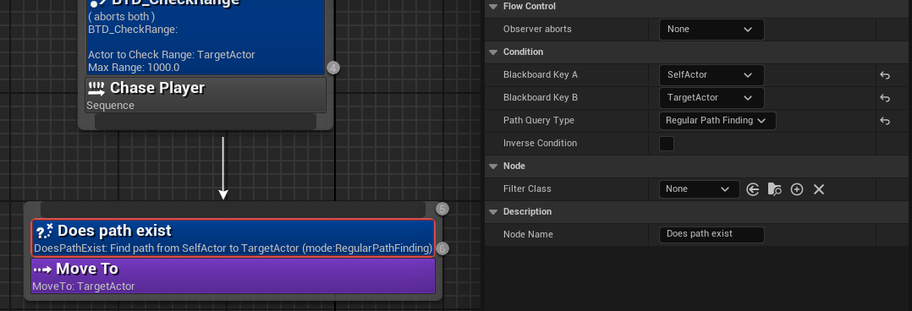

## Final Behavior Tree

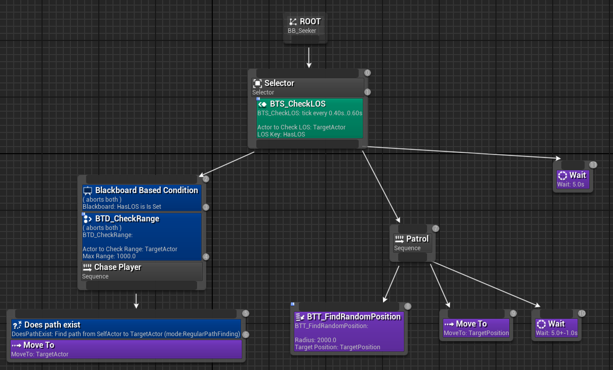

## Exercises

**Exercise 1.** When the AI Character catches the player, it should automatically go back to the patrol behavior.

**Exercise 2.** When patrolling, the AI Character should run when his target destination is far and start walking when the destination is closer. The agent's walking speed should change gradually.

  2.1. Make this behavior also work for when the character is chasing the player — when close to the player the AI Character should start walking.

**Exercise 3.** Add an alternative way of patrolling based on hand-placed waypoints in the level.
