::: {.title-banner}


::: {.dept}
Department of Computer Science<br>
[www.dei.estg.ipleiria.pt](https://www.dei.estg.ipleiria.pt)
:::

::: {.course}
Artificial Intelligence<br>Applied to Games
:::
:::

## Introduction

In this assignment you will build an NPC that:

1. **patrols** by walking to random reachable points and waiting;
2. **chases** the player when it has line of sight and the player is within range;
3. **falls back** to an idle state when nothing else is possible.

Before building it, @sec-theory explains what a State Tree is, how it chooses which state to run, and how data moves between its parts. Read it first: most problems students run into with State Trees come from not knowing *when* states are selected and *when* transitions are evaluated.

### What you will build

```{mermaid}
%%| fig-cap: "Final structure of ST_Seeker. Rounded boxes are states; the global task runs for the tree's whole lifetime."
flowchart TD
    ROOT["<b>Root</b><br/>Try Select Children In Order<br/><i>Global task: STT_CheckLOS</i>"]
    CHASE["<b>Chase</b><br/>Enter: HasLOS AND STC_InRange<br/>Task: Move To (TargetActor)"]
    PATROL["<b>Patrol</b><br/>Try Select Children In Order<br/>On Tick: HasLOS AND InRange → Chase"]
    MOVE["<b>MoveToPoint</b><br/>STT_FindRandomPosition<br/>Move To (RandomLocation)"]
    WAIT["<b>WaitAtPoint</b><br/>Delay 5 s ± 1 s"]
    IDLE["<b>Idle</b> (fallback)<br/>Delay 5 s"]
    ROOT --> CHASE
    ROOT --> PATROL
    ROOT --> IDLE
    PATROL --> MOVE
    PATROL --> WAIT
    MOVE -. "On Succeeded" .-> WAIT
    WAIT -. "On Completed" .-> MOVE
    MOVE -. "On Failed" .-> IDLE
    CHASE -. "On Tick: NOT HasLOS OR NOT InRange" .-> PATROL
```

## What is a State Tree? {#sec-theory}

A **State Tree** is a general-purpose **hierarchical state machine** framework introduced in Unreal Engine 5.0. It combines ideas from two established AI patterns: **Hierarchical State Machines (HSM)** and **Behavior Trees (BT)**. Like a Behavior Tree, it can host complex, reactive logic for an agent. Like a state machine, it has explicit, named states that are clearly active or inactive, so the agent's current behavior is easy to read and debug.

State Trees were used for AI in *The Matrix Awakens* demo and in *City Sample*, but the design is general enough for any stateful logic: combo selection in a fighting game, animation state selection, quest logic, doors, and so on.

### State Tree vs. Behavior Tree

Behavior Trees are well established in Unreal Engine and are still supported. State Trees have several advantages that make them a better choice for new projects:

- **Explicit states.** Instead of traversing a tree of composites and decorators every tick, the agent is always in a known set of active states.
- **Hierarchical grouping.** A state can have child states. When a parent is active, exactly one of its children is active too. This models behaviors such as `Combat → (Attacking | Flanking | Retreating)` without duplicating logic across branches.
- **Data-oriented design.** *Data* (context, parameters, task outputs) is separated from *logic* (tasks and conditions), which makes nodes easy to share and reuse between trees.
- **Not AI-only.** Behavior Trees are tied to the AI Controller/Pawn system. State Trees can run on any actor or component, or standalone.
- **Performance.** The tree is compiled into a flat data structure when saved, which is efficient to execute at runtime.

| Feature | Behavior Tree | State Tree |
|---|---|---|
| Execution model | Traverses the node graph every tick | Stays in the active states; re-selects only on transitions |
| State visibility | Implicit (current node path) | Explicit, named states |
| Hierarchy | Composites + decorators | Parent/child states |
| Data sharing | Blackboard (key–value store) | Typed bindings between parameters, context and task outputs |
| Non-AI use | Not practical | Fully supported |
| Introduced | UE 4 | UE 5.0 |

### Coming from Behavior Trees

If you already know Behavior Trees, this table maps the concepts you will use in this assignment:

| Behavior Tree concept | State Tree equivalent |
|---|---|
| Behavior Tree asset | **State Tree** asset (with the *StateTree AI Component* schema) |
| Blackboard keys | **Parameters** of the tree + **property bindings** between tasks, conditions and context |
| Selector | A parent state with *Selection Behavior* = **Try Select Children In Order** |
| Sequence | Sibling states chained with **transitions** (*On Succeeded → next state*) |
| Task (`BTTask_BlueprintBase`) | **Task** (`StateTreeTaskBlueprintBase`) |
| Service (runs periodically on a branch) | **Global Task** (runs for the whole tree) or a task in a parent state |
| Decorator (condition) | **Enter Condition** on a state or a **Transition Condition** |
| Observer Aborts | Transitions with trigger **On Tick** (or **On Event**) |
| `Run Behavior Tree` in the AI Controller | **StateTreeAI** component on the AI Controller + **Start Logic** |

### Architecture overview

A State Tree is built from these parts:

| Part | Description |
|---|---|
| **Schema** | Defines which external objects (the **context**) are available to the tree. For AI, use *StateTree AI Component*, which provides the **Actor** (controlled pawn) and the **AIController**. |
| **Parameters** | Public values of the tree that can be overridden per instance, similar to Blueprint variables |
| **Global Tasks** | Tasks that run for the whole lifetime of the tree (caching data, registering listeners, sensing) |
| **Evaluators** | Compute data every tick. *Largely replaced by Global Tasks since UE 5.4.* |
| **States** | Named nodes of the hierarchy; each can hold tasks, enter conditions and transitions |
| **Enter Conditions** | Must all pass before a state can become active |
| **Tasks** | Logic that runs while its state is active. Several tasks can run at the same time in one state. |
| **Transitions** | Rules that decide which state becomes active next |

### State types

Every state has a **Type** property:

| Type | Description |
|---|---|
| **State** | Standard state: can have tasks, enter conditions and transitions |
| **Group** | Cannot have tasks, only child states. Useful as a logical container. |
| **Linked** | Links to a *Subtree* state in the **same** asset |
| **Linked Asset** | Runs another State Tree asset inside the current one |
| **Subtree** | A state that *Linked* states can point to; can have tasks, children, conditions and transitions |

In this assignment all states are of type **State**.

### State selection: which state becomes active {#sec-selection}

Selection is a **depth-first search** that starts at the Root (or at the target of a transition):

1. Children are tried **in order, from top to bottom**.
2. For each child, its **Enter Conditions** are checked. If they pass and the state is a **leaf**, it becomes active. If it has children, the search continues into its children.
3. If the enter conditions fail, the **next sibling** is tried.
4. If no child of a state can be entered, that state fails to be selected. If nothing under the Root can be entered, the tree **fails**.
5. When switching states, the old states are **exited from leaf to root** and the new ones are **entered from root to leaf**. States shared by the old and the new path (for example a common parent) are not exited.

```{mermaid}
%%| fig-cap: "Selection in ST_Seeker. Root tries Chase first; if its enter conditions fail it tries Patrol, and inside Patrol it picks the first child, MoveToPoint."
flowchart LR
    R([Root]) --> C{"Chase<br/>enter conditions<br/>pass?"}
    C -- yes --> CA[["Chase active"]]
    C -- no --> P{"Patrol<br/>(no conditions)"}
    P --> M{"MoveToPoint<br/>(first child)"}
    M --> MA[["Patrol ▸ MoveToPoint active"]]
```

::: {.callout-important}
## Enter conditions can't use outputs of tasks that haven't run yet
During selection, tasks of the states being considered have **not** entered yet. If an enter condition is bound to an output of a task in a parent state, that task hasn't run, so the value is empty and the condition fails. That is why, in this assignment, the line-of-sight data comes from a **global task**: global tasks start with the tree, before any state is selected.
:::

A state's **Selection Behavior** changes how its children are chosen:

| Selection Behavior | Description |
|---|---|
| **Try Select Children In Order** | Default: try children from top to bottom |
| **Try Select Children At Random** | Shuffle the children, then try them in that order |
| **Try Select Children With Highest Utility** *(UE 5.5+)* | Enter the child with the highest utility score |
| **Try Select Children At Random Weighted By Utility** *(UE 5.5+)* | Random choice, with probability proportional to each child's utility score |
| **Try Enter** | Enter this state even though it has children (children are not selected) |
| **Try Follow Transitions** | Follow this state's transitions instead of entering it |
| **None** | This state can never be selected directly |

::: {.callout-note}
## Utility selection (UE 5.5+)
States can have **Utility Considerations**: inputs mapped through curves that produce a score. Considerations can be combined into a more complex scoring function. This gives you *highest score* or *weighted random* selection as an alternative to plain top-to-bottom priority.
:::

### Transition selection: where to go next {#sec-transitions}

A transition is: **when** *trigger* happens, **if** *conditions* hold, **go to** *target*.

| Trigger | Fires when |
|---|---|
| **On State Completed** | A task of the state finished (succeeded **or** failed) |
| **On State Succeeded** | A task of the state finished with success |
| **On State Failed** | A task of the state finished with failure |
| **On Tick** | Every tick, as long as the conditions pass |
| **On Event** | A **State Tree Event** with a given Gameplay Tag is received |

The target can be a named state, **Next State** (the next sibling), **Root**, or **Tree Succeeded / Tree Failed** (which stop the tree).

Transitions are evaluated **from the active leaf state up to the root**, and the **first one that passes wins**. So a transition placed on a parent state works for all its active children, unless a child has a transition that fires first. You will use this to put a single *"see the player → Chase"* transition on **Patrol** that works for both of its children.

::: {.callout-warning}
## Any active state can complete
A task that finishes on **any active state**, not only the leaf, triggers that state's completion transitions. For example, a task on a parent state that succeeds will try the parent's transitions and interrupt its children. Keep this in mind when you place tasks on parent states.
:::

::: {.callout-note}
## Implicit transitions
A new leaf state automatically gets a hidden transition back to **Root** when it completes. This prevents the tree from getting stuck when no transitions are configured. As soon as you add an explicit transition without conditions, the implicit one is removed.
:::

### Task lifecycle {#sec-tasks}

Every task can implement three events:

| Event | When it runs | Typical use |
|---|---|---|
| **Enter State** | Once, when its state becomes active | Initialize, compute a location, start a move |
| **Tick** | Every frame while its state is active (Blueprint: only if implemented) | Poll something, track a target |
| **Exit State** | Once, when its state is left | Stop movement, clean up |

Internally each task reports a status (`EStateTreeRunStatus` in C++):

| Status | Meaning |
|---|---|
| `Running` | Keep the state active and keep ticking |
| `Succeeded` | The task is done; triggers *On State Succeeded* / *On State Completed* |
| `Failed` | The task failed; triggers *On State Failed* / *On State Completed* |

In **Blueprint** you don't return a status. A task is `Running` until it calls **Finish Task** (`Succeeded = true/false`).

::: {.callout-tip}
## Not every task has to finish
A task that only **provides data** (for example, computing a location for *Move To*) can do its work in *Enter State* and never call *Finish Task*. The state then ends when another task in it, such as *Move To*, finishes. You will use this in `STT_FindRandomPosition`.
:::

#### Task completion control (UE 5.6+)

In UE 5.6, task completion became configurable:

- Each task has a **clipboard icon** to its left in the state's *Tasks* list. **Blue** means the task is *considered for completion* (it can end the state); **grey** means it isn't. Some built-in tasks, such as *Debug Text*, are never considered.
- Each state has a **Task Completion** mode:
  - **Any** *(default)*: the first task considered for completion that finishes ends the state. This is the classic behavior.
  - **All**: the state waits for **every** task considered for completion to succeed. If one fails, the state fails immediately.

This makes it easy to run several tasks in parallel and continue only when all of them are done.

### Property categories and bindings {#sec-categories}

Tasks and conditions exchange data through **bindings**, not through a Blackboard. In a Blueprint task or condition, the **Category** of each variable (*Details → Category*) tells the State Tree how to treat it. Variables must also be **Instance Editable** (eye icon) to appear in the State Tree editor.

| Category | Meaning |
|---|---|
| `Context` | Automatically bound to the best-matching context object (e.g. *Actor*, *AIController*); can be changed manually |
| `Input` | **Must** be bound (to a parameter, context or another node's output) for the tree to compile |
| `Output` | Written by the task; later tasks and conditions can bind to it. An output cannot be bound back into a parameter to store it. |
| `Parameter` | Optional binding; otherwise you type a value in the State Tree editor. Shown prominently in the Details panel. |
| *(none)* | Optional binding; can also be set to a direct value |

What a property can bind to: the tree **parameters**, the **context**, outputs of **global tasks**, outputs of tasks in **parent states**, and outputs of tasks **above it in the same state**.

::: {.callout-note}
## Property references
**Property References** let a task or condition refer to a tree parameter directly, so it can write data back to it, similar to a Blackboard key. In UE 5.4 this is C++ only (`FStateTreePropertyRef`). UE 5.5+ adds a Blueprint version (`FStateTreeBlueprintPropertyRef`) with more limited support. This assignment uses outputs and bindings instead.
:::


## Setting up the basis

### Project and plugins

Create a new project based on the **Third Person** template (Blueprint) and name it **`ST_Basics`**.

{width=80%}

Go to **Edit → Plugins** and make sure the following plugins are enabled (restart the editor if asked):

- **StateTree**
- **Gameplay State Tree** (provides the *StateTree AI Component* and the AI *Move To* task)

::: {.callout-tip}
Some UE5 versions enable these plugins by default. Check anyway: without **Gameplay State Tree** the AI component and the *Move To* task will not appear.
:::

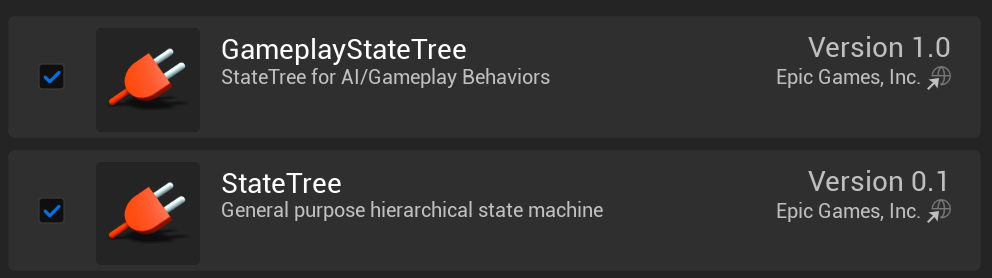{fig-align="center"}

### Navigation

The agent needs a navigation mesh to move. If the level has no **Nav Mesh Bounds Volume**, add one (**Quick Add → Volumes → Nav Mesh Bounds Volume**) and scale it to cover the whole floor. Press <span class="kbd">P</span> in the viewport to show the walkable area in green.

### The AI Character

In the **Content Drawer**, inside `ThirdPerson/Blueprints`, create a folder named **`AI`**.

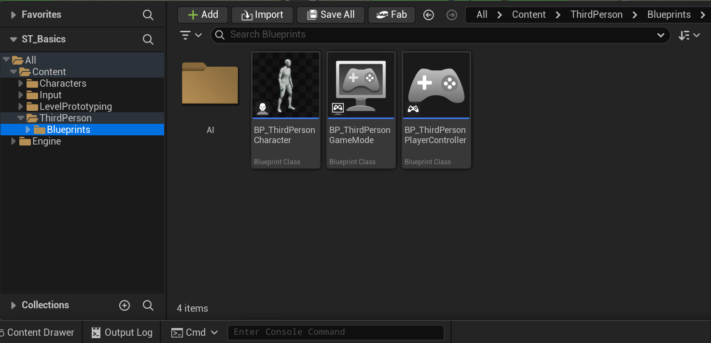{width=85%}

**Copy** `BP_ThirdPersonCharacter` into the `AI` folder (drag it onto the folder and choose **Copy Here**).

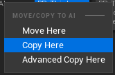

Now, go to the **`AI`** folder and rename the copy to **`BP_AICharacter`**.

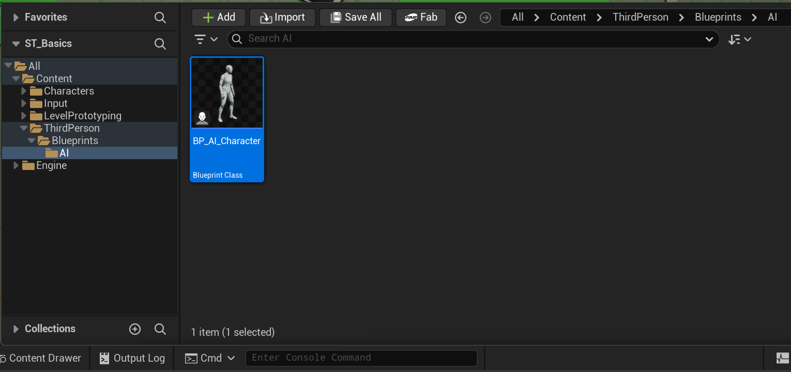

Open `BP_AICharacter`:

1. In the **Event Graph**, select everything and press <span class="kbd">Delete</span>. The AI does not read player input.

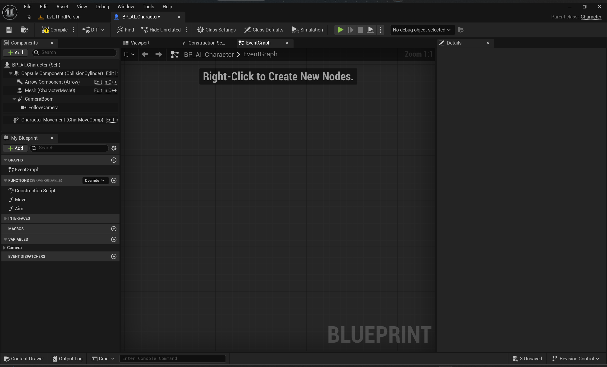

2. In the **Components** panel, delete **CameraBoom** and **FollowCamera**.

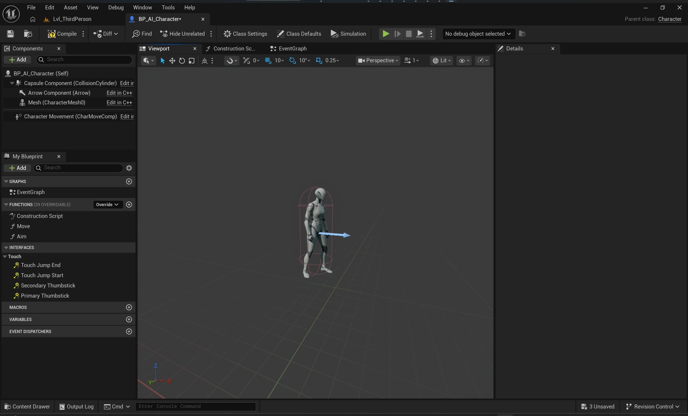

3. **Compile** and **Save**.

### The AI Controller

Now, let's create an **AIController** for this Character. If you look into its **Class Defaults**, more specifically into the **AI Controller Class** option, you will see that this Character already has a default AI Controller Class, which is the **"AIController"**:

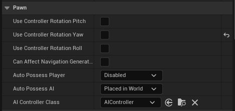

Inside the `AI` folder, right-click **Blueprint Class**, expand **ALL CLASSES**, search for `AIController`, select it.

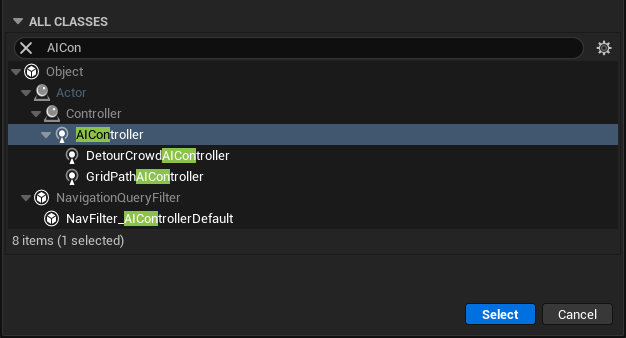

Name the new blueprint **`BP_AIC_Seeker`**

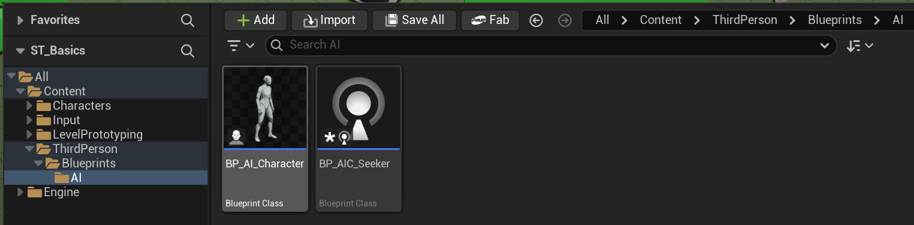


Open `BP_AICharacter` again, go to **Class Defaults** and set **AI Controller Class** to `BP_AIC_Seeker`. Keep **Auto Possess AI** set to *Placed in World* (or *Placed in World or Spawned*).

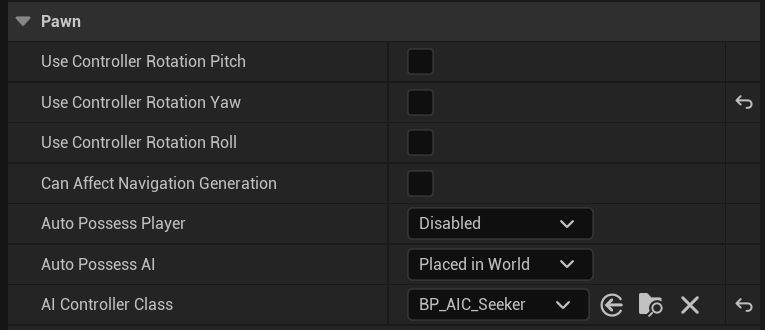

**Compile**, **Save**, and drag `BP_AICharacter` into the level.

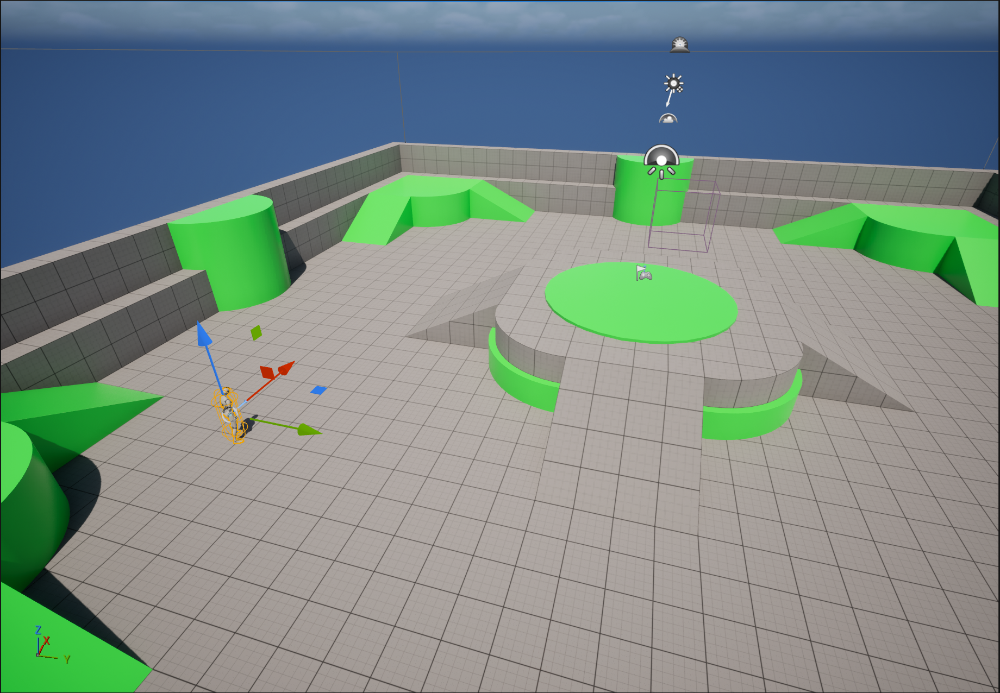

If you press **Play** now, the character stands still: it has a controller but no behavior yet.

## Creating the State Tree

### The asset and its schema

In the `AI` folder, right-click **Artificial Intelligence → State Tree**. When asked for a schema, choose **StateTree AI Component**.

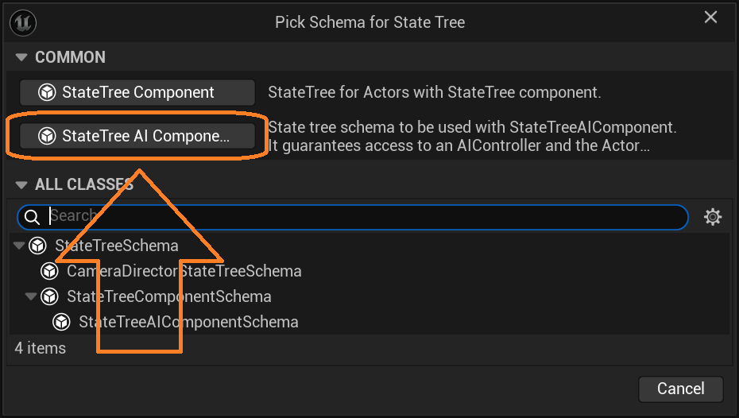

::: {.callout-important}
## The schema matters
The schema defines the **context** that the tree receives. The *StateTree AI Component* schema gives every task and condition access to the **AIController** and to the controlled pawn (**Actor**). With the wrong schema the AI tasks (e.g. *Move To*) will not be available.
:::

Name the asset **`ST_Seeker`** and open it.

Select the root of the tree (the asset name at the top of the **States** panel) and, in the **Details** panel, under **Schema**:

| Property | Value |
|---|---|
| AI Controller Class | `BP_AIC_Seeker` |
| Context Actor Class | `BP_AICharacter` |

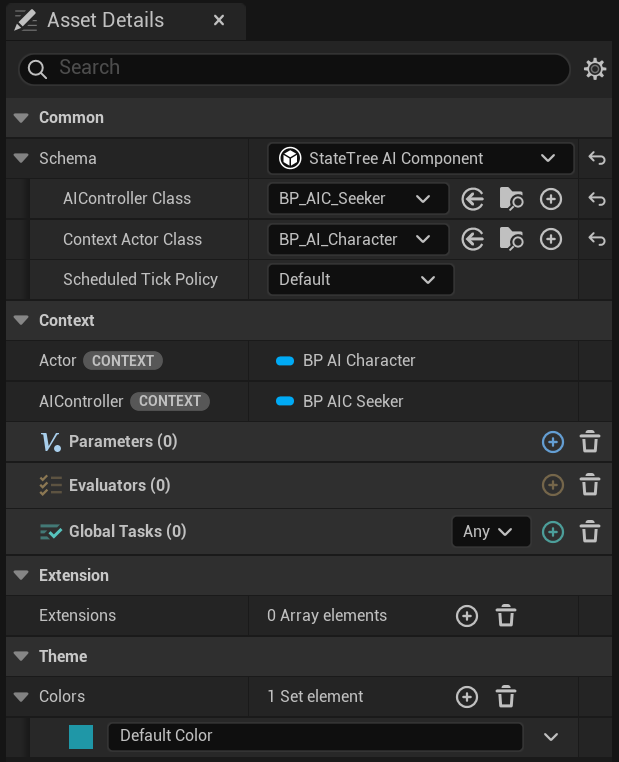

### Tree parameters

Parameters are values that belong to the tree and can be bound by any node. They replace the constant values you used to type directly on Behavior Tree nodes, and they can be overridden per component instance.

In the root's **Details → Parameters**, add:

| Name | Type | Default |
|---|---|---|
| `PatrolRadius` | Float | `2000.0` |
| `MaxChaseRange` | Float | `1000.0` |

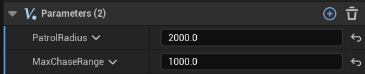

::: {.callout-note}
## Where did the Blackboard go?
There is no Blackboard. Data flows through **bindings**: a task exposes **Output** properties, and other tasks or conditions bind their **Input** properties to them. Values that never change at runtime are **Parameters**. You will see this in practice in the next sections.
:::

### Running the tree from the AI Controller

Open `BP_AIC_Seeker`:

1. **Add Component → StateTreeAI**.
2. With the component selected, in **Details**:
   - **State Tree** → `ST_Seeker`
   - **Start Logic Automatically** → **unchecked**

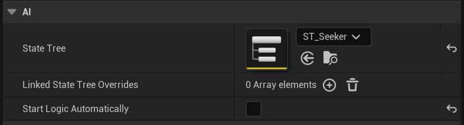

3. In the **Event Graph** add:

```{.text .node-chain}
Event On Possess ──► StateTreeAI.Start Logic
```

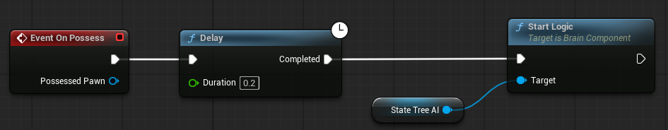

::: {.callout-tip}
## Why not start automatically?
The controller's *BeginPlay* can run **before** it possesses the pawn, so the *Actor* context would still be empty. Starting the logic on **On Possess** guarantees that the pawn exists.
:::

**Compile** and **Save**. The tree runs, but it is still empty.

## Patrol behavior

### Blueprint tasks: a quick recap

State Tree tasks in Blueprint derive from **`StateTreeTaskBlueprintBase`** and implement **Enter State**, **Tick** and/or **Exit State** (@sec-tasks). Each variable needs a **Category** (`Context`, `Input`, `Output`, `Parameter`) and must be **Instance Editable** (@sec-categories).

### Task `STT_FindRandomPosition`

In the `AI` folder, create a **Blueprint Class** derived from **StateTreeTaskBlueprintBase** and name it **`STT_FindRandomPosition`**. Create these variables:

| Variable | Type | Category | Default |
|---|---|---|---|
| `Actor` | Actor (object reference) | `Context` | – |
| `Radius` | Float | `Parameter` | `2000.0` |
| `RandomLocation` | Vector | `Output` | – |

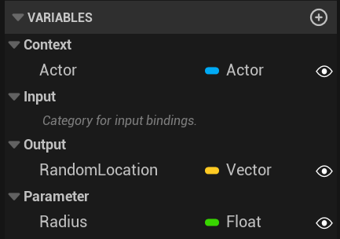

Override **Event Enter State** and build:

```{.text .node-chain}
Event Enter State
  └─► GetRandomReachablePointInRadius
        Origin  = GetActorLocation(Actor)
        Radius  = Radius
        out RandomLocation ──► SET RandomLocation
  └─► Branch (Return Value)
        True  ──► (nothing — do NOT call Finish Task)
        False ──► Finish Task (Succeeded = false)
```

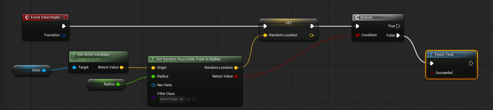

::: {.callout-important}
## Why doesn't the task finish on success?
This task only **provides data**. It will share a state with the built-in **Move To** task, and we want the state to end when the *movement* ends, not when the point is found. If no point is found, it fails the state immediately so that the tree can react.

In **UE 5.6+** you can make this explicit: in the *MoveToPoint* state, set the clipboard icon of `STT_FindRandomPosition` to grey (*not considered for completion*). See @sec-tasks.
:::

**Compile** and **Save**.

### Building the Patrol states

Open `ST_Seeker`. In the **States** panel, use **Add State** (and right-click → *Add Child State*) to create this hierarchy:

```
Root
├── Patrol
│   ├── MoveToPoint
│   └── WaitAtPoint
└── Idle
```

::: {.callout-tip}
## Color your states
In the asset's **Theme → Colors**, create a few colors (e.g. red for *Chase*, green for *Patrol*) and assign them with each state's **Color** property. Larger trees become much easier to read.
:::

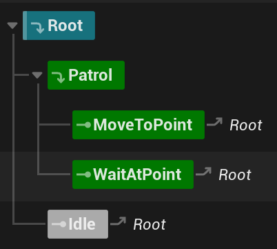

Configure them as follows.

**Root** – *Selection Behavior*: **Try Select Children In Order**.

**Patrol** – *Selection Behavior*: **Try Select Children In Order**. No tasks.

**MoveToPoint**

| Tasks (in this order) | Settings |
|---|---|
| `STT_FindRandomPosition` | **Radius** → bind to *Parameters › PatrolRadius* |
| **Move To** (AI category) | **Destination** → bind to *STT_FindRandomPosition › RandomLocation*; **Acceptable Radius** = `50` |

| Transition | Trigger | Go to |
|---|---|---|
| 1 | On State Succeeded | `WaitAtPoint` |
| 2 | On State Failed | `Idle` |

To bind a property, click the small **binding (chain) icon** next to it and pick the source from the menu (see @sec-categories for what can be bound).

The explicit transitions you add here replace the *implicit transition to Root* that new leaf states have (@sec-transitions).

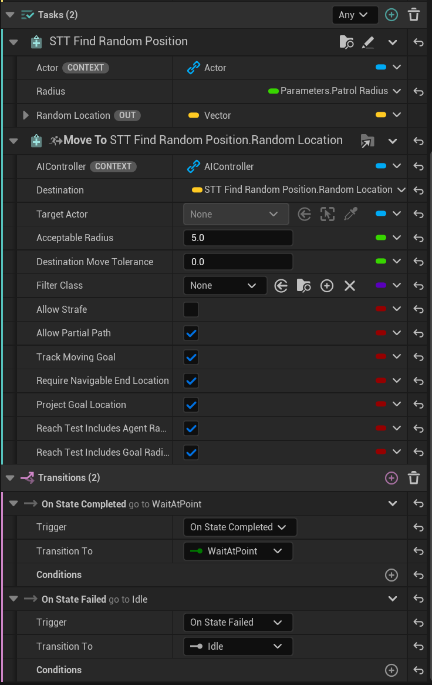


**WaitAtPoint**

| Task | Settings |
|---|---|
| **Delay** | **Duration** = `5.0`, **Random Deviation** = `1.0` |

| Transition | Trigger | Go to |
|---|---|---|
| 1 | On State Completed | `MoveToPoint` |

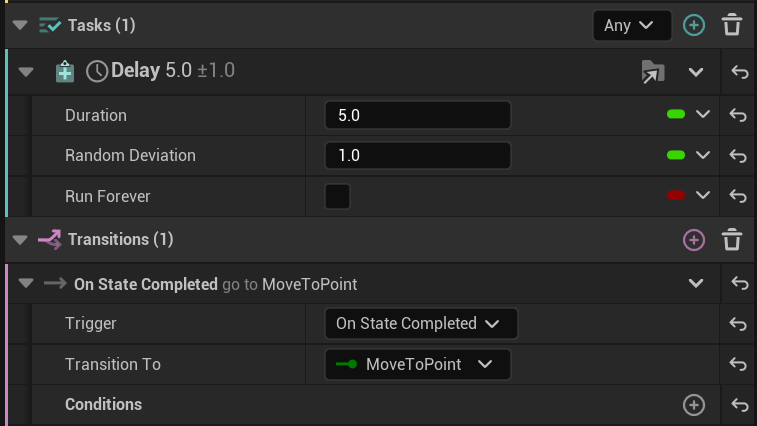

**Idle** (fallback: runs if patrolling fails)

| Task | Settings |
|---|---|
| **Delay** | **Duration** = `5.0` |

| Transition | Trigger | Go to |
|---|---|---|
| 1 | On State Completed | `Root` |

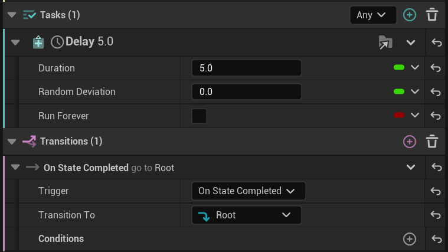

Your state tree should look like this:

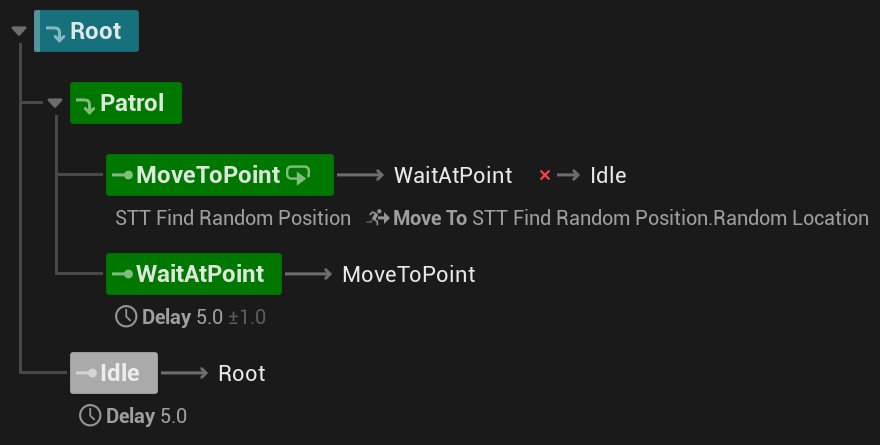


Click **Compile** in the State Tree toolbar (fix any red errors it reports) and **Save**.

::: {.callout-tip}
## Checkpoint 1
Play. The agent should walk to a random point, wait about 5 seconds, pick a new point, and repeat. Because *MoveToPoint* is re-entered every cycle, its *Enter State* runs again and a new random location is computed each time.
:::

## Chase behavior

To chase the player the agent needs to know (1) **who** the player is and (2) whether it **can see** them. In a Behavior Tree this would be a *Service* writing to Blackboard keys. Here it is a **Global Task**: a task that starts with the tree, ticks for as long as the tree runs, and exposes its results as **outputs** that the whole tree can bind to.

### Global task `STT_CheckLOS`

Create a new **StateTreeTaskBlueprintBase** named **`STT_CheckLOS`** with these variables:

| Variable | Type | Category | Default |
|---|---|---|---|
| `Actor` | Actor | `Context` | – |
| `TargetActor` | Actor | `Output` | – |
| `HasLOS` | Boolean | `Output` | `false` |
| `CheckInterval` | Float | `Parameter` | `0.25` |
| `TimeSinceLastCheck` | Float | *(none, not instance editable)* | `0.0` |

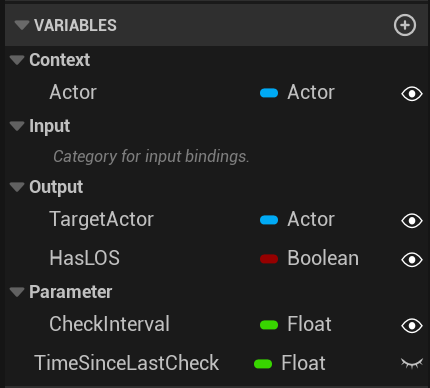

**Event Enter State** – find the target once and force an immediate first check:

```{.text .node-chain}
Event Enter State
  └─► SET TargetActor = Get Player Character (Player Index 0)
  └─► SET HasLOS = false
  └─► SET TimeSinceLastCheck = CheckInterval
```

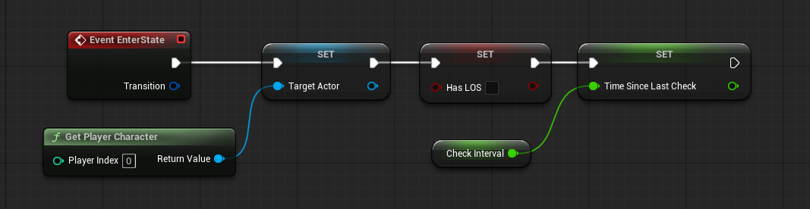

**Event Tick** – run the trace only every `CheckInterval` seconds (the equivalent of a Service *Interval*):

```{.text .node-chain}
Event Tick (Delta Time)
  └─► SET TimeSinceLastCheck = TimeSinceLastCheck + Delta Time
  └─► Branch (TimeSinceLastCheck >= CheckInterval)       False ──► end
  └─► SET TimeSinceLastCheck = 0
  └─► Is Valid (TargetActor)                             Not Valid ──► SET HasLOS = false
  └─► Capsule Trace For Objects
        Start          = GetActorLocation(Actor)
        End            = GetActorLocation(TargetActor)
        Radius = 23, Half Height = 10
        Object Types   = [WorldStatic, WorldDynamic, Pawn, PhysicsBody]
        Actors to Ignore = [Actor]
  └─► Break Hit Result
  └─► SET HasLOS = (Return Value AND Hit Actor == TargetActor)
```

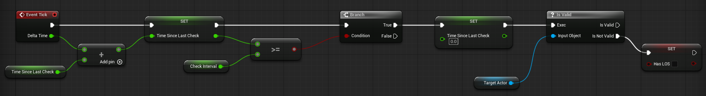

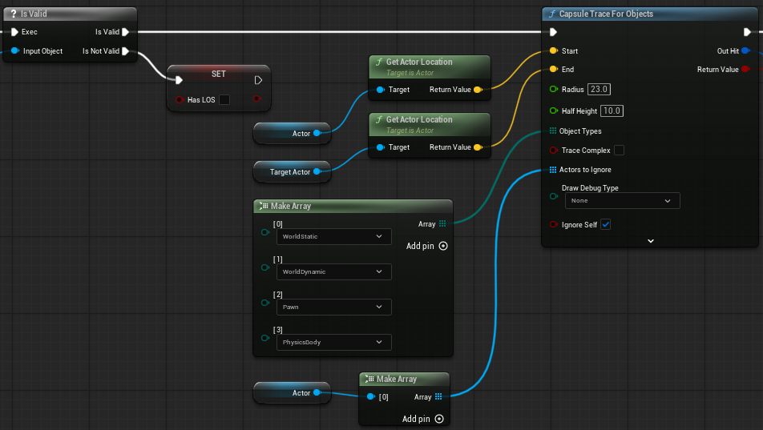

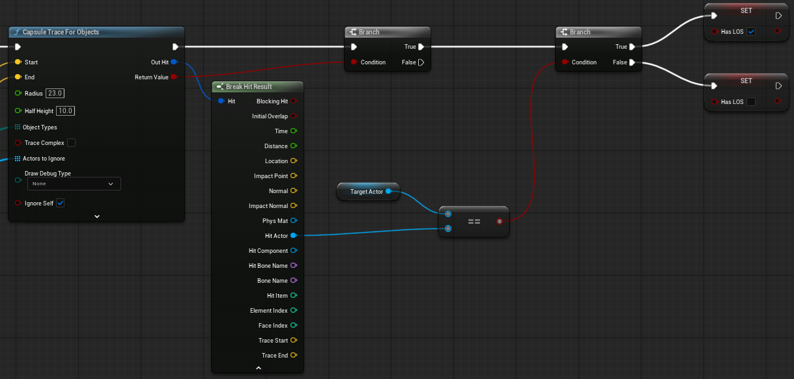

::: {.callout-warning}
## Never call Finish Task in a global task
If a global task finishes, the **whole State Tree stops**. `STT_CheckLOS` must keep running forever, so it never calls *Finish Task*.
:::

**Compile** and **Save**. In `ST_Seeker`, select the root and, in **Details → Global Tasks**, add **`STT_CheckLOS`**.

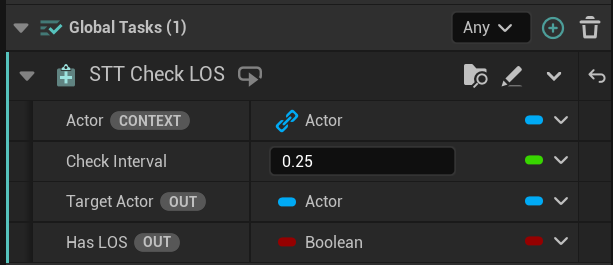

::: {.callout-note}
The player reference is now obtained **inside the tree** when it starts, so the AI Controller no longer needs to write it anywhere (no *Set Value as Object*, no *Make Literal Name*, no *Delay*).
:::

### The Chase state

Add a new child of **Root** called **`Chase`** and drag it so that it is the **first** child (above *Patrol*). Since the root tries its children in order (@sec-selection), *Chase* has the highest priority. Its enter conditions can safely bind to `STT_CheckLOS` because global tasks are already running when states are selected.

**Enter Conditions**

| Condition | Settings |
|---|---|
| **Bool Compare** | **Left** → bind to *STT_CheckLOS › HasLOS*; **Right** = `true` |

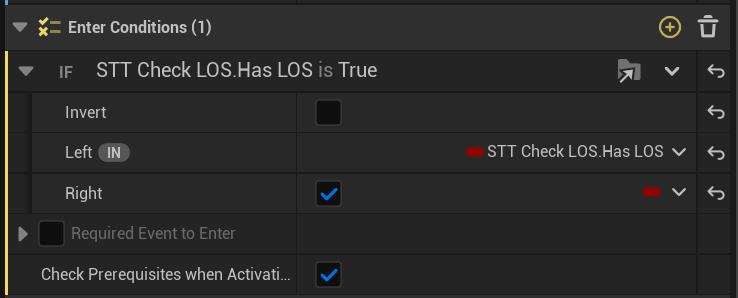

**Tasks**

| Task | Settings |
|---|---|
| **Move To** | **Target Actor** → bind to *STT_CheckLOS › TargetActor*; **Acceptable Radius** = `100`; **Track Moving Goal** = ✔ |

**Transitions**

| # | Trigger | Conditions | Go to |
|---|---|---|---|
| 1 | On Tick | **Bool Compare**: *HasLOS* == `false` | `Patrol` |
| 2 | On State Completed | – | `Root` |

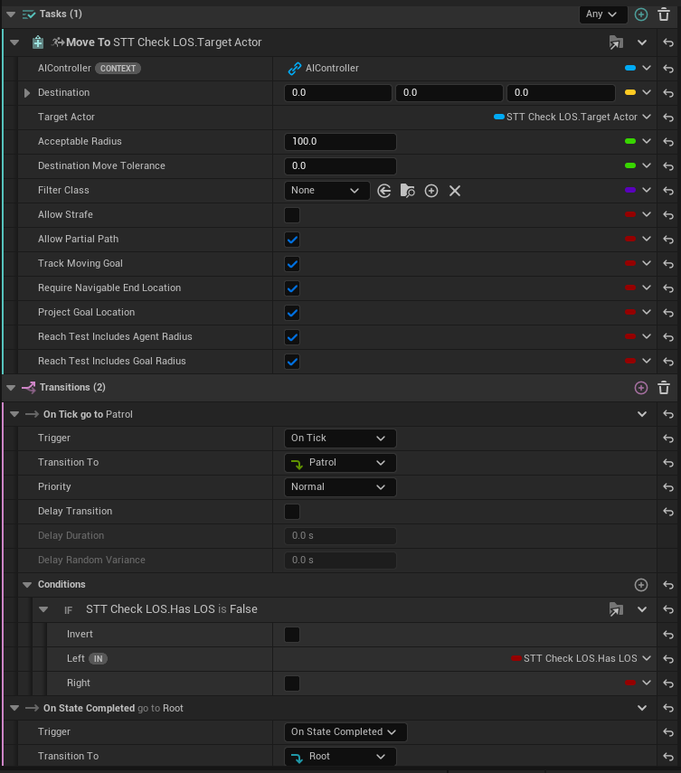


### Reacting while patrolling

Enter conditions are only checked **when a state is being selected**. While the agent is patrolling, nothing re-selects the root, so it would never notice the player. This is what *Observer Aborts* did in Behavior Trees. In a State Tree you add a **transition** that checks every tick. Because transitions are evaluated from the leaf up to the root (@sec-transitions), one transition on the parent covers all its children.

Select **Patrol** (the parent, so the transition is active for both *MoveToPoint* and *WaitAtPoint*) and add:

| # | Trigger | Conditions | Go to |
|---|---|---|---|
| 1 | On Tick | **Bool Compare**: *HasLOS* == `true` | `Chase` |

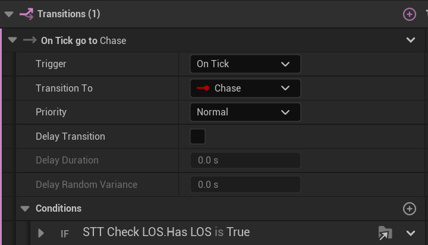

**Compile** and **Save**.

::: {.callout-tip}
## Checkpoint 2
Play and walk in front of the agent: it should start chasing you. Hide behind a wall: after a moment it goes back to patrolling.
:::

## Limiting the detection range

The agent currently sees the player from any distance. We will write a **custom condition**, the State Tree equivalent of a Blackboard decorator.

### Condition `STC_InRange`

Create a **Blueprint Class** derived from **StateTreeConditionBlueprintBase** named **`STC_InRange`**:

| Variable | Type | Category | Default |
|---|---|---|---|
| `Actor` | Actor | `Context` | – |
| `TargetActor` | Actor | `Input` | – |
| `MaxRange` | Float | `Parameter` | `1000.0` |

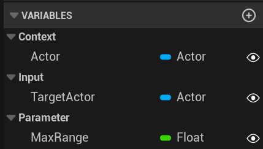

In **Functions → Override**, choose **Test Condition** (`ReceiveTestCondition`) and build:

```{.text .node-chain}
Test Condition
  └─► Return Node
        Return Value = Is Valid(TargetActor)
                       AND (Get Distance To(Actor, TargetActor) < MaxRange)
```
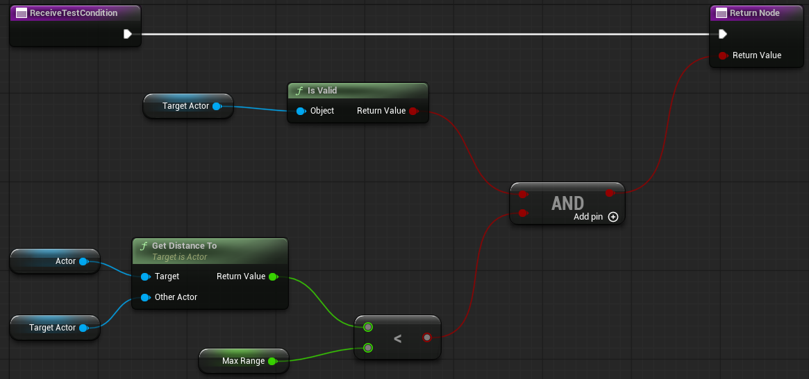

**Compile** and **Save**.

### Using the condition

In `ST_Seeker`, add `STC_InRange` in three places. In all of them bind **Target Actor** → *STT_CheckLOS › TargetActor* and **Max Range** → *Parameters › MaxChaseRange*.

1. **Chase → Enter Conditions**: add it after the Bool Compare, with operand **AND**.
2. **Patrol → transition *On Tick → Chase***: add it after the Bool Compare, with operand **AND**.
3. **Chase → transition *On Tick → Patrol***: add it after the Bool Compare, set operand to **OR**, and toggle **Invert** on `STC_InRange` (shown as **NOT**). The transition now reads: *NOT HasLOS **OR** NOT InRange*.

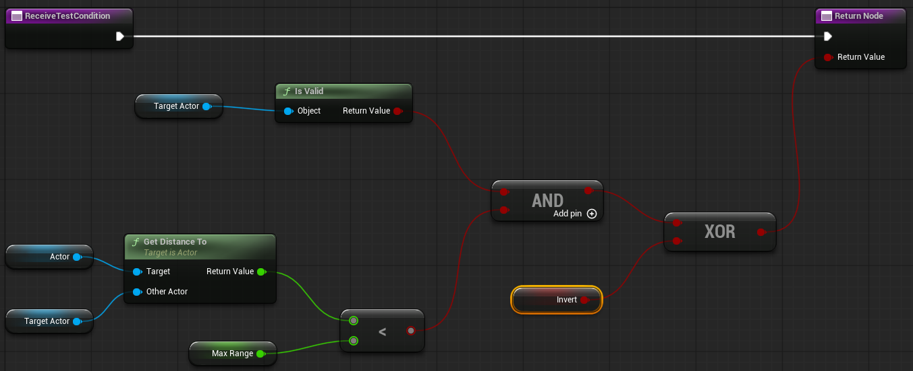

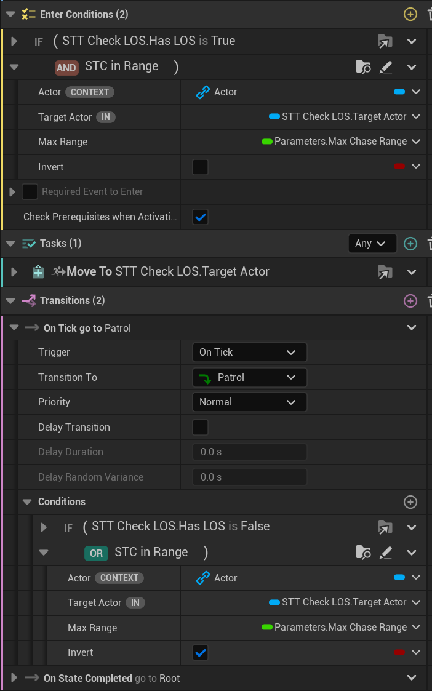

::: {.callout-note}
Conditions in a list are combined with the **AND/OR** operand shown on the left of each condition. You can also indent conditions to group them, like parentheses.
:::

### Making sure a path exists

The Behavior Tree version used a *Does Path Exist* decorator. The State Tree **Move To** task can handle this itself. In **Chase → Move To** set:

| Property | Value |
|---|---|
| Allow Partial Path | ✘ (unchecked) |
| Require Navigable End Location | ✔ |

If no full path to the player exists, *Move To* **fails**. Add a transition to **Chase**:

| # | Trigger | Go to |
|---|---|---|
| 3 | On State Failed | `Patrol` |

Move this transition **above** the *On State Completed → Root* transition, so that failure is handled first.

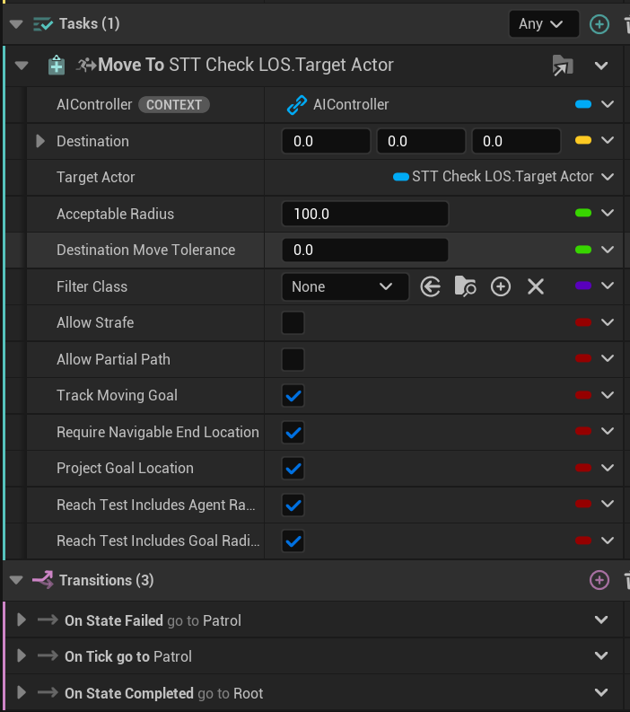

::: {.callout-tip}
## Checkpoint 3
Change **MaxChaseRange** in the root's Parameters (e.g. `600`) and play. The agent should only chase you when you are closer than that distance. Because it is a tree parameter, you can also override it per agent in the **StateTreeAI** component of each controller.
:::

## Debugging

State Trees include a dedicated debugger:

1. In the State Tree editor, open **Window → Debugger** (or the **Debugger** tab).
2. Press **Play**. Recording starts automatically; you can also start it manually from the debugger toolbar.
3. Select the agent's instance and scrub the timeline to see **which states were active**, which **transitions** fired, and **task/condition values** at each frame.

The active states are also highlighted in the tree while the game is running. When something doesn't work, check the debugger before changing the logic.

Other useful tools:

- **Gameplay Debugger.** During play, press <span class="kbd">'</span> (apostrophe) to open the AI debug overlay for the agent in front of the camera. The active State Tree states are listed under **Brain Component**. <span class="kbd">NumPad 4</span> toggles the perception view (useful for Exercise 4).
- **Debug Text task.** Add a *Debug Text* task to a state (Text = the state name, **Reference Actor** bound to the context *Actor*) to show above the agent's head which state it is in.
- **State Enabled.** Right-click a state and uncheck **State Enabled** to take it out of selection while you test other parts of the tree. Don't forget to enable it again.

::: {.callout-warning}
## Common problems
| Symptom | Likely cause |
|---|---|
| The tree never starts | *Start Logic* not called, or the component has no State Tree assigned |
| *Move To* doesn't appear in the task list | *Gameplay State Tree* plugin disabled, or wrong schema |
| A task's variables don't appear | Variables not **Instance Editable** or missing **Category** |
| *Input* shows a red error | An `Input` property is not bound |
| The agent never moves | No Nav Mesh Bounds Volume, or it doesn't cover the floor |
| The tree stops completely | A **global task** called *Finish Task* |
| An enter condition always fails | It is bound to an output of a task in a parent state that hasn't entered yet (@sec-selection) |
| A state is greyed out and never entered | **State Enabled** is unchecked |
:::

## Final result

| State | Selection / Enter conditions | Tasks | Transitions |
|---|---|---|---|
| **Root** | Try Select Children In Order | *Global:* `STT_CheckLOS` | – |
| **Chase** | HasLOS **AND** `STC_InRange` | Move To (TargetActor, no partial path) | On Tick: NOT HasLOS OR NOT InRange → Patrol · On Failed → Patrol · On Completed → Root |
| **Patrol** | Try Select Children In Order | – | On Tick: HasLOS AND InRange → Chase |
| ↳ **MoveToPoint** | – | `STT_FindRandomPosition`, Move To (RandomLocation) | On Succeeded → WaitAtPoint · On Failed → Idle |
| ↳ **WaitAtPoint** | – | Delay 5 s ± 1 s | On Completed → MoveToPoint |
| **Idle** | – | Delay 5 s | On Completed → Root |

```{mermaid}
%%| fig-cap: "Runtime view: the agent's behavior as a flat state machine (Patrol children shown directly)."
stateDiagram-v2
    direction LR
    [*] --> MoveToPoint
    MoveToPoint --> WaitAtPoint : succeeded
    WaitAtPoint --> MoveToPoint : completed
    MoveToPoint --> Idle : no point found
    Idle --> MoveToPoint : after 5 s
    MoveToPoint --> Chase : sees player in range
    WaitAtPoint --> Chase : sees player in range
    Chase --> MoveToPoint : lost player or no path
```

## Exercises

1. **Catch and return.** When the AI Character reaches the player, it currently re-selects the root and immediately chases again. Make it go back to patrolling instead, and ignore the player for a few seconds.
   *Hint:* add a state after the catch with a *Delay* task, or store a cooldown timestamp as an output of a global task and use it in Chase's enter conditions.

2. **Walk or run.** While patrolling, the agent should **run** when its destination is far and **walk** when it is close, with the speed changing **gradually** (interpolate *Max Walk Speed* on the Character Movement component).
   a. Make it also work while chasing: when close to the player, the agent should slow down to a walk.
   *Hint:* one task in the *Patrol* and *Chase* states (or a global task) that ticks, reads the distance to the current goal, and uses *FInterp To*.

3. **Waypoint patrol.** Add a second way of patrolling based on **hand-placed waypoints** in the level. Create a `BP_Waypoint` actor, expose an array of waypoints on the AI Character, and add a new state (for example `WaypointPatrol`) that selects the next waypoint in order.
   *Hint:* use a **tree parameter** (bool `UseWaypoints`) and enter conditions to choose between the random patrol and the waypoint patrol.

4. **(Extra) Events instead of polling.** Replace the *On Tick* transitions with **On Event** transitions. Use an **AI Perception** component (Sight) on the controller and, in *On Target Perception Updated*, call **Send State Tree Event** on the StateTreeAI component with the gameplay tags `AI.Event.PlayerSeen` / `AI.Event.PlayerLost`. Compare both approaches: when is polling simpler, and when do events scale better?
   *Things to watch out for:*
   - The Gameplay Tags must exist in **Project Settings → GameplayTags**, otherwise *Send State Tree Event* does nothing.
   - The **Target** of *Send State Tree Event* must be the **StateTreeAI component**, not the controller or the pawn.
   - AI Sight only detects *Enemies* when the actors are on different teams (`IGenericTeamAgentInterface`, C++). In Blueprint-only projects, enable **Detect Neutrals** (or all three options) in *Detection by Affiliation*, and filter the perceived actors yourself.
