In addition to Behavior Trees which can be used to make decisions on which logic to execute, and the Environmental Query System (EQS) used to retrieve information about the environment; another tool you can use within the AI framework which provides sensory data for an AI is the **AI Perception System**. This provides a way for Pawns to receive data from the environment, such as where noises are coming from, if the AI was damaged by something, or if the AI sees something. This is accomplished with the **AI Perception Component** which acts as a stimuli listener and gathers registered Stimuli Sources.

When a stimuli source is registered, the event **On Perception Updated** (or **On Target Perception Updated** for target selection) is called which you can use to fire off a new Blueprint Script and/or update variables that are used to validate branches in a Behavior Tree.

## Setting up the Basis

Create a new project based on the Third Person template and name it: **Advanced AI**.

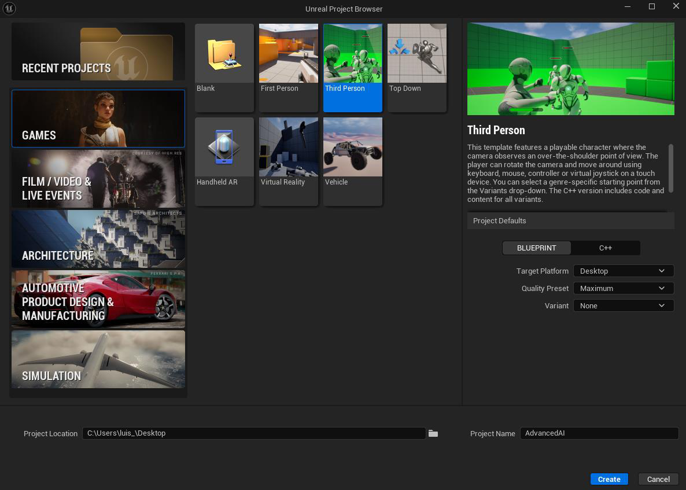

In the **Content Drawer**, inside the **ThirdPerson\Blueprints** folder create a new folder and name it **"AI"**.

**Copy** the **BP_ThirdPersonCharacter** blueprint into the **AI** folder by dragging the blueprint into the AI folder and select **Copy Here**.

Now, go to the **AI** folder and rename the blueprint to **"BP_AICharacter"**.

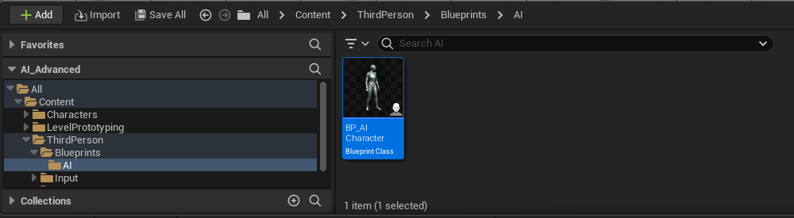

**Double-click** on the **BP_AICharacter** blueprint to open it. Then, go to the **Event Graph** and delete the entire content: select everything and press **DELETE** key:

Also, go to the **Viewport** tab and delete the **Camera Boom** and the **Follow Camera** components, since the AI character will not need all that.

**Compile** and **save** the **BP_AICharacter** blueprint by clicking on **Compile** and **Save** buttons.

## Creating the AI Controller

Now, let's create an **AIController** for this Character. If you look into its **Class Defaults**, more specifically into the **AI Controller Class** option, you will see that this Character already has a default AI Controller Class, which is the **"AIController"**:

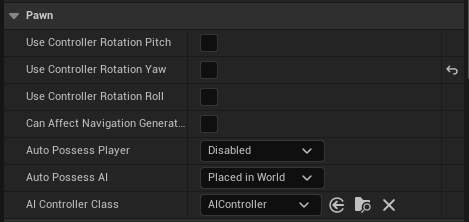

However, what you need is a **new** AI Controller. To create a new **AI Controller**, go the **Content Drawer**, and inside the **AI** folder, right-click and select **"Blueprint Class"**. Click on **ALL CLASSES** to expand, go to the **Search** box and type: **"AICon"**. Finally, select **AIController** class.

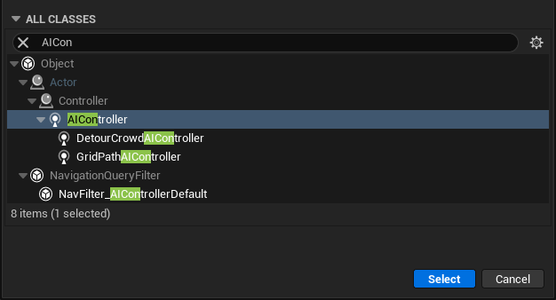

Name the created **AI Controller** as **"AIC_Runner"**.

## Setting the AI Controller Class

Go to the **Content Drawer** and open the **BP_AICharacter**. Now, on the **Class Defaults**, set the **AIController Class** to **AIC_Runner**. This way, you are specifying that this is the controller that will be controlling the **Character**.

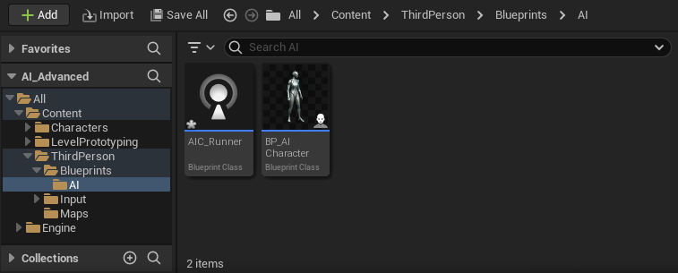

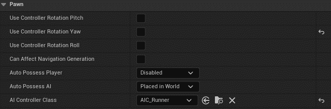

Click **Compile** and **Save**. Now, that everything is all set up on your **AI Character**, you can go to the **Content Drawer** and drag it into the Level, like so:

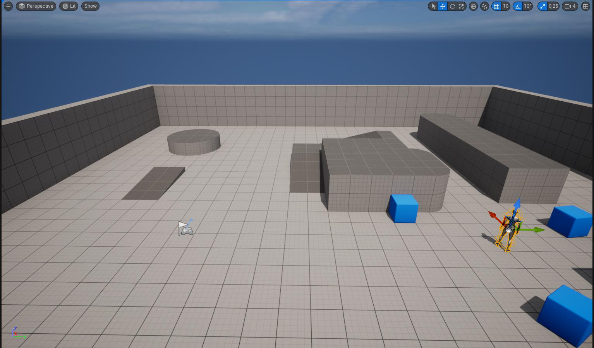

If you run your game, the **AI Character** will be standing still because he does not have any behavior — he simply exists in the world and does not follow any commands.

## Adding the AIPerception Component

Now, you will add the **AIPerception** component so that our **AICharacter** can sense things. In our case we will add Sight. To do this open your **AIC_Runner** and add the component **AIPerception** (see <https://api.unrealengine.com/INT/BlueprintAPI/AI/Perception/index.html>).

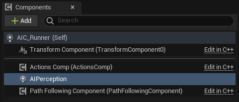

Select the **AIPerception** component and go to the **Details** panel to configure the component. In the **Senses Config** array add an element and set it to **"AI Sight Config"**, click the dropdown arrows to expand the config, set the **Sight Radius** to **1000** and the **Lose Sight Radius** to **1500**, and in the **Detection by Affiliation** set all flags to true.

> **Note:** The detection by affiliation features can only be edited in C++, therefore if working with blueprints, we must check all the flags and implement this ourselves if we want to distinguish between enemies, neutrals, or friendlies in blueprints.

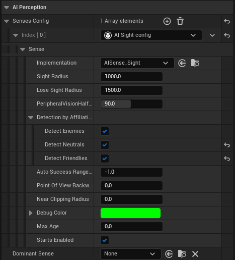

Your AI Character should now be able to **see** you. To debug and visualize this, you can enable the AI debugging tool. Start the game, rotate the camera towards the direction of the agent you want to debug, and enable the **AI Debug tool** (with the **apostrophe key**, to the right of the 0 key). You should then see something like this:

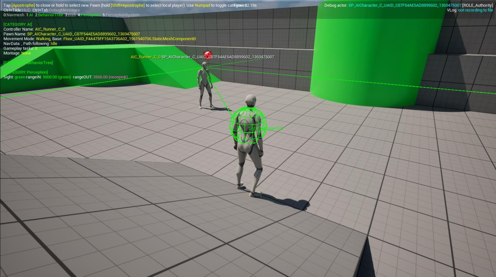

The **AI Debug tool** has a variety of different categories you can visualize, using your keyboard's **Numpad** to toggle them on or off (for example you can visualize the NavMesh with NumPad 0, the BehaviorTree with NumPad 2, and even the Perception system with NumPad 4).

## Adding Behavior to the AICharacter

Start by creating a blackboard, name it **"BB_Runner"**, add 3 keys:

- an **Object** key named **"PlayerCharacter"**
- a **Boolean** key named **"IsPlayerVisible"**
- a **Vector** key named **"HidingLocation"**

and save it.

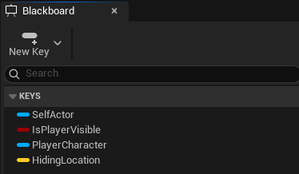

Now create the **Behavior Tree**, name it **"BT_Runner"** and assign it the blackboard you previously created. In the **Behavior Tree** start by adding a **Selector** and a **fallback behavior** (in case all the previous nodes fail) — in our case a simple **Wait** node will work.

Add a **Sequence** and apply a **Blackboard Decorator** to it. In the **Details** panel of the decorator the **Blackboard Key** it will be checking is the **IsPlayerVisible** key.

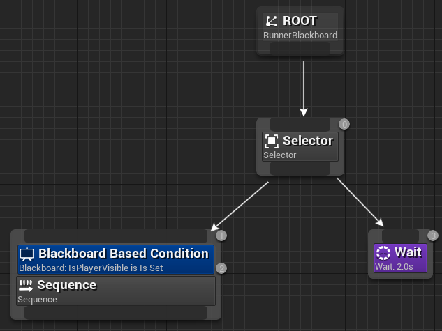

Next, we'll add a **"Run EQS Query"** task and a **"Move To"** task. Set the **Blackboard Key** value of the **Run EQS Query** to be the **Hiding Location** and in the **Move To** task do the same.

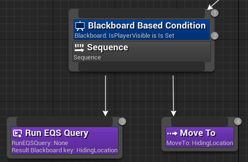

At this point, our AI Character can see us and has its behavior defined, but the blackboard has no values being set. In our **AIC_Runner**, go to the event graph and we'll start by adding the event **"On Possess"**, which is called when the controller possesses the pawn, and then run the behavior tree we created. (To add this event right click anywhere on the Event Graph and type "Possess" on the search bar).

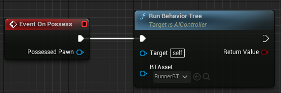

Now we need to tell the **Blackboard** if our AI Character can or cannot see our character. To do this, we use an event from the **AIPerception** component called **"On Target Perception Updated"**. This event is fired when something in the **AIPerception** changes, like for example a character entering or leaving the sight radius. To add this event, select the **AIPerception** component, right click on the event graph, expand **"Add Event for AIPerception"**, **"Event Dispatchers"**, and select **"Add On Target Perception Updated"**.

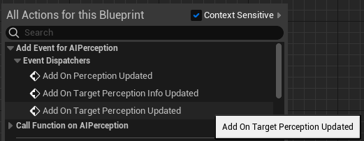

This is where we will check if the perceived actor is our **Player Character** and if it is, we'll do a couple things — first we tell the blackboard that what the AI Character saw is the Player Character, and next we tell it if the AI Character sees or has stopped seeing the player character.

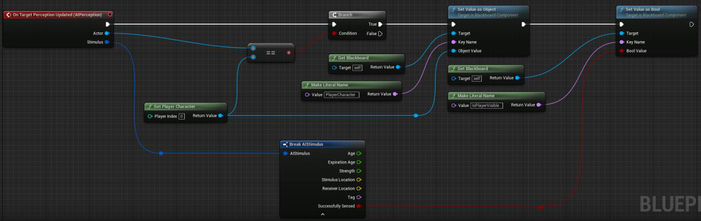

At this point you should debug to test if the AI Character can see the player character. Turn on the **"BehaviorTree"** category debug and check the value of the **"IsPlayerVisibleKey"**.

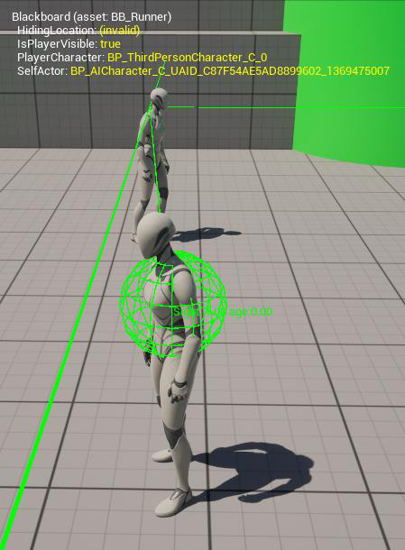

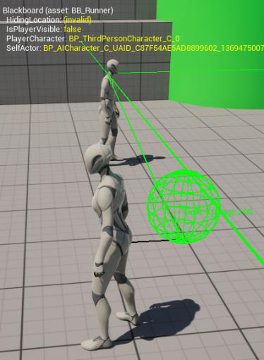

Even if the AI character is detecting the player, it already has its behavior created in the Behavior Tree and the blackboard values are set — it won't do anything, because we are not finding a hiding spot for it.

## Environmental Query System (EQS)

Create a new EQS (right-click content drawer > **Artificial Intelligence** > **Environment Query**) and call it **"EQS_FindHidingLocation"**.

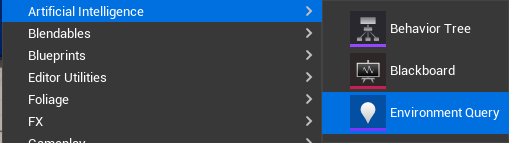

The **EQS** is used for collecting data on the environment, by spawning points in the world, testing them, and returning the valid ones for use. Now, for better understanding the **EQS** system and ease of use, we are going to create a dummy pawn just for testing our EQS for Find Hiding Location. To do so, create a new **Blueprint** class, and on the **ALL CLASSES** type **EQS**:

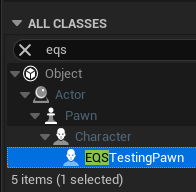

Select the **EQS Testing Pawn** as your base class. Finally, name your newly created blueprint as **"EQS_TestingPawn"**.

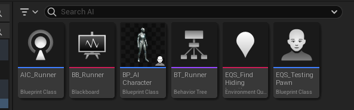

Now, drag your **EQS_TestingPawn** to the middle of the map, like so:

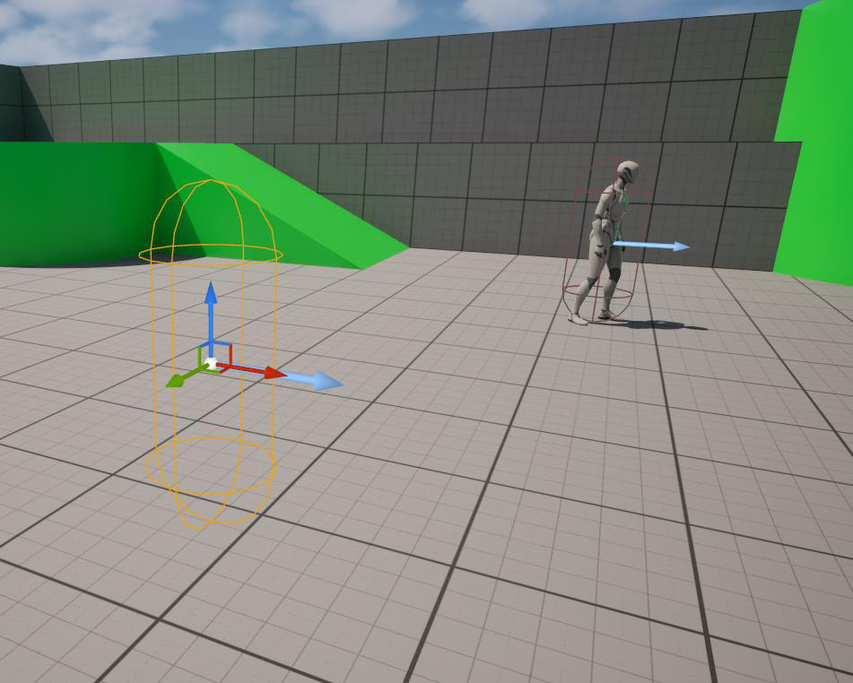

Now, with your **EQS_TestingPawn** actor selected, go to the **Details** panel, go to the **EQS** section, and set the **EQS_FindHidingLocation** as the **QueryTemplate**. By doing this, you are saying that this dummy pawn will perform the EQS you created **without playing the game**. This is a way to debug EQS queries in editor, without needing to play the game.

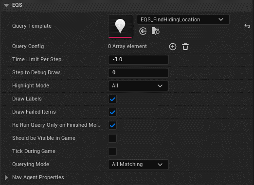

Now, let's configure our **EQS** to find a good hiding spot for the AI Character. When you open your EQS it is empty — start by adding a **PathingGrid** by right clicking on the graph.

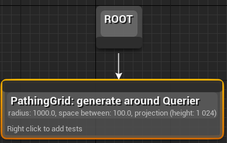

Save the **EQS** and return to your level. Now, add a **NavMeshBoundsVolume** to your level to create the navigation mesh.

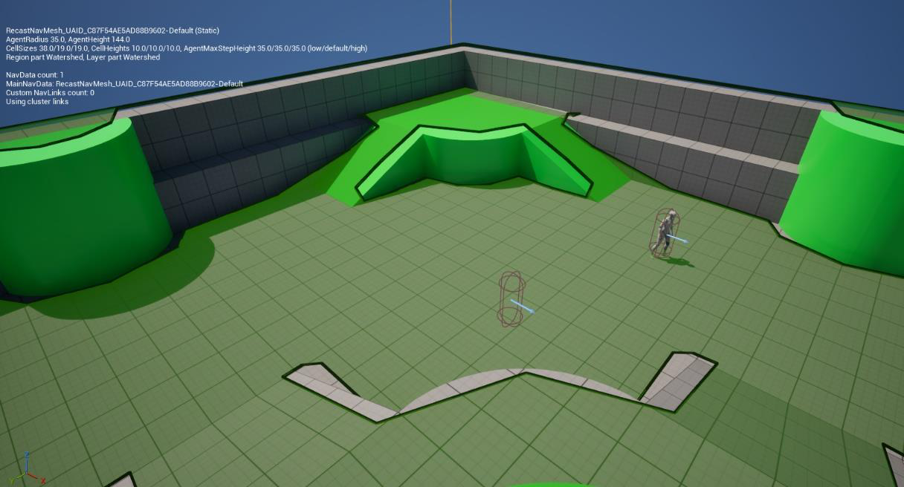

Now, select your **EQS_TestingPawn** and you will see that a grid of circles was generated around it — hence the **"generate around Querier"**. If the circles are floating in the air and not being projected to the NavMesh, you need to make some change to the EQS_TestingPawn (such as moving it slightly), as it doesn't run the query continuously, but only when the construction script runs.

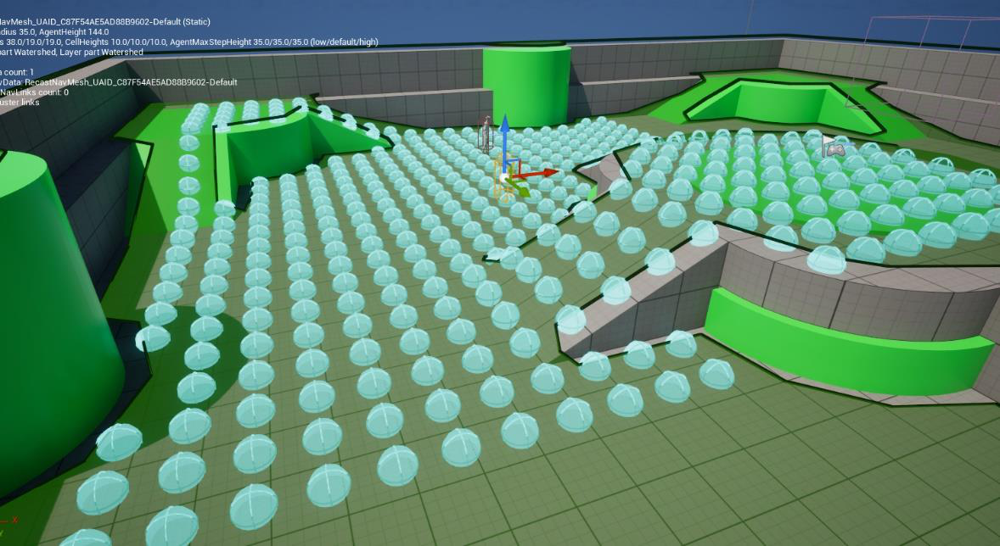

Open again the **EQS_FindHidingLocation** and change the properties of the **PathingGrid** to: set **GridHalfSize** to **1500** and **Space Between** to **150**. This way, we have a bigger grid and a wider space between each point:

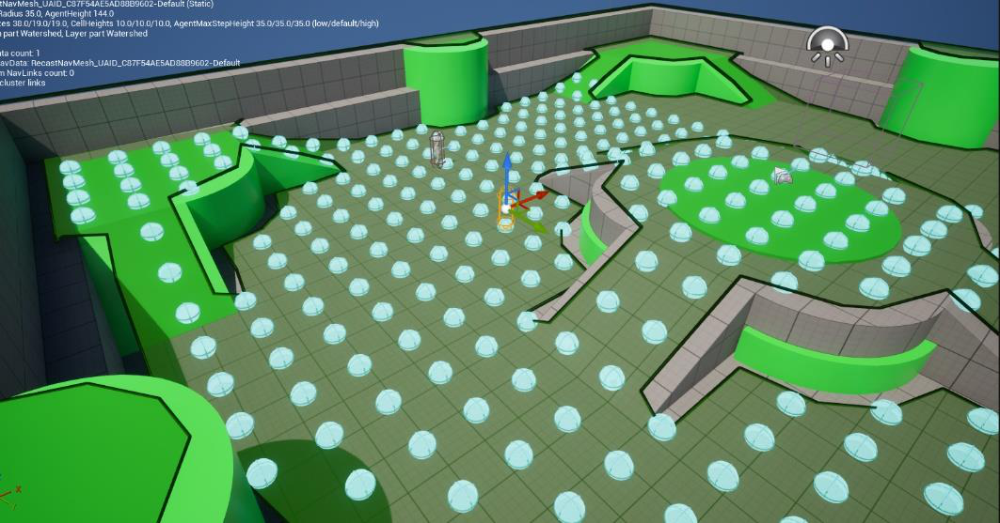

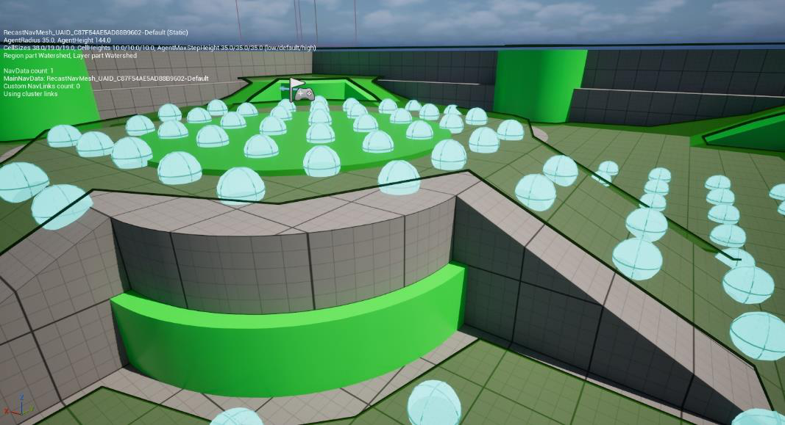

Now that the grid points generated by the EQS are being projected onto the Nav Mesh correctly, we need to start asking questions and making tests to this **PathingGrid**.

In our case, we want the **AI Character** to hide from the **Player Character**, therefore we need to find locations where the **Player Character** cannot see. To achieve this, we need to **perform a trace** from each location of the **PathingGrid** to our **Player Character**.

So, to add a test right click on the **Pathing Grid** > **Add Test** > **Trace**. Your EQS should now look like this:

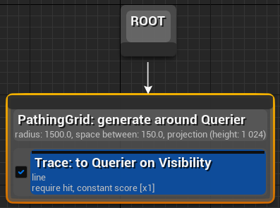

Now, if you go back to the level, you will see the spots that are not visible to the dummy pawn position with a **green** color. All the visible ones are **blue**:

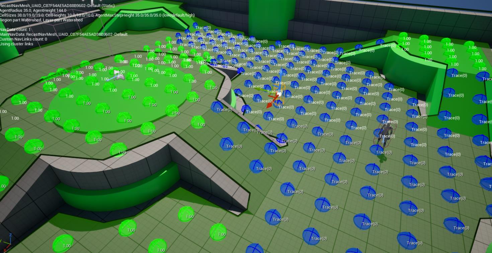

However, the **AI Character** running this query does not need to know which are the spots where he can hide from himself. Instead, he wants to know **which spots are not visible by the enemy**. Thus, if you go to the **EQS** you will notice that, by default, it is set to **Trace to Querier** (in our case, since we're using the EQS_TestingPawn, the querier is the testing pawn).

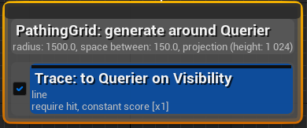

If you want to **Trace** to the **Player Character**, you need to create a **Context** for this test. Basically, a **Context** is a way for you to tell things to the EQS. For example, you can tell the EQS what an enemy is by creating an **Enemy Context**.

In other words, a **Context** is a class with functions we can **Override** to provide certain information to the test. In our case we need an **Enemy Context** that returns our **Player Character** — since in this case for the AI, our player is the enemy. With that context we can trace to the Player Character instead of the Querier.

In order to do so, right click on the **Content Drawer**, select create a new **"Blueprint Class"**. Click on **All Classes** to expand, go to the **Search** box and type: **"Context"**, select the **"EnvQueryContext_BlueprintBase"** class, and name it **"EQS_Enemy_Context"**.

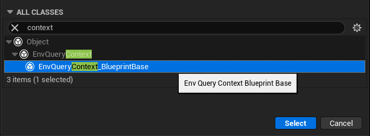

Open the **EQS_Enemy_Context** you created and start by overriding a function: since we want this context to return our **Player Character**, we'll override the **"Provide Single Actor"** function.

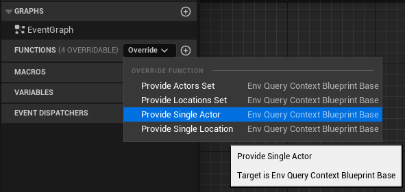

There are many ways to get the **Player Character**. In our case, we will retrieve it from the **Blackboard** we created earlier, by using the key named **"PlayerCharacter"**:

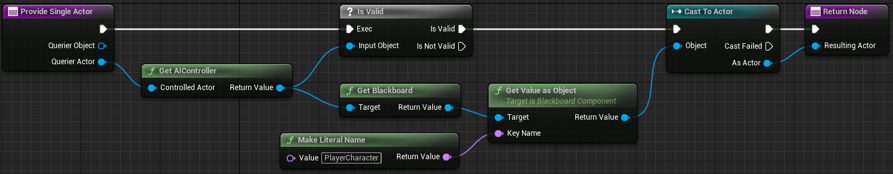

And this is all we need to do in our **Context** — it currently returns our **Player Character** as long as it was stored successfully in our **Blackboard**. Compile and save and let's go back to the **EQS**.

## Configuring the Trace Context

On our **EQS**, we are tracing to the **Querier** — let's change that to be the enemy (Player Character). Select the **Trace Test** and on the **Details** panel change the **Context** to the **EQS_Enemy_Context** we created:

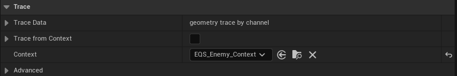

By default, the trace tests are done towards the **root** of the objects. We can **offset** this trace direction vertically for better trace results. Click on **Advanced** and the **"Item Height Offset"** represents the offset for each EQS result; the **"Context Height Offset"** represents the offset for the actor you're using as context.

Now, considering that the player character is 1.80 meters tall, change the **"Item Height Offset"** to **180**, and the **"Context Height Offset"** to **90**, for better trace results:

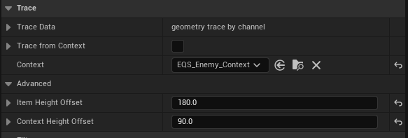

The following image shows what happens when you change the trace offsets:

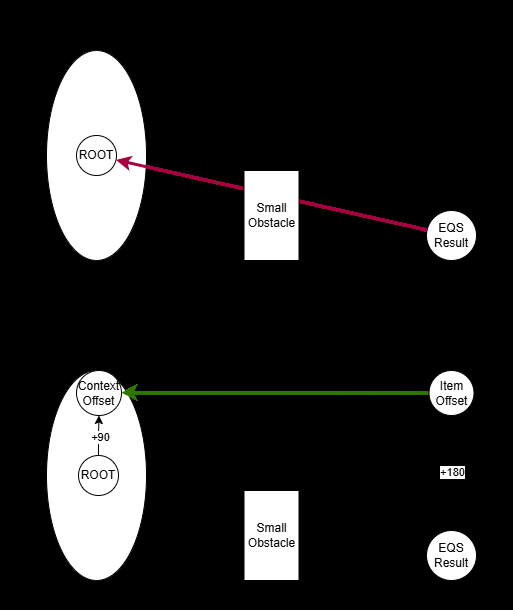

Now, if you go to the level, every spot on the EQS grid should be **red**:

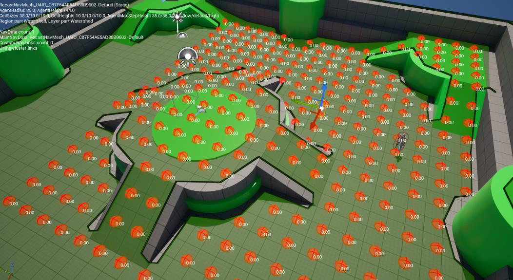

This happens because, outside the game, you don't have any actor set up as enemy: **when the game is not running, you don't have an enemy, because there is no Player Character**. Therefore, we are going to perform the necessary changes in order to detect the **Player Start** object as the enemy, when the game is not running. This is ideal to test our EQS in the editor, without playing the game.

On the **EQS_Enemy_Context**:

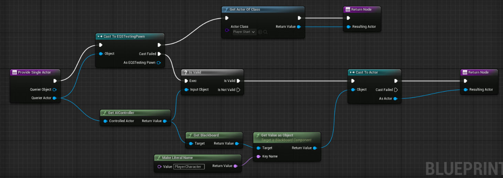

This way if the **Querier Actor** is successfully cast as an **EQS Testing Pawn**, the **Player Start** on the map should be returned as being the **Enemy**, otherwise the **Player Character** is returned. This way, the visibility check can be performed both in the editor (considering the Player Start as the Enemy) as well as in game:

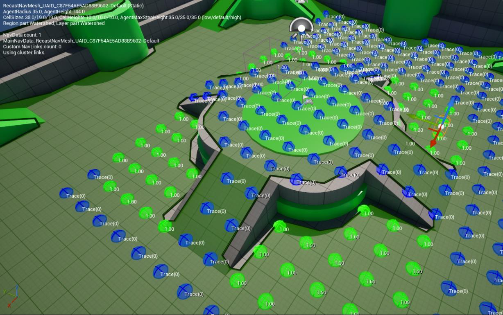

Your results may differ depending on the offsets you're using for the trace, as well as on the position of the Player Start (Context) and EQS Testing Pawn (Querier).

## Scoring EQS Results

Now that we are only getting points that are not visible by the **Player Character**, we need to filter which are best and which are worse. The best hiding location spots are those that are **closer to the agent** and also those that are **as far as possible from the enemy**.

First, let's focus on the points that are closer to the agent. Go to the **EQS_FindHidingLocation** and add a **Distance** test (right click **Pathing Grid** > **Add Test** > **Distance**):

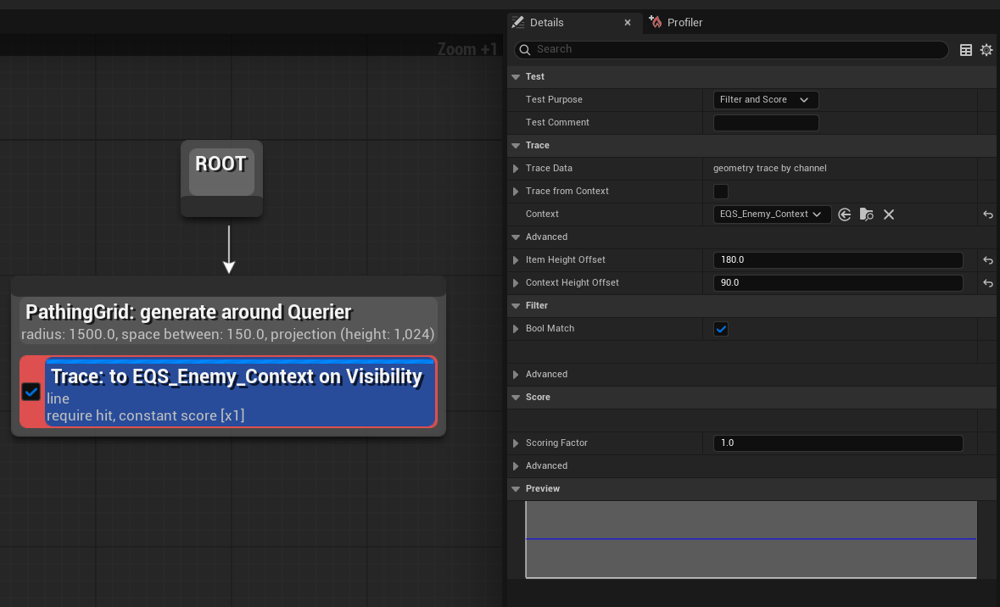

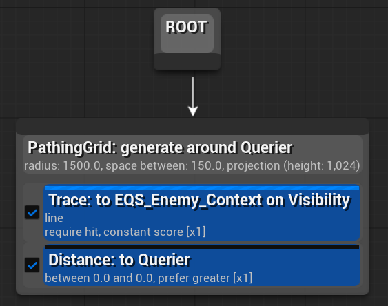

Now, with the **Distance: to Querier** selected, go to the **Details** panel and change the **Test Purpose** to **Score Only** and the **Scoring Equation** to **Inverse Linear**:

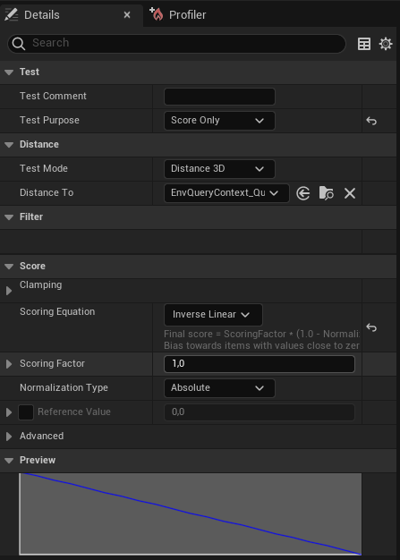

This way, you are saying that the points that are closer to the querier (AI Character) are better, therefore they have a higher score. We will leave the **Distance To** Context default since we want to test the distance to the AI Character.

By now, your distance test should look like the following:

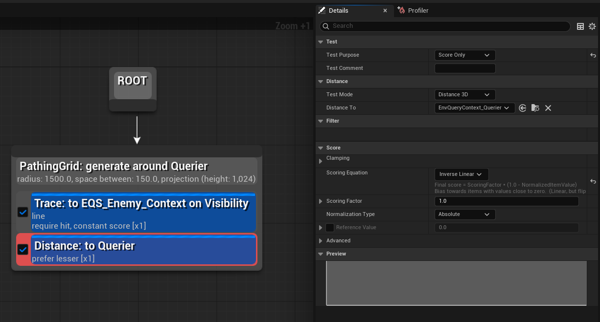

At this point we're currently getting the points from the PathingGrid where the Player Character cannot see the AI Character, and scoring them from worst to best based on the distance to the AI Character. Notice that the points that are far away from the EQS Testing Pawn have a more yellow or orange color:

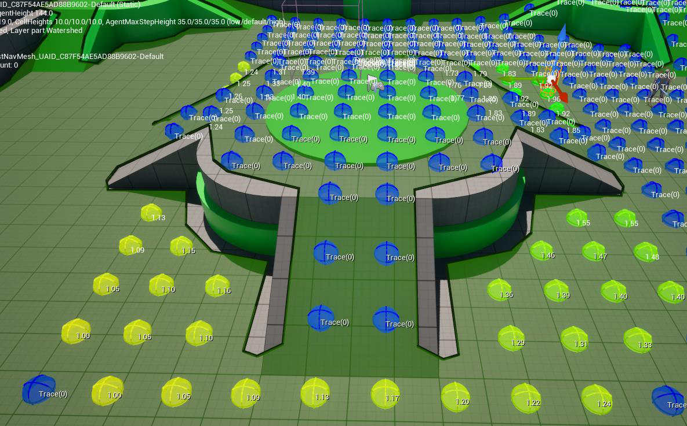

Now, let's add another distance test, change test purpose to **Score Only** and the **Distance To** to the Context we created earlier, which was **"EQS_Enemy_Context"**:

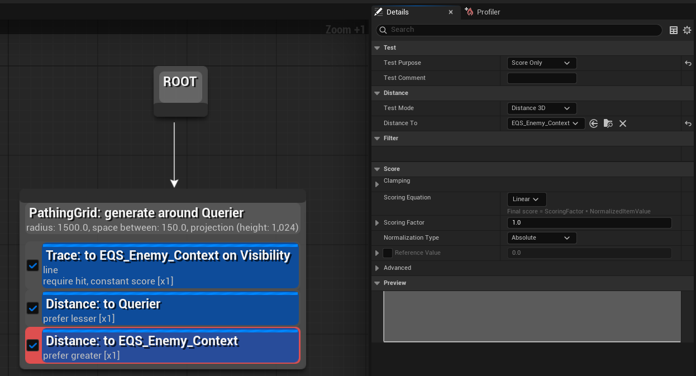

The EQS is now trying to find a position closest to the AICharacter but far from the Player Character. If you return to the map, you will see all the points and the corresponding scores, according to these two distance scores:

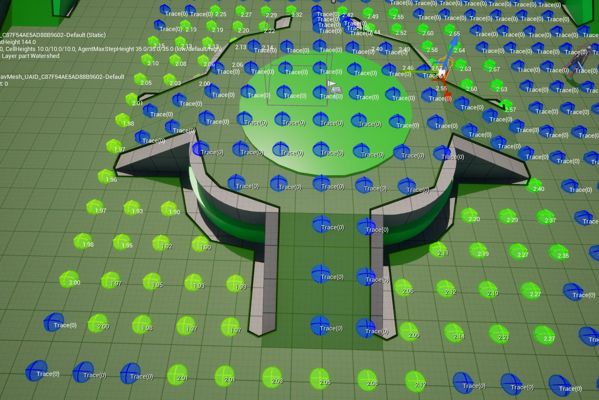

If you want to know **which is the single best point** between all of those, with EQS Pawn selected, go to the **Details** panel and on the **Querying Mode** select **Single Best Item**. You can also change the **"Step to Debug Draw"** if you want to see the results from a specific EQS test.

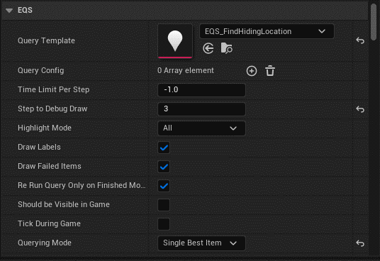

## Connecting EQS to the Behavior Tree

Now that we have created our EQS, all we need to do is go back to our **Behavior Tree** and in the **Run EQS Query** node select which EQS we want to run. To do this, select the **Run EQS Query** node and on the **Details** panel open **EQSRequest** and select the **Query Template** we created, which was named **"EQS_FindHidingLocation"**. Also, set the **Blackboard Key** to **HidingLocation**.

This way, the point with the highest score that is returned by the EQS will be stored on the **HidingLocation** blackboard entry:

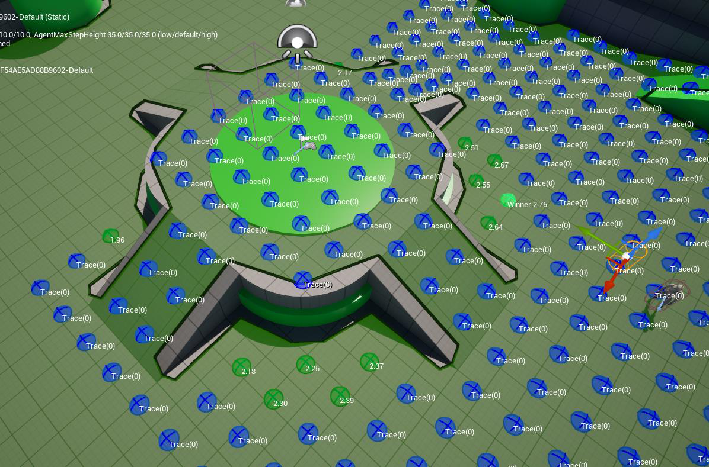

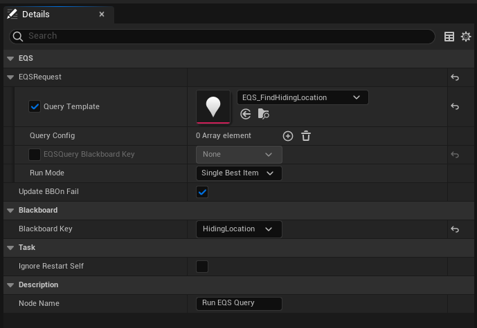

Your **Behaviour Tree** should now look like this:

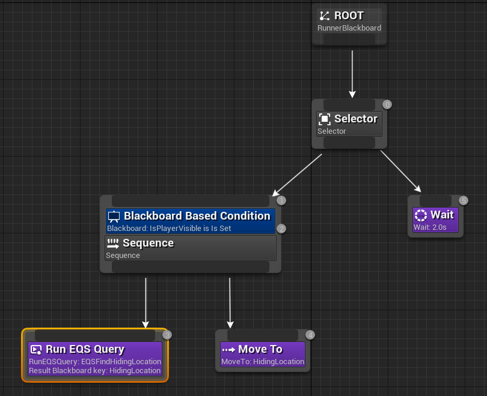

And finally, if everything is set up correctly, when you play the game, your **AI Character** should be able to see you and, when it does, it should run to a hiding location where the **Player Character** cannot see it.

If you enable the **AI Debugging** tool and enable **EQS** (press the **apostrophe key** next to the "0" key and press **3** on the **Numpad**) you can see the EQS grid and each point's individual results.

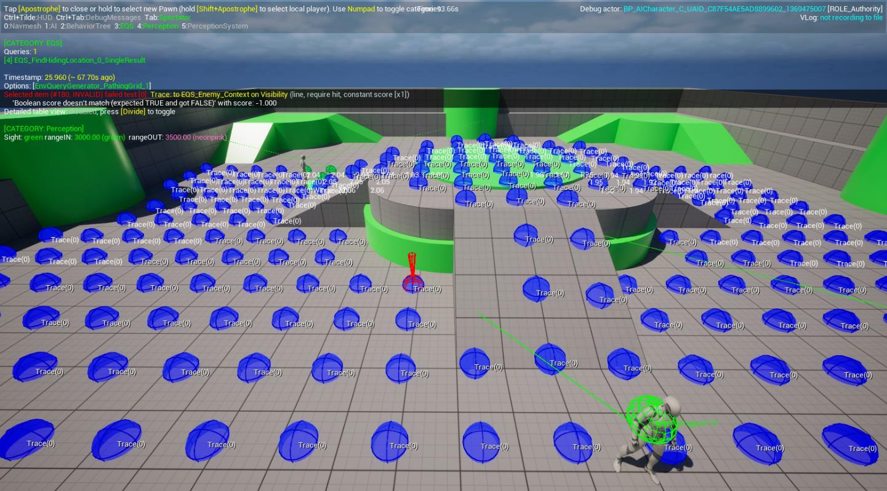

If you press the **Divide** key on the **Numpad** you can also see the top results from the EQS Query, and the scores for each individual test we added (the trace and distance tests we're performing).

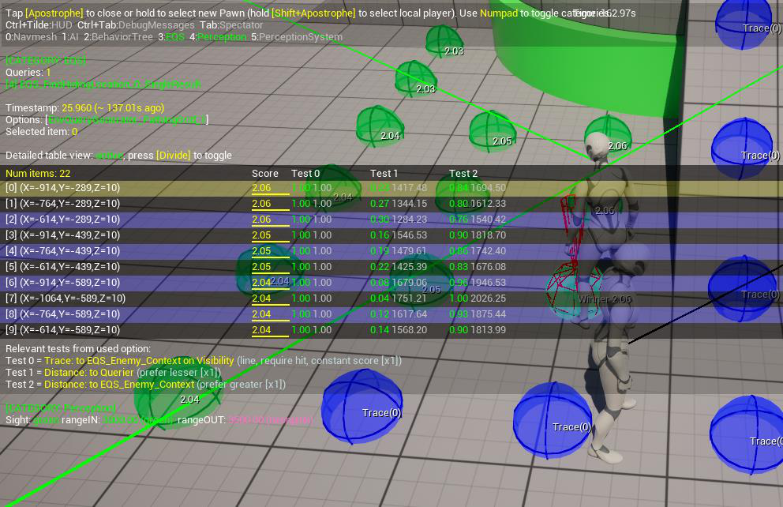

## Exercises

**Exercise 1.** Create a new folder inside the AI folder named **"AISearch"**, then create a new AI character inside that new folder and name it **AI_Search**.

a) This new **AI_Search** should **patrol** around the map.

b) When the **AI_Search** sees the **Player Character**, it should **move to him**.

c) When the **AI_Search** loses sight of the **Player Character**, it should move to the **last known position** where he saw the Player Character. (You must make use of the **AIStimulus** resultant from the **AIPerception** component).

d) Upon arriving at the last known position, the **AI_Search** should then enter a **"Searching"** mode where he searches for the player around the position where he last saw him for **20 seconds**. (For this you must use the **stimulus result** from the **AIPerception** component, an **EQS**, and the **Max Age** property from the **AIPerception** component).
