## Introduction

In this worksheet we are going to learn about **Interfaces in C++** in the context of **Unreal Engine 5**, as well as some useful **debug tools** such as on-screen messages and line trace visualization.

To achieve this, we will build a small First Person mini-game where a gun fires a **line trace** that detects actors in the world. Depending on what is hit, different responses will be triggered, and this is where interfaces become essential.

By the end of this worksheet you will be able to:

- Replace a projectile-based weapon with a line trace
- Use debug tools to visualize and log information at runtime
- Create and implement Blueprintable and NotBlueprintable C++ interfaces
- Call interface functions on actors regardless of their concrete type

::: {.callout-tip}
This worksheet uses the **First Person C++ template** available in Unreal Engine 5.6.
:::

---

## Project Setup

Open the Unreal Project Browser. We are going to use a **C++ template**. Select **First Person**. Leave the setup on Desktop. Name your project **ShootingRange**.

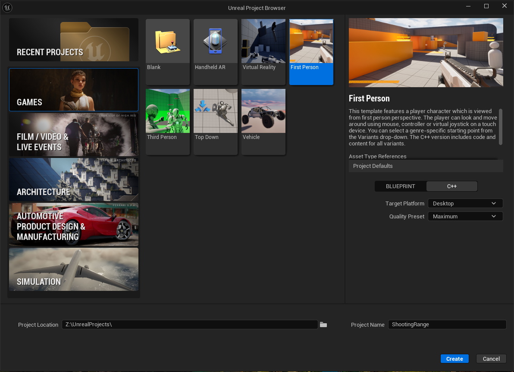

::: {.callout-important}
Make sure to select **C++** and not Blueprint as the project type. The C++ template in UE5.6 already comes with all Variant Shooter content included.
:::

After the project is created and the editor opens, navigate to **Content → Variant_Shooter** in the Content Drawer and open **Lvl_Shooter**.

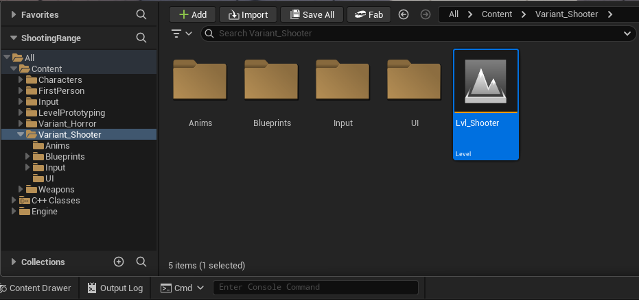

We need to set this as our default level. Click **Edit** on the menu bar, select **Project Settings**, and on the left select **Maps & Modes**. Set both the **Editor Startup Map** and the **Game Default Map** to **Lvl_Shooter**. That will save automatically in the `DefaultEngine.ini` configuration file. Close the Project Settings.

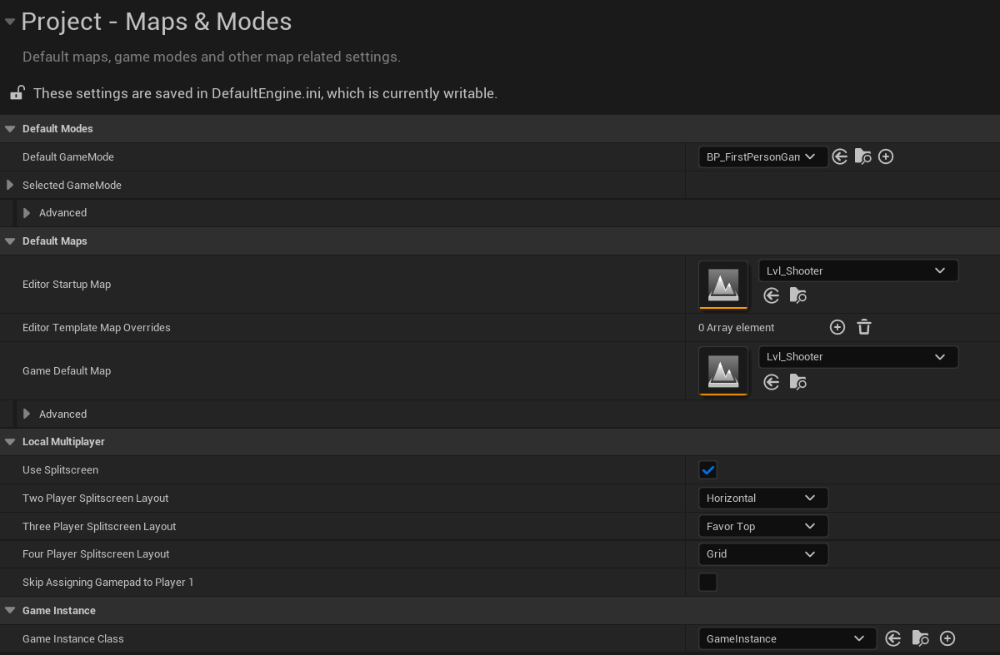

Let's also remove both NPCs that are already present in the level by selecting and deleting them. Now, go to menu **File** and select **Save Current Level** to save the current level.

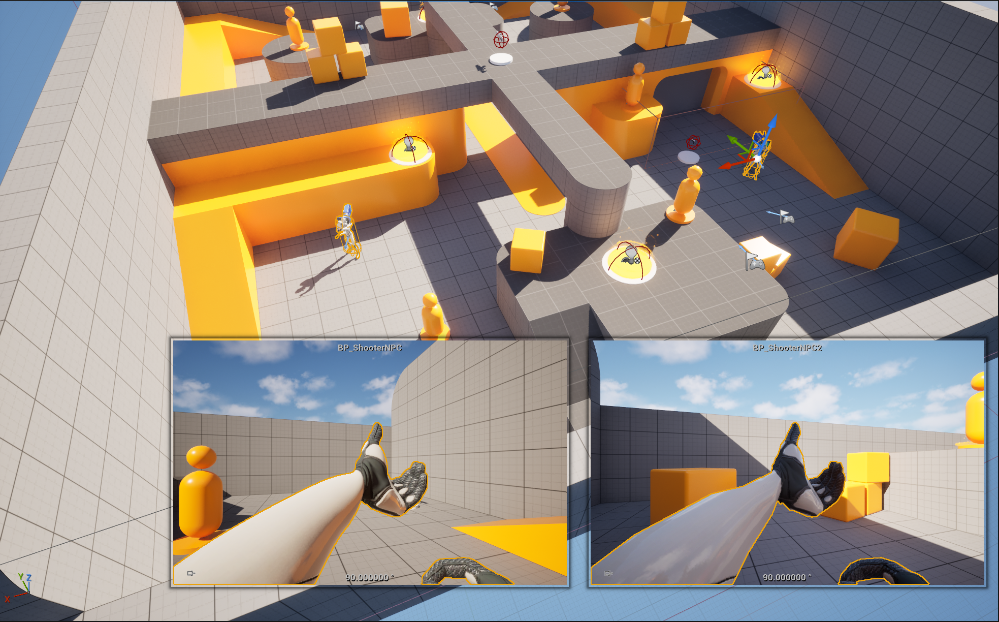

Finally, if you don't have already Visual Studio open, click **Tools → Open Visual Studio 2022** to open the project in the IDE. We are now ready to begin.

---

## From Projectile to Line Trace

In the Solution Explorer, navigate to **Source → ShootingRange → Variant_Shooter → Weapons** and open both **ShooterWeapon.h** and **ShooterWeapon.cpp**.

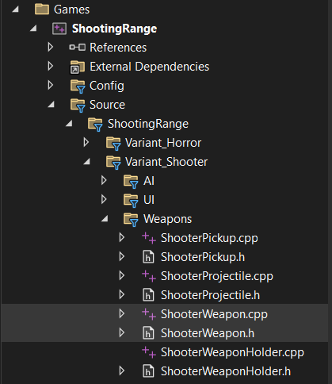

Inside the source file, locate the `Fire()` function. It currently looks like this:

```cpp
void AShooterWeapon::Fire()
{
    // ensure the player still wants to fire. They may have let go of the trigger
    if (!bIsFiring)
    {
        return;
    }

    // fire a projectile at the target
    FireProjectile(WeaponOwner->GetWeaponTargetLocation());

    // update the time of our last shot
    TimeOfLastShot = GetWorld()->GetTimeSeconds();

    // make noise so the AI perception system can hear us
    MakeNoise(ShotLoudness, PawnOwner, PawnOwner->GetActorLocation(), ShotNoiseRange, ShotNoiseTag);

    // are we full auto?
    if (bFullAuto)
    {
        // schedule the next shot
        GetWorld()->GetTimerManager().SetTimer(RefireTimer, this, &AShooterWeapon::Fire, RefireRate, false);
    } else {
        // for semi-auto weapons, schedule the cooldown notification
        GetWorld()->GetTimerManager().SetTimer(RefireTimer, this, &AShooterWeapon::FireCooldownExpired, RefireRate, false);
    }
}
```

Comment out the `FireProjectile` call, as we are going to replace it with our own line trace function:

```cpp
    // fire a projectile at the target
    // FireProjectile(WeaponOwner->GetWeaponTargetLocation());
```

Now open **ShooterWeapon.h**. In one of the `protected` sections, you will find the existing `FireProjectile` declaration. Add the new `FireLineTrace` function right below it:

```cpp
/** Fire a projectile towards the target location */
virtual void FireProjectile(const FVector& TargetLocation);

/** Fire a line trace */
virtual void FireLineTrace();
```

Now open **ShooterWeapon.cpp** and define `FireLineTrace`. The function starts with the line trace itself. We need a `FHitResult` to store information about what was hit, start and end vectors, and collision query parameters:

```cpp
void AShooterWeapon::FireLineTrace()
{
    FHitResult HitResult;
    FVector Start = FirstPersonMesh->GetSocketLocation(FName(MuzzleSocketName));
    FVector End = Start + FirstPersonMesh->GetSocketRotation(FName(MuzzleSocketName)).Vector() * 10000.f;

    FCollisionQueryParams Params;
    Params.AddIgnoredActor(this);
    Params.AddIgnoredActor(GetOwner());

    bool bHit = GetWorld()->LineTraceSingleByChannel(
        HitResult,
        Start,
        End,
        ECC_Visibility,
        Params
    );

    // ... common weapon functionalities added later
}
```

::: {.callout-note}
`MuzzleSocketName` and `FirstPersonMesh` are already defined in `ShooterWeapon.h`. `10000.f` is the trace range in centimeters and `ECC_Visibility` is a suitable collision channel for this scenario.
:::

After the line trace, copy the common weapon functionalities from `FireProjectile`: playing the firing montage, applying recoil, consuming bullets, and updating the HUD. We will be adding more code between the line trace result and these calls in the next section, but for now the full function looks like this:

```cpp
void AShooterWeapon::FireLineTrace()
{
    FHitResult HitResult;
    FVector Start = FirstPersonMesh->GetSocketLocation(FName(MuzzleSocketName));
    FVector End = Start + FirstPersonMesh->GetSocketRotation(FName(MuzzleSocketName)).Vector() * 10000.f;

    FCollisionQueryParams Params;
    Params.AddIgnoredActor(this);
    Params.AddIgnoredActor(GetOwner());

    bool bHit = GetWorld()->LineTraceSingleByChannel(
        HitResult,
        Start,
        End,
        ECC_Visibility,
        Params
    );

    // play the firing montage
    WeaponOwner->PlayFiringMontage(FiringMontage);

    // add recoil
    WeaponOwner->AddWeaponRecoil(FiringRecoil);

    // consume bullets
    --CurrentBullets;

    // if the clip is depleted, reload it
    if (CurrentBullets <= 0)
    {
        CurrentBullets = MagazineSize;
    }

    // update the weapon HUD
    WeaponOwner->UpdateWeaponHUD(CurrentBullets, MagazineSize);
}
```

Now call `FireLineTrace()` in the `Fire()` function to replace the commented line:

```cpp
// fire a projectile at the target
// FireProjectile(WeaponOwner->GetWeaponTargetLocation());

// fire a line trace
FireLineTrace();
```

Compile with **CTRL+ALT+F11** and test the game. You should hear the weapon fire and see the bullet count decrease, but nothing will appear on screen yet since we have not added any debug output.

---

## Debug Tools

::: {.callout-tip}
Compile with **CTRL+ALT+F11** after every code change to see the results in the editor when testing.
:::

When we shoot we can see the bullets counting down in the UI and we also have a small recoil on the weapon when firing, but we might want to verify if the trace is working correctly. Inside `FireLineTrace`, right after the line trace call, add an `if (bHit)` block. All the debug messages will go inside it.

```cpp
bool bHit = GetWorld()->LineTraceSingleByChannel(
    HitResult, Start, End, ECC_Visibility, Params
);

if (bHit)
{
    // debug code goes here
}

// play the firing montage
// ...
```

The most basic approach is to write to the Output Log using `UE_LOG`:

```cpp
if (bHit)
{
    UE_LOG(LogClass, Log, TEXT("Hit Something"));
}
```

However, switching between the game and the Output Log or having it occupy space in our screen during gameplay is not very convenient. A more practical approach is to display the message directly on screen using `GEngine`:

```cpp
if (bHit)
{
    if (GEngine)
        GEngine->AddOnScreenDebugMessage(-1, 2.0f, FColor::Green, TEXT("Hit Something"));
}
```

::: {.callout-note}
`GEngine` is a global pointer to the engine instance. It is not guaranteed to be valid in all contexts, such as dedicated servers or early engine initialization, so checking it before use is a defensive programming habit that prevents crashes in edge cases. This is the same reason you will see `GetWorld()` checked throughout Unreal code.
:::

Instead of a generic message, we can display the exact name of the actor that was hit using `FString::Printf`:

```cpp
if (bHit)
{
    if (GEngine)
        GEngine->AddOnScreenDebugMessage(-1, 2.0f, FColor::Red,
            FString::Printf(TEXT("Hitting %s"), *HitResult.GetActor()->GetName()));
}
```

Now we can see exactly what the line trace is hitting in real time. However, when firing rapidly a new message appears for every shot, which can quickly become overwhelming. We can assign a **key** to the message so it always updates the same slot on screen instead of stacking new ones:

```cpp
if (bHit)
{
    if (GEngine)
        GEngine->AddOnScreenDebugMessage(1, 2.0f, FColor::Red,
            FString::Printf(TEXT("Hitting %s"), *HitResult.GetActor()->GetName()));
}
```
::: {.callout-note}
Notice the first argument changes from `-1` to `1`
:::

Having a key as a number is not very convenient though. If you recall the **Print String** node from Blueprints, it has a `Key` parameter that accepts a `FName` rather than an integer. That node comes directly from `KismetSystemLibrary`. 

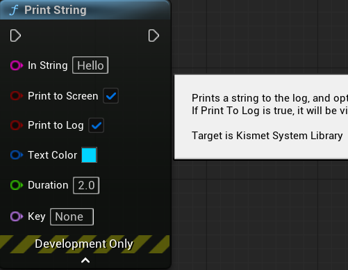

We can include it and use that exact same function in C++:

```cpp
#include "Kismet/KismetSystemLibrary.h"
```

```cpp
if (bHit)
{
    if (GEngine)
        GEngine->AddOnScreenDebugMessage(1, 2.0f, FColor::Red,
            FString::Printf(TEXT("Hitting %s"), *HitResult.GetActor()->GetName()));

    UKismetSystemLibrary::PrintString(
        GetWorld(),
        FString::Printf(TEXT("Hitting %s"), *HitResult.GetActor()->GetName()),
        true,
        true,
        FLinearColor::Blue,
        2.0f,
        "Hit"
    );
}
```

Both messages now display the same information. The `KismetSystemLibrary` version uses the `FName` key `"Hit"` and a blue color to distinguish it. Now that we have seen both approaches, **remove the `GEngine` message** and keep only the `PrintString` from `KismetSystemLibrary`.

We can now see what we are hitting through messages, but it would be better to have some visual feedback of where the line trace is going. To do so, we can use `DrawDebugLine` to draw a line using the same start and end vectors of the line trace. Since we want to see the trace regardless of whether it hit something, we will place the debug line before the `if (bHit)` block:

```cpp
DrawDebugLine(GetWorld(), Start, End, FColor::Red, false, 2.0f, 0, 0.5f);

if (bHit)
{
    UKismetSystemLibrary::PrintString(...);
}
```

And it will look like this:

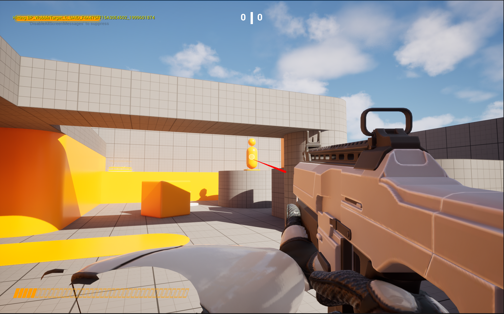

When we do Line Traces in Blueprints, we might use the `LineTraceByChannel` node and set the `Draw Debug Type` to anything other than `None`. We might notice that `DrawDebugLine` is different, as one key functionality it does not have is changing colors when the hit is successful. If we take a look at that node, we can see that it belongs to `KismetSystemLibrary`.

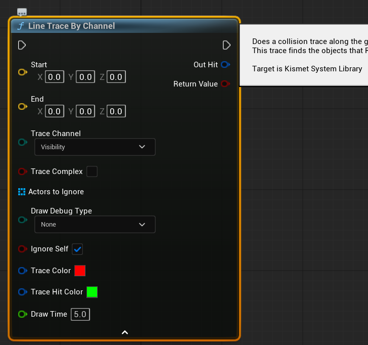

So instead of using a Line Trace and a Debug Line separately, we can use `KismetSystemLibrary`'s `LineTraceSingle` which handles both at the same time. `LineTraceSingle` does not use `FCollisionQueryParams`, this means we can remove `FCollisionQueryParams Params` and `DrawDebugLine` since they are no longer needed. We replace them with two new local variables:

```cpp
FHitResult HitResult;
FVector Start = FirstPersonMesh->GetSocketLocation(FName(MuzzleSocketName));
FVector End = Start + FirstPersonMesh->GetSocketRotation(FName(MuzzleSocketName)).Vector() * 10000.f;

TArray<AActor*> ActorsToIgnore;
ActorsToIgnore.Add(GetOwner());

ETraceTypeQuery TraceChannel =
    UEngineTypes::ConvertToTraceType(ECollisionChannel::ECC_Visibility);
```

::: {.callout-note}
`UKismetSystemLibrary::LineTraceSingle` uses `ETraceTypeQuery` instead of `ECollisionChannel`. These are two different enumerations for the same concept. `UEngineTypes::ConvertToTraceType` handles the conversion between them.
:::

With those variables ready, we can now perform the new line trace, followed by the `if (bHit)` block:

```cpp
bool bHit = UKismetSystemLibrary::LineTraceSingle(
    GetWorld(),
    Start,
    End,
    TraceChannel,
    false,
    ActorsToIgnore,
    EDrawDebugTrace::ForDuration,
    HitResult,
    true,
    FLinearColor::Red,
    FLinearColor::Green,
    2.0f
);

if (bHit)
{
    UKismetSystemLibrary::PrintString(
        GetWorld(),
        FString::Printf(TEXT("Hitting %s"), *HitResult.GetActor()->GetName()),
        true, true, FLinearColor::Blue, 2.f, "Hit"
    );
}
```

::: {.callout-note}
Notice that unlike the previous line trace, we are not adding `this` to `ActorsToIgnore`. `UKismetSystemLibrary::LineTraceSingle` has a boolean parameter `bIgnoreSelf` that handles this automatically. It is set to `true` in our call right after `HitResult`.
:::

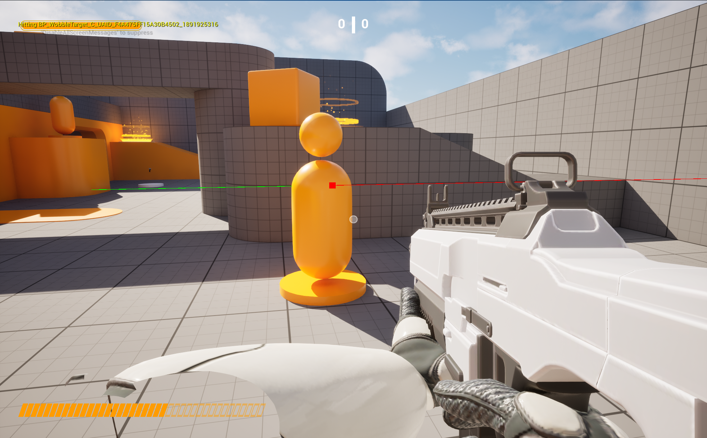

The full `FireLineTrace` function now looks like this:

```cpp
void AShooterWeapon::FireLineTrace()
{
    FHitResult HitResult;
    FVector Start = FirstPersonMesh->GetSocketLocation(FName(MuzzleSocketName));
    FVector End = Start + FirstPersonMesh->GetSocketRotation(FName(MuzzleSocketName)).Vector() * 10000.f;

    TArray<AActor*> ActorsToIgnore;
    ActorsToIgnore.Add(GetOwner());

    ETraceTypeQuery TraceChannel =
        UEngineTypes::ConvertToTraceType(ECollisionChannel::ECC_Visibility);

    bool bHit = UKismetSystemLibrary::LineTraceSingle(
        GetWorld(),
        Start,
        End,
        TraceChannel,
        false,
        ActorsToIgnore,
        EDrawDebugTrace::ForDuration,
        HitResult,
        true,
        FLinearColor::Red,
        FLinearColor::Green,
        2.0f
    );

    if (bHit)
    {
        UKismetSystemLibrary::PrintString(
            GetWorld(),
            FString::Printf(TEXT("Hitting %s"), *HitResult.GetActor()->GetName()),
            true,
            true,
            FLinearColor::Blue,
            2.f,
            "Hit"
        );
    }

    // play the firing montage
    WeaponOwner->PlayFiringMontage(FiringMontage);

    // add recoil
    WeaponOwner->AddWeaponRecoil(FiringRecoil);

    // consume bullets
    --CurrentBullets;

    // if the clip is depleted, reload it
    if (CurrentBullets <= 0)
    {
        CurrentBullets = MagazineSize;
    }

    // update the weapon HUD
    WeaponOwner->UpdateWeaponHUD(CurrentBullets, MagazineSize);
}
```

---

## Interfaces in Unreal Engine 5

Now that we have a working line trace that detects actors, we need a way to respond differently depending on what was hit, without the weapon needing to know the exact type of every actor in the level. This is precisely the problem that **interfaces** solve.

An interface defines a **contract**: a set of functions that any class can agree to implement. The caller does not need to know what type of actor it hit. It just asks: *does this actor implement the interface?* If yes, it calls the function and the actor handles the rest.

### The Three Types of Interfaces

::: {.panel-tabset}

## Blueprint-only

Created entirely inside the Blueprint editor with no C++ backing. The interface and all its implementations live in Blueprint assets. Any Blueprint actor can implement them directly through Class Settings without writing a single line of C++. C++ classes can still check for and call these interfaces, but cannot inherit from them directly.

## Blueprintable C++

Created in C++ and exposed to Blueprint. Both C++ classes and Blueprint actors can implement them. Functions are marked with `BlueprintNativeEvent` or `BlueprintImplementableEvent` and can be called from Blueprint Graphs.

## NotBlueprintable C++

Created in C++ only. Only C++ classes can inherit them. Functions are plain virtual C++ and cannot be called from Blueprint graphs. It is used when the contract is a pure code concern (physics, damage systems, save logic) that Blueprint should not implement or call directly.

:::

In this worksheet we are going to focus on the two C++ variants.

### The U Type and the I Type

Every C++ interface in Unreal Engine generates **two classes** from a single file. Understanding what each one does is essential.

```{mermaid}
classDiagram
    class UHittable {
        <<UInterface>>
        +GENERATED_BODY()
    }
    class IHittable {
        <<Interface>>
        +OnHit(float DamageAmount)*
    }
    class AHittableTarget {
        +OnHit(float DamageAmount)
    }
    class AHittableExplosive {
        +OnHit(float DamageAmount)
    }
    class BP_HittableTarget {
        <<Blueprint>>
    }

    UHittable <|-- UInterface
    IHittable <|-- AHittableTarget
    IHittable <|-- AHittableExplosive
    UHittable <|-- BP_HittableTarget
```

The **U type** (`UHittable`) connects to Unreal's reflection system. Blueprint actors that implement the interface are linked to this type. Its body must always remain empty, as it exists purely for the reflection system.

The **I type** (`IHittable`) is where all virtual functions are declared. C++ classes inherit from this type when implementing the interface.

::: {.callout-important}
All virtual functions must be declared inside the **I type**, not the U type. The U type body must remain empty.
:::

### Checking if an Actor Implements an Interface

::: {layout-ncol=2}

**`Implements<U>`** works for both C++ and Blueprint actors. Always safe to use.

```cpp
if (SomeActor->Implements<UHittable>())
{
    // works for C++ and Blueprint
}
```

**`Cast<I>`** only works for C++ actors. Returns `nullptr` for Blueprint actors.

```cpp
IHittable* Ptr = Cast<IHittable>(SomeActor);
if (Ptr)
{
    // C++ actors only
}
```

:::

::: {.callout-warning}
`Cast<IHittable>` will return `nullptr` for Blueprint actors even if they implement the interface, because Blueprint actors never inherit from the `IInterface` type in C++. Use `Implements<U>` when you need to handle both.
:::

### Calling Interface Functions

The way you call an interface function depends on whether the interface is Blueprintable or not.

```{mermaid}
flowchart LR
    A[Hit Actor] --> B{Implements UHittable?}
    B -- No --> C[Do nothing]
    B -- Yes --> D{Blueprintable?}
    D -- Yes --> E["Execute_OnHit()"]
    D -- No --> F["Cast&lt;IHittable&gt;→ OnHit()"]
```

For **Blueprintable interfaces**, use the `Execute_` static wrapper generated by UHT. This ensures both C++ and Blueprint implementations are called correctly:

```cpp
if (HitActor->Implements<UHittable>())
{
    IHittable::Execute_OnHit(HitActor, Damage);
}
```

For **NotBlueprintable interfaces**, cast to the I type and call directly:

```cpp
IHittable* HittablePtr = Cast<IHittable>(HitActor);
if (HittablePtr)
{
    HittablePtr->OnHit(Damage);
}
```

The `Execute_`wrapper is generated for functions marked with either `BlueprintNativeEvent` or `BlueprintImplementableEvent`. These two specifiers are similar but have one important difference.

`BlueprintImplementableEvent` can only be overridden in Blueprint. It has no C++ implementation:

```cpp
UFUNCTION(BlueprintImplementableEvent)
void OnInspected();
```
`BlueprintNativeEvent`can be overridden in both C++ and Blueprint. It requires a C++ `_Implementation` function:

```cpp
// Interface declaration
UFUNCTION(BlueprintNativeEvent)
void OnInspected();

//C++ class implementation
virtual void OnInspected_Implementation();

```

If a Blueprint does not override a `BlueprintNativeEvent`, the `_Implementation` is called as the fallback. If a Blueprint does not override a `BlueprintImplementableEvent`, nothing happens when the function is called.

### Storing Interface References

If you need to store a reference to an actor that implements an interface as a `UPROPERTY`, you cannot use a raw `IInterface*` pointer. Unreal's garbage collector does not track raw interface pointers and this will cause crashes. Instead, use `TScriptInterface`:

```cpp
UPROPERTY()
TScriptInterface<IHittable> HittableActor;
```

You can then retrieve both the `UObject` and the `IInterface` pointer from it:

```cpp
if (OtherActor->Implements<UHittable>())
{
    HittableActor = OtherActor;
    UObject* ObjectPtr = HittableActor.GetObject();        // always valid
    IHittable* HittablePtr = HittableActor.GetInterface(); // valid for C++ actors only
}
```

::: {.callout-warning}
`GetInterface()` returns `nullptr` for Blueprint actors. `GetObject()` is always valid for any actor that passes the `Implements<U>` check.
:::

---

## Creating the IHittable Interface

We will start with the NotBlueprintable interface. In the editor, click **Tools → New C++ Class**. Keep **Common Classes** selected and search for **Unreal Interface**. Select it and click Next.

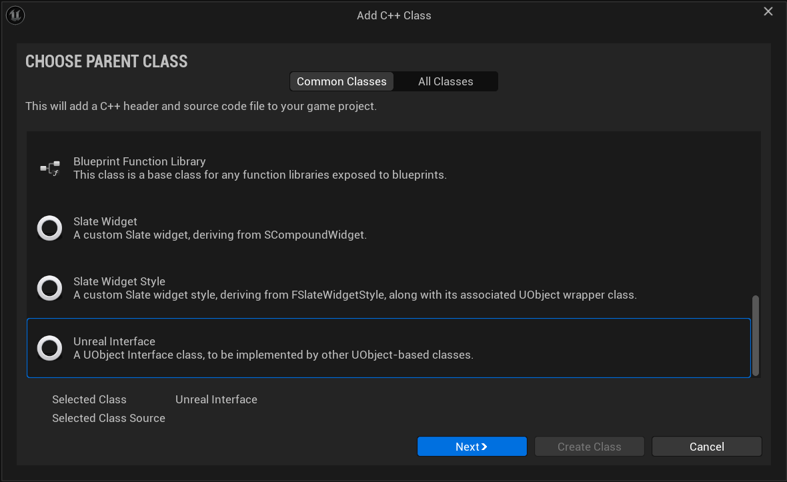

Name the interface **`Hittable`** and click Create Class.

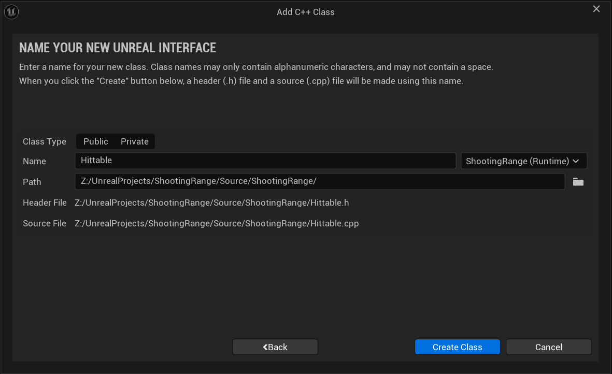

Open **Hittable.h**. You will see two classes have been generated, `UHittable` and `IHittable`:

```cpp
#pragma once

#include "CoreMinimal.h"
#include "UObject/Interface.h"
#include "Hittable.generated.h"

// This class does not need to be modified.
UINTERFACE(MinimalAPI)
class UHittable : public UInterface
{
    GENERATED_BODY()
};

/**
 * 
 */
class SHOOTINGRANGE_API IHittable
{
    GENERATED_BODY()

	// Add interface functions to this class. This is the class that will be inherited to implement this interface.
public:
};
```

To make the Interface NotBlueprintable, we need to add the `NotBlueprintable` macro to the `UINTERFACE`:

```cpp
UINTERFACE(NotBlueprintable, MinimalAPI)
class UHittable : public UInterface
{
    GENERATED_BODY()
};
```

Leave the `UHittable` body empty and add your virtual function to `IHittable` under **public**:

```cpp
public:
    virtual void OnHit(float DamageAmount) = 0;
};
```

The interface is intentionally minimal. It is just a contract. Everything else (health, death, scoring) will live on the class that implements it.

The `= 0` at the end of the function declaration makes it pure virtual. This means any C++ class that inherits `IHittable` must provide its own implementation of `OnHit` or it will not compile. The contract is enforced by the compiler. You could also declare it as `virtual void OnHit(float DamageAmount) {}` with an empty body, which would make the implementation optional. Whether that makes sense depends on your design.

---

## Creating the HittableTarget

Now we will create `AHittableTarget`, the C++ class that implements `IHittable`. In the editor, click **Tools → New C++ Class**, select **Actor** as the parent, and name it **`HittableTarget`**.

We know that this target will have health, will take damage, and will eventually "die" and respawn. Let's start by declaring those variables and functions in **HittableTarget.h**:

```cpp
#pragma once

#include "CoreMinimal.h"
#include "GameFramework/Actor.h"
#include "HittableTarget.generated.h"

UCLASS()
class SHOOTINGRANGE_API AHittableTarget : public AActor
{
    GENERATED_BODY()

public:	
	// Sets default values for this actor's properties
	AHittableTarget();

protected:
	// Called when the game starts or when spawned
	virtual void BeginPlay() override;

public:
	// Called every frame
	virtual void Tick(float DeltaTime) override;

protected:
	UPROPERTY(EditAnywhere, Category = "Target")
	float MaxHealth;

	UPROPERTY(EditAnywhere, Category = "Target")
	float RespawnDelay;

private:
	float CurrentHealth;

	void Die();
	void Respawn();
};
```

`MaxHealth` and `RespawnDelay` are `EditAnywhere` so we can tweak them per instance in the editor. `CurrentHealth` is private because nothing outside this class should modify it directly.

Now that we have the structure, we need this actor to respond to being hit. This is exactly what the `IHittable` interface is for. Include the interface header and add `IHittable` as a second parent class:

```cpp
#include "Hittable.h"
```

```cpp
class SHOOTINGRANGE_API AHittableTarget : public AActor, public IHittable
```

::: {.callout-warning}
Be careful to include `Hittable.h` before `HittableTarget.generated.h`.
:::

By inheriting from `IHittable` we are committing to implementing `OnHit`. The compiler will not let us forget.

```cpp
public:
    virtual void OnHit(float DamageAmount) override;
```

Now open **HittableTarget.cpp** and include `KismetSystemLibrary` so we can display some messages. 

```cpp
#include "Kismet/KismetSystemLibrary.h"
```

In the `constructor` we set the default values of the variables. We also set `bCanEverTick` to false since we won't need it for this actor.

```cpp
AHittableTarget::AHittableTarget()
{
 	// Set this actor to call Tick() every frame.  You can turn this off to improve performance if you don't need it.
	PrimaryActorTick.bCanEverTick = false;

	MaxHealth = 100.f;

	RespawnDelay = 3.f;
}
```

`BeginPlay` initializes `CurrentHealth` to `MaxHealth`:

```cpp
void AHittableTarget::BeginPlay()
{
    Super::BeginPlay();
    
    CurrentHealth = MaxHealth;
}
```

`OnHit` reduces health, displays a message, and checks if the target should die:

```cpp
void AHittableTarget::OnHit(float DamageAmount)
{
    CurrentHealth -= DamageAmount;

    UKismetSystemLibrary::PrintString(
        GetWorld(),
        FString::Printf(TEXT("Damage Taken: %.0f | Health: %.0f"), DamageAmount, CurrentHealth),
        true, true, FLinearColor::Red, 2.0f
    );

    if (CurrentHealth <= 0.f)
    {
        Die();
    }
}
```

`Die` hides the actor, disables its collision, and starts a timer to call `Respawn` after the delay:

```cpp
void AHittableTarget::Die()
{
    SetActorHiddenInGame(true);
    SetActorEnableCollision(false);

    FTimerHandle RespawnTimer;
    GetWorldTimerManager().SetTimer(RespawnTimer, this, &AHittableTarget::Respawn, RespawnDelay, false);
}
```

`Respawn` restores health, unhides the actor, and re-enables collision:

```cpp
void AHittableTarget::Respawn()
{
    CurrentHealth = MaxHealth;
    SetActorHiddenInGame(false);
    SetActorEnableCollision(true);

    UKismetSystemLibrary::PrintString(
        GetWorld(),
        TEXT("Target Respawned!"),
        true, true, FLinearColor::Green, 2.0f
    );
}
```

Now that we have the target ready, we need to make sure the weapon calls `OnHit` when it shoots the target. That is the topic of the next section.

---

## Calling IHittable from the Weapon

We have prepared **HittableTarget** with the interface and implementation. We can go back to **ShooterWeapon.cpp** to make it call the `OnHit` function. To do that, we need to include the interface header and update the hit logic inside `FireLineTrace`. For a NotBlueprintable interface we use `Cast<IHittable>` to get the interface pointer and call `OnHit` directly:

```cpp
#include "Hittable.h"
```

```cpp
if (bHit)
{
    UKismetSystemLibrary::PrintString(
        GetWorld(),
        FString::Printf(TEXT("Hitting %s"), *HitResult.GetActor()->GetName()),
        true, true, FLinearColor::Yellow, 2.0f, "Hit"
    );

    AActor* HitActor = HitResult.GetActor();
    if (HitActor)
    {
        IHittable* HittablePtr = Cast<IHittable>(HitActor);
        if (HittablePtr)
        {
            HittablePtr->OnHit(25.f);
        }
    }
}
```

Compile with **CTRL+ALT+F11**. Create a new folder called **Blueprints** in the **Content** folder and then create a Blueprint based on `AHittableTarget` named **`BP_HittableTarget`**, add a Static Mesh component and use **SM_Cube_03** as the mesh, place it in the level, and fire at it. You should see the damage message update on screen with each shot, and the target disappear and reappear after a few seconds when it dies.

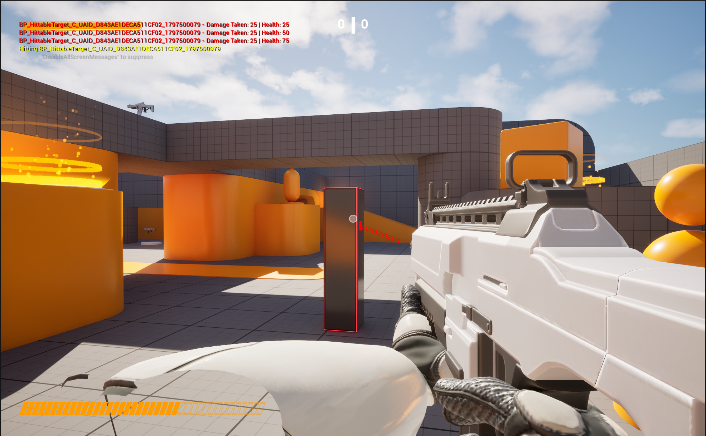

---

## Creating the HittableExplosive

So far we have one class implementing `IHittable`. The weapon calls `OnHit` and the target progressively loses health. This works, but it does not yet demonstrate why the interface is powerful, as we have just used it on one type of actor.

We are now going to create `AHittableExplosive`, a completely unrelated class that also implements `IHittable` but behaves differently when hit.

The **explosive** has no health. A single hit triggers an explosion that calls `OnHit` on every `IHittable` actor within a radius, then the **explosive** hides and respawns after a delay. 

The **weapon** does not change at all, it still just does `Cast<IHittable>` and calls `OnHit`. The interface handles the rest.

In the editor, click **Tools → New C++ Class**, select **Actor**, and name it `HittableExplosive`.

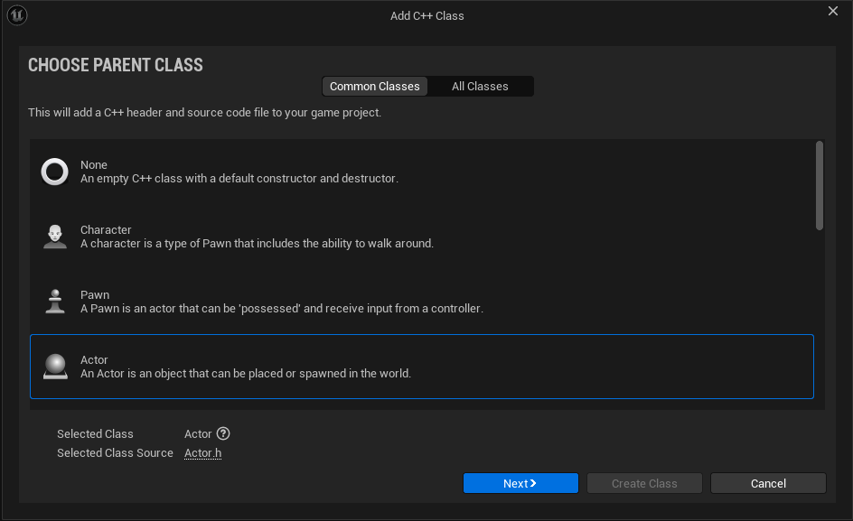

Open **HittableExplosive.h** and inherit from `IHittable` by including the header file and setting the parent class. 

```cpp
#include "Hittable.h"
```

```cpp
class SHOOTINGRANGE_API AHittableExplosive : public AActor, public IHittable
```

The explosive needs an explosion radius and damage amount that are editable in the editor, and the same respawn delay pattern as the target:

```cpp
#pragma once

#include "CoreMinimal.h"
#include "GameFramework/Actor.h"
#include "Hittable.h"
#include "HittableExplosive.generated.h"

UCLASS()
class SHOOTINGRANGE_API AHittableExplosive : public AActor, public IHittable
{
	GENERATED_BODY()
	
public:	
	// Sets default values for this actor's properties
	AHittableExplosive();

protected:
	// Called when the game starts or when spawned
	virtual void BeginPlay() override;

public:	
	// Called every frame
	virtual void Tick(float DeltaTime) override;

protected:
    UPROPERTY(EditAnywhere, Category = "Explosive")
    float ExplosionRadius;

    UPROPERTY(EditAnywhere, Category = "Explosive")
    float ExplosionDamage;

    UPROPERTY(EditAnywhere, Category = "Explosive")
    float RespawnDelay;

private:
    void Explode();
    void Respawn();

public:
    virtual void OnHit(float DamageAmount) override;
};
```

Notice there is no health variable. The explosive does not care how much damage the incoming shot dealt, as any hit triggers the explosion immediately.

Open **HittableExplosive.cpp**. We are going to include `KismetSystemLibrary`, set the default values of the variables in the constructor, and set `bCanEverTick` to false.


```cpp
#include "Kismet/KismetSystemLibrary.h"
```

```cpp
AHittableExplosive::AHittableExplosive()
{
    PrimaryActorTick.bCanEverTick = false;

    ExplosionRadius = 300.f;
    ExplosionDamage = 50.f;

    RespawnDelay = 5.f;
}
```

`OnHit` simply calls `Explode` regardless of the incoming damage amount:

```cpp
void AHittableExplosive::OnHit(float DamageAmount)
{
    Explode();
}
```

In `Explode` we use a sphere overlap to find all nearby actors, check each one for `IHittable`, and call `OnHit` on them with the explosion damage. Then we hide the explosive and start the respawn timer:

```cpp
void AHittableExplosive::Explode()
{
    UKismetSystemLibrary::PrintString(
        GetWorld(), TEXT("BOOM!"),
        true, true, FLinearColor::Yellow, 2.0f, "Explosion"
    );

    // draw a debug sphere to visualize the explosion radius
    DrawDebugSphere(
        GetWorld(), GetActorLocation(), ExplosionRadius,
        24, FColor::Orange, false, RespawnDelay
    );

    // find all actors within explosion radius
    TArray<AActor*> OverlappingActors;
    TArray<AActor*> ActorsToIgnore = { this };

    UKismetSystemLibrary::SphereOverlapActors(
        GetWorld(),
        GetActorLocation(),
        ExplosionRadius,
        TArray<TEnumAsByte<EObjectTypeQuery>>(),
        AActor::StaticClass(),
        ActorsToIgnore,
        OverlappingActors
    );

    // call OnHit on every IHittable actor in range
    for (AActor* Actor : OverlappingActors)
    {
        IHittable* HittablePtr = Cast<IHittable>(Actor);
        if (HittablePtr)
        {
            HittablePtr->OnHit(ExplosionDamage);
        }
    }

    // hide and start respawn timer
    SetActorHiddenInGame(true);
    SetActorEnableCollision(false);

    FTimerHandle RespawnTimer;
    GetWorldTimerManager().SetTimer(RespawnTimer, this, &AHittableExplosive::Respawn, RespawnDelay, false);
}

void AHittableExplosive::Respawn()
{
    SetActorHiddenInGame(false);
    SetActorEnableCollision(true);

    UKismetSystemLibrary::PrintString(
        GetWorld(),
        TEXT("Explosive Reset"),
        true, true, FLinearColor::Green, 2.0f, "ExplosiveRespawn"
    );
}
```

::: {.callout-note}
`UKismetSystemLibrary::SphereOverlapActors` is the C++ equivalent of the Blueprint **Sphere Overlap Actors** node. It takes the world, a center location, a radius, a list of object type filters, an actor class filter, and a list of actors to ignore. Passing an empty object type array checks all object types.
:::

Compile with **CTRL+ALT+F11**. Create a Blueprint based on `AHittableExplosive` named **`BP_HittableExplosive`**, add a static mesh and use **SM_Cube_02** as the mesh, and place it in the level next to some `BP_HittableTarget` actors. Shoot the explosive. It should explode immediately, dealing damage to all nearby targets, and you should see the debug sphere overlapping the targets and a message for each of them displayed on screen.

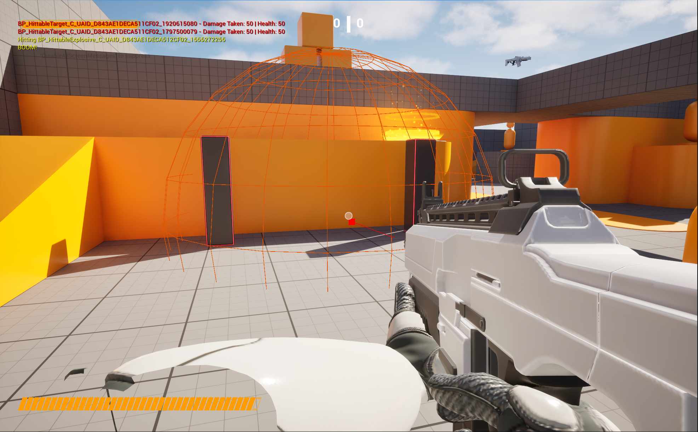

This is what makes the interface powerful. The weapon did not change and a completely new class with a different behavior was added to the game by simply implementing `IHittable` and defining what `OnHit` means for that class.

---

## Creating the IInspectable Interface

So far every interaction in this project has been driven by shooting. We are now going to add a second input for inspecting. When the player holds the **right mouse button** and looks at an actor, if that actor implements `IInspectable`, it will display information about itself. Each Blueprint actor can define its own response freely, which is precisely what the **Blueprintable** interface is designed for.

The key difference from `IHittable` is that `IInspectable` is `Blueprintable`. This means Blueprint actors can implement it directly through Class Settings, without needing a C++ parent class. The C++ side only needs to call the function. The designer decides what happens.

In the editor, click **Tools → New C++ Class**. Keep **Common Classes** selected, search for **Unreal Interface**, select it, click Next, and name it **`Inspectable`**.


Open **Inspectable.h**. This time the `UINTERFACE` macro uses `Blueprintable`:

```cpp
UINTERFACE(Blueprintable, MinimalAPI)
class UInspectable : public UInterface
{
    GENERATED_BODY()
};
```

In this interface we will declare `OnInspected()` function marked with `BlueprintNativeEvent` so it can be implemented in both C++ and Blueprint:

```cpp
public:
    UFUNCTION(BlueprintNativeEvent)
    void OnInspected();
```

::: {.callout-note}
`BlueprintNativeEvent` functions have a default C++ implementation via `_Implementation` that can be overridden in both C++ and Blueprint. `BlueprintImplementableEvent` functions can only be overridden in Blueprint and have no C++ fallback.
:::

---

## Setting Up the Inspect Input

Before we can call the interface from the weapon, we need a new input action for the right mouse button. In the Content Drawer, navigate to **Content → Variant_Shooter → Input → Actions**. Right-click, select **Input** and then **Input Action**. Name it **`IA_Inspect`**.

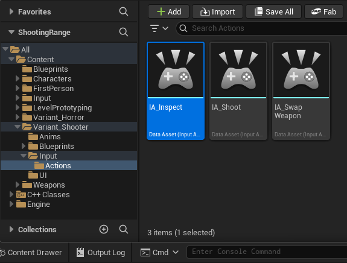

Now open **IMC_Weapons** in the same Input folder. Click the **+** button to add a new mapping, select **`IA_Inspect`**, and assign the **Right Mouse Button** as the key.

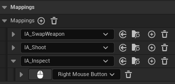

Now we need to bind this action in the **ShooterCharacter** class. Open **ShooterCharacter.h** and add a new input action variable alongside the existing ones:

```cpp
protected:

    // existing input actions...

    /** Inspect actors input action */
    UPROPERTY(EditAnywhere, Category = "Input")
    UInputAction* InspectAction;
```

In the Character source file, inside `SetupPlayerInputComponent`, bind the action to a new function that we are going to create:

```cpp
void AShooterCharacter::SetupPlayerInputComponent(UInputComponent* PlayerInputComponent)
{
    Super::SetupPlayerInputComponent(PlayerInputComponent);

    // Set up action bindings
    if (UEnhancedInputComponent* EnhancedInputComponent = Cast<UEnhancedInputComponent>(PlayerInputComponent))
    {
        // existing bindings...

        // Inspect actors
        EnhancedInputComponent->BindAction(InspectAction, ETriggerEvent::Triggered, this, &AShooterCharacter::Inspect);
    }
}

```

Then declare and implement the `Inspect` function in **ShooterCharacter.h**. It will perform a line trace and check for actors that implement `IInspectable`:

```cpp
protected:
    /** Inspect actors implementing Inspectable interface */
    void Inspect();
```

Include `KismetSystemLibrary` and `Inspectable.h` at the top of **ShooterCharacter.cpp**:

```cpp
#include "Inspectable.h"
#include "Kismet/KismetSystemLibrary.h"
```

```cpp
void AShooterCharacter::Inspect()
{
    FHitResult HitResult;
    FVector Start = GetPawnViewLocation();
    FVector End = Start + GetViewRotation().Vector() * 5000.f;

    TArray<AActor*> ActorsToIgnore = { this };
    ETraceTypeQuery TraceChannel =
        UEngineTypes::ConvertToTraceType(ECollisionChannel::ECC_Visibility);

    bool bHit = UKismetSystemLibrary::LineTraceSingle(
        GetWorld(), Start, End, TraceChannel,
        false, ActorsToIgnore, EDrawDebugTrace::None,
        HitResult, true
    );

    if (bHit)
    {
        AActor* HitActor = HitResult.GetActor();
        if (HitActor && HitActor->Implements<UInspectable>())
        {
            IInspectable::Execute_OnInspected(HitActor);
        }
    }
}
```

::: {.callout-note}
The inspect trace comes from the Character rather than the weapon because it is not a weapon action. It uses `GetPawnViewLocation` and `GetViewRotation` to fire from the camera's perspective, and `EDrawDebugTrace::None` since we do not need a visible trace for inspection. Notice we use `Execute_OnInspected` because `IInspectable` is Blueprintable, unlike `IHittable` where we used a direct cast.
:::

Finally, open **BP_ShooterCharacter** in the editor and assign `IA_Inspect` to the **Inspect Action** slot in the Input section of the Details panel.

---

## Implementing IInspectable in Blueprint

Now we can update an existing actor to implement `IInspectable`. Open the **WobbleTarget** Blueprint and go to **Class Settings → Interfaces → Implemented Interfaces** and click **Add**.

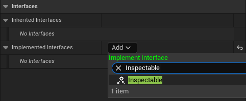

In the Event Graph, right-click and search for **Event On Inspected**. Add a **Print String** node with a custom message describing this actor, such as `"I'm a Wobble Target"`, and set the **Key** to be `Inspect`.

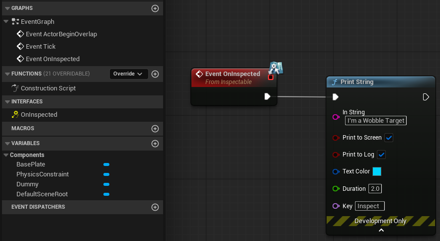

Hold the **right mouse button** while looking at the actor. You should see the custom message appear on screen. Looking at a `BP_HittableTarget` or `BP_HittableExplosive` produces nothing, since they do not implement `IInspectable`. The weapon still fires normally with the left mouse button, completely unaffected.

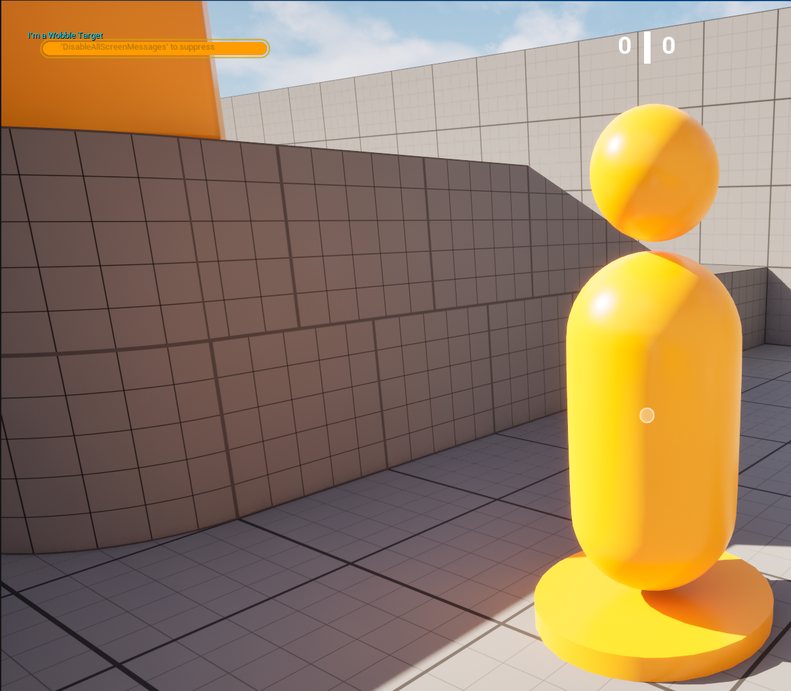

This is the distinction between Blueprintable and NotBlueprintable in practice. `IHittable` required a C++ class to implement the contract. `IInspectable` required nothing more than a Blueprint actor and a Class Settings checkbox. The designer owns the response entirely.

Open **BP_HittableTarget** and **BP_WobbleTarget** and open the Class Settings on both of them. You should see that **HittableTarget** has "Inherited Interfaces" and the **WobbleTarget** has "Implemented Interfaces". This shows the difference between what already belongs to the C++ class and what was implemented afterward through Blueprint.


---

## Exercises

1. Expose the damage amount per shot as an `EditAnywhere` variable on `AShooterWeapon` instead of hardcoding `25.f`. Create two Blueprint children of `BP_ShooterWeaponBase` with different damage values and observe how the same targets respond differently depending on which weapon is equipped.

2. Add `IInspectable` to `BP_HittableExplosive` through Blueprint Class Settings. When inspected, display the explosive's current `ExplosionRadius` and `ExplosionDamage` values on screen.

3. Extend the previous exercise by also drawing a debug sphere representing the explosion radius when the explosive is inspected, so the player can visualise the danger zone before deciding to shoot it.

4. Create a new C++ class `AHittableShield` that implements `IHittable`. This actor has a shield and a health pool. While the shield is active, incoming hits deplete the shield instead of health. Once the shield is fully depleted, further hits reduce health normally. When health reaches zero the actor hides and respawns, restoring both shield and health.

5. Extend `AHittableShield` from previous exercise by also implementing `IInspectable` in C++. Override `OnInspected_Implementation` to display the current shield and health values on screen. Implement it entirely in C++ without touching the Blueprint editor. 

::: {.callout-tip}
**Exercise 5:** With `BlueprintNativeEvent`, the function you override in C++ is not `OnInspected` itself but `OnInspected_Implementation`. Declare it as `virtual` in the `AHittableShield`'s header and Unreal Header Tool (UHT) generates the connection between the two automatically.
:::