## Introduction

This assignment will introduce you to C++ programming and Unreal Engine 5 (UE5), including some of the Gameplay Framework classes. It will also show you some of the different ways to work with classes, functions, and variables that can help you with your project. This is just a jumping off point to get you started, but it is a mini game with both winning and losing. As you will see, the character can collect batteries which are spawned by a Spawn Volume above the level. Your power increases as you collect the batteries, which changes your material and your running speed. However, the GameMode is also draining your character over time. You can lose power completely. By the end of this assignment, you will have a number of classes including a base pickup, a battery pickup which fires lightning towards the character and gives some of its base power to the character. You will have an upgraded character which has a Collection Sphere to collect all of the batteries within a certain radius of the character. You will have a GameMode which drains the character's power over time. The GameMode also defines what happens when you win and when you lose during gameplay. You will have a Spawn Volume that spawns any kind of pickup whether it is a Base Pickup, a Battery Pickup, or some other kind of pickup that you develop on your own. There is also the HUD, which is set up using UMG (Unreal Motion Graphics) and has the power bar and the text at the top of the screen.

::: {.callout-tip}
**Source:** <https://www.youtube.com/playlist?list=PLZlv_N0_O1gYup-gvJtMsgJqnEB_dGiM4>
:::

---

## Building the Base Level

Open the Games tab in the Unreal Project Browser. We are going to use a C++ template. Select **Third Person**. Leave the setup on Desktop. You can change the quality to Maximum Quality or Scalable, depending on your system setup. The reason for not to change from Desktop to Mobile is that will change some of the inputs for your project. You can either include Starter Content or not; we don't need it for this assignment. However, if you want to take the project further, you can add Starter Content now or add it later with the add Feature Packs in the editor.

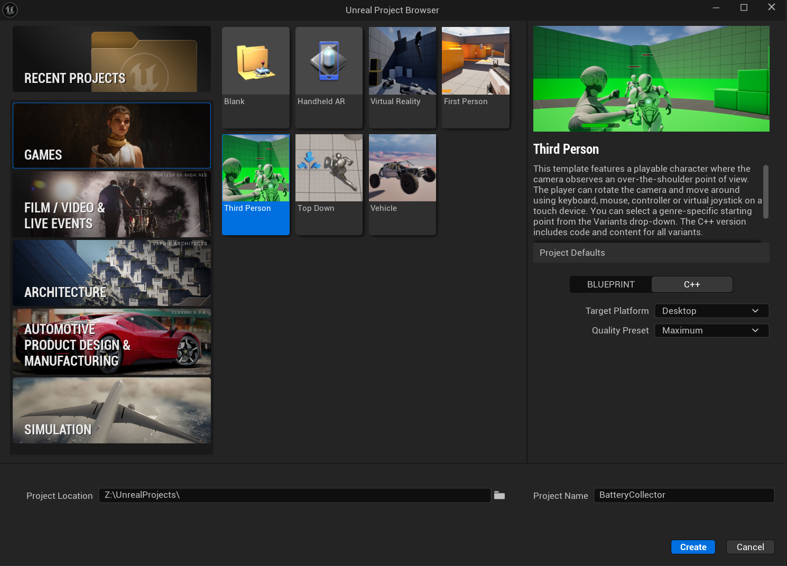

You need to name the project. Name the game **"BatteryCollector"**. If you name your project something different, you will have to adjust the code from the assignment. Click Create. That is going to generate the template code, which is a Character and a GameMode. It is going to compile the project and open it in the editor. For this assignment, we are using the Third Person template because it already has the camera controls and input setup and ready to go. You could try adding this same assignment content to the Vehicle template or your own game and see how it works for you. This is going to compile, and it will be open in the editor.

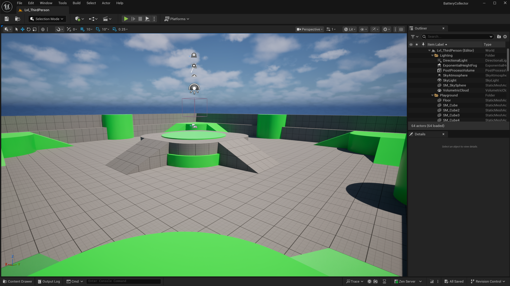

You can click Play and run around with the character. He has some jump and movement functionality already setup. There is some content you need to use from the Content Examples project as well. Download it from the Fab.


There are 2 things you are going to use from the Content Examples project. There is a room for the character to run around, and a battery mesh for our battery pickup.


In the Content Drawer, you can start typing. Search for **"BP_DemoRoom"**. This is the room we are going to use.


Select BP_DemoRoom in the Content Drawer, right-click, go to Asset Actions and select **Migrate**.

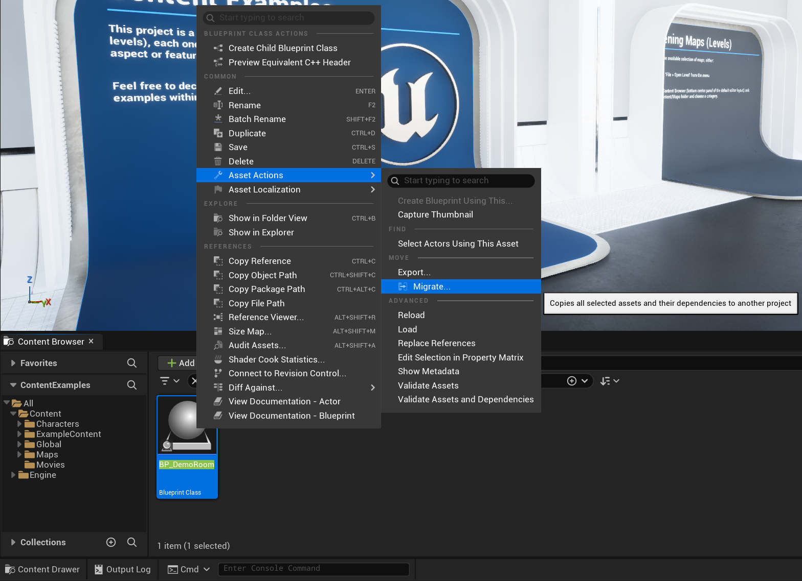

As you see, this pulls together the materials, Blueprints, and everything needed for this room to work in your project. It is most helpful to use the Migrate functionality rather than just copying the BP_DemoRoom UAsset file from one project to the next. Once the list of assets has come up, click OK.

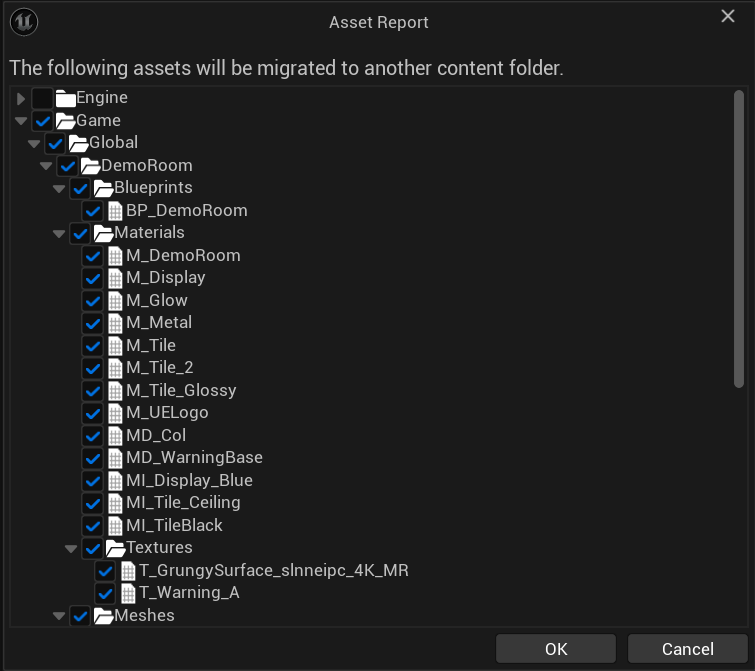

Find your project. We have `UnrealProjects > BatteryCollector > Content`. Put it in the Content folder and click Select Folder.


Now, let's migrate the next two. Search for **"Battery"**. Select the **SM_Battery_Medium**. Right-click, go to Asset Actions, and select Migrate. Our asset list will pop up. Click OK. The Content folder you just selected should still be selected, so these next two will go quickly. Double check to make sure the Content folder is selected. Click OK.

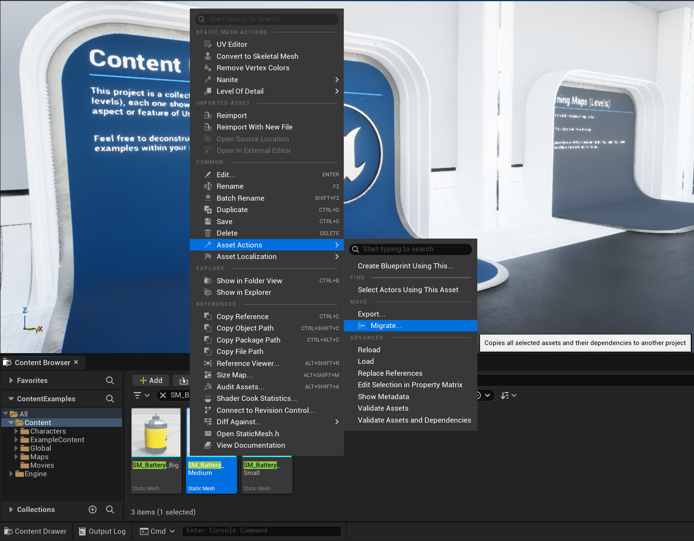

At this point, we are done with the Content Examples project and you can close it. Now, let's do a little bit of setup in our main BatteryCollector project. First, we need a new level. Click File and select New Level. We are going to use the **Basic** level because it already has the sky, some lights, etc. set up.

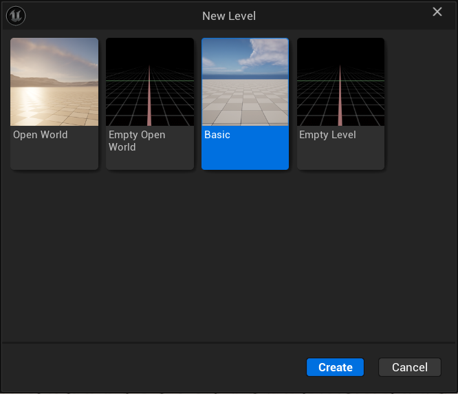

We are going to make a Maps folder within the Content folder. Select the Content folder. Right-click in the Content Browser and select New Folder. Call this **"Maps"**. Double-click Maps to open it. Click File and select Save Current Level. We are going to save our new level in the Maps folder. Call this **"CollectionLevel"**. Now, you can see the CollectionLevel here in the Content Drawer.

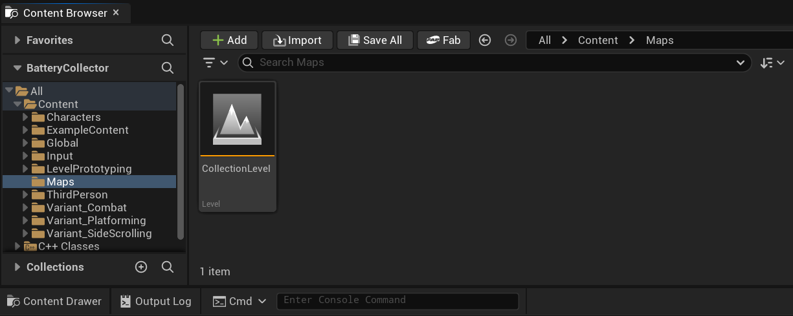

How do we get the project to use this level every time we open the project? To do that, click Edit on the menu. Click the drop down and select Project Settings. On the left, select **Maps & Modes**. Again, this is for working with the maps for your project.


There is the Game Default Map and the Editor Startup Map. This is the map the game will start with, and the map the editor will start with. Using the drop-down arrow, set both to **CollectionLevel**. That will save automatically in our `DefaultEngine.ini` configuration file.

Note that there is a Default GameMode which sets things like our Character, and the default GameMode. These are part of the Third Person template. If you use a different template, you will have a different Default Pawn Class and a different GameMode here. 


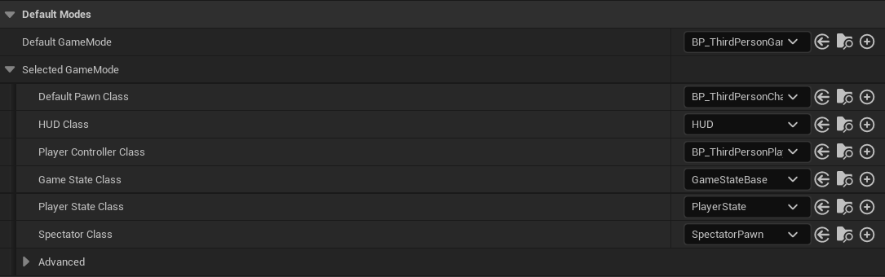

Close the Project Settings.


Now, let's do some quick level design. In the World Outliner, select the Floor. Press Delete. Go to the Content folder in the Content Drawer. Search for **"BP_DemoRoom"**. Drag-and-drop BP_DemoRoom into the level.

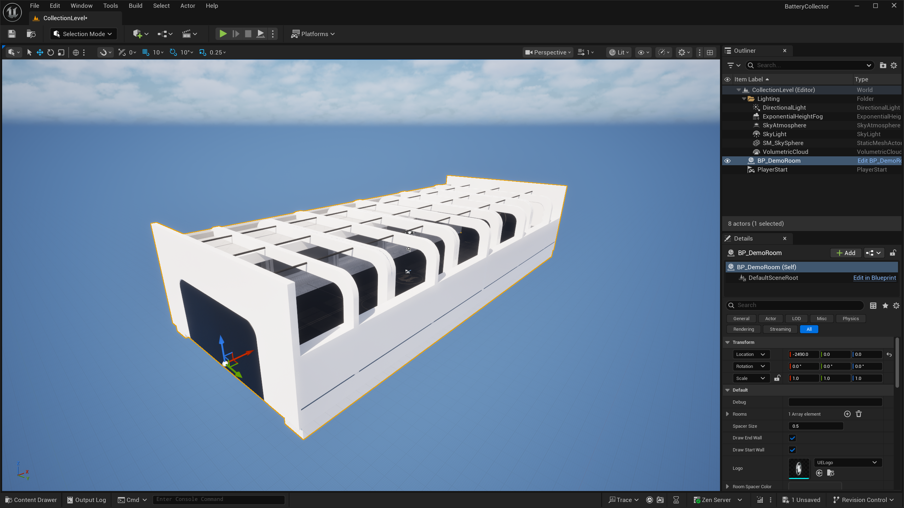

There are several properties already set up on the Blueprint. On the first room, set **Width** to `32`, because we would like to enlarge the room so it is larger. Zoom out to see what is going on. Uncheck **Pillar** and **Sub Pillar** to remove all the pillars and make the room an open space. Uncheck **Enclosed Left** because our batteries are going to fall from the sky.


This is an open space where our character can run around, and the batteries can fall in without having to go through a roof or anything that doesn't make sense. We are going to do more tweaks later, like lighting and post-processing. For now, this is enough to get us started. You used the Default level because it comes with things like lights, and a sky.

Click Play. The character will spawn in the middle, and you can run around. Close the Place Actors tab. Let's save this map: go to the Content Drawer and click **Save All**. Click Save Selected. When we leave and come back, everything will be right where we left it. Now, you are ready to get started with your first code class.

---

## Making Your First Pickup Class

You are going to make a very, very basic pickup. You can make new classes with Visual Studio, XCode, or whatever code IDE you are using, but there is a little bit of Unreal specific boilerplate which the C++ Class Wizard from the editor handles for you. We are going to start with the C++ Class Wizard so you can see the templates and how they can help you. You can access the C++ Class Wizard by clicking **Tools** and select **New C++ Class**.

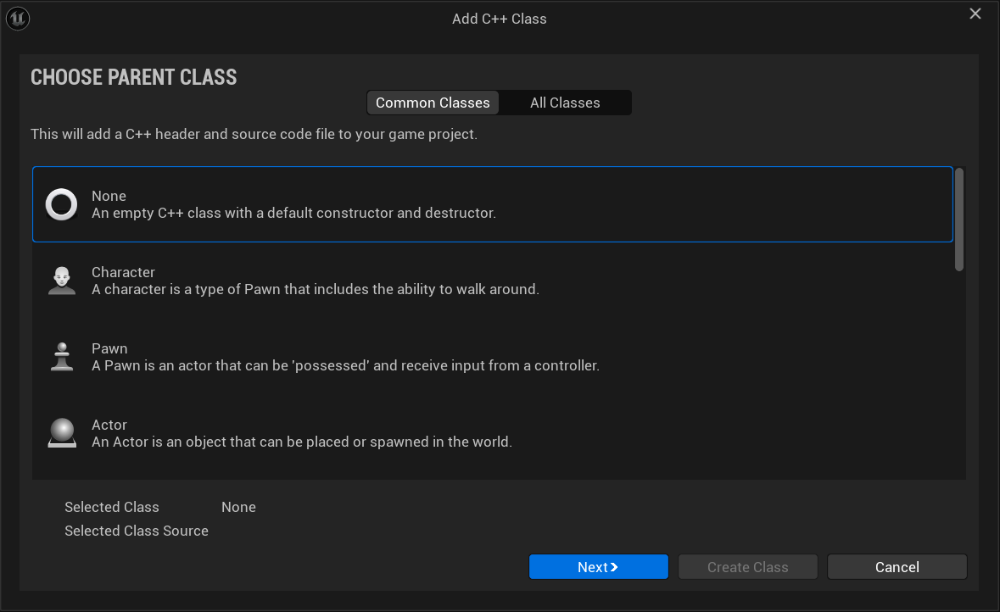

For this very basic pickup, you basically need something that sits in the world and is a visible representation so the Character could theoretically interact with it. Thinking of it that way, we should base our pickup on the **Actor** Class. An Actor is any object that can be placed or spawned in the world. If we had other functionality we needed, we could look for another class that might do some of that functionality for us already. If you want something to sit in the world, you base it on Actor. From the list of common classes, select **Actor**.


Click Next. Here, we will enter a name. Type **"Pickup"**. If you name your class something different, you will have to slightly adjust the code of the assignment to match your pickup class' name. If you just want to follow along, name your class **"Pickup"**.

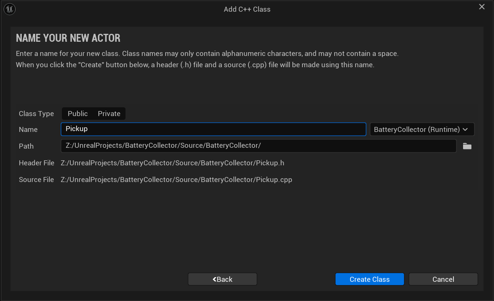

If you wanted, you could do some organization here so that your code will be stored differently. We are only going to have 10-12 files by the time we are done with this assignment. The project is not quite large enough to need a lot of sub-folders yet, so you are not going to set those up. As you can see, this is going to create a Header File and a Source File for you. Click **Create Class**. It will add code to the project. It is going to recompile and reload that module so you can see any code changes reflected when you click Compile in the editor. This is called hot reload, which is being able to change between the code editor of your choice and use the Compile button to see your changes.

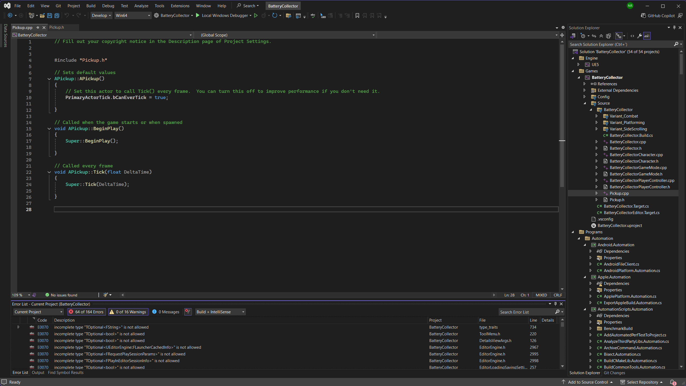

Let's go through some of the basic things included with this template.

```cpp
// Fill out your copyright notice in the Description page of Project Settings.
#pragma once
#include "CoreMinimal.h"
#include "GameFramework/Actor.h"
#include "Pickup.generated.h"

UCLASS()
class BATTERYCOLLECTOR_API APickup : public AActor
{
    GENERATED_BODY()

public:
    // Sets default values for this actor's properties
    APickup();

protected:
    // Called when the game starts or when spawned
    virtual void BeginPlay() override;

public:
    // Called every frame
    virtual void Tick(float DeltaTime) override;
};
```

As you can see, your pickup inherits from Actor which is included here. The generated header file is also included here. You can put other includes in here if you want to put other functionality in your pickup and you need to interact with other classes. Make sure you don't put anything under the `Pickup.generated.h` file. This is something the Unreal Build Tool (UBT) looks for as the last thing in the list.

Here, we have the class declaration. Above the class declaration is this `UCLASS()` macro. The `UCLASS()` macro helps set up the class so the editor actually knows about it for things like garbage collection, setting keywords, reflection, and all the things that come with being a UObject. All Actors are based on UObjects. The UClass does a lot of that functionality for you. `GENERATED_BODY()` is more macro boilerplate text which does more of the engine linking. As you can see here, there are 3 functions already set up for us. First, `APickup` is the constructor where we can set default values. Next `BeginPlay`, which will be called when the pickup spawns or when the game starts. Third, is the `Tick` function but we are going to turn off this functionality in a second. Click `Pickup.cpp` to go over to the source file:

```cpp
// Fill out your copyright notice in the Description page of Project Settings.
#include "Pickup.h"

// Sets default values
APickup::APickup()
{
    // Set this actor to call Tick() every frame. You can turn this off to
    // improve performance if you don't need it.
    PrimaryActorTick.bCanEverTick = true;
}

// Called when the game starts or when spawned
void APickup::BeginPlay()
{
    Super::BeginPlay();
}

// Called every frame
void APickup::Tick(float DeltaTime)
{
    Super::Tick(DeltaTime);
}
```

In the source file, you can see the `Pickup.h` file you were just in is included. Our constructor already has the pickup set up so it can tick. This is a very basic pickup and we are not going to do any ticking functionality. Set `bCanEverTick` to `false`. You could also delete the Tick function now that you have turned off the Tick functionality. You can also leave it because it is not going to get called as long as `bCanEverTick` is false. The BeginPlay function has also been automatically defined for us. Right now, all BeginPlay does is call the Actor's BeginPlay functionality like registering it with the scene, and things like that. That is what the `Super::BeginPlay` function is for.

So, what is the first thing our pickup needs? Most pickups have a visual representation within the level. Let's set ours up to have a **Static Mesh Component**. We are going to make our Static Mesh Component private. This means we can only set up and alter the Static Mesh Component within the pickup code. No other code classes, nor Blueprints, nor anything else can directly access the Static Mesh Component.

```cpp
UCLASS()
class BATTERYCOLLECTOR_API APickup : public AActor
{
    GENERATED_BODY()

public:
    // Sets default values for this actor's properties
    APickup();

protected:
    // Called when the game starts or when spawned
    virtual void BeginPlay() override;

public:
    // Called every frame
    virtual void Tick(float DeltaTime) override;

private:
    /** Static mesh to represent the pickup in the level */
    UStaticMeshComponent* PickupMesh;
};
```

This is going to be our "Static Mesh to represent the pickup in the level". Just like we have the `UCLASS()` macro, we also have `UPROPERTY()` and `UFUNCTION()` macros. We are going to use the `UPROPERTY()` macro here. Components are basically regarded as variables, but we need to add some specific keywords in here.

```cpp
private:
    /** Static mesh to represent the pickup in the level */
    UPROPERTY(VisibleAnywhere, BlueprintReadOnly, Category = "Pickup",
              meta = (allowprivateaccess = true))
    UStaticMeshComponent* PickupMesh;
```

`BlueprintReadOnly` means that if you place the pickup directly in the level or create a Blueprint based on the pickup, you can see this component exists. However, you can't remove it or edit it in a way so we wouldn't rely on the pickup mesh being there and being a component of our Actor. You can also put a category keyword on it. We are going to add a Pickup category. This means in the Details panel, we can look under the Pickup category and our mesh will show up. The last thing we are going to use is this `meta` keyword. There are a few of these meta keywords throughout sample code, some of the templates, and especially on components. This code is specific to components in that this is private. We need to be able to change properties about the mesh such as which Static Mesh is assigned, or what size it is, etc. from within the Blueprint or within the level.

This is private, but we may need to return the Static Mesh and alter it from another class. Maybe when the Character powers up, all of the pickups start glowing and we need to change the material on the Static Mesh. Let's make an accessor function for that. This function will "Return the mesh for the pickup."

```cpp
public:
    // Called every frame
    virtual void Tick(float DeltaTime) override;

    /** Return the mesh for the pickup */
    FORCEINLINE UStaticMeshComponent* GetMesh() const { return PickupMesh; }
```

We are going to use a little bit of magic here with the `FORCEINLINE` keyword. We want to change the material on the mesh from another class, and this function will allow us to do that. We made the `GetMesh` function `const` because it is not allowed to modify our Mesh Component, it will just return it for us. Finally, let's set up the component within our constructor so it is ready to go when the pickup is created:

```cpp
APickup::APickup()
{
    // Set this actor to call Tick() every frame. You can turn this off to
    // improve performance if you don't need it.
    PrimaryActorTick.bCanEverTick = false;

    // Create the static mesh component
    PickupMesh = CreateDefaultSubobject<UStaticMeshComponent>(TEXT("PickupMesh"));
    RootComponent = PickupMesh;
}
```

First, we will "Create the Static Mesh Component". There is a helper that will do that for us called `CreateDefaultSubobject`. `UStaticMeshComponent` is the type of component we are making. We can also give it some display text. We also want to set that StaticMeshComponent as the Root Component. If we add other effects or another mesh later, they would all be based on the size and location of the PickupMesh. At this point, we can compile. Switch back to the editor. Press **CTRL+ALT+F11**, and the toast will pop up in the corner. If you have an error during compilation for some reason, you will be able to click on this to show the log and get some debug messages.


In the next section, you are going to add the actual activation and deactivation functions for the pickup because that is the other baseline functionality we want all pickups to have.

---

## Adding Variables and Functions

Now, we will add our activity code to the pickup. Go back to Visual Studio. We want all pickups to have a state of whether it is active, to have ways to report whether it is active, and also to change it. Let's start with our variable for whether it is active. We are going to make this variable **protected** which means we can change it in this code class, another code class based on this one, or in a Blueprint. If we wanted to create a Blueprint based on pickup and then directly toggle the pickup behavior, we could do that.

```cpp
protected:
    /** True when the pickup can be used, and false when the pickup is deactivated */
    bool bIsActive;
```

This will be "True when the pickup can be used, and false when pickup is deactivated". Again, that is very straightforward. The variable is just a Boolean. It will be true when the pickup can be used, and false when the pickup can't be used. We will go to the constructor where we set the default values.

```cpp
APickup::APickup()
{
    // Set this actor to call Tick() every frame. You can turn this off to
    // improve performance if you don't need it.
    PrimaryActorTick.bCanEverTick = false;

    // All pickups start active
    bIsActive = true;

    // Create the static mesh component
    PickupMesh = CreateDefaultSubobject<UStaticMeshComponent>(TEXT("PickupMesh"));
    RootComponent = PickupMesh;
}
```

All pickups start active. If you had a specific type of pickup where you wanted it to be inactive until the character did something, you could make a Blueprint or a code class based on this variable and override it in the constructor or the Construction Script because that variable is protected. Again, because this variable is protected, it can only be changed by other types of pickups and not by the Character or the GameMode. We would need to make functions for that. Let's go ahead and do that now. We will create a function to return if the variable is active or not.

```cpp
/** Return whether or not the pickup is active */
UFUNCTION(BlueprintPure, Category = "Pickup")
bool IsActive();
```

The function to return will return a Boolean. Boolean functions should ask a question that has a true or false answer. Is it active? Like we used the `UPROPERTY()` macro before, we are going to use the `UFUNCTION()` macro on this function. We are going to use the keyword `BlueprintPure`, which will be explained shortly. Then, we will create a function to change whether or not the variable is active.

```cpp
/** Allows other classes to safely change whether or not pickup is active */
UFUNCTION(BlueprintCallable, Category = "Pickup")
void SetActive(bool NewPickupState);
```

The `SetActive` is not going to return anything. It will be a void function. This is also going to be a UFunction. This function is going to be `BlueprintCallable`.

`BlueprintPure` and `BlueprintCallable` are both things defined in code, but can be called from Blueprints. Technically `BlueprintPure` functions can modify things, but in general they shouldn't. `BlueprintPure` functions are run every time their output is used. A `BlueprintPure` function that pops something off a stack that is called twice, either with a loop or in 2 separate nodes, will pop 2 things off the stack. On the other hand, `BlueprintCallable` functions only run when the input execution pin is hit. `BlueprintCallable` functions save their results in the output pins. `BlueprintCallable` functions can be used for modifying calls. Expensive calculations that aren't expected to change frequently are better in `BlueprintCallable` functions than `BlueprintPure` functions. Fast calculations that will frequently change are better to make in `BlueprintPure` functions, or by adding multiple Blueprint Callable nodes to your graph.

Neither of these two functions you just created do anything right now. Let's write the definition in the `Pickup.cpp` source file.

```cpp
// Returns active state
bool APickup::IsActive()
{
    return bIsActive;
}

// Changes active state
void APickup::SetActive(bool NewPickupState)
{
    bIsActive = NewPickupState;
}
```

We have a Boolean for `IsActive`. It is very simple. Setting it up with these public functions that manipulate a protected variable keeps things code safe. This is especially so if you have multiple people working on a project and they may not understand the rule setup in code, or if you have people trying to have different things interact together.

Our setter is also very straightforward. If you also wanted to print the new pickup state to the screen or change how the mesh looks depending on whether it is active, you can handle all of that in here. It is a little more complex than just changing `bIsActive`, so you wouldn't want to change `bIsActive` without those associated pieces of code.

Double check that everything is saved. There is our Boolean, our getter and our setter. Let's go back to the editor and compile. Press **CTRL+ALT+F11**. Now, that just finished compiling, let's make a Blueprint based on our pickup. Right-click on the Content folder and select New Folder. Call this **"Blueprints"** just to keep everything organized as we go forward.

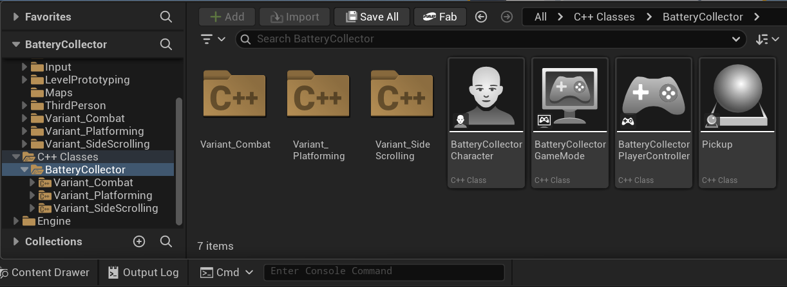

In the Content Drawer go to C++ Classes, and select BatteryCollector. Right-click Pickup and select **Create Blueprint class based on Pickup**. 

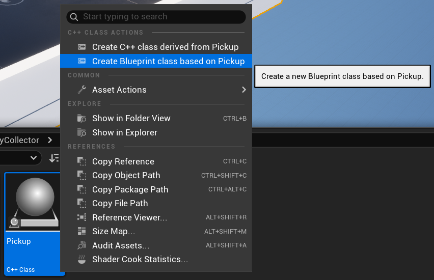

Save it in the Blueprints folder.


Call this **"BP_Pickup"**. Click Create Blueprint Class.

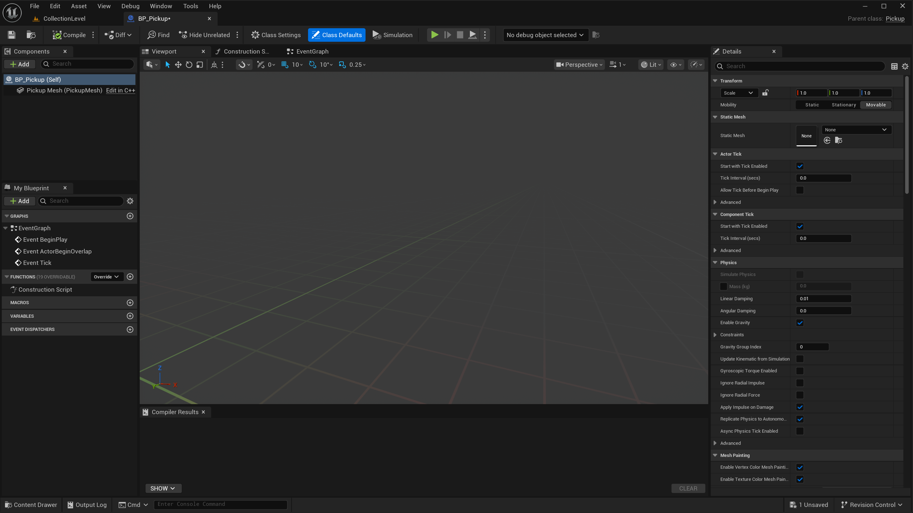

Save this, close and reopen it, so you can see something. Now if you reopen BP_Pickup, this is a Data-Only Blueprint. 

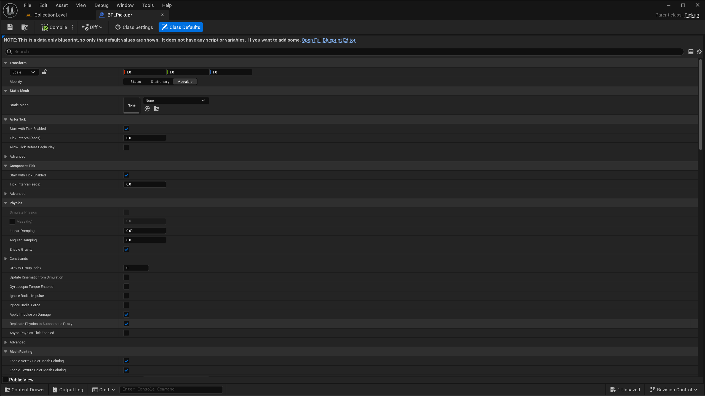

Because this won't have any full node behavior, you can leave it in this state. There is our Static Mesh. Set the Static Mesh to **SM_Cube**.

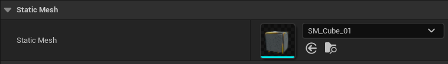

Click Compile and click Save. Go to CollectionLevel. Drag-and-drop BP_Pickup into the world. 


Click Play. Our new pickup is right there and ready for us to interact with if it had any way to call that active changing function.


Now, to show you those 2 nodes that you made. Go back to BP_Pickup to open the full Blueprint Editor. 


Right-click in the graph, and scroll down to the Pickup category.

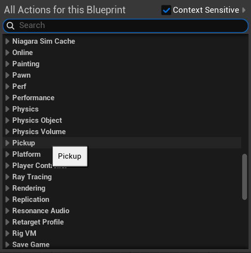

Remember, we put the Pickup category on all of our nodes. Expand Pickup and you see our **Is Active** function. 

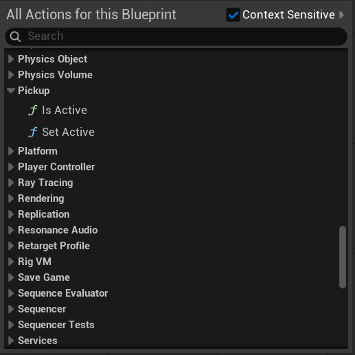

Add both to the Event Graph.


Is Active is the `BlueprintPure` function, so it doesn't have any execution pins. Set Active is the `BlueprintCallable` function and it does have execution pins. It can be specifically called on Event BeginPlay, if we don't necessarily want them to be active. Select both nodes and press Delete. We don't want to set up any behavior. This was just for you to see the difference between those 2 nodes and save.

In the next section, we will make a Battery pickup class that inherits from the Base Pickup and gives it a little more functionality.

---

## Extending the Pickup Class

You have just made a very basic pickup. It has no physics. It just has a pickup mesh to represent it in the world, which is this very artistic cube here. We set up whether the pickup is active or inactive. Now, we are going to make the battery that is really going to be one of the key parts of our gameplay. Eventually, the battery pickup will have physics, so it can fall from the sky. It will have a power level, and it will be destroyed after we pick it up. In this section we are mostly going to focus on creating the battery that inherits from the Base Pickup. We will also set the physics changes and show how that works within the project:

- **Base Pickup (parent class)**
  - No physics
  - Activates/deactivates
- **Battery pickup (child)**
  - Physics on
  - Power level
  - Destroys after picked up

In the Content Drawer, expand C++ Classes. You can Right-click on Pickup and select **Create C++ class derived from Pickup**. This is the same way we created our Blueprint before. However, if you want to find some of the more complex classes, click the **New C++ Class** to add a new C++ class.


We have a base list of classes such as Character, Pawn, Actor, HUD, Blueprint Function Library, and a lot of fairly common and useful things. If you need to branch out and find any of the classes you can inherit from, click the **All Classes** button. Here, you have a list of just about everything. Search for **"Pickup"**. Select Pickup and click Next.

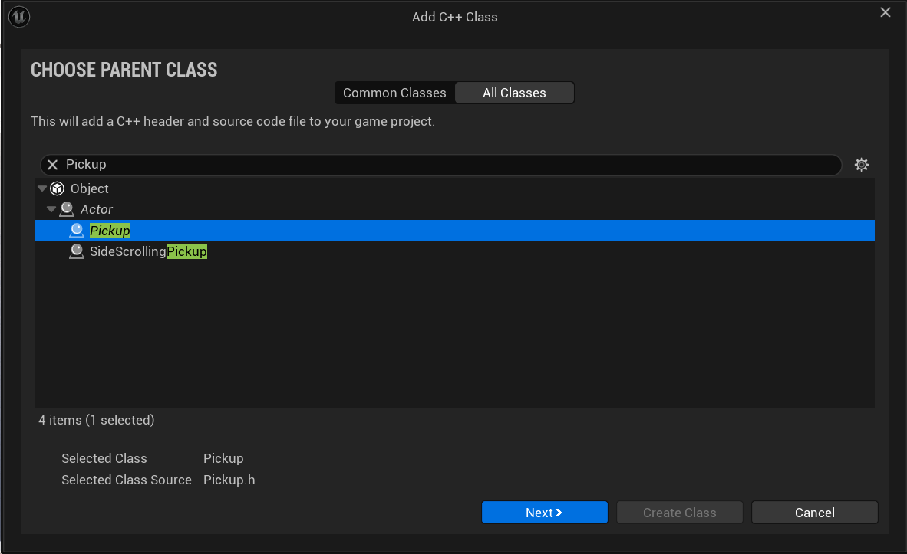

Call this class **"BatteryPickup"**. 


If you name the class something different, your code will look different than the rest of this assignment but you should still be able to follow along. Click **Create Class**. That is going to compile and then reload the module.

We will start changing the new Battery Pickup class functionality.

```cpp
// Fill out your copyright notice in the Description page of Project Settings.
#pragma once
#include "CoreMinimal.h"
#include "Pickup.h"
#include "BatteryPickup.generated.h"

UCLASS()
class BATTERYCOLLECTOR_API ABatteryPickup : public APickup
{
    GENERATED_BODY()
};
```

Again, include `Pickup.h` because that is what we inherit from. We have the generated header file `BatteryPickup.generated.h`. We don't have nearly as much boilerplate as we did in the `Pickup.h` file.

If you need an example to look at, you can see this is how you create the BeginPlay override. That is why the template code is nice. We are going to make our own constructor and we need to make it public. Copy template code: go to `Pickup.h` and copy the constructor declaration. Go to `BatteryPickup.h`, and paste the code.

```cpp
// Fill out your copyright notice in the Description page of Project Settings.
#pragma once
#include "CoreMinimal.h"
#include "Pickup.h"
#include "BatteryPickup.generated.h"

UCLASS()
class BATTERYCOLLECTOR_API ABatteryPickup : public APickup
{
    GENERATED_BODY()

public:
    // Sets default values for this actor's properties
    ABatteryPickup();
};
```

Go to `BatteryPickup.cpp`:

```cpp
// Fill out your copyright notice in the Description page of Project Settings.
#include "BatteryPickup.h"

// Set default values
ABatteryPickup::ABatteryPickup()
{
    GetMesh()->SetSimulatePhysics(true);
}
```

As it was said before, this pickup is going to fall from the sky. The batteries are going to spawn in space and fall down on the character, where he can collect them. Remember, we had that public `GetMesh` function from before. We are going to use that here. We have that mesh and there are all kinds of things we can do. We can add an impulse and shoot it across the room. There are a lot of forces and impulses we could add. We could change the offset or rotation, and all the things you can do with a Static Mesh Component. We want to **set simulate physics to true**. This way, as soon as the batteries spawn in, they will fall from the sky.

Remember when you placed a pickup box in the level, it just hovered in the air? Obviously, physics was not set to simulate on the box. That is the only change we are going to make right now. Later, we are going to come back to add power and collection. Go back to the editor and press **CTRL+ALT+F11** to compile.

Now, we will make a Blueprint based on our Battery Pickup. To set the Static Mesh property on either the Pickup or the BatteryPickup, we could have hard coded those references. If we wanted to move around the meshes or easily tweak it without having to recompile, that would be trickier. Creating a code class with the variables you know you want to set and then creating a Blueprint to set those variables is the recommended best practice in a lot of cases.

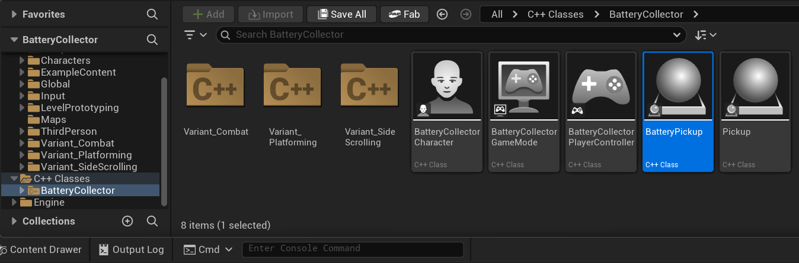

Right-click on BatteryPickup and select **Create Blueprint class based on BatteryPickup**. Call this **"Battery_BP"**. Save it in the Blueprints folder. Click Create Blueprint Class. It is going to open the full Blueprint Editor.

In the Components tab, select **PickupMesh (inherited)**. Click the Static Mesh drop down and scroll to find **SM_Battery_Medium** we imported from the Content Examples project.

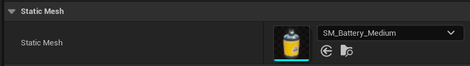

Click Compile. We are ready to try this out. Go to CollectionLevel. Drag-and-drop Battery_BP into the world. Drag it up with the blue arrow. Click Play. The battery did fall, while the box is still in the air. Notice that the battery fell through the floor.

### Fixing Battery Collision

Select the Content folder and search for **"Battery"**.

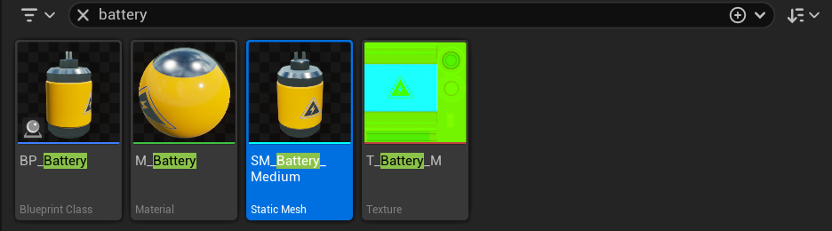

Open **SM_Battery_Medium**. In the Static Mesh Editor, you can look at the collision. Notice there are no green lines showing up. There are no primitives, and that is why it is falling through the world. There is no box showing where the collision would be. It can never collide. It can never stop on the floor. It is going to keep falling forever.

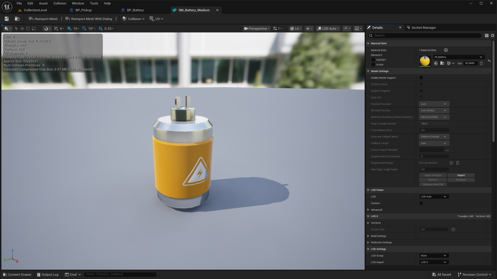

Let's fix this really quick. In the top menu, click **Collision**. Select **Add 10DOP-Z Simplified Collision**. This makes a cylinder on the Z axis. The cylinder is centered on the Z axis.


You see how the top of the battery is inset. If you want to fit the cylinder closer, we could click Collision and select Remove Collision. Click Collision and select **18DOP Simplified Collision**. This collision is closer around the battery. We can go with that so it will roll around on the top edge a little bit more. Click **Save**.

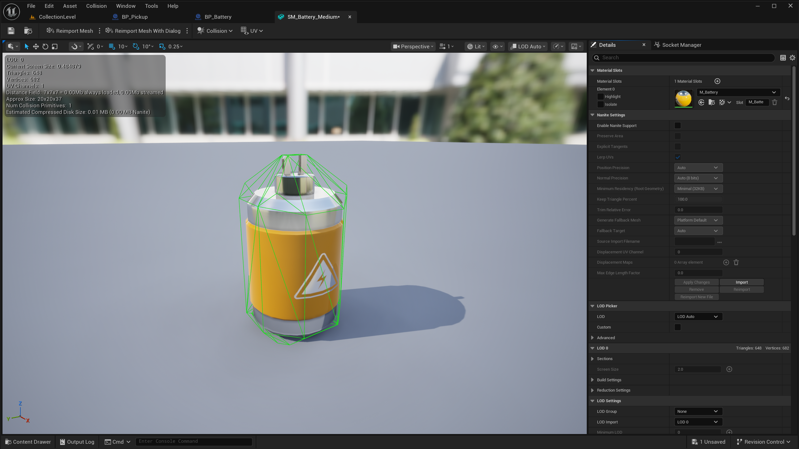

Go to CollectionLevel. Click Play. It sits on the floor. We can come over and kick it along the ground. We are going to add more functionality to the battery in upcoming sections.


---

## Creating the Spawning Volume

You are going to set up our spawn volume. Until now, we have been dragging in pickups to test like this battery or the cube. That is great for testing. For gameplay, we want these pickups to fall from the sky at regular intervals. It will take a few sections on this assignment to set it up entirely. At the end, you are going to have a very awesome functional spawn volume. You will have a spawn volume that will have functionality to determine **where to spawn**, **what to spawn**, and **when to spawn**.

While you are in the Level Editor, delete the two pickups. We are going to create another code class. Go to the Content Drawer and select BatteryCollector, under C++ Classes. Right click and select **New C++ Class**.


Our spawn volume is going to be something that is placed in the level. It doesn't need too much more than that. Select **Actor**.

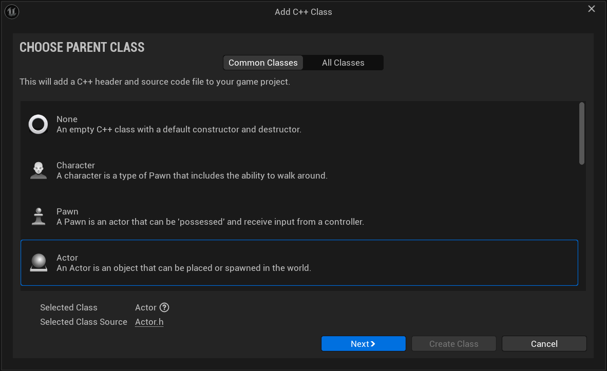

Click Next. Call this **"SpawnVolume"**. Click Create Class.

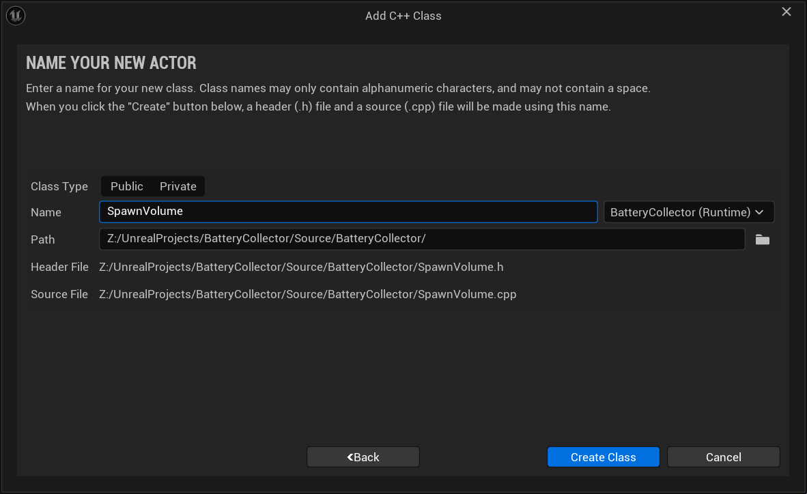

### Where To Spawn

Our SpawnVolume.h header and source file have opened in Visual Studio. The WhereToSpawn code is going to look very similar to the code when we added a Mesh Component to our pickup. Again, we are going to make a component. This time it will be a **Box Component**, which we will make private and have a function to access it publicly.

```cpp
#include "CoreMinimal.h"
#include "GameFramework/Actor.h"
#include "SpawnVolume.generated.h"

class UBoxComponent;

UCLASS()
class BATTERYCOLLECTOR_API ASpawnVolume : public AActor
{
    GENERATED_BODY()

public:
    ASpawnVolume();

protected:
    virtual void BeginPlay() override;

public:
    virtual void Tick(float DeltaTime) override;

    /** Returns the WhereToSpawn subobject */
    FORCEINLINE UBoxComponent* GetWhereToSpawn() const { return WhereToSpawn; }

    /** Find a random point within the BoxComponent */
    UFUNCTION(BlueprintPure, Category = "Spawning")
    FVector GetRandomPointInVolume();

private:
    /** Box Component to specify where the pickups should be spawned */
    UPROPERTY(VisibleAnywhere, BlueprintReadOnly, Category = "Spawning",
              meta = (AllowPrivateAccess = "true"))
    UBoxComponent* WhereToSpawn;
};
```

Call this **"WhereToSpawn"**. This component will have a lot of the same `UPROPERTY` keywords as our other component. It will be in the **Spawning** category. We will add the meta keyword as well. We are not going to make a Blueprint of the spawn volume during this assignment. We are going to place the spawn volume directly in the level and manipulate it there to show a different workflow. That is why we left this `BlueprintReadOnly` keyword.

::: {.callout-note}
In `Pickup.h` the function `bool IsActive` didn't use `FORCEINLINE` because the `UFUNCTION()` macro is not compatible with making a function `FORCEINLINE`. If you wanted to make the `GetMesh` a `BlueprintCallable` function, you would not use `FORCEINLINE`.
:::

Go to `SpawnVolume.cpp`:

```cpp

#include <Components/BoxComponent.h>

ASpawnVolume::ASpawnVolume()
{
    // Set this actor to call Tick() every frame. You can turn this off to
    // improve performance if you don't need it.
    PrimaryActorTick.bCanEverTick = false;

    // Create the Box Component to represent the spawn volume
    WhereToSpawn = CreateDefaultSubobject<UBoxComponent>(TEXT("WhereToSpawn"));
    RootComponent = WhereToSpawn;
}
```

Although it says "a volume" in the comment, it is going to be more of a flat, rectangular prism within the world. We also set the Box Component as the root Component. Since we are not going to use Tick in the spawn volume, we can make that false.

Lastly, create a function to find a random point in our volume. To use these functions, first go up to the top of `SpawnVolume.h`:

```cpp
#include <Kismet/KismetMathLibrary.h>
```

Kismet Math Library has a function called `RandomPointInBoundingBox`, which takes an Origin and a BoxExtent as variables.

```cpp
FVector ASpawnVolume::GetRandomPointInVolume()
{
    FVector SpawnOrigin = WhereToSpawn->Bounds.Origin;
    FVector SpawnExtent = WhereToSpawn->Bounds.BoxExtent;
    return UKismetMathLibrary::RandomPointInBoundingBox(SpawnOrigin, SpawnExtent);
}
```

If you look, `RandomPointInBoundingBox` returns a vector. It takes the Origin and the BoxExtent. We will supply the `SpawnOrigin` and the `SpawnExtent` we previously pulled out. At this point, compile the code to check that everything is OK. You can also compile directly in Visual Studio: right-click on BatteryCollector and select **Build**.

---

## Defining What to Spawn

You have wrote code in the SpawnVolume which told the spawn volume where to spawn. Throughout this section, you are going to set up **what to spawn**. You are going to use a protected variable. All subclasses, whether they are code or Blueprint, can set WhatToSpawn. No other class, such as the GameMode or Character, can change the pickup to spawn.

```cpp
protected:
    /** The pickup to spawn */
    UPROPERTY(EditAnywhere, Category = "Spawning")
    TSubclassOf<class APickup> WhatToSpawn;
```

You are going to use `TSubclassOf`. You could use a UClass pointer here. Using `TSubclassOf` means we can enforce that only `APickup` or any child class, like our BatteryBlueprint or PickupBlueprint, can be set on the `WhatToSpawn` variable. The `WhatToSpawn` variable is protected and can only be set in this class or in the child SpawnVolume classes. We want to be able to edit `WhatToSpawn` directly on the Details panel, which is why it is `EditAnywhere`. Make the `SpawnPickup` function private:

```cpp
private:
    /** Handle spawning a new pickup */
    void SpawnPickup();
```

We trust the SpawnVolume to handle the right spawning, but no other classes can handle spawning. `SpawnPickup` will not be able to be called from Blueprints. Go to the `SpawnVolume.cpp` source file to define the SpawnPickup behavior.

```cpp
void ASpawnVolume::SpawnPickup()
{
    // If we have something to spawn:
    if (WhatToSpawn != nullptr)
    {
        // Check for a valid World:
        UWorld* const World = GetWorld();
        if (World)
        {
            // Set the spawn parameters
            FActorSpawnParameters SpawnParams;
            SpawnParams.Owner = this;
            SpawnParams.Instigator = GetInstigator();

            // Get a random location to spawn at
            FVector SpawnLocation = GetRandomPointInVolume();

            // Get a random rotation for the spawned item
            FRotator SpawnRotation;
            SpawnRotation.Yaw   = FMath::FRand() * 360.0f;
            SpawnRotation.Pitch = FMath::FRand() * 360.0f;
            SpawnRotation.Roll  = FMath::FRand() * 360.0f;

            // Spawn the pickup
            APickup* const SpawnedPickup = World->SpawnActor<APickup>(
                WhatToSpawn, SpawnLocation, SpawnRotation, SpawnParams);
        }
    }
}
```

It is a void function which doesn't return anything. It is just going to spawn our pickups. If we have set something to spawn, we are going to check for a valid world because that is very important.

::: {.callout-important}
We must check for a valid World. If you have ever tried to access UWorld and the editor crashes when you try to open it, then it is probably missing its World check.
:::

`GetWorld` is ready for us to call and verify. We need another `if` statement. The reason we are storing this and not doing an `if GetWorld` here is because we are later going to use `World` when we are spawning. `UWorld` contains the general `SpawnActor` function. If we have set something to spawn, then it continues to the next block and checks for a valid World. If both statements are true, then we can start working on the spawn parameters.

Since you had to use `APickup`, this means you need to go to the top and include `Pickup.h`:

```cpp
#include "Pickup.h"
```

Once you are working with the Pickup class directly you might need to know more information about the pickup, that is when you will include it. You can compile. Right-click BatteryCollector and select **Build**.

---

## Setting Timers for Spawning

Previously, we were working on our spawning volume. We wrote code to specify where to spawn and what to spawn. Now, we are going to work on some code with **timers** to call the spawning function and define when to spawn. Go to `SpawnVolume.h`. We are going to set up some new variables. We are going to create a Timer Handle. We are going to make the Timer Handle protected so only this class or child classes can reset and work with the timer. This does not get a `UPROPERTY()` macro applied to it because Timer Handles can't be properties. We are also going to make protected values for a minimum and maximum spawn delay.

```cpp
protected:
    FTimerHandle SpawnTimer;

    /** Minimum spawn delay */
    UPROPERTY(EditAnywhere, BlueprintReadWrite, Category = "Spawning")
    float SpawnDelayRangeLow;

    /** Maximum spawn delay */
    UPROPERTY(EditAnywhere, BlueprintReadWrite, Category = "Spawning")
    float SpawnDelayRangeHigh;

private:
    /** The current spawn delay */
    float SpawnDelay;
```

In the private section of the header, we are going to store the actual `SpawnDelay` which is going to fall somewhere in that range. We are making this private because we are only going to handle it on the code side. We don't want to be able to edit this in the Blueprint because we want to set all the rules in code and not allow them to be changed by any child class.

Now, let's go over to `SpawnVolume.cpp` and set some default values for our `SpawnDelayRange`:

```cpp
ASpawnVolume::ASpawnVolume()
{
    PrimaryActorTick.bCanEverTick = false;

    WhereToSpawn = CreateDefaultSubobject<UBoxComponent>(TEXT("WhereToSpawn"));
    RootComponent = WhereToSpawn;

    // Set the spawn delay range
    SpawnDelayRangeLow = 1.0f;
    SpawnDelayRangeHigh = 4.5f;
}
```

We will set some new values for the `SpawnDelayRange` when we place them in the level. A delay of every second to just under 5 seconds is enough so you are not getting tons of pickups piling up, but you are also not waiting for one to spawn.

In `BeginPlay`, we are going to set the first time the timer is called. First, we need to get the time. Set a value for `SpawnDelay`. This is going to use the `FMath` function to get a random value in range for a float.

```cpp
void ASpawnVolume::BeginPlay()
{
    Super::BeginPlay();
    SpawnDelay = FMath::FRandRange(SpawnDelayRangeLow, SpawnDelayRangeHigh);
    GetWorldTimerManager().SetTimer(SpawnTimer, this,
        &ASpawnVolume::SpawnPickup, SpawnDelay, false);
}
```

If we had a formula where we wanted a more complex delay towards the low or high end, then we could break this out into its own function. We always want a random value within the range between the low and the high. Then, we use the **world timer manager**. This keeps track of all the timers that are going on throughout your project. It has a lot of built in functionality such as clearing timers, figuring out how long a timer has been running, determining whether or not a timer is active, etc. We take the Timer Handle for this class, bind it to the `SpawnPickup` function, fire after the `SpawnDelay`, and don't loop.

Copy this block of code and put it at the end of your Spawning function, after the script where the pickup is actually spawned, so it will only get called if `WhatToSpawn` is valid and we have a World:

```cpp
void ASpawnVolume::SpawnPickup()
{
    // If we have something to spawn:
    if (WhatToSpawn != nullptr)
    {
        // Check for a valid World:
        UWorld* const World = GetWorld();
        if (World)
        {
            // ... (spawn parameters, location, rotation as before) ...

            APickup* const SpawnedPickup = World->SpawnActor<APickup>(
                WhatToSpawn, SpawnLocation, SpawnRotation, SpawnParams);

            SpawnDelay = FMath::FRandRange(SpawnDelayRangeLow, SpawnDelayRangeHigh);
            GetWorldTimerManager().SetTimer(SpawnTimer, this,
                &ASpawnVolume::SpawnPickup, SpawnDelay, false);
        }
    }
}
```

After we spawn one pickup, we will reset the timer to another random time between the low and high end of the range. Switch back to the editor and press **CTRL + ALT + F11**.

Now, drag your SpawnVolume directly to your level. Then, press **R** to use the Scale tool to make it slightly larger. 

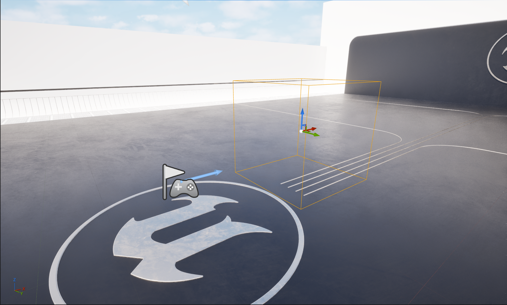

In the Details panel under Spawning, click the **What to Spawn** drop down and select **BP_Pickup**. Set Spawn Delay Range Low to `2` and set Spawn Delay Range High to `6` seconds. Drag-and-drop another SpawnVolume into the level. Press R to make it a longer rectangle. Click the **What to Spawn** drop down and select **Battery_BP**.


If you notice, this list includes only things that inherit from the base Pickup class. That is because we used the `TSubclassOf` template. We only have the Pickup, the BP_Pickup, the BatteryPickup, and Battery_BP. Let's make the Battery_BP spawn more quickly so you can see what happens when we have a faster Spawn Rate. Click Play. At this point you can see the base pickup, which doesn't have any physics, spawn in at different rotations. The batteries are spawning much more quickly. We were able to set 2 different types of pickups to our spawn volumes.


---

## Extending the Character Class

If you let the game run for a while, you end up with a big bunch of batteries that are doing no good. We will work on some of the collection code. The collection code is going to have 2 parts. Some of the code is going to be on the Pickup and some code is going to be on the Character. The pickups will decide how they respond to being collected. The Character will call the collection functions.

First, let's put our collected functions on our base pickup. Go to `Pickup.h`. Every pickup will respond to being collected, therefore all of the base code should go on the base pickup. It is going to be a public pickup function so that it can be called by our Character.

```cpp
/** Function to call when the pickup is collected */
UFUNCTION(BlueprintNativeEvent)
void WasCollected();
virtual void WasCollected_Implementation();
```

`BlueprintNativeEvents` have some behavior which is set up in code, and some behavior that can be set up in Blueprint. You don't have to set up Blueprint behavior. If you just set up code behavior, then only the code behavior will be called. You can override the behavior in Blueprints and either call back to the code implementation, or not. We need to make the implementation declaration because this is a `BlueprintNativeEvent`. The declaration is going to be `virtual` so it can be overridden by any child classes.

The naming scheme is our previous function name, `WasCollected_Implementation`. The `WasCollected_Implementation` function is what you will override in any child code classes. However, you will only ever call it as `WasCollected` so it can call both the code implementations and the Blueprint implementations with one function call.

```cpp
void APickup::WasCollected_Implementation()
{
    // Log a debug message
    FString PickupDebugString = GetName();
    UE_LOG(LogClass, Log, TEXT("You have collected %s"), *PickupDebugString);
}
```

For the base pickup, we are going to put together a debug string to say what you have collected. This helps with debugging. All pickups, including the boxes that stay in the sky, the batteries that rain down — if we created a power pickup later — will always print that you have collected them to the log.

Now, we will go to `BatteryPickup.h` and override `WasCollected_Implementation` with a little bit of extra behavior:

```cpp
UCLASS()
class BATTERYCOLLECTOR_API ABatteryPickup : public APickup
{
    GENERATED_BODY()

public:
    ABatteryPickup();

    /** Override the WasCollected function - use Implementation because it's a Blueprint Native Event */
    void WasCollected_Implementation() override;
};
```

Go to the `BatteryPickup.cpp` source file to override it:

```cpp
void ABatteryPickup::WasCollected_Implementation()
{
    // Use the base pickup behavior
    Super::WasCollected_Implementation();

    // Destroy the battery
    Destroy();
}
```

There are two things we want to do when a battery is collected. First, we want to use the base pickup behavior. To do that, we call the parent function using `Super`. Then, we want to destroy the battery. We didn't put the destruction on the base pickup because there may be some pickups that only deactivate for a short time and then reactivate, like a power-up. Destruction is not universally applicable, so we only put it on the battery.

### Adding the Collection Sphere

Go to `BatteryCollectorCharacter.h`. You can copy and paste the FollowCamera component as your template.

```cpp
/** Collection sphere */
UPROPERTY(VisibleAnywhere, BlueprintReadOnly, Category = "Pickups",
          meta = (AllowPrivateAccess = "true"))
USphereComponent* CollectionSphere;
```

Scroll down to the `FORCEINLINE` accessor functions. We will make another accessor function.

```cpp
/** Return CollectionSphere subobject **/
FORCEINLINE class USphereComponent* GetCollectionSphere() const { return CollectionSphere; }
```

Then go to the constructor in `BatteryCollectorCharacter.cpp`. Scroll down to the bottom and add:

```cpp
// Create the collection sphere
CollectionSphere = CreateDefaultSubobject<USphereComponent>(TEXT("CollectionSphere"));
CollectionSphere->SetupAttachment(RootComponent);
CollectionSphere->SetSphereRadius(200.f);
```

If you wanted to make a box or a capsule around the Character, you can certainly do that too. We are using the sphere because it can extend a large volume around the Character. The `CollectionSphere` was not set as the Root Component because the Character already has a Root Component. Instead, attach it to the Root Component. The sphere radius is set using a function that is on the Sphere Component. We set the sphere radius to `200` to get a balanced feeling at the end.

In the next section, you will actually write the collection function.

---

## Collecting Pickups

Now, we will create a function to collect all the pickups that we are currently overlapping with our Character. Go to the `BatteryCollectorCharacter.h` class header. This is going to be a **protected** function, since we only want to be able to call this function on our specific Character or any child classes.

```cpp
/** Called when we press a key to collect any pickups inside the CollectionSphere */
UFUNCTION(BlueprintCallable, Category = "Pickups")
void CollectPickups();
```

Make this function `BlueprintCallable` and put it in the Pickups category. This way, if you wanted to use `CollectPickups` in some other way in a Blueprint, then you could.

This function is going to be called when you press a key, as opposed to having the Character run over the pickups and automatically collect them. Save the header and go to the source file `BatteryCollectorCharacter.cpp`. We know we are going to have to use some of the Pickup classes, so include `Pickup.h`:

```cpp
#include "Pickup.h"
```

Scroll all the way down to the bottom:

```cpp
void ABatteryCollectorCharacter::CollectPickups()
{
    // Get all overlapping Actors and store them in an array
    TArray<AActor*> CollectedActors;
    CollectionSphere->GetOverlappingActors(CollectedActors);

    // For each actor we collected
    for (int32 iCollected = 0; iCollected < CollectedActors.Num(); ++iCollected)
    {
        // Cast the actor to APickup
        APickup* const TestPickup = Cast<APickup>(CollectedActors[iCollected]);

        // If the cast is successful and the pickup is valid and active
        if (TestPickup && IsValid(TestPickup) && TestPickup->IsActive())
        {
            // Call the pickup's WasCollected function
            TestPickup->WasCollected();

            // Check to see if the pickup is also a battery
            ABatteryPickup* const TestBattery = Cast<ABatteryPickup>(TestPickup);
            if (TestBattery)
            {
                // increase the collected power
                CollectedPower += TestBattery->GetPower();
            }

            // Deactivate the pickup
            TestPickup->SetActive(false);
        }
    }
}
```

First, get all overlapping Actors and store them in an array. Then, we are going to go through the array for each Actor we collected. We are going to cast the Actor to `APickup`. Basically, we are asking: did we overlap `APickup`? Or did we overlap the floor? If the cast is successful and the pickup is valid and active — if you remember the `IsActive` variable we wrote in the first section — we call the pickup's `WasCollected` function, then deactivate the pickup. This is so you can't spam Collection and get more benefits.

If you notice on `TestPickup`, we are calling `WasCollected`. We are not calling `WasCollected_Implementation` because that would just go to the code implementation. We want to capture any Blueprint script we might set up and any code that is defined.

### Input Binding

Go back to Unreal Editor and go to the folder `ThirdPerson/Input/Actions`. Right click, select **Input** and then **Input Action** to create a new Input Action. 

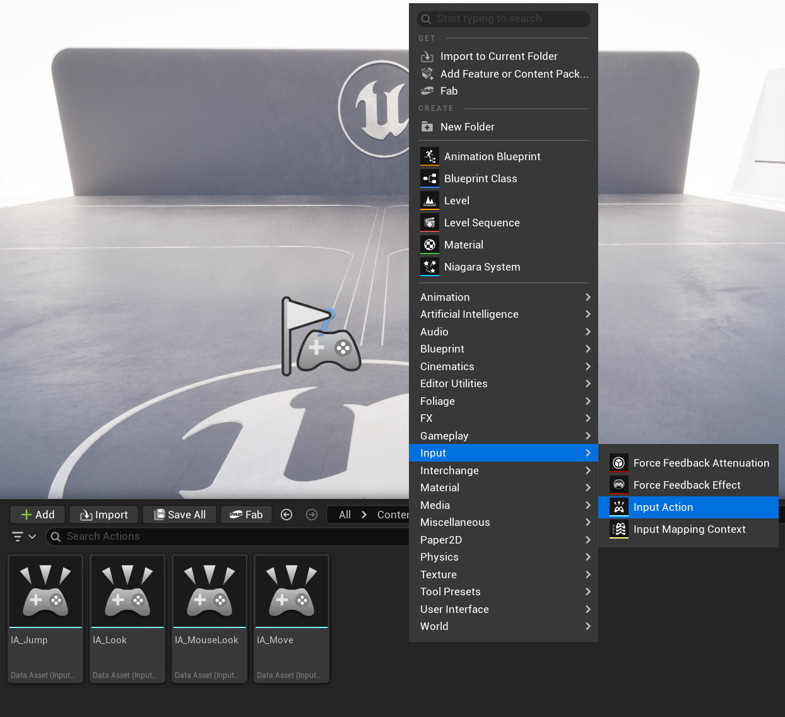

Name this Input Action **`IA_Collect`**.


Go back to the ThirdPerson folder and open **`IMC_Default`**.

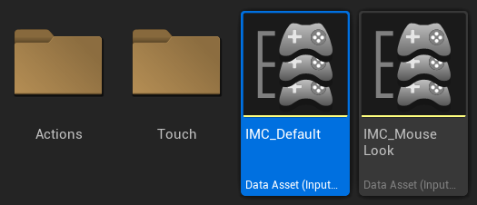

On the Mappings section, click on the plus sign to add a new Mapping.


Select **`IA_Collect`** as the new mapping.

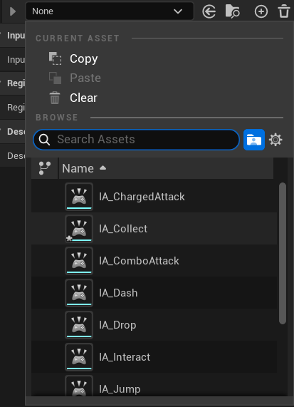

Set the **C key** for the Keyboard Mapping.


Now that we have the new Input Action setup and configured, go back to Visual Studio and open `BatteryCollectorCharacter.h`. Note that it already has declarations for the mapping context and the already setup input actions:

```cpp
/** MappingContext */
UPROPERTY(EditAnywhere, BlueprintReadOnly, Category = Input, meta = (AllowPrivateAccess = "true"))
class UInputMappingContext* DefaultMappingContext;

/** Jump Input Action */
UPROPERTY(EditAnywhere, BlueprintReadOnly, Category = Input, meta = (AllowPrivateAccess = "true"))
class UInputAction* JumpAction;

/** Move Input Action */
UPROPERTY(EditAnywhere, BlueprintReadOnly, Category = Input, meta = (AllowPrivateAccess = "true"))
class UInputAction* MoveAction;

/** Look Input Action */
UPROPERTY(EditAnywhere, BlueprintReadOnly, Category = Input, meta = (AllowPrivateAccess = "true"))
class UInputAction* LookAction;
```

Add a new input mapping for collecting the pickups:

```cpp
/** Collect Input Action */
UPROPERTY(EditAnywhere, BlueprintReadOnly, Category = Input, meta = (AllowPrivateAccess = "true"))
class UInputAction* CollectAction;
```

Now, open `BatteryCollectorCharacter.cpp`. In the `SetupPlayerInputComponent` function, add:

```cpp
EnhancedInputComponent->BindAction(CollectAction, ETriggerEvent::Triggered,
    this, &ABatteryCollectorCharacter::CollectPickups);
```

When it is pressed, call a function inside this Character class. It knows to look for some action event called Collect. Whenever that is called from whichever key we set up in the editor, then call `CollectPickups` on our Character class. Save this, switch back to the editor and compile.

Next, open **`BP_ThirdPersonCharacter`** and, on the Input section set `IA_Collect` as the **Collect Action**.

Open the log so you can see the log messages and click Play. You can see the pickups being spawned in. If you come over to the batteries and press **C**, they disappear. We said the battery pickup behavior was to print to the log and destroy the batteries. Meanwhile, the other pickups are only going to print the log message. They are not being destroyed, but they are inactive.

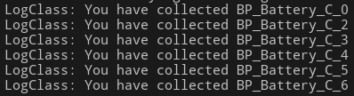

---

## Adding Power to the Game

In the last section, we set up the Collection function. We set up the Collection function with a test log string, so we can show it is working. For our gameplay, we want the Character to increase its power using the batteries in the level. That means we have to create a power variable on both the Battery Pickup and the Character.

### Battery Power Variable

Go to Battery header file `BatteryPickup.h`. We are going to have a protected variable with a public accessor function. This way you can only set the battery power if you are on the code class or on a Blueprint derived from that code class.

```cpp
protected:
    /** Set the amount of power the battery gives to the character */
    UPROPERTY(EditAnywhere, BlueprintReadWrite, Category = "Power",
              Meta = (BlueprintProtected = "true"))
    float BatteryPower;
```

This code uses a new piece of metadata: the meta for `BlueprintProtected`. We have made this variable protected in code, which means no other C++ classes can change `BatteryPower` unless they inherit from `BatteryPickup`. However, we need a separate flag to protect the variable in Blueprint so the only Blueprints that can change this variable are those that inherit from `BatteryPickup`.

Then we will make our accessor function so other classes, like our Character, can know what the battery power is:

```cpp
/** Public way to access the battery's power level */
float GetPower();
```

Go to the `BatteryPickup.cpp` source file:

```cpp
ABatteryPickup::ABatteryPickup()
{
    GetMesh()->SetSimulatePhysics(true);

    // the base power level of the battery
    BatteryPower = 150.f;
}

// report the power level of the battery
float ABatteryPickup::GetPower()
{
    return BatteryPower;
}
```

`BatteryPower` is set to `150`. We will definitely tweak this value during our polish pass later, but 150 is a nice number to start with. Let's compile and check it out on our battery. Press **CTRL+ALT+F11**. Once the Editor has finished compiling, double-click to open `Battery_BP`.


Under the Power category, we have Battery Power which is set to the default of 150. You can easily override it and make the Battery Power 200. Click Compile. Click Save.


### Character Power Variables

Now that we have seen the power level work on our battery, let's add it to the Character. Select `BatteryCollectorCharacter.h` in the Solution Explorer. Our Character is going to have 2 power variables: one for the **initial power level**, and another for the **current power level**. The `InitialPower` is going to be protected so that we can override it in a Blueprint or in a subclass. The `CharacterPower` or current power level is going to be private, so no other class or default can change the value without going through our code.

```cpp
protected:
    /** The starting power level of our character */
    UPROPERTY(EditAnywhere, BlueprintReadWrite, Category = "Power",
              Meta = (BlueprintProtected = "true"))
    float InitialPower;

private:
    /** Current power level of our character */
    UPROPERTY(VisibleAnywhere, Category = "Power")
    float CharacterPower;
```

`CharacterPower` is not going to be `EditAnywhere`. It is going to be `VisibleAnywhere` so we can take a look at it to debug as we go. Now, let's go into the constructor and set defaults. Go to the bottom of the constructor:

```cpp
// set a base power level for the character
InitialPower = 2000.f;
CharacterPower = InitialPower;
```

We set `InitialPower` to `2000`. If you think about it the battery is about 150-200, so you have to collect a number of batteries. We are also going to have the power level drain, so you won't pick up 10 batteries and double your power. Also in the constructor, we say when the Character is created, the `CharacterPower` level is set to the `InitialPower` level.

Now, we will create the public getters. We have the protected and private power variables, but we want other classes to at least be able to reach out to the Character and ask what those power levels are.

```cpp
/** Accessor function for initial power */
UFUNCTION(BlueprintPure, Category = "Power")
float GetInitialPower();

/** Accessor function for current power */
UFUNCTION(BlueprintPure, Category = "Power")
float GetCurrentPower();
```

These are both `BlueprintPure` functions, which means they are not going to have execution pins because they do not actually change anything. These functions are just returning the current value of the `InitialPower` and `CharacterPower`.

The function to update the character's power is going to be a little bit more complicated. It is going to have a parameter. It is going to be a void function called `UpdatePower`. The `PowerChange` can be either positive or negative.

```cpp
/**
 * Function to update the character's power
 * @param PowerChange This is the amount to change the power by, and it can be positive or negative.
 */
UFUNCTION(BlueprintCallable, Category = "Power")
void UpdatePower(float PowerChange);
```

The reason this is `BlueprintCallable` and not `BlueprintPure` is it is actually having an effect on your Character's power. You want to directly execute it, so you want it to have that execution pin. Go back to the `BatteryCollectorCharacter.cpp` source file:

```cpp
// Reports starting power
float ABatteryCollectorCharacter::GetInitialPower()
{
    return InitialPower;
}

// Reports current power
float ABatteryCollectorCharacter::GetCurrentPower()
{
    return CharacterPower;
}

// Called whenever power is increased or decreased
void ABatteryCollectorCharacter::UpdatePower(float PowerChange)
{
    CharacterPower = CharacterPower + PowerChange;
}
```

Press **CTRL+ALT+F11**. After the compile is complete, open `BP_ThirdPersonCharacter` and search **"power"** in the Details panel. We can see both Initial Power and Character Power.

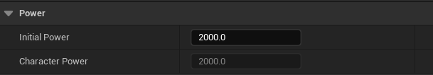

We are not able to change Character Power, but we can change Initial Power. In the next section, we will start actually using the `UpdatePower` function.

---

## Powering Up the Character

In the last section, we wrote the `UpdatePower` function which allows the character's power level to be updated. In this section, we will use `UpdatePower` to add the power of each collected battery to our character's power level.

If you remember, we wrote the `CollectPickups` function on our `BatteryCollectorCharacter`. Since we are already working on collecting the pickups, this is where we should process pickups to find out if they are batteries. If they are batteries, get their power level and add it to our character's power level. The full `CollectPickups` function already reflects this — note the cast to `ABatteryPickup` and the `CollectedPower` accumulation (refer to the code in the **Collecting Pickups** section above).

Switch back to the editor. Go to the Level Editor and compile. Click Play. Then, before clicking in the Editor Window, select `BP_ThirdPersonCharacter` in the Outliner. Power is in the Details panel. You can see Initial Power is `2000`. The current Character Power is `2000`. When you start collecting batteries, the Character Power increases. The batteries are being collected, so your total power is increasing.


In the next section, you will work with the GameMode so we can start draining the character's power over time.

---

## Powering Down the Character

In the last section, you used the `UpdatePower` function to increase the character's power as we collected batteries. Now, you are going to call the `UpdatePower` function from the **GameMode** to decrease the character's power over time.

Go back to Visual Studio. Select the `BatteryCollectorGameMode.h` header file. We are going to create a **decay rate**. This is the rate by which our character's power will decrease over time. We will make this protected so we can only change it from the GameMode or GameMode inherited classes.

```cpp
UCLASS(minimalapi)
class ABatteryCollectorGameMode : public AGameModeBase
{
    GENERATED_BODY()

public:
    ABatteryCollectorGameMode();

protected:
    /** The rate at which the character loses power */
    UPROPERTY(EditDefaultsOnly, BlueprintReadWrite, Category = "Power",
              Meta = (BlueprintProtected = true))
    float DecayRate;
};
```

We are doing this in the GameMode rather than the Character or another class because the **GameMode sets the rules of the game**. One of the rules is how fast the character loses power. `EditDefaultsOnly` is a little different than `EditAnywhere`, which you have been using so far. The `EditDefaultsOnly` keyword means that you can't change a property on every instance of the class, just on the base class itself. We also made it `BlueprintReadWrite` so we could increase or decrease the decay rates systematically in our Blueprint. Now, set a starting value for the `DecayRate` in the constructor:

```cpp
// base decay rate
DecayRate = 0.01f;
```

We will start by setting this to something slow so we can test it out. This is one of those tweakable values we have exposed so gameplay designers could easily manipulate it within the editor.

Now, we are going to decrease the character's power on Tick. We are doing this on Tick so we can incorporate **delta time** and avoid having the battery life decay depend on frame rate. Go to `BatteryCollectorGameMode.h`:

```cpp
virtual void Tick(float DeltaTime) override;
```

Go to `BatteryCollectorGameMode.cpp` to start implementing the function. We need to include `Kismet/GameplayStatics.h`:

```cpp
#include <Kismet/GameplayStatics.h>
```

```cpp
void ABatteryCollectorGameMode::Tick(float DeltaTime)
{
    Super::Tick(DeltaTime);

    // Check that we are using the battery collector character
    ABatteryCollectorCharacter* MyCharacter = Cast<ABatteryCollectorCharacter>(
        UGameplayStatics::GetPlayerPawn(this, 0));

    if (MyCharacter)
    {
        // if the character's power is positive
        if (MyCharacter->GetCurrentPower() > 0)
        {
            // decrease the character's power using the decay rate
            MyCharacter->UpdatePower(-DeltaTime * DecayRate * (MyCharacter->GetInitialPower()));
        }
    }
}
```

We are taking Delta Time into account in case frame rate changes our `DecayRate`. In order for the Game Mode to Tick, you have to add the following code inside its constructor:

```cpp
PrimaryActorTick.bCanEverTick = true;
```

At this point, you can compile. Let's see how this looks on the character's power level. Go to the editor and click Compile. After finished compiling, click Play. Scroll down in the World Outliner and select ThirdPersonCharacter. You can see the Character Power is automatically decreasing just a little bit on every frame. If you collect batteries, the Character Power will increase by the amount of power provided by the batteries. Now, you have both forces on the character's power. In the next section, we are going to set up some visual effects.

---

## Change Character Speed and Material

In the past few sections, you have been able to check the character's power level by looking in the Details panel. To make the change easier to see and to give some gameplay feel, we are going to do some visual effects and change the character's speed as his power changes. We need to go to the Character class in the code. We are going to create some properties for the character's speed dependence on his power level. These properties are going to be protected.

```cpp
/** Multiplier for character speed */
UPROPERTY(EditAnywhere, BlueprintReadWrite, Category = "Power",
          Meta = (BlueprintProtected = "true"))
float SpeedFactor;

/** Speed when power level = 0 */
UPROPERTY(EditAnywhere, BlueprintReadWrite, Category = "Power",
          Meta = (BlueprintProtected = "true"))
float BaseSpeed;
```

All of these have the meta keyword for `BlueprintProtected`. This is so our GameMode Blueprint can't reach in and change the values for `InitialPower`, `SpeedFactor`, or `BaseSpeed`. Now that you have the properties, set baseline values in the constructor, right underneath setting up the `InitialPower`:

```cpp
// set the dependence of the speed on the power level
SpeedFactor = 0.75f;
BaseSpeed = 10.f;
```

Now that those values are set, we can start manipulating the character's speed based on `CharacterPower`. We are going to do that in the `UpdatePower` function:

```cpp
// Called whenever power is increased or decreased
void ABatteryCollectorCharacter::UpdatePower(float PowerChange)
{
    // change power
    CharacterPower = CharacterPower + PowerChange;

    // change speed based on power
    GetCharacterMovement()->MaxWalkSpeed = BaseSpeed + SpeedFactor * CharacterPower;

    // call visual effect
    PowerChangeEffect();
}
```

By including `SpeedChange`, our speed will also change every time the power is increased or decreased. The `CharacterMovementComponent` is included on all Characters. Our `BatteryCollectorCharacter` inherits from the Character base class, so it has the `CharacterMovementComponent` which allows it to run, jump, and do all the bipedal movement that is already set up. You want to change the `MaxWalkSpeed` variable to `BaseSpeed` because `BaseSpeed` is what happens when the power level is 0. It is important to have them in this order — first change the power, then change the speed based on power — otherwise we are setting the character movement to be based on previous speed.

We are also going to change the Material in Blueprints because it is a little bit more straightforward that way. However, we want to know it gets called every time `UpdatePower` is called. We are going to do that with a **Blueprint-implementable Event**:

```cpp
UFUNCTION(BlueprintImplementableEvent, Category = "Power")
void PowerChangeEffect();
```

The `BlueprintImplementableEvent` keyword means we don't have to define the function in code at all. We call the function and let the Blueprints worry about the behavior that is going to be attached to that event. Everything else is left up to the person creating the Blueprint.

Go to Unreal Engine and Compile. Double-click to open `BP_ThirdPersonCharacter`. You can see the **Skeletal Mesh Asset** already has a **Material** on it at **Element 0**. Double-click the icon to open the Material Editor. The Material has a **Paint Tint** parameter already on it.


**Construction Script setup:**

1. Drag-and-drop **Mesh** into the graph → drag off Mesh → **Get Materials**
2. Drag off the Return Value → **Get** (index 0)
3. Drag off Mesh → **Create Dynamic Material Instance** → connect index 0 to Source Material
4. Right-click on the Return Value → **Promote to Variable** → name it **"PowerMaterial"**


**Event Graph setup:**

1. Right-click → type "power" → select **Event Power Change Effect**


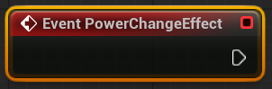

2. Drag-and-drop **PowerMaterial** into the graph → drag off → **Set Vector Parameter Value**

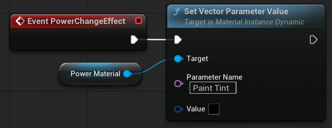

3. Parameter Name: **"Paint Tint"**

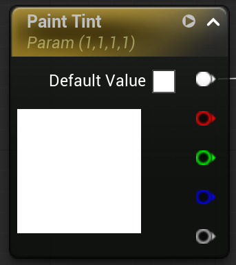

4. Plug `Event Power Change Effect` into `Set Vector Parameter Value`
5. Right-click → **Get Current Power** and **Get Initial Power**
6. Divide: `Get Current Power / Get Initial Power`


7. **Clamp (float)** with Min `0` and Max `1`

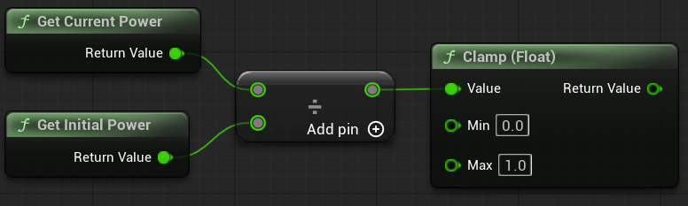

8. **Lerp (LinearColor)**: plug Clamp into Alpha, Return Value into Set Vector Parameter Value
   - Color A: **teal** (low power)
   - Color B: **orange** (high power)


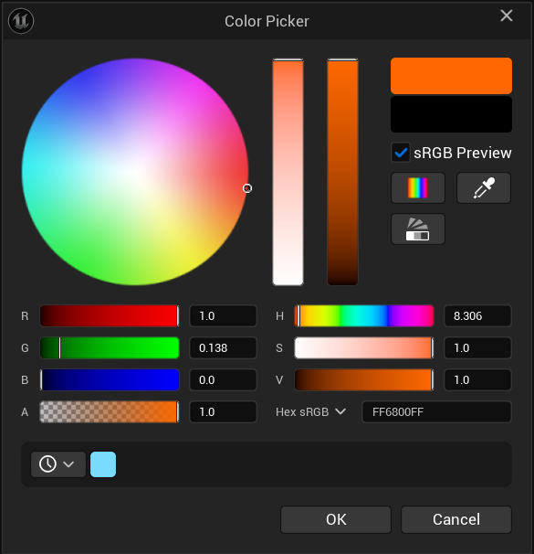


Click Compile and click Save. Let's test this. Go to CollectionLevel. Click Play. Your character is light yellow color because you have a fairly high power level. If you wait for a moment, the power level will decrease and the color should start turning more grey. It should also be moving a little bit slower. If you collect more batteries, it will go back to yellow. In the next section, we will do some more visual effects with batteries and some lightning.

---

## Creating the Particle System

In the previous section, we set up some visual effects like the Character's speed and changing his color. In this section, we are going to work on the batteries to make them shoot electricity between them and the Character when they are collected.

The first step will consist in creating our particle system using **Niagara**. Then, we will setup our battery blueprint to spawn the electric arc between its static mesh and the player when it gets collected.

### Material Setup

On the Content Drawer create a new folder named **Materials**. Then, inside the Materials folder, right-click on the Content Drawer and select **Material**.


Name this Material **`M_ElectricArc`**.

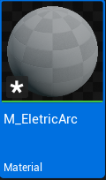

Set the **Shading Model** to **Unlit**.


Drag off from the **Emissive Color** pin and type **Particle Color**.


Select one of the Particle Color options.

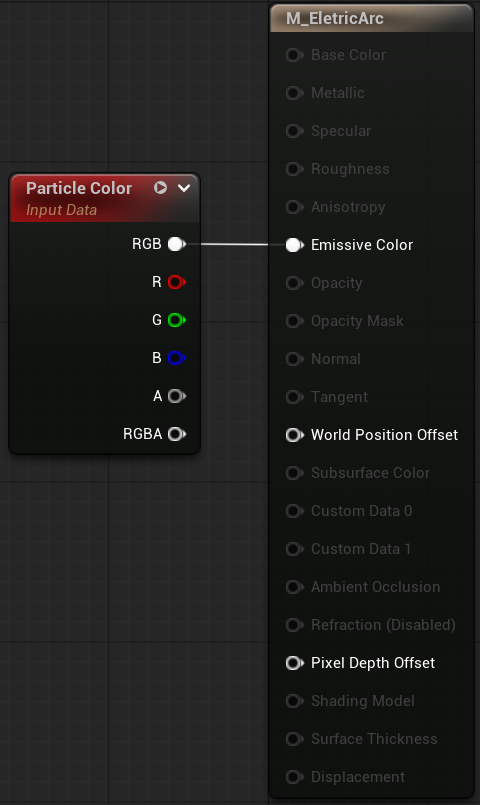

Save the Material.

### Niagara System

On the Content Drawer create a folder named **FX**. Inside that folder, right-click and select **FX → Niagara System**.

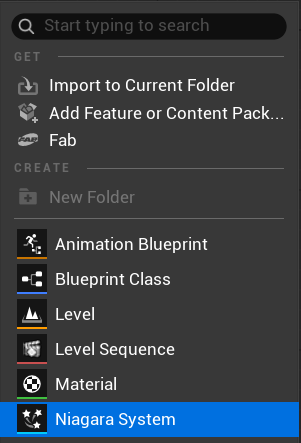

Select **Select an emitter or system as a base** and click Next. Select **Static Beam** — the static beam will allow us to modify the position of each particle constituting the beam during the particle spawn. Press the **Create** button.


Name this Niagara System **`P_ElectricArcs`**.


Open the `P_ElectricArcs` particle system. On the Parameters panel, expand the **Emitter Attributes** and create a new float attribute. Name this **`LifeTime`**.

This will set the lifetime of each particle within the particle system. Drag this attribute to the **Emitter Update** section, above the Emitter State. This will create a new item named **Set: EMITTER LifeTime**. Set the parameter type to **Random Range Float**. Set the Minimum and Maximum values to `0.1` and `0.15`.

Select **Emitter State** on the Static Beam node and drag the LifeTime parameter onto **Loop Duration**. Then, check **Recalculate Duration each Loop**, so that at each repetition, a new lifetime value should be used.

Select **Initialize Particle** on the Particle Spawn section. Drag the LifeTime attribute into the **LifeTime point attribute**. Enable the **Color point attribute** and set the color to a blueish color. Then, set **v to 50**.

Delete the Color on the Particle Update section. This way, the spawned particles will not have their colors changing. Finally, select **Ribbon Renderer** on the Render section and set the **Material** to `M_ElectricArc` and press the Save button.

Select **Beam Emitter Setup**. Notice that you have a **Beam End** attribute. Let's make this attribute user exposed so we can set this value through Blueprints. To do so, create a **User Exposed** attribute of the type **Vector** and name it **`Beam End`**. Drag this attribute into the **Beam End**. Check **Absolute Beam End**, so you can use world positions.

On the **Spawn Burst Instantaneous**, set the **Spawn Count** to `25`. On the **Beam Width**, change its type to **Random Range Float** and set its Minimum and Maximum values to `1` and `5`.

Click Save. Notice that you cannot see the beam because the Beam End is not being set. On the `P_ElectricArcs` node, select **User Parameters**. Then, on the left panel set `X = 200`, and `Z = 100`. Now, you can see the beam.

Click the plus sign on the Particle Spawn section and select **Shape Location**. Set the **Sphere Radius** to `10`. Select the **Ribbon Renderer** and set the **Curve Tension** to `0.8`. Press Save.

---

## Adding Particles to the Pickup

If you remember when we first created the battery pickups, we created a Blueprint Native Event called `WasCollected`. Since this is a `Blueprint Native Event`, we can set up some behavior in code, like destroying the battery. Then, we are going to set up some behavior which can be called in Blueprints.

Go to the editor. Select the Blueprints folder in the Content Browser. Double-click to open `Battery_BP`. Click **Open Full Blueprint Editor**. Right-click in the graph, type **"Was Collected"** and select the **Was Collected Event** in the context menu.

We are going to spawn an emitter based on this. Right-click in the graph, type **"spawn emitter"** and select **Spawn System Attached**.

Connect **Event Was Collected** to **Spawn System Attached**. When `WasCollected` is called in our Character's collection function, it will look for this Blueprint event first. Then, it will fire the event. When we add a call to the parent, it will reach back and call any code we have set up. Click the **Emitter Template** drop down menu and select **`P_ElectricArcs`**. We are going to Attach to Component **PickupMesh**. In the Components tab, drag-and-drop PickupMesh on top of the **Attach to Component** pin. This will automatically connect the wires.

We need one end of the electricity on the Character, so let's get our Character. Right-click → type **"get player"** → select **"Get Player Character"**. Drag off the Return Value → type and select **"Get Mesh"**.

We need to get the Skeletal Mesh from Get Player Character. We are going to get a socket so the electricity will connect to a particular bone on the Skeletal Mesh's skeleton. Drag off Mesh → type and select **"Get Socket Location"**.

To find the right socket, open `BP_ThirdPersonCharacter`. Select **Mesh** from the Components tab. In the Details panel, double-click to open the Skeletal Mesh. Click on the **Skeleton** editing mode in the top right. On the left side, there is a list of all the sockets. We will use a socket in the chest. Select **spine_02**. Right-click spine_02 and select **Copy Selected Bone Names**. Right-click in **Socket Name** and select Paste.

Drag off the **Spawn Emitter Attached** Return Value → type and select **"Set Vector Parameter"**. On the **Parameter Name** type **"User.BeamEnd"**. Connect the **Get Socket Location Return Value** into **Param**. It will always target our character's chest.

Once that is done, we want the Beam Target Point to update frequently. If the Character is running around, the electricity will follow the character. We need a **Sequence** node. Drag off the Set Vector Parameter output → type and select **"Sequence"**. A Sequence node is nice because you could wire everything up together in one long row. First, we are going to add a **Delay** node. Drag off **Then 0** → type and select **"Delay"**. We are going to use a Delay and not a Retriggerable Delay because if Beam Target Point gets called again, we don't want it to restart the Delay. Set the **Duration** to `1` second. When that is done, we are going to call the parent which will destroy the battery. Right-click Event Was Collected and select **"Add call to parent function"**. Drag the node over to the right. Connect the **Delay Completed** output to **Parent Was Collected**.

Then, we want another Delay node. Copy and paste the Delay node. Set the **Duration** to `0.1` seconds. After we execute a delay and call the parent, we will loop back through and keep updating our Beam Target Point. Connect **Then 1** to the new Delay node. Connect the **Delay Completed** output to **Set Beam Target Point**.

The execution of the graph will be: an emitter is spawned and it will set the Target Point as our character's spine. It will delay for 1 second, and then call the parent function and destroy the battery. Then, it will keep delaying, and reset the Beam Target Point to follow the character around. Click Compile and click Save.

Select the CollectionLevel tab. Click Play. The batteries are spawning in. If you collect the batteries, they are spawning electricity that will follow the character around. You will tweak the size of the lightning in the polish section of the assignment.

---

## Enabling UMG

In the last section, we set up our batteries to shoot electricity between themselves and the character when they are picked up. We are going to add another visual element now. We are going to work towards a HUD that will display our character's current power, as well as the power needed to win the game. This is building towards a win state, a lose state, and the general playing state in the game.

Open Visual Studio and go to the `BatteryCollectorGameMode.h`. You are going to set up a power to win variable. If we have a bar to display how much power we need, then we need to know the maximum of the bar to win the game. This is going to be a **protected** variable.

```cpp
/** The power needed to win the game */
UPROPERTY(EditDefaultsOnly, BlueprintReadWrite, Category = "Power",
          Meta = (BlueprintProtected = true))
float PowerToWin;
```

Again, this is on the GameMode because that is where the rules of the game should go, including how to win the game. We are going to make a public function to return what the `PowerToWin` is because this is needed by the HUD.

```cpp
/** Returns the power needed to win - needed for the HUD */
UFUNCTION(BlueprintPure, Category = "Power")
float GetPowerToWin() const;
```

It is a constant because it is not going to change anything about the power, it is just going to return the value. It is going to be a `UFUNCTION()` so we can call it in our Blueprint. Now, implement `GetPowerToWin()` on the source file:

```cpp
float ABatteryCollectorGameMode::GetPowerToWin() const
{
    return PowerToWin;
}
```

We are going to set `PowerToWin` in `BeginPlay()`. We can't set `PowerToWin` in the constructor because our GameMode may not necessarily be constructed after our Character is constructed. We need to base the `PowerToWin` on the Character's `InitialPower`. We are going to do it in `BeginPlay()` because that means everything will already be spawned and registered.

```cpp
virtual void BeginPlay() override;
```

```cpp
void ABatteryCollectorGameMode::BeginPlay()
{
    Super::BeginPlay();

    // set score to beat
    ABatteryCollectorCharacter* MyCharacter = Cast<ABatteryCollectorCharacter>(
        UGameplayStatics::GetPlayerPawn(this, 0));
    if (MyCharacter)
    {
        PowerToWin = (MyCharacter->GetInitialPower()) * 1.25f;
    }
}
```

We will call the parent `BeginPlay()` in case anything happens on the GameMode that we need to make sure still gets called. To test, we are going to multiply and say you need at least **1.25 times your Initial Power** to win the game.

### UMG Dependencies

Before we start making the HUD, we need to change some of the dependencies in our build file. Go to the Solution Explorer and select **`BatteryCollector.Build.cs`**. Add `UMG` to the public dependencies, and add Slate modules as private dependencies:

```csharp
PublicDependencyModuleNames.AddRange(new string[] {
    "Core", "CoreUObject", "Engine", "InputCore",
    "HeadMountedDisplay", "UMG"
});

PrivateDependencyModuleNames.AddRange(new string[] { "Slate", "SlateCore" });
```

UMG requires some of these Slate modules.

### HUD Widget Variables

Go to `BatteryCollectorGameMode.h`:

```cpp
/** The Widget class to use for our HUD screen */
UPROPERTY(EditDefaultsOnly, BlueprintReadWrite, Category = "Power",
          Meta = (BlueprintProtected = true))
TSubclassOf<class UUserWidget> HUDWidgetClass;

/** The instance of the HUD */
UPROPERTY()
class UUserWidget* CurrentWidget;
```

We use a forward declaration because we don't necessarily need to work with the widget yet. The `TSubclassOf` is similar to the `UCLASS()`, but it is restricted to only things which inherit from `UUserWidget`. `CurrentWidget` is marked as a regular `UPROPERTY()` so it is handled properly with garbage collection.

Now, in `BeginPlay()`, after we have set `PowerToWin`, set the widget to use:

```cpp
if (HUDWidgetClass != nullptr)
{
    CurrentWidget = CreateWidget<UUserWidget>(GetWorld(), HUDWidgetClass);
    if (CurrentWidget != nullptr)
    {
        CurrentWidget->AddToViewport();
    }
}
```

You have to include `UserWidget.h` at the top:

```cpp
#include <Blueprint/UserWidget.h>
```

Compile to check that everything is OK. We will go into **UMG UI Designer** in the next section and lay out our UI with our power bar.

---

## Creating the HUD Blueprint

On Unreal Editor, inside Content Drawer, go to the Blueprints folder. Right-click in the Content Drawer, go to **User Interface**, and select **Widget Blueprint**. Select **User Widget**. Call this Blueprint **"BatteryHUD"**. Double-click to open BatteryHUD.

We need a progress bar. In the Palette, drag-and-drop a **Canvas Panel** into the graph. Then, drag a **Progress Bar** into the canvas panel. Click the **Anchors** drop down menu and select the **bottom center**. Set Position X to `0`. Set Position Y to `-100`. Set Size X to `600`. Set Alignment X to `0.5`. This means half of the bar is on the left and half of the bar is on the right.

To set the Percent, we are going to create a binding. Under Progress, go to **Percent** and click the **Bind** drop down. Select **+Create Binding**.

We want the progress bar to be some percentage of the Player Character's Current Power over the GameMode's PowerToWin. Right-click → type and select **"Get Player Character"**. Drag off the Return Value → type "battery" → select **Cast To BatteryCollectorCharacter**. Right-click and select **Convert to pure cast**.

Right-click → type and select **"Get GameMode"**. Drag off Return Value → type "battery" → select **Cast To BatteryCollectorGameMode**. Right-click and select **Convert to pure cast**.

Drag off **As Battery Collector Character** → type "get power" → select **Get Current Power**. Drag off **As Battery Collector GameMode** → type "get power" → select **Get Power To Win**. Divide: drag off Get Current Power Return Value → type `/` → select **float / float**. Plug in **Initial Power** and **Current Power**. Plug the result into the **Return Value** of the Return Node.

Click Compile and click Save.

We need to create a GameMode Blueprint. Go to CollectionLevel. Right-click in the Content Browser and select **Blueprint Class**. Click the drop down → type "battery" → select **BatteryCollectorGameMode**. Name this **"GameMode_BP"**. Double-click to open it. Click the **HUDWidget Class** drop down and select **BatteryHUD**. Click Compile and click Save.

Now, we have to tell CollectionLevel to use the GameMode_BP as our default GameMode. In the main toolbar, click **Edit** and select **Project Settings**. Go to **Maps & Modes**. Click the **Default GameMode** drop down menu and select **GameMode_BP**.

Click Play. We have our progress bar, which you can see ticking down because the GameMode is draining our power. If you collect some batteries, it will fill up the progress bar. In the next section, we are going to start working on the game over and game won states.

---

## Setting Up the Play States

Previously, we set up a power bar so we can see how much power our Character needs to win. Now, we need to set up some code to show what winning and losing really means. We are going to make an **enum** to store the current playing state: playing, game over, or the game has been won. Then, we can start using this state to determine other Blueprint and C++ behavior. Let's go back to our GameMode code. In the `BatteryCollectorGameMode.h` header file, we are going to make a custom enum to store the state of your game. The enum will be above `UCLASS()` in our header file.

```cpp
// enum to store the current state of gameplay
UENUM(BlueprintType)
enum class EBatteryPlayState : uint8
{
    EPlaying,
    EGameOver,
    EWon,
    EUnknown
};
```

We use a macro similar to the `UCLASS()`, `UPROPERTY()` and `UFUNCTION()` macros we used previously. This macro is of the Blueprint type which will allow us to use it later in our HUD_BP. Our 4 states will be `EPlaying`, `EGameOver`, `EWon`, and `EUnknown`. Use the prefix **E** for the naming scheme. `EUnknown` is a default state to handle if things aren't set.

After we have defined the `EBatteryPlayState`, we need a variable to store it. We are going to make the variable **private** because we don't want to be able to change it in any other class. We only want to be able to change it within the code of our GameMode.

```cpp
private:
    /** Keeps track of the current playing state */
    EBatteryPlayState CurrentState;
```

This variable is private, but we want to still read it from our HUD or communicate with the GameMode to set the variable, so we can make public getter and setter functions.

```cpp
/** Returns the current playing state */
UFUNCTION(BlueprintPure, Category = "Power")
EBatteryPlayState GetCurrentState() const;

/** Sets a new playing state */
void SetCurrentState(EBatteryPlayState NewState);
```

You are going to set the state in code only. If you want to change the GameState from a Blueprint, such as in a main menu, you can add a `UFUNCTION()` macro here. Now, make the getter and setter function bodies in `BatteryCollectorGameMode.cpp`:

```cpp
EBatteryPlayState ABatteryCollectorGameMode::GetCurrentState() const
{
    return CurrentState;
}

void ABatteryCollectorGameMode::SetCurrentState(EBatteryPlayState NewState)
{
    CurrentState = NewState;
}
```

You will do more handling of the new play state in the future. For right now, if this function is called, it just changes the current state to the new state that has been requested. When should the GameMode switch to `EPlaying` as a state? On Begin Play. We should make sure to switch the GameState before we do anything else.

```cpp
void ABatteryCollectorGameMode::BeginPlay()
{
    Super::BeginPlay();
    SetCurrentState(EBatteryPlayState::EPlaying);

    // set score to beat
    ABatteryCollectorCharacter* MyCharacter = Cast<ABatteryCollectorCharacter>(
        UGameplayStatics::GetPlayerPawn(this, 0));
    if (MyCharacter)
    {
        PowerToWin = (MyCharacter->GetInitialPower()) * 1.25f;
    }

    if (HUDWidgetClass != nullptr)
    {
        CurrentWidget = CreateWidget<UUserWidget>(GetWorld(), HUDWidgetClass);
        if (CurrentWidget != nullptr)
        {
            CurrentWidget->AddToViewport();
        }
    }
}
```

We want to add whether or not we are in the `EPlaying` state in our `Tick()` function, where we are checking whether or not the CurrentPower level is positive. We don't want to decrease `CurrentPower` if we have already won or lost the game. Let's add some more conditional statements.

```cpp
void ABatteryCollectorGameMode::Tick(float DeltaTime)
{
    Super::Tick(DeltaTime);

    ABatteryCollectorCharacter* MyCharacter = Cast<ABatteryCollectorCharacter>(
        UGameplayStatics::GetPlayerPawn(this, 0));

    if (MyCharacter)
    {
        // If our power is greater than needed to win, set the game's state to Won
        if (MyCharacter->GetCurrentPower() > PowerToWin)
        {
            SetCurrentState(EBatteryPlayState::EWon);
        }
        // if the character's power is positive
        else if (MyCharacter->GetCurrentPower() > 0)
        {
            // decrease the character's power using the decay rate
            MyCharacter->UpdatePower(-DeltaTime * DecayRate * (MyCharacter->GetInitialPower()));
        }
        else
        {
            SetCurrentState(EBatteryPlayState::EGameOver);
        }
    }
}
```

We have 3 states. The game is `EWon` when `CurrentPower` is greater than the `PowerToWin`. If `CurrentPower` is positive, but not greater than the `PowerToWin`, we can start decreasing and decaying `CurrentPower`. If the power is negative, then we will set the state to `EGameOver`. Let's find a way to display the states within our HUD.

Go back to the editor and click Compile. In the Content Browser, go to the Blueprints folder and double-click to open **BatteryHUD**. Select the Designer tab. Put a Text box at the top. In the Palette, drag-and-drop **Text** into the graph. Click the **Anchors** drop down menu and select the **top** of the screen. Set Position X to `0`. Set Position Y to `50`. Check **Size To Content**. Under Alignment, Set X to `0.5` so that it is centered on the screen.

Click the **Bind** drop down menu and select **+Create Binding**. Right-click → type and select **"Get Game Mode"**. Drag off Return Value → type "cast" → select **Cast To BatteryCollectorGameMode**. Connect Get Text 0 to Cast To BatteryCollectorGameMode. Plug the execution output into the Return Node. Drag off **As Battery Collector Game Mode** → type "get state" → select **Get Current State**. Drag off the Return Value enum pin → type "select" → under Struct, click the **Select** node. Connect the Return Value to the Return Value on the Return Node.

For each state, enter the following text:

| State | Text |
|---|---|
| EPlaying | `Press C to collect batteries` |
| EGameOver | `Game Over!` |
| EWon | `You Win!` |

Click Compile and click Save. Go to CollectionLevel. Click Play. You can see at the top it says **"Press C to collect batteries"**. You can see as you collect all the batteries, when you fill up the bar completely, it says **"You Win!"** If you restart the level, and drain the power it says **"Game Over!"** when you lose.

---

## Toggling the Spawn Volumes

Previously, you set up text to display on the screen when the game was playing, when the player won, or when the game is over. There are a few other things we want to have happen for our different playing states. All states have the HUD text, which is all set up and ready for us. We want to have some things happen with the spawn volume:

- **Playing:** spawn volumes are spawning pickups
- **Won:** spawn volumes stop spawning pickups
- **Game Over:** spawn volumes stop spawning pickups, the character collapses, player can no longer input

Throughout this section, we are going to start working with the Spawn Volume class so we can have it work with our new play states. This will include adding a new function to the SpawnVolume class and registering all the spawn volumes in the level with the GameMode. First, go to `SpawnVolume.h` header file. We are going to create a new function to toggle spawning on and off.

```cpp
/** This function toggles whether or not the spawn volume spawns pickups */
UFUNCTION(BlueprintCallable, Category = "Spawning")
void SetSpawningActive(bool bShouldSpawn);
```

This will be a **public** function because we want other classes, like the GameMode, to be able to reach in and access this function. It takes a Boolean for whether or not the spawning volumes should spawn. Make this a `BlueprintCallable` function. This way, at some point in your Blueprint, if you wanted to call whether or not the spawn volume should spawn, you can do that. Go to the `SpawnVolume.cpp` source file. Put the function body above our `SpawnPickup()`:

```cpp
void ASpawnVolume::SetSpawningActive(bool bShouldSpawn)
{
    if (bShouldSpawn)
    {
        // Set the timer on Spawn Pickup
        SpawnDelay = FMath::FRandRange(SpawnDelayRangeLow, SpawnDelayRangeHigh);
        GetWorldTimerManager().SetTimer(SpawnTimer, this,
            &ASpawnVolume::SpawnPickup, SpawnDelay, false);
    }
    else
    {
        // Clear the timer on Spawn Pickup
        GetWorldTimerManager().ClearTimer(SpawnTimer);
    }
}
```

If you remember from earlier, you set up a timer in `BeginPlay()` to determine whether or not our `SpawnPickup` function should be called. Use that same code in `SetSpawningActive`. This will toggle based on the Boolean `bShouldSpawn`. Otherwise if `bShouldSpawn` is false, clear the timer on Spawn Pickup. This means the Spawn Pickup function would no longer be called on a regular interval.

Cut and remove these lines from `BeginPlay()` because we only want the spawn volume to start spawning after the `SetSpawningActive` function has been called. Completely remove this functionality from `BeginPlay()`.

```cpp
// Called when the game starts or when spawned
void ASpawnVolume::BeginPlay()
{
    Super::BeginPlay();
}
```

We are no longer setting the initial timer on BeginPlay because we don't want the spawn volume to start spawning until we call `SetSpawningActive`. We are only going to call `SetSpawningActive` from the GameMode. Open the editor and click Compile. Then, play the game. You will notice your spawn volumes are not spawning your regular pickup, nor the battery pickup because you never called the `SetSpawningActive(true)` function.

### Registering Spawn Volumes in the GameMode

We are going to register all the spawn volumes in the level. You could place 3 or 4 spawn volumes, and they would spawn pickups as long as you set their `WhatToSpawn` variable. We want all of the spawn volumes to be tracked by the GameMode so they can be turned on and off during gameplay. Open the `BatteryCollectorGameMode.h` header file. We are going to store all of the spawn volumes in an array. Let's make a **private** `TArray`. We are really only handling the array on the code side.

```cpp
TArray<class ASpawnVolume*> SpawnVolumeActors;
```

Now that we have `SpawnVolumeActors`, go to the `BatteryCollectorGameMode.cpp` source file. We can now collect all of those Actors in BeginPlay. We need to include the spawn volumes because we need to interact with them directly and start casting.

```cpp
#include "SpawnVolume.h"
```

Go back to BeginPlay and start writing the code to find all the spawn volume Actors. We are going to use another Gameplay Statics function and another array. Use the `UGameplayStatics` function `GetAllActorsOfClass`. This function will go through your entire level. Supply this with the type of class you would like to look for. `StaticClass()` is the argument which the `GetAllActorsOfClass` function takes.

```cpp
void ABatteryCollectorGameMode::BeginPlay()
{
    Super::BeginPlay();

    // find all spawn volume Actors
    TArray<AActor*> FoundActors;
    UGameplayStatics::GetAllActorsOfClass(GetWorld(), ASpawnVolume::StaticClass(), FoundActors);

    for (auto Actor : FoundActors)
    {
        ASpawnVolume* SpawnVolumeActor = Cast<ASpawnVolume>(Actor);
        if (SpawnVolumeActor)
        {
            SpawnVolumeActors.AddUnique(SpawnVolumeActor);
        }
    }

    SetCurrentState(EBatteryPlayState::EPlaying);

    // set score to beat
    ABatteryCollectorCharacter* MyCharacter = Cast<ABatteryCollectorCharacter>(
        UGameplayStatics::GetPlayerPawn(this, 0));
    if (MyCharacter)
    {
        PowerToWin = (MyCharacter->GetInitialPower()) * 1.25f;
    }

    if (HUDWidgetClass != nullptr)
    {
        CurrentWidget = CreateWidget<UUserWidget>(GetWorld(), HUDWidgetClass);
        if (CurrentWidget != nullptr)
        {
            CurrentWidget->AddToViewport();
        }
    }
}
```

We have set up this array of all Actors because the `GetAllActorsOfClass` returns the base Actor type. Then, we are going to work through and cast them. As we go through all of the Actors in `FoundActors`, we are going to try and cast them to spawn volumes. If they are a spawn volume, then we are going to store them in that array. This is the part which meant we had to include `SpawnVolume.h` in this `BatteryCollectorGameMode.cpp` file. We use `AddUnique` so we don't end up with any duplicated spawn volume Actors. Now as soon as the game begins, we are going to find all spawn volume Actors. We will cast the Actors in the array, and if it is a spawn volume then store it in the `SpawnVolumeActor` array.

When we set the current state to `EPlaying`, we will handle our new `EPlaying` state. We need to have the `SpawnVolumeActors` array already populated and ready to talk to. Once we set the current state to `EPlaying`, everything will be stored in this array to work with.

---

## Handling New Play States

We have a few things we want the GameMode to handle while you are playing versus when you have won or lost the game. You have set up all states to have the HUD text. We want the spawn volumes to spawn while you are playing, we also want the spawn volumes to stop spawning when you have won and the spawn volumes to stop spawning when the game is over. At that point, we will have the character ragdoll and we will disable player input.

Previously, you set up the code for the spawn volume to toggle whether it would spawn. You registered all the spawn volumes in the level with our GameMode. Now we can start working on our **state handler**. The state handler will be on our GameMode. The state handler will be a **private** function because we will only call it from within GameMode code.

```cpp
private:
    /** Handle any function calls that rely upon changing the playing state of our game */
    void HandleNewState(EBatteryPlayState NewState);
```

The body of this function is going to be a simple **switch statement**. This is going to switch on the value of `NewState`. We have our different case statements which are all based on our 4 states of the `EBatteryPlayState`. If we have won the game, we want the spawn volumes to be inactive. If you have lost the game, we will still make the spawn volumes inactive and have a little more impact such as block player input and ragdoll the character.

```cpp
void ABatteryCollectorGameMode::HandleNewState(EBatteryPlayState NewState)
{
    switch (NewState)
    {
    // If the game is playing
    case EBatteryPlayState::EPlaying:
    {
        // spawn volumes active
        for (ASpawnVolume* Volume : SpawnVolumeActors)
        {
            Volume->SetSpawningActive(true);
        }
    }
    break;

    // If we've won the game
    case EBatteryPlayState::EWon:
    {
        // spawn volumes inactive
        for (ASpawnVolume* Volume : SpawnVolumeActors)
        {
            Volume->SetSpawningActive(false);
        }
    }
    break;

    // If we've lost the game
    case EBatteryPlayState::EGameOver:
    {
        // spawn volumes inactive
        for (ASpawnVolume* Volume : SpawnVolumeActors)
        {
            Volume->SetSpawningActive(false);
        }

        // block player input
        APlayerController* PlayerController = UGameplayStatics::GetPlayerController(this, 0);
        if (PlayerController)
        {
            PlayerController->SetCinematicMode(true, false, false, true, true);
        }

        // ragdoll the character
        ACharacter* MyCharacter = UGameplayStatics::GetPlayerCharacter(this, 0);
        if (MyCharacter)
        {
            MyCharacter->GetMesh()->SetSimulatePhysics(true);
            MyCharacter->GetMovementComponent()->MovementState.bCanJump = false;
        }
    }
    break;

    // Unknown/default state
    default:
    case EBatteryPlayState::EUnknown:
    {
        // do nothing
    }
    break;
    }
}
```

Now, go to `SetCurrentState` function and add a function call to `HandleNewState`:

```cpp
void ABatteryCollectorGameMode::SetCurrentState(EBatteryPlayState NewState)
{
    // set current state
    CurrentState = NewState;
    // handle the new current state
    HandleNewState(CurrentState);
}
```

This way, once we begin playing, the spawn volumes will all be activated. Once we have won or lost the game, the spawn volumes will all be inactivated.

We are using cinematic mode to disable input. We also ragdoll the character using physics. We need to get the `GetPlayerController`. We are using `UGameplayStatics` again. We are getting the PlayerController. If you had a multiplayer game, you would have to do a little bit more work here. This is a single player game setup. There are several other ways you could do this. This is just a very simple way to illustrate how you could set up disabling the input. We are saying this is true; we are entering cinematic mode (first argument); it is not going to hide the player (second argument); it is not going to affect the HUD (third argument), it is going to affect movement (fourth argument) and it is going to affect turning (fifth and last argument).

To ragdoll the character, we work with the Character using a very similar setup. We don't have to do any specific casting to our type of Character because we are working on the root Character that is included in Unreal with all the movement controls. We have to make sure he is a Character and not a Pawn because Characters have the additional movement set and a Skeletal Mesh. On the Character, we get the mesh and `SetSimulatePhysics` to true, which will make the character ragdoll and collapse after we have lost the game. Finally, on the Character's Movement Component, the movement state is set to false for whether or not it can jump. That is the last bit of code in your state handling.

Go over to the editor and click Compile to test this. We will turn up our Decay Rate, so we can quickly show the `EGameOver` state. Set the **Decay Rate** in `GameMode_BP` to 10 times higher than it was before. Click Compile and click Save. Click Play. The material is changing quickly. The power bar is draining quickly and the character is turning blue. The game will be over pretty soon. My input is disabled, but the character fell through the floor.

Go to the ThirdPersonCPP folder, open the Blueprints folder, and double-click to open `BP_ThirdPersonCharacter`. Under Components, select the **Mesh**. In the Details panel, scroll down to **Collision** and change the **Collision Presets** to **Ragdoll**, so it will collide.

Click Compile and click Save. Go to CollectionLevel to test one more time. Now the character is ragdolled on the floor.

---

## Adding Finishing Touches

This is the final section of this assignment. We are going to wrap up what we have created and polish our level to give you some ideas as jumping off points to keep and take your project to new places. Now that we are done with all the code, we have:

- A **base pickup** which is that gray block that doesn't have any physics on it
- The **battery pickup** which the character can collect and get its power
- The **Character** upgraded with a power level, a collection sphere, and the ability to collect activated pickups
- The upgraded **Game Mode**, which has the Playing state, the Game Over state, and the Won state
- The **spawn volumes** that start or stop spawning
- **Text on our HUD** showing status
- A **HUD** to show both our power level and the descriptive text
- **Spawn volumes** that can create any kind of pickup in our world if it inherits from the Base Pickup class

Let's go back to our project and do a little bit of final polish and tweaking. Again, we have 2 spawn volumes in our level. The first spawn volume spawns our plain grey pickups that don't have physics activated. The other spawn volume spawns the batteries that extend a lightning bolt to the Character. We have 2 spawn volumes in our level, but we could create any number of them because our GameMode collects them and registers the spawn volumes when we begin playing.

For now, we will remove the regular pickup spawn volume because it was just for testing to show our spawn volumes can make any kind of pickup as long as it inherits from the base Pickup class.

In the World Outliner, select SpawnVolume2 and press Delete. We are going to align the other spawn volume with our room from the **Top** view. In the World Outliner, select SpawnVolume1 and move it into the center. Press **R** to use the Scale tool and scale up the spawn volume so it extends over most of the room.

There are a million other things you could add to the game, such as a key press to have your character pull all the pickups in the world towards them and get the electricity out of all of them. It might be a last effort to power up before losing the game. Let's switch the view. Click the View menu and select **Left**. We didn't put a roof on our room, so drag the spawn volume up above the room.

In the World Outliner, select the **PlayerStart** to see where it is relative to the rest of our room. Go back to the Top view to make sure it is centered. Click the View menu and select **Perspective**. Click Play. We have moved some things, so we will have to rebuild lighting again. We can see batteries falling all over the map.

Press Esc. Go to the **`GameMode_BP`** to reset the Decay Rate. It is very easy to tweak and change the values here because we exposed the variables. Test it and see if a Decay Rate of `0.05` is more reasonable. Click Compile and click Save.

Go to CollectionLevel and click Play. Now our power is going down at a much more reasonable rate. We can pick up some of these batteries from all the way across the map. It looks like if we were to keep running around and collecting batteries, we would be able to win the game.

The **"You Win!"** text does not stand out very much right now. Press Esc. Double-click to open **BatteryHUD**. In the Hierarchy, select the **Text Block**. In the Details panel, go to **Appearance** and set the Font size to `48`. We have set it to Size To Content, so it should not impact our overall appearance. Click Compile and click Save.

Click Play. We have our text for how to collect batteries. The batteries are spawning in, so we can start collecting those. You can see our speed and material changing as our power drains and as we collect batteries to power up.

---

## Exercises

Using what you have learned throughout this assignment, try to do the following:

1. Make your Character **glow** as you collect batteries.
2. Show the **number of batteries you have collected** on a counter in the corner.
3. Make it a **nighttime scene** by playing with the sky sphere and the directional light.
4. Create a copy of the original `SM_Battery_Medium` mesh, and change its material to become **red** instead of orange.
5. Create a **new type of Battery**, using the previously created mesh, that has **300 power**.
6. Create a new type of **Spawn Volume**, that has a second type of pickups (special pickups) to respawn and a **probability**. This probability (default value = `0.1`) dictates the chances of the special battery pickup being created when spawning a new battery pickup.
7. Set the previously created battery pickup as the **special type of pickup**.
