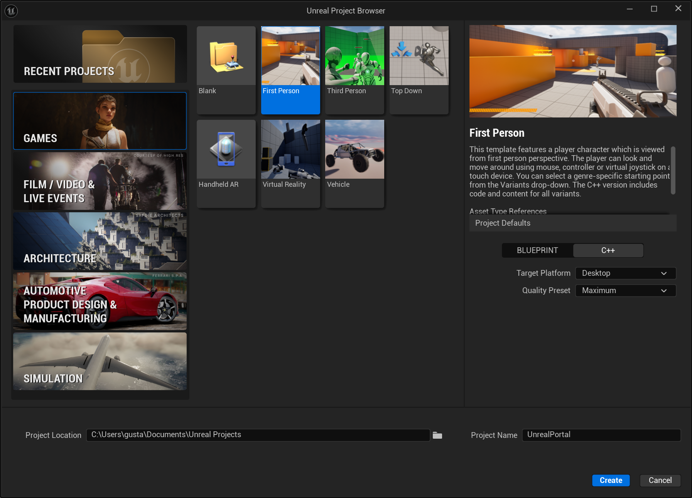
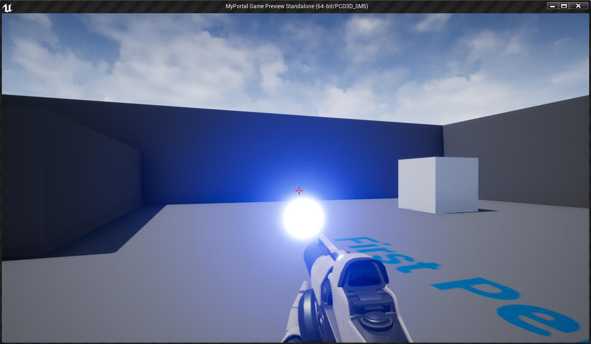
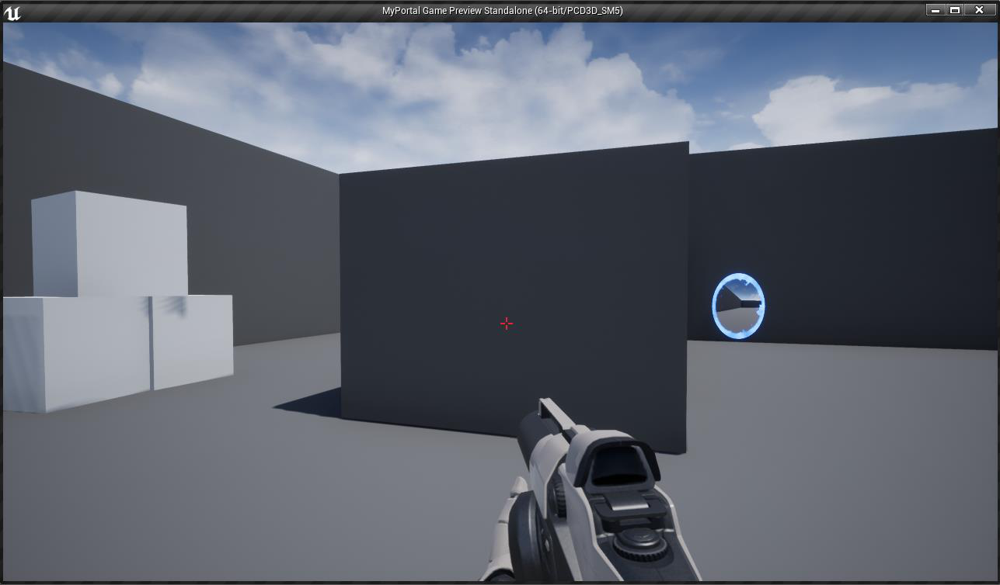
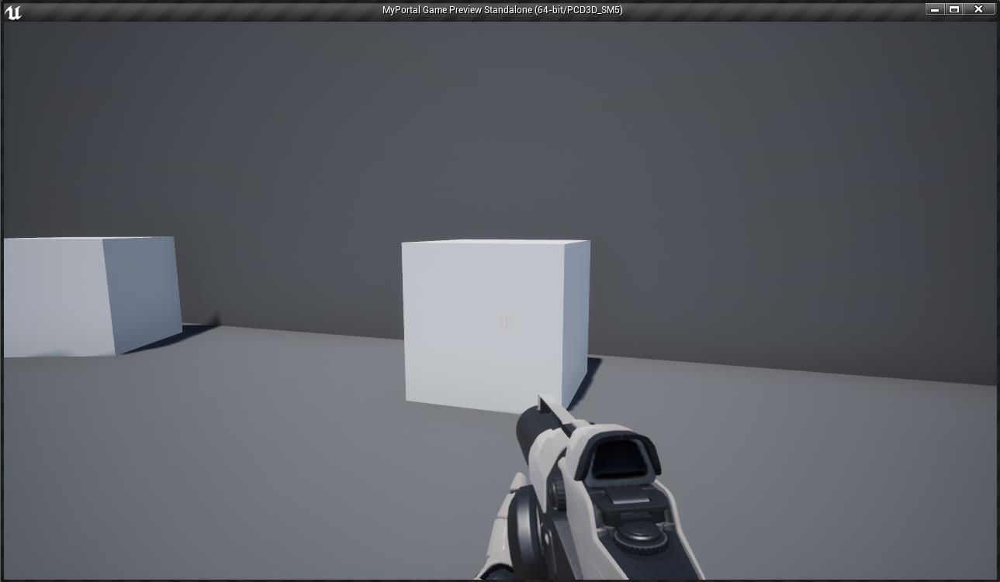

For the first part of the class project, you are going to create a simple first person platformer, and implement a simplified gameplay version of the [Portal](http://www.valvesoftware.com/games/portal.html) game, from [Valve Corporation](http://www.valvesoftware.com/).

## First Person Character

For the First Person Character, you should use the **First Person template**:

The Variant **Shooter** in this C++ template project already provides a functional First Person Character with skeletal meshes and animations for the first-person view. Also, the provided First Person character already has a Skeletal Mesh component for a third person view.

## Portal System

Like in the original Portal game, when the player presses the **Left Mouse Button**, the portal gun should fire a **blue portal**, and with the **Right Mouse Button** it should fire an **orange portal**. Also, if the player is using a Gamepad Controller, the blue portal can be fired using the **Left Trigger** button and the orange portal with the **Right Trigger** button.

Each portal should behave like the portals in the original game, teleporting the character and maintaining its relative orientation — concerning also the physics part (e.g. if the player falls into a portal, it is expected the character to appear on the other portal jumping).

Your portals should also visually resemble the portals of the original game, in both look and appearance. Each portal should have a similar behavior as if the player is looking through a window: the rendered view must consider the relative position of the player character to give the illusion that there is something in the other side of the wall where the portal is.

## Firing Portals

To spawn a portal, the player should press the corresponding mouse button or gamepad trigger. This will fire a glowing projectile with the corresponding color that, when colliding with a wall, will spawn the respective portal.

Portals on the walls should not trespass the floor, neither the ceiling. Also, make sure part of the portals are not spawned outside the walls on corners and neither in walls that are smaller than a portal.

## Collisions and Object Channels

Like in the original game, portals should only be fired to walls that support portals. We suggest you use a specific object channel to specify in which walls portals can be spawned. The crosshair, indicating where the player is aiming, should have a **bright red color**, indicating that the player can spawn a portal in that wall:

Also, if the player targets a different object where a portal cannot be spawned, the crosshair should fade, indicating that the corresponding object is not valid for spawning portals. In this situation, the player should not be able to fire any kind of portal.

## Report

Together with the project, there must be a report **in PDF format** with a description of all the implemented algorithms and a justification of the choices made. The report shall cite all references (books, websites, etc.) on which the algorithms were based. The report should also explicitly include the objectives achieved and not achieved.

## Evaluation

| Criteria | Mark |
|---|---|
| First Person Character | 25% |
| Portal System | 35% |
| Firing and Spawning Portals | 10% |
| Collisions and Object Channels | 10% |
| Physics | 10% |
| Report | 10% |

## Rules

1. **Deadline for submission:** 20th April, 2024.
2. The work must be performed by **groups of two students**.
3. **Oral Exam:** 26th April, 2024.
