# Networking Overview

The UE5 framework is built with multiplayer gaming in mind. If you follow the basic framework conventions, you generally don't have to do much to extend a single-player experience to multiplayer.

UE5 networking is built around the **server/client model**. This means that there will be one server that is authoritative (makes all the important decisions), and this server will then make sure all connected clients are continually updated so that they maintain the most up-to-date approximation of the server's world. Even non-networked, single-player games have a server; the local machine acts as the server in these cases.

In multiplayer game sessions, game state information is communicated between multiple machines over a network connection. In contrast, single-player, local games store all game state information on a single machine. Communication over a network connection makes creating multiplayer experiences inherently more complex than single-player experiences. Unreal Engine (UE) features a robust networking framework that powers some of the world's most popular online multiplayer games.

# Plan Early for Multiplayer

If there is any possibility that your project might need multiplayer features at any time, you should build all your gameplay with multiplayer in mind **from the start of your project**. If your team consistently implements the extra steps for creating multiplayer, the process of building gameplay will not consume much more time compared to a single-player game. In the long run, your project will be easier to debug and service. Meanwhile, any gameplay programmed for multiplayer in UE will still work as expected in single-player, non-networked play.

If you do not design your project with multiplayer in mind from the beginning, refactoring a codebase already built without networking will require you to comb through your entire project and rewrite large sections of gameplay functionality. You also might need to reconsider your design since technical obstacles in networking such as network speed and stability may force you to change your existing design.

# Unreal Engine Networking Architecture

UE uses the **client-server architecture** for networked multiplayer games. There are two types of multiplayer games: local multiplayer and networked multiplayer.

In a **single-player or local multiplayer** game, your game runs locally on a single machine as a standalone game. All players, assets, and functionality exist and all input is processed on a single machine. There is no potential issue with communicating input from a player to the game because the player is connected directly to the game instance.

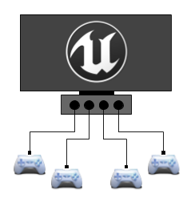{fig-align="center" width="40%"}

In a **networked multiplayer** game, many players on distinct machines connect to a central machine across a network. The central machine (the **server**) hosts the multiplayer game while all other players connect as **clients**. The server shares game state information with each connected client and provides the means for all players on different machines to communicate with one another.

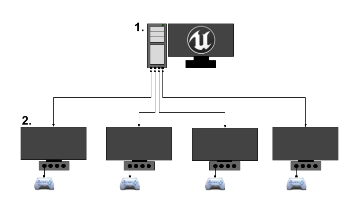{fig-align="center" width="80%"}

As opposed to local multiplayer, this presents additional challenges. Different clients might have different network connection speeds, and information must be communicated across a potentially unstable network where input might get lost. As a result, at any given time, the state of the game on one client machine is likely to differ from every other.

The **server is where the multiplayer game is actually played.** The clients each control remote Pawns that they own on the server. Clients send remote procedure calls from their local pawn to their server pawn to perform in-game actions. The server then replicates information about the game state to each client — where Actors are located, how they should behave, and what values different variables should have. Each client then uses this information to simulate a close approximation of what is actually happening on the server.

## Client-Server Gameplay Example

This section provides a side-by-side comparison of two players in a multiplayer game to illustrate the differences between local and networked multiplayer.

::: {layout-ncol=2}
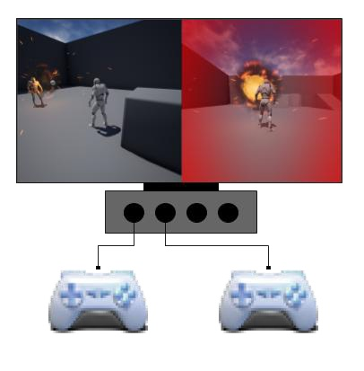

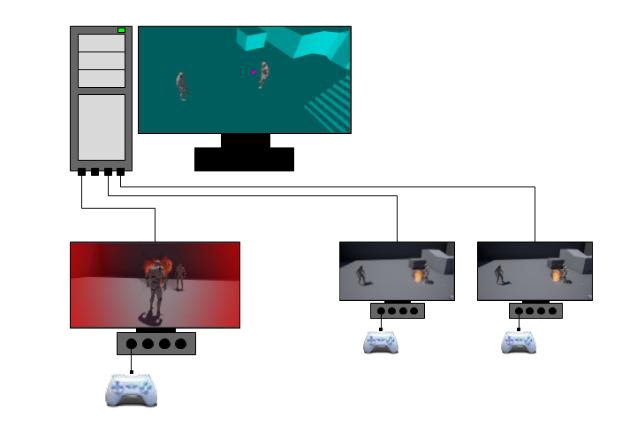
:::

*Figure 3 – Local multiplayer (left) vs. Networked multiplayer (right) in UE5's ContentExamples project.*

| **Local Multiplayer** | **Networked Multiplayer** |
|---|---|
| Player 1 presses an input to fire a weapon. Player 1's Pawn responds by firing its current weapon. Player 1's weapon spawns a projectile and plays any accompanying sound or visual effects. | Player 1 presses an input on their local machine. Player 1's local Pawn relays the command to its connected Pawn on the server. The weapon on the server spawns a projectile. The server notifies each client to create its own copy of the projectile, and to play the associated sound and visual effects. |
| Player 1's projectile moves forward from the weapon. | Player 1's projectile on the server moves forward. The server notifies each client to replicate the movement, so each client's version of the projectile also moves. |
| Player 1's projectile collides with Player 2's pawn. The collision destroys the projectile, causes damage to Player 2, and plays sound/visual effects. Player 2 plays an on-screen effect as a response to being damaged. | Player 1's projectile on the server collides with Player 2's pawn. The collision destroys the server-side projectile. The server automatically notifies each client to destroy their copy. The collision also notifies all clients to play the accompanying sound and visual effects. Player 2's pawn on the server takes damage and notifies Player 2's client to play an on-screen effect. |

: Local vs. Networked multiplayer: projectile fire sequence {.striped .hover}

In the networked multiplayer game, these interactions take place in **several different worlds**:

- Authoritative world on the server.
- Player 1's client world.
- Player 2's client world.
- Additional worlds for any other connected clients.

Each world has its own player controllers, pawns, weapons, and projectiles. This introduces a division between:

- **Essential gameplay interactions** — collisions, movement, damage (server-authoritative).
- **Cosmetic effects** — visual effects and sounds (replicated to relevant clients).
- **Player information** — HUD updates (sent to the owning client).

# Network Modes

| Mode | Functionality / Ideal Use Case |
|---|---|
| `NM_Standalone` | Server running locally, not accepting remote clients. Best for single-player or local multiplayer. |
| `NM_DedicatedServer` | No local players; discards sound, graphics, and player-oriented features. Used for competitive MOBAs, MMOs, and online shooters. |
| `NM_ListenServer` | Hosts a local player but open to remote connections. Good for casual co-op or competitive games without a dedicated server. |
| `NM_Client` | The only non-server mode. The local machine is a client connected to a dedicated or listen server. |

: UE5 Network Modes {.striped .hover}

## Server Types

### Listen Server

Listen servers are designed to be simple for users to set up spontaneously. Any user with a copy of the game can start a listen server and play on the same machine. Games that support listen servers often feature an in-game UI for starting or finding servers.

**Disadvantages:** The hosting player has an advantage over remote clients (no network latency), and the game can be terminated without warning by the host. These factors make listen servers less suitable for highly competitive settings.

### Dedicated Server

Dedicated servers are more expensive and challenging to configure. They require a separate machine from all players, but all players connect remotely, ensuring better fairness. Since a dedicated server does not render graphics or perform local-player logic, it can process gameplay and networking functions more efficiently.

**Best for:** MMOs, competitive MOBAs, and fast-paced online shooters that require large player counts or high-performance, trusted servers.

# Replication

**Replication** is the process of the authoritative server sending state data to connected clients. If replication is configured correctly, different machines' game instances synchronize and gameplay runs smoothly.

Actors and actor-derived classes are the primary classes designed for replicating their state over a network connection. `AActor` is the base class for an object that can be placed or spawned in a level and is the first class in UE's `UObject` inheritance hierarchy that is supported for networking.

## Actor Replication

Actors interact over a network using several mechanisms:

- **Replicated Properties** — actor properties that replicate their state over the network.
- **Replicated Using Properties (RepNotify)** — replicate state and call a function when that state changes.
- **Remote Procedure Calls (RPCs)** — functions called from one machine and executed on another.

By default, most actors do **not** replicate. Enable replication for actor-derived classes by setting `bReplicates` to `true` in C++, or enabling **Replicates** in Blueprint. The Actor Details panel's Replication section controls all replication settings:

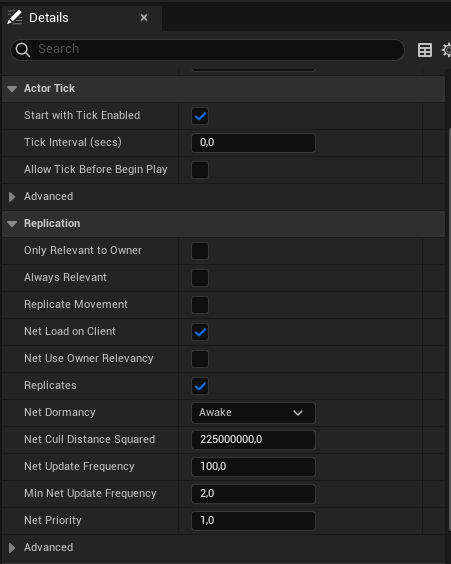{fig-align="center" width="45%"}

| Feature | Description |
|---|---|
| Creation & Destruction | When a replicated actor is spawned on the server, remote proxies are automatically created on all connected clients. Destroying the authoritative actor destroys all proxies. |
| Movement | If **Replicate Movement** is enabled, Location, Rotation, and Velocity are automatically replicated. |
| Properties | Designated replicated properties automatically replicate from the authoritative actor to its remote proxies whenever their values change. |
| Components | Actor components replicate as part of their owning actor if set to replicate. |
| Subobjects | Any `UObject`-derived object can be attached to an actor and replicated as a subobject. |
| Remote Procedure Calls | RPCs run on a specific machine: **Server** (only on server), **Client** (only on owning client), or **NetMulticast** (on every connected machine). |

: Actor Replication Feature Overview {.striped .hover}

### What Does NOT Replicate by Default

Even when an actor has replication enabled, the following features do **not** replicate automatically. The variables that drive them should be replicated so all clients simulate them consistently:

- Skeletal Mesh Component
- Static Mesh Component
- Materials
- Animation Blueprints
- Particle System Component
- Sound Emitters
- Physics Objects

# Multiplayer in Blueprints

UE5 provides a lot of multiplayer functionality out of the box, and it's easy to set up a basic Blueprint game that works over a network. Most of the logic for basic multiplayer is built into the `Character` class and its `CharacterMovementComponent`.

## Gameplay Framework Review

Understanding the roles of the major gameplay classes is essential for multiplayer design:

**`GameInstance`**
:   Exists for the duration of the engine session (not destroyed between levels). A separate `GameInstance` exists on the server and each client — they do not communicate with each other. Ideal for persistent data such as lifetime player statistics or account information.

**`GameMode`**
:   Only exists on the **server**. Stores game rule information that clients do not need to know explicitly (e.g., which weapon types can spawn).

**`GameState`**
:   Exists on the **server and all clients**. Use replicated variables on `GameState` to keep all clients updated on global game data (e.g., scores, current round/inning).

**`PlayerController`**
:   One exists on each client per local player. Replicated between the server and the associated client, but **not** to other clients. Suited for communicating information privately between a client and the server.

**`PlayerState`**
:   Exists for every player on both the server and all clients. Used for replicated properties that all clients are interested in (e.g., a player's score in a free-for-all).

**`Pawn` / `Character`**
:   Exists on the server and all clients. Can contain replicated variables and events. Note that a Pawn may be destroyed and respawned during gameplay (e.g., on death), while `PlayerController` and `PlayerState` persist. Store health on the Pawn itself since it should reset on respawn.

## Actor Replication in Blueprints

The core of the networking technology in UE5 is actor replication. An actor with its **Replicates** flag set to `true` will automatically be synchronized from the server to clients.

::: {.callout-important}
Actors are **only replicated from the server to clients** — it's not possible to have an actor replicate from a client to the server. Clients send data to the server through **"Run on Server"** RPCs.
:::

### Authority

For every actor in the world, one connected player is considered to have **authority** over that actor. For every actor on the server, the server has authority — including all replicated actors.

Use the **`Switch Has Authority`** macro to branch for different server and client behaviour in replicated actors:

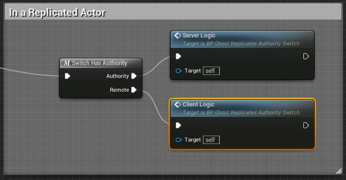{fig-align="center" width="70%"}

::: {.callout-note}
A UI element like a HUD is typically only spawned on the client, so the client has authority over it. For almost all other gameplay scenarios, authority means the server.
:::

## Variables

In the Details panel of variables on your actors, the **Replication** drop-down controls how variables are replicated:

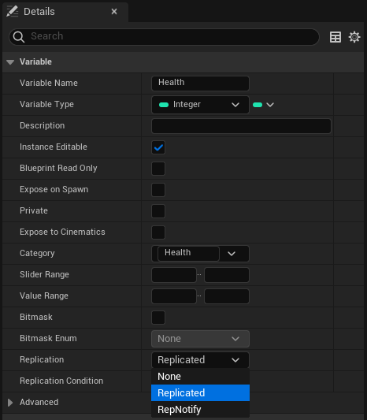{fig-align="center" width="70%"}

| Option | Description |
|---|---|
| **None** | Default. Value is not sent over the network. |
| **Replicated** | When the server replicates this actor, this variable's value is sent to clients and updated automatically. Replicated variables flow **server → client only**. |
| **RepNotify** | Same as Replicated, but also auto-generates an `OnRep_<VariableName>` function called automatically on both the server and clients whenever the value changes. |

: Variable Replication Options {.striped .hover}

::: {.callout-tip}
**In Blueprints**, the `OnRep_` function is automatically called on the server when a RepNotify variable is set — a convenience not available in C++, where you must call it manually.
:::

### Key Rules for Variable Replication

- Replicated variables are **always reliable** — changes are guaranteed to eventually reach all clients.
- Only the **last change per frame** is captured. If a value changes multiple times in one frame, only the final value is replicated.
- **Never modify replicated variables on the client.** Always let the server make the change and rely on the replication system to propagate it.

## Spawning and Destroying

| Action | Behaviour |
|---|---|
| **Spawn on Server** | Automatically creates copies of the actor on all connected clients. |
| **Spawn on Client** | The actor only exists on the spawning client. The server and other clients are unaware of it. |
| **Destroy on Server** | Automatically destroys all client copies. |
| **Destroy on Client** | Only destroys the actor if the client has authority over it. Attempting to destroy a server-authoritative actor from the client is ignored. |

: Spawning and Destruction Behaviour {.striped .hover}

::: {.callout-important}
For actors that influence gameplay and need to be replicated, **always spawn and destroy them on the server**.
:::

## Events (RPCs)

In the Details panel of custom events, you can set how the event is replicated:

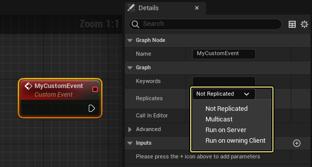{fig-align="center" width="50%"}

| Option | Description |
|---|---|
| **Not Replicated** | Default. Only runs locally on the machine that invoked it. |
| **Multicast** | When invoked on the server, replicates to all connected clients. If invoked from a client, treated as not replicated (client only). |
| **Run on Server** | If invoked from a client (on an actor the client owns), runs on the server. The primary method for clients to send data to the server. |
| **Run on Owning Client** | If invoked from the server, runs on the client who owns the target actor. If invoked from a client, runs only on that client. |

: Event Replication Options {.striped .hover}

### Event Execution Matrices

**When invoked from the server:**

|  | Not Replicated | Multicast | Run on Server | Run on Owning Client |
|---|---|---|---|---|
| Client-owned target | Server | Server + all clients | Server | Target's owning client |
| Server-owned target | Server | Server + all clients | Server | Server |
| Unowned target | Server | Server + all clients | Server | Server |

**When invoked from a client:**

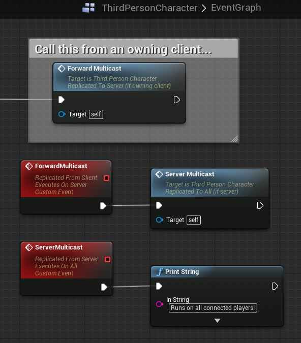{fig-align="center" width="90%"}

|  | Not Replicated | Multicast | Run on Server | Run on Owning Client |
|---|---|---|---|---|
| Target owned by invoking client | Invoking client | Invoking client | Server | Invoking client |
| Target owned by different client | Invoking client | Invoking client | **Dropped** | Invoking client |
| Server-owned target | Invoking client | Invoking client | **Dropped** | Invoking client |
| Unowned target | Invoking client | Invoking client | **Dropped** | Invoking client |

::: {.callout-warning}
Any event invoked from a client that is **not** set to **Run on Server** is treated as not replicated. Multicast events can only effectively be sent from the server.
:::

### Ownership and "Run on Server"

"Run on Server" events can only be invoked from actors the client owns:

- The client's **PlayerController**
- A **Pawn** possessed by the client's PlayerController
- The client's **PlayerState**

### Reliability

| Type | Description |
|---|---|
| **Reliable** | Guaranteed to reach its destination. Uses more bandwidth and may introduce latency. Avoid sending on every tick — overflowing the reliable buffer disconnects the player. |
| **Unreliable** | May be dropped under packet loss or high traffic. Uses less bandwidth. Suitable for cosmetic or frequently-called events. |

::: {.callout-tip}
Use **Unreliable** for cosmetic events (particles, sounds). Use **Reliable** only when missing the event would break gameplay.
:::

### Join-in-Progress Considerations

If a player joins a game in progress, any replicated **events** that fired before they joined will **not** be executed for the new player. Important gameplay state should be communicated via **replicated variables** — when a late-joining client connects, it receives the current values of all replicated variables from the server.

# Testing Multiplayer in the Editor

In the UE5 editor, press the dropdown arrow next to the **Play** button to access multiplayer testing options:

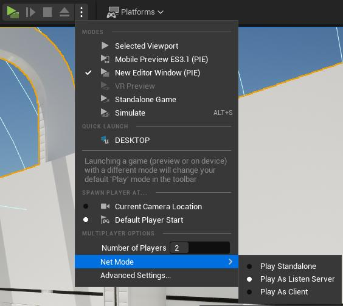{fig-align="center" width="55%"}

1. Set **Number of Players** to 2 or more.
2. Select **New Editor Window (PIE)** as the play mode.
3. Go to **Advanced Settings** and set a smaller viewport size (e.g., 640×480) so multiple windows fit comfortably on screen.

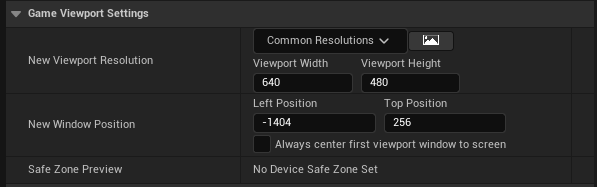{fig-align="center" width="60%"}

4. Click Play — one window will show **[NetMode: Server 0]** (listen server) and the other **[NetMode: Client 1]**.

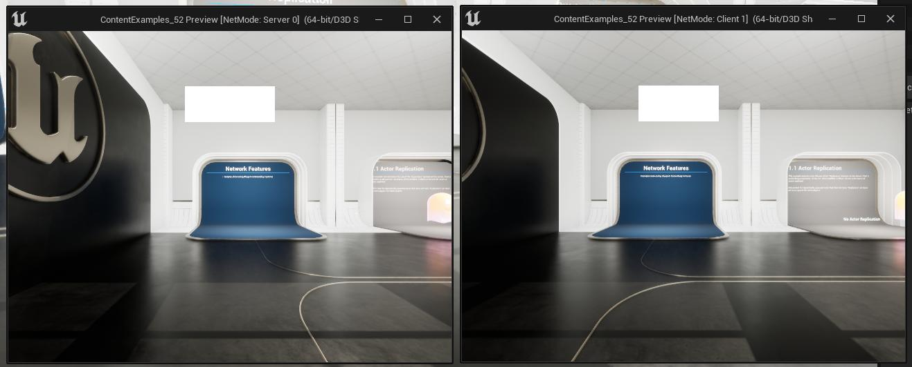{fig-align="center" width="95%"}

**To emulate a dedicated server:** Enable **Launch Separate Server** in the multiplayer options and set the number of clients to 1. The single client window will connect to a background dedicated server process that has no rendering.

# Hands On — Actor Replication

## Actor Replication Example

When an Actor has `Replicates = false` (the default), remote machines are completely unaware of it. The server sees both actors, but the client only sees the replicated one.

::: {layout-ncol=2}
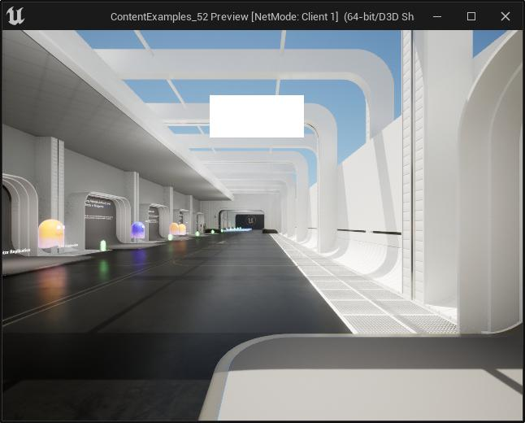

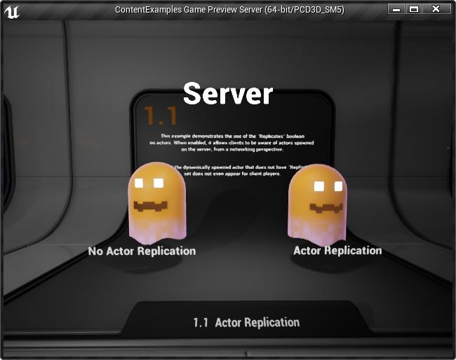
:::

*Figure 12 – Server (left) sees both actors; Client (right) does not see the non-replicated "No Actor Replication" object.*

To fix this, open the Blueprint's Class Defaults and check the **Replicates** checkbox in the Replication section:

::: {layout-ncol=2}
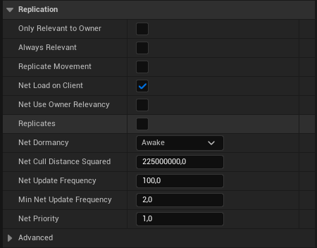

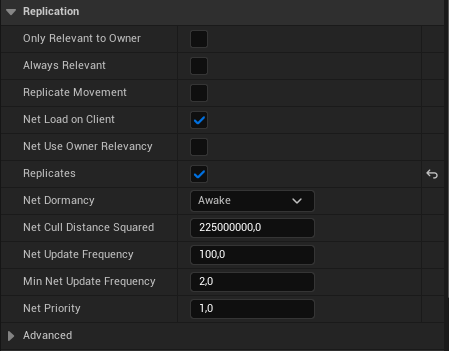
:::

## Detecting Network Authority

The Level Blueprint uses `Switch Has Authority` to ensure that gameplay-important actors are only spawned on the server:

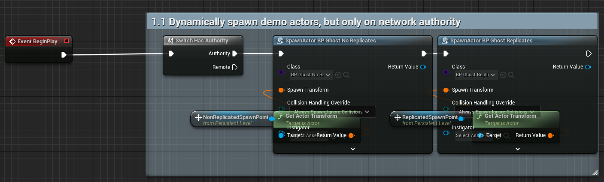{fig-align="center" width="95%"}

The **`Switch Has Authority`** node in detail:

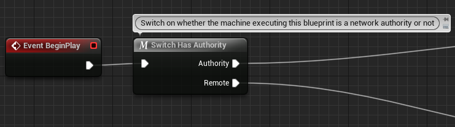{fig-align="center" width="70%"}

The ghost actor Blueprint uses this to display different labels and colours on server vs. clients:

::: {layout-ncol=2}
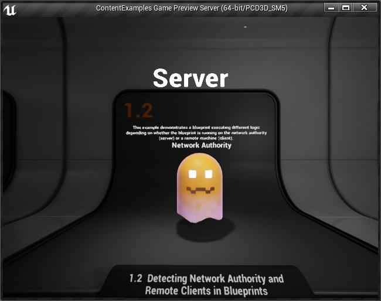

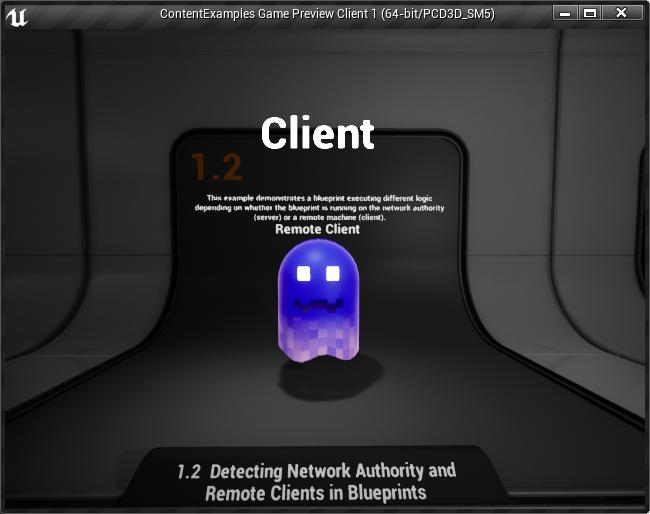
:::

*Figure 17 – Server (left) shows "Network Authority"; Client (right) shows "Remote Client".*

The full Blueprint implementing this behaviour:

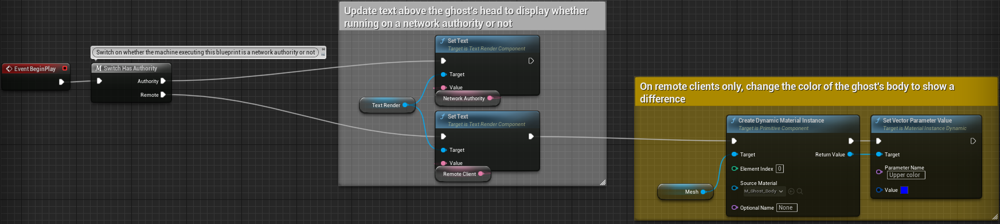{fig-align="center" width="95%"}

::: {.callout-tip}
The most common use case for `Switch Has Authority` is wrapping gameplay-critical logic — damage, scoring, state changes — to ensure only the server executes it.
:::

# Variable Replication

## Health Variable Example

Without variable replication the client's health value stays at 0 and never changes. With replication enabled, the client's value stays in sync with the server.

::: {layout-ncol=2}
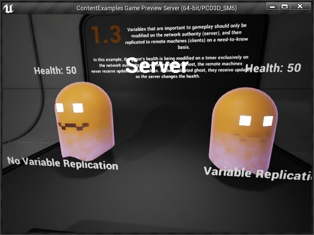

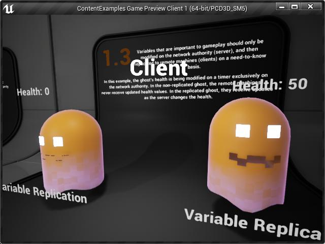
:::

*Figure 19 – Server (left): both ghosts decrement correctly. Client (right): the non-replicated ghost is stuck at Health: 0.*

The ghost Blueprint initialises health and sets a decrement timer — all wrapped in an Authority check so only the server modifies health:

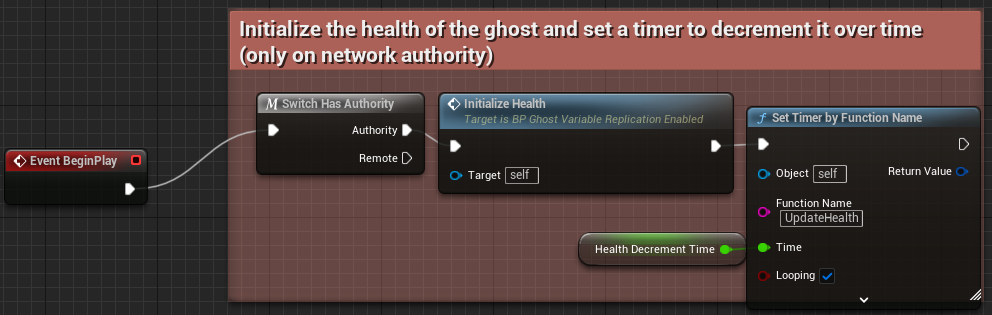{fig-align="center" width="95%"}

Every tick, the health value is displayed above the ghost's head on both server and client by reading the replicated variable:

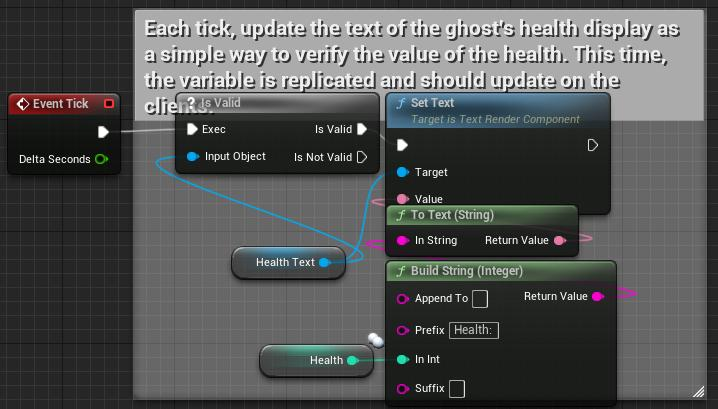{fig-align="center" width="90%"}

Setting the variable's **Replication** dropdown to **Replicated** ensures clients always receive updated values:

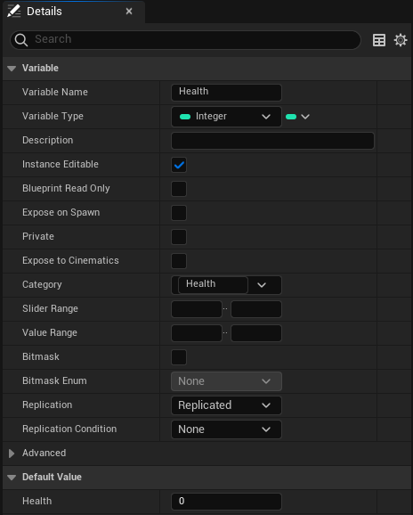{fig-align="center" width="55%"}

The `UpdateHealth` timer function decrements health on the server:

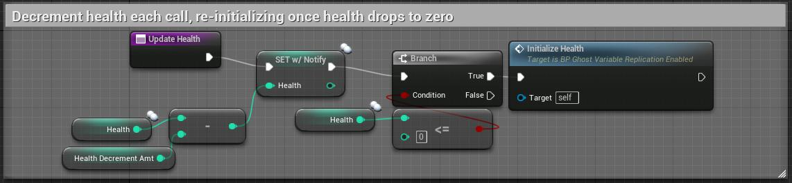{fig-align="center" width="90%"}

## RepNotify

**RepNotify** works like **Replicated**, but additionally calls an auto-generated `OnRep_<VariableName>` function on **both the server and all clients** whenever the value changes.

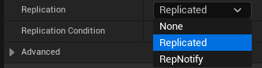{fig-align="center" width="45%"}

### Streetlight Example

A streetlight cycles through red → yellow → green. The server controls the cycle; the client stays in sync via a RepNotify variable:

::: {layout-ncol=2}
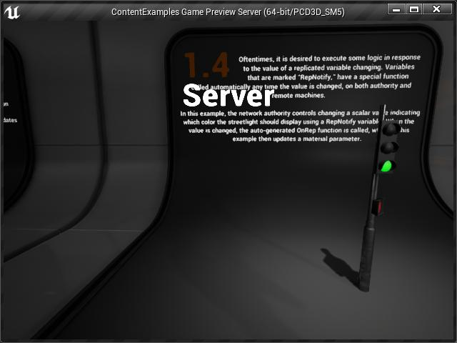

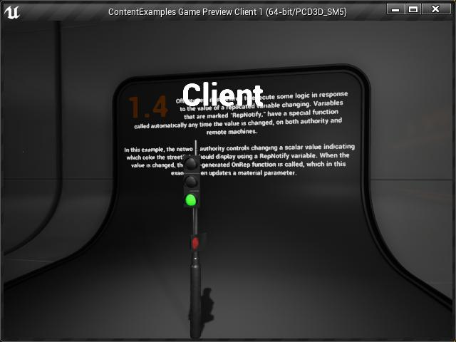
:::

*Figure 25 – Server (left) and Client (right) showing the streetlight in the same state, synchronised via RepNotify.*

The `StreetlightScalar` variable is marked **RepNotify**:

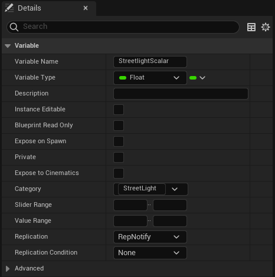{fig-align="center" width="50%"}

The server Blueprint controls the light cycle using `SET w/ Notify`. The two small sphere icons on a variable node indicate it is replicated:

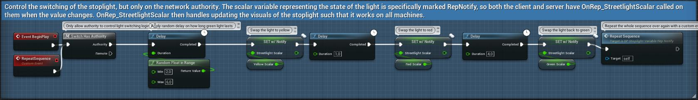{fig-align="center" width="95%"}

The `OnRep_StreetlightScalar` function updates the material parameter on both server and all clients whenever the value changes:

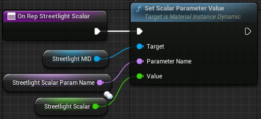{fig-align="center" width="65%"}

::: {.callout-note}
In **Blueprints**, the `OnRep_` function is automatically called on the server when the variable is set. In **C++**, you must call it manually on the server.
:::

# Function Call Replication

**General rule of thumb:**

- **One-off events** (explosions, button presses) → use **Function Replication (Multicast)**.
- **Persistent state** (health, door open/closed) → use **Variable Replication (RepNotify)**.

## Forwarding Multicast from a Client

Because clients cannot send Multicast events directly to other clients, use a two-event pattern: a **Run on Server** event validates the request, then calls a **Multicast** event that fires on all clients:

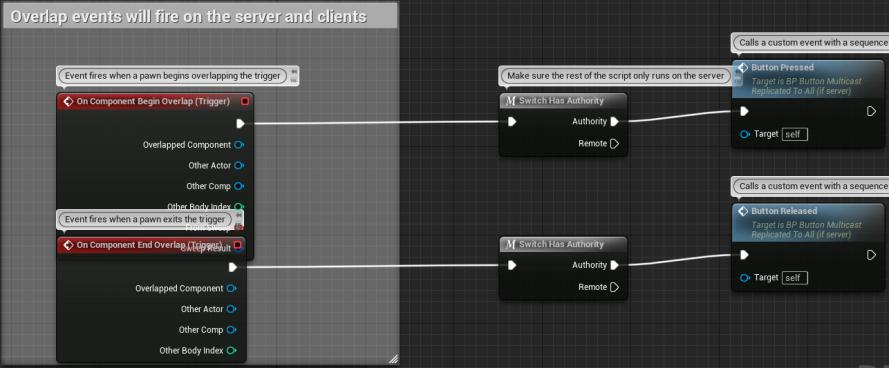{fig-align="center" width="95%"}

## Button Press Example

A button in the world fires a Multicast event when a player steps on it. The overlap event fires on both server and client, but `Switch Has Authority` ensures only the server decides if the press is valid:

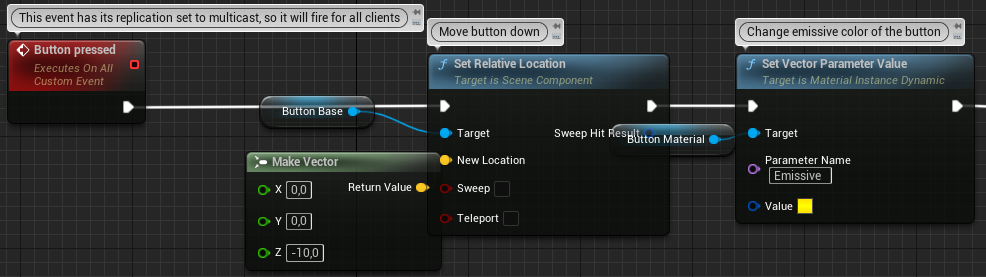{fig-align="center" width="95%"}

The `Button Pressed` custom event node shows its replication mode in its subtitle label:

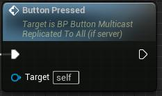{fig-align="center" width="35%"}

The Button Pressed event is configured as **Multicast** in its Details panel:

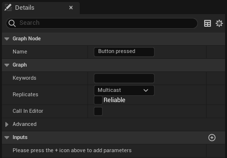{fig-align="center" width="55%"}

### Reliable vs. Unreliable

The Reliable checkbox controls delivery guarantees:

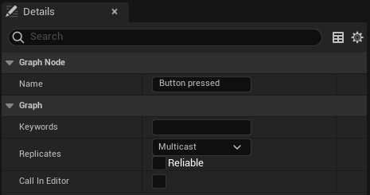{fig-align="center" width="55%"}

::: {.callout-tip}
**Cosmetic effects** (particles, sounds, button animations) → **Unreliable**. They will almost always arrive, and missing one frame is not game-breaking.

**Gameplay-critical events** (damage applied, door permanently unlocked) → **Reliable**. Missing these would break game state.
:::

::: {.callout-warning}
With Multicast, the engine will reject further calls if you call the same event more than twice on the same actor in the same frame, to prevent accidental network flooding.
:::

The full set of replication options available on custom events:

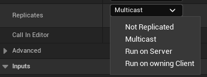{fig-align="center" width="45%"}

# Network Relevancy

Network relevancy is a key optimisation concept. It is not realistic (or necessary) to constantly send network updates for every actor in the world to every client. **An actor is considered network-relevant to a client if the client needs to know about it** (e.g., it's nearby or it can affect the client directly).

**The problem:** If an actor is not relevant to a client when an event occurs, the client misses that event. When the actor becomes relevant later, the client's state may be incorrect.

## The Chest Example — Solving Network Relevancy

This example demonstrates four progressively better solutions to the network relevancy problem using a treasure chest that can be opened.

### ❌ Approach 2.1 — No Replication

The server opens the chest and plays the particle effect, but clients see nothing. All logic runs authority-guarded on the server only:

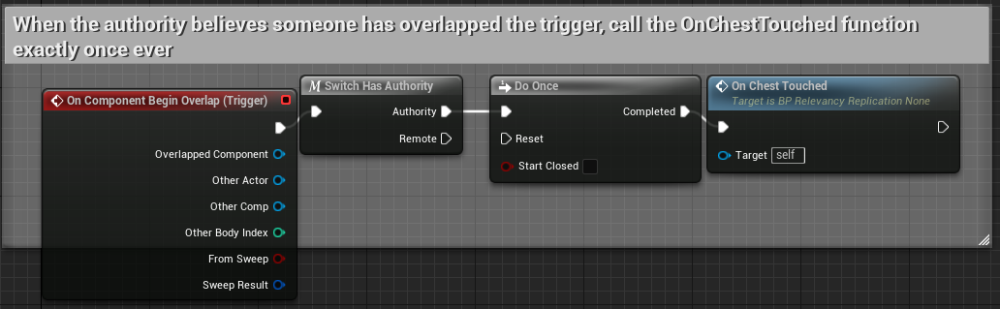{fig-align="center" width="85%"}

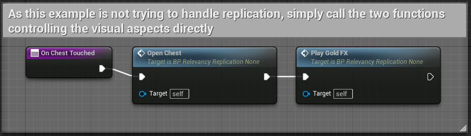{fig-align="center" width="85%"}

### ⚠️ Approach 2.2 — Multicast Only

Using a Multicast function works when all clients are currently relevant. However, if a client is outside the network relevancy range when the chest is opened, they permanently miss the event — they will **never** see the chest open, even after entering range.

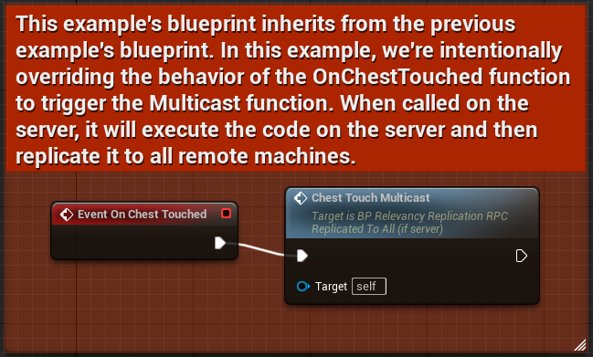{fig-align="center" width="75%"}

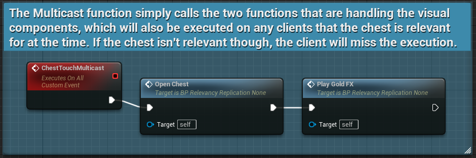{fig-align="center" width="85%"}

### ⚠️ Approach 2.3 — RepNotify Variable Only

Setting a `RepNotify` bool correctly saves the persistent lid state. When the client enters range, it receives the updated variable. However, the `OnRep` function also re-triggers the gold particle FX long after the event — incorrect for a late-joining client.

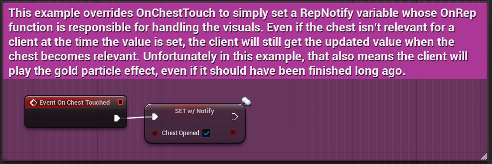{fig-align="center" width="75%"}

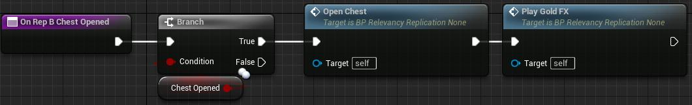{fig-align="center" width="90%"}

### ✅ Approach 2.4 — RepNotify + Multicast (Correct Solution)

Split the two components by their nature:

| Component | Mechanism | Reason |
|---|---|---|
| Lid open/closed (persistent state) | **RepNotify variable** | Should always reflect current state, even for late joiners. |
| Gold particle burst (one-off event) | **Multicast function** | Should only play at the moment of opening; missing it is acceptable. |

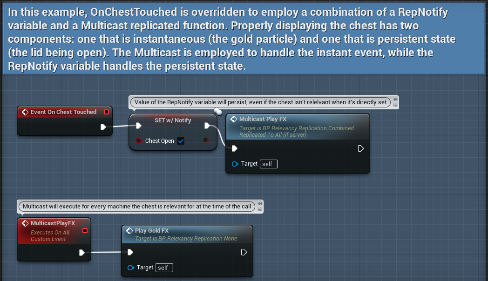{fig-align="center" width="95%"}

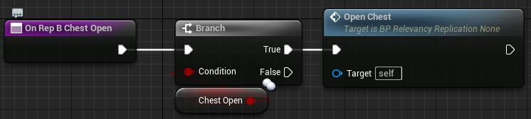{fig-align="center" width="80%"}

**Results:**

- Clients present when the chest opens: see both the lid open and the gold particles ✅
- Clients who were out of range and enter later: see the lid open correctly, but **do not** see the gold particles (correct — the particles happened in the past) ✅

# Replication Systems

UE provides three different systems to replicate state data:

1. **Generic Replication System** — default, suitable for most projects.
2. **Replication Graph** — optimised for large-scale games.
3. **Iris Replication System** — the newest system with additional optimisations.

# Networking Tips

- Use as **few RPCs and replicated Blueprint functions** as possible. Prefer a RepNotify property when applicable.
- Use **multicast functions sparingly** — they generate extra traffic for every connected client.
- Server-only logic does not have to be in a server RPC if you can guarantee a non-replicated function only executes on the server.
- Be cautious when binding **reliable RPCs to player input** — rapid button presses can overflow the reliable RPC queue. Implement rate-limiting logic.
- Make RPCs **unreliable** if they are called very often (e.g., inside an actor tick function).
- Check **actor network role** (`Switch Has Authority`) to filter execution in functions that run on both server and client.
- Check `IsLocallyControlled` to filter execution based on whether a pawn is relevant to its owning client.
- Make use of **network dormancy** — one of the most significant network optimisations available.

# Exercises

Using what you have learned throughout this assignment, complete the following:

1. Create a new project based on the **First-Person template** and use the **Variant** **Arena Shooter**.

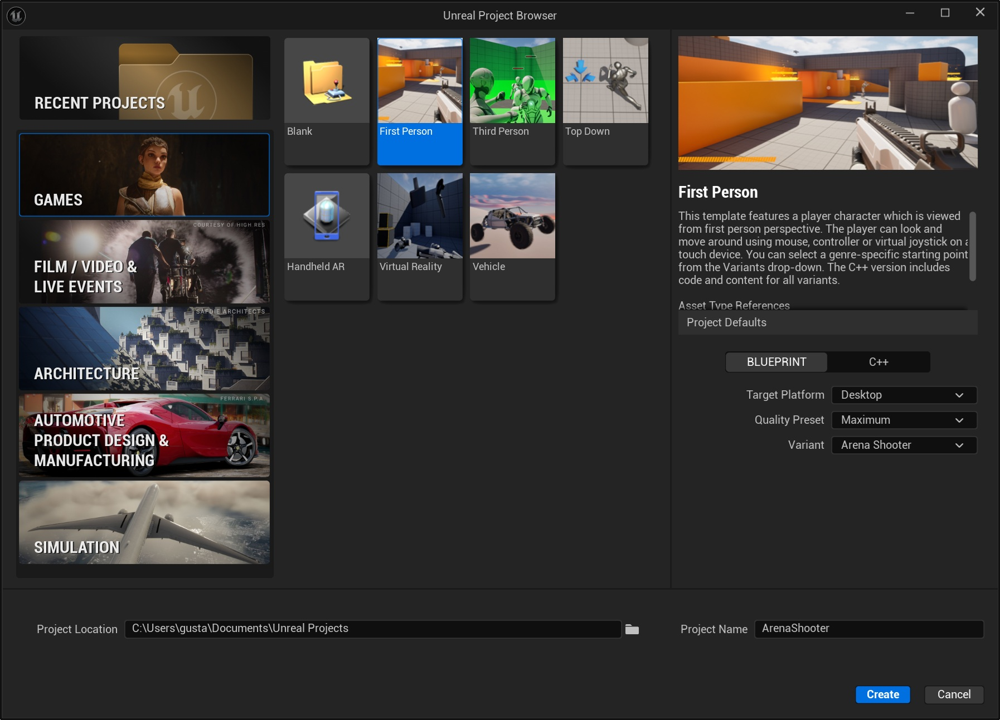{fig-align="center" width="85%"}

2. Set the project to run with **two players**.
3. Set the **Net Mode** as **Play As Listen Server**.
3. Play the game using **New Editor Window (PIE)**.
4. As you can see, this variant does not propperly work in Multiplayer. Fix all the issues.

::: {.callout-important}
## Submission Checklist

Ensure your project correctly uses:

- Actor replication (`Replicates = true` on relevant Blueprints).
- Variable replication for health (using `Replicated` or `RepNotify`).
- A **"Run on Server"** RPC for applying damage (authority-guarded).
- A **Multicast** RPC for playing hit effects on all clients.
- Network authority checks (`Switch Has Authority`) to protect all gameplay-critical logic.
:::
