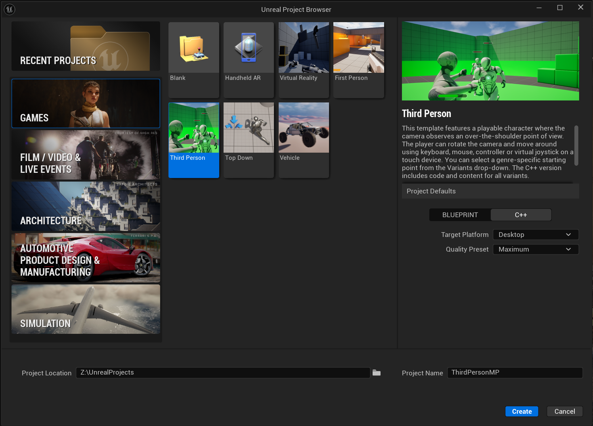
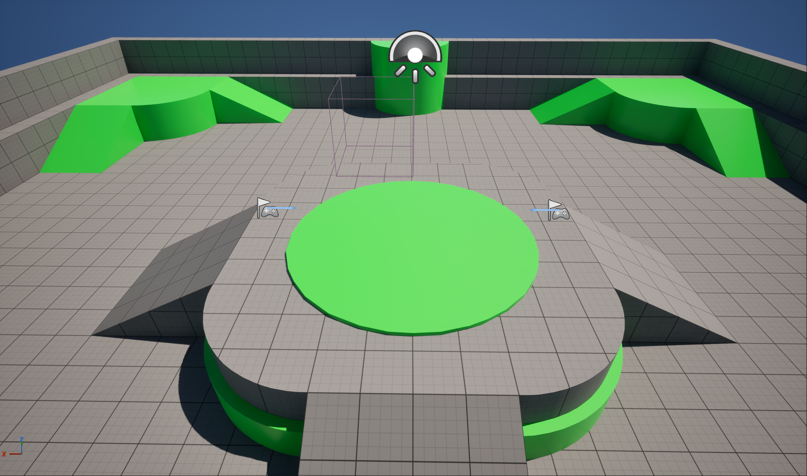
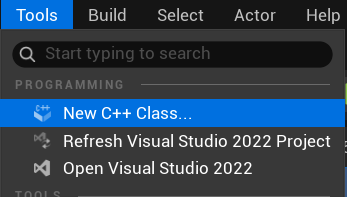
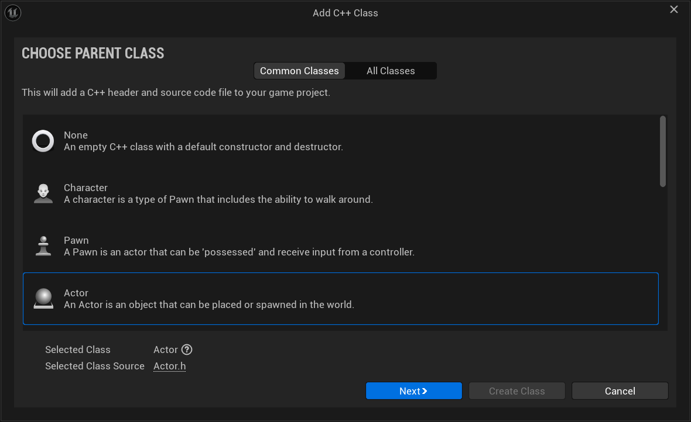
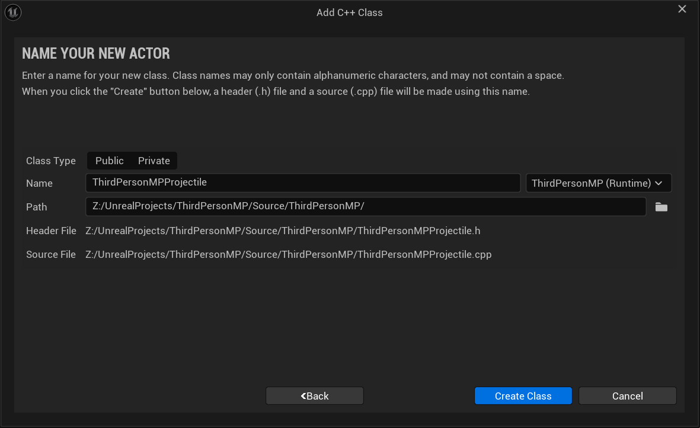
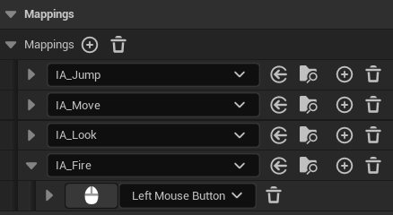
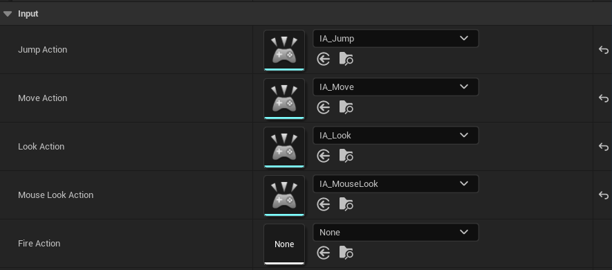
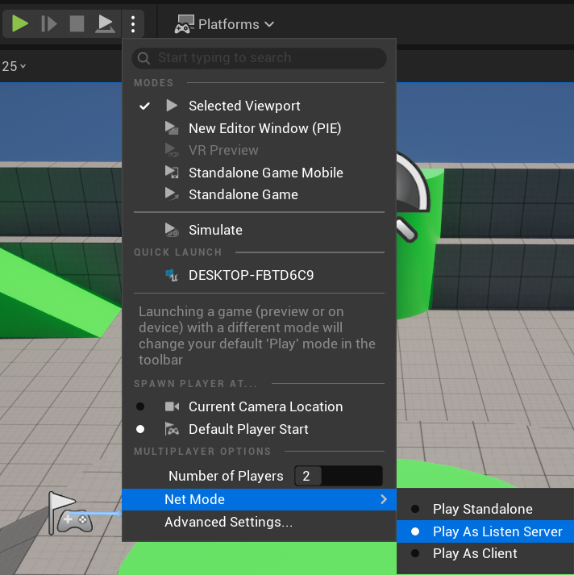
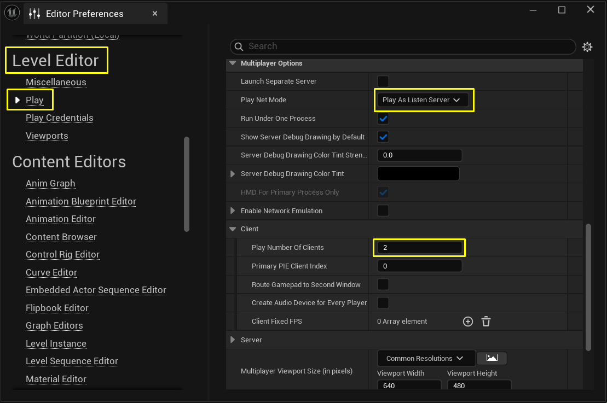

## Overview

Developing gameplay for a multiplayer game requires you to implement **replication** in your game's Actors. You must also design functionality specific to the **server** (which acts as the host for the game session) or a **client** (which represents a player connecting to the session).

This assignment will walk you through the process of creating some simple multiplayer gameplay. You will learn the following:

- How to add replication to a base **Actor**.
- How to take advantage of **Movement Components** in a network game.
- How to add replication to **variables**.
- How to use **RepNotifies** when a variable changes.
- How to use **Remote Procedure Calls (RPCs)** in C++.
- How to check an Actor's **Network Role** to filter calls that are performed within a function.

The result will be a third-person game where players can throw exploding projectiles at one another. The bulk of the work involves creating the projectile and adding a damage response to the Character.

---

## Project Setup



Open the Editor and create a New Project with the following settings:

- Is a **C++ Project**
- Uses the **Third-Person Template**
- Includes **Starter Content**
- Targets **Desktop**

Name your project `ThirdPersonMP` and click **Create**. The Unreal Editor will open `Lvl\_ThirdPerson` automatically.

Ensure that there are two **Player Starts** present in your map. These will handle spawning your players instead of the manually placed ThirdPersonCharacter that the scene includes by default.



::: {.callout-note}
The Pawns and Characters in most templates have replication enabled by default. In this example, `ThirdPersonCharacter` already has a **Character Movement Component** that will automatically replicate movement. For more information on how the Character Movement Component handles replication and how to expand on its functionality, you can refer to the [Character Movement Component](https://docs.unrealengine.com/en-US/InteractiveExperiences/Networking/CharacterMovementComponent/) guide.
:::

Cosmetic components like the Character's **Skeletal Mesh** and its **Animation Blueprint** are not replicated. However, variables that are relevant to gameplay and movement, like a Character's velocity, are replicated. The Animation Blueprint reads these variables as they are updated. In this way, copies of each client's characters will update their visuals. The process is performed in such a way that they are consistent with accurate updating of gameplay variables. Likewise, the **Gameplay Framework** automatically handles spawning Characters at Player Starts and assigning **Player Controllers** to them.

If you start a server with this project and have a client join it, you would already have a functioning multiplayer game. However, players would only be able to move and jump with their avatar. Therefore, you will create some additional multiplayer gameplay.

---

## Replicating Player's Health with RepNotifies

Players need a health value, so that you can cause damage to them during gameplay. That value needs to replicate so all clients have synchronized information about each player's health. You need to provide feedback to a player when they take damage. This section will demonstrate how it is possible to use a **RepNotify** to synchronize all essential updates to a variable without relying on RPCs.

### Header Declarations

Open `ThirdPersonMPCharacter.h`. Add the following properties under `protected`:

```cpp
protected:
    /** The player's maximum health. This is the highest value of their health can be.
        This value is a value of the player's health, which starts at when spawned. */
    UPROPERTY(EditDefaultsOnly, Category = "Health")
    float MaxHealth;

    /** The player's current health. When reduced to 0, they are considered dead. */
    UPROPERTY(ReplicatedUsing = OnRep_CurrentHealth)
    float CurrentHealth;

    /** RepNotify for changes made to current health. */
    UFUNCTION()
    void OnRep_CurrentHealth();
```

You need to strictly control how the player's health is changed, therefore these health values have the following constraints:

- `MaxHealth` does not replicate and is only editable in defaults. This value is pre-computed for all players and will never change.
- `CurrentHealth` replicates, but is not editable or accessible anywhere in Blueprint.
- Both `MaxHealth` and `CurrentHealth` are `protected`, which prevents them from being accessed from external C++ classes. They can only be modified within `AThirdPersonMPCharacter` or other classes derived from it.

This minimizes the risk of causing unwanted changes to a player's `CurrentHealth` or `MaxHealth` during live gameplay. You will provide other public functions for getting and modifying these values in a later step.

The `Replicated` specifier enables the copy of an Actor on the server to replicate the value of a variable to all connected clients any time it changes. `ReplicatedUsing` does the same thing, but enables you to set a RepNotify function. This function will be triggered when a client successfully receives the replicated data. You will use `OnRep_CurrentHealth` to perform updates to each client based on changes to this variable.

### Required Includes

Open `ThirdPersonMPCharacter.cpp`. Add the following `#include` statements:

```cpp
#include "Net/UnrealNetwork.h"
#include "Engine/Engine.h"
```

These provide required functionality for variable replication, as well as access to the `AddOnScreenDebugMessage` function in `GEngine`. You will use it to output messages to the screen.

In `ThirdPersonMPCharacter.cpp`, add the following code at the bottom of the `AThirdPersonMPCharacter` constructor :

```cpp
// Initialize the player's Health
MaxHealth = 100.0f;
CurrentHealth = MaxHealth;
```

These will initialize the player's health. Any time a new copy of this Character is created, its current health will be set to its maximum health value.

### GetLifetimeReplicatedProps

In `ThirdPersonMPCharacter.h`, add the following public function declaration just after the `AThirdPersonMPCharacter` constructor:

```cpp
/** Property replication */
void GetLifetimeReplicatedProps(TArray<FLifetimeProperty>& OutLifetimeProps) const override;
```

In `ThirdPersonMPCharacter.cpp`, add the implementation:

```cpp
//////////////////////////////////////////////////////////////////////////
// Replicated Properties

void AThirdPersonMPCharacter::GetLifetimeReplicatedProps(
    TArray<FLifetimeProperty>& OutLifetimeProps) const
{
    Super::GetLifetimeReplicatedProps(OutLifetimeProps);

    // Replicate current health.
    DOREPLIFETIME(AThirdPersonMPCharacter, CurrentHealth);
}
```

::: {.callout-important}
You must call the `Super` version of `GetLifetimeReplicatedProps`, or inherited properties from parent classes will not replicate, even if the parent class designates them as being replicated.
:::

The `GetLifetimeReplicatedProps` function is responsible for replicating any properties you designate with the `Replicated` specifier, and enables you to configure how a property will replicate. Here you are using the most basic implementation for `CurrentHealth`. If at any time you add more properties that need to be replicated, you must add them to this function as well.

### OnHealthUpdate

In `ThirdPersonMPCharacter.h`, add under `protected`:

```cpp
protected:
    /** Response to health being updated. Called on the server immediately after
        modification, and on clients in response to a RepNotify. */
    void OnHealthUpdate();
```

In `ThirdPersonMPCharacter.cpp`, add the implementation:

```cpp
void AThirdPersonMPCharacter::OnHealthUpdate()
{
    // Client-specific functionality
    if (IsLocallyControlled())
    {
        FString healthMessage = FString::Printf(
            TEXT("You now have %f health remaining."), CurrentHealth);
        GEngine->AddOnScreenDebugMessage(-1, 5.f, FColor::Blue, healthMessage);

        if (CurrentHealth <= 0)
        {
            FString deathMessage = FString::Printf(TEXT("You have been killed."));
            GEngine->AddOnScreenDebugMessage(-1, 5.f, FColor::Red, deathMessage);
        }
    }

    // Server-specific functionality
    if (GetLocalRole() == ROLE_Authority)
    {
        FString healthMessage = FString::Printf(
            TEXT("%s now has %f health remaining."),
            *GetFName().ToString(), CurrentHealth);
        GEngine->AddOnScreenDebugMessage(-1, 5.f, FColor::Blue, healthMessage);
    }

    // Functions that occur on all machines.
    /*
      Any special functionality that should occur as a result of damage or death
      should be placed here.
    */
}
```

You will be using this function to perform updates in response to changes to the player's `CurrentHealth`. Currently its functionality is limited to onscreen debug messages, but additional functionality could be added — for example, an `OnDeath` function that is called on all machines to trigger a death animation. Note that `OnHealthUpdate` is not replicated, and you will need to manually call it on all devices.

### OnRep_CurrentHealth

```cpp
void AThirdPersonMPCharacter::OnRep_CurrentHealth()
{
    OnHealthUpdate();
}
```

Variables replicate any time their value changes rather than constantly replicating, and RepNotifies run any time the client successfully receives a replicated value for a variable. Therefore, any time you change the player's `CurrentHealth` on the server, you would expect `OnRep_CurrentHealth` to run on each connected client. This makes `OnRep_CurrentHealth` the ideal place to call `OnHealthUpdate` on client machines.

---

## Making the Player Respond to Damage

Now that you have implemented the player's health, you need to provide a means for modifying the player's health from outside of this class.

### Public Getters and Setters

In `ThirdPersonMPCharacter.h`, add under `public`:

```cpp
public:
    /** Getter for Max Health. */
    UFUNCTION(BlueprintPure, Category = "Health")
    FORCEINLINE float GetMaxHealth() const { return MaxHealth; }

    /** Getter for Current Health. */
    UFUNCTION(BlueprintPure, Category = "Health")
    FORCEINLINE float GetCurrentHealth() const { return CurrentHealth; }

    /** Setter for Current Health. Clamps between 0 and MaxHealth and calls OnHealthUpdate.
        Should only be called on the server. */
    UFUNCTION(BlueprintCallable, Category = "Health")
    void SetCurrentHealth(float healthValue);

    /** Event for taking damage. Overridden from APawn. */
    UFUNCTION(BlueprintCallable, Category = "Health")
    float TakeDamage(float DamageTaken, struct FDamageEvent const& DamageEvent,
                     AController* EventInstigator, AActor* DamageCauser) override;
```

The `GetMaxHealth` and `GetCurrentHealth` functions provide getters that can access the player's health values from outside of `AThirdPersonMPCharacter`, both in C++ and in Blueprint. As `const` functions they provide a safe means of getting these values without allowing them to be modified. You are also declaring functions for setting the player's health and taking damage.

### SetCurrentHealth Implementation

```cpp
void AThirdPersonMPCharacter::SetCurrentHealth(float healthValue)
{
    if (GetLocalRole() == ROLE_Authority)
    {
        CurrentHealth = FMath::Clamp(healthValue, 0.f, MaxHealth);
        OnHealthUpdate();
    }
}
```

`SetCurrentHealth` provides a controlled means of modifying the player's `CurrentHealth` from outside of `AThirdPersonMPCharacter`. It is not a replicated function, but by checking that the Network Role of the Actor is `ROLE_Authority`, you restrict this function to execute only if it is called on the hosted game server. It clamps `CurrentHealth` to values between 0 and the player's `MaxHealth`, making it impossible to set `CurrentHealth` to an invalid value. It also calls `OnHealthUpdate` to ensure that the server and clients both have parallel calls to this function. This is necessary because the server will not receive the RepNotify.

::: {.callout-note}
While "setter" functions like this are not necessary for every variable, they are preferable for sensitive gameplay variables that change frequently during play, especially if they can be modified by many different sources. This is a best practice for single-player and multiplayer games alike, as it makes live changes to these variables more consistent, easier to debug, and easier to extend with new functionality.
:::

### TakeDamage Implementation

```cpp
float AThirdPersonMPCharacter::TakeDamage(float DamageTaken, struct FDamageEvent const& DamageEvent,
                                           AController* EventInstigator, AActor* DamageCauser)
{
    float damageApplied = CurrentHealth - DamageTaken;
    SetCurrentHealth(damageApplied);
    return damageApplied;
}
```

The built-in functions for applying damage to Actors call the basic `TakeDamage` function for that Actor. In this case you implement a simple health deduction using `SetCurrentHealth`.

If you have followed this section so far, the following should now be the flow for applying damage to an Actor:

1. An external Actor or function calls `CauseDamage` on your Character, which in turn calls its `TakeDamage` function.
2. `TakeDamage` calls `SetCurrentHealth` to change the player's `CurrentHealth` value on the server.
3. `SetCurrentHealth` calls `OnHealthUpdate` on the server, causing any functionality that happens in response to changes in the player's health to execute.
4. `CurrentHealth` replicates to all connected clients' copies of the Character.
5. When each client receives a new `CurrentHealth` value from the server, they call `OnRep_CurrentHealth`.
6. `OnRep_CurrentHealth` calls `OnHealthUpdate`, ensuring that each client responds the same way to the new `CurrentHealth` value.

This implementation has two main advantages. First, it condenses the workflow for adding new functionality around two key functions — `SetCurrentHealth` and `OnHealthUpdate` — which makes maintaining and expanding the code easier. Second, since this implementation does not use any Server, Client, or NetMulticast RPCs, it condenses the amount of information being sent across the network, depending only on the replication of `CurrentHealth` to trigger all essential changes. Since `CurrentHealth` would need to replicate regardless of what other functions you implement, this is the most efficient possible model for replicating health changes.

---

## Creating a Projectile with Replication

Inside the Unreal Editor, create a new C++ class using either the **Tools** menu or the **Content Browser**.



In the **Choose Parent Class** menu, choose **Actor** as the Parent Class and click **Next**.



In the **Name Your New Actor** menu, name your class `ThirdPersonMPProjectile` and click **Create Class**.



### Header Properties

Open `ThirdPersonMPProjectile.h` and add the following under `public`:

```cpp
public:
    // Sphere component used to test collision.
    UPROPERTY(VisibleAnywhere, BlueprintReadOnly, Category = "Components")
    class USphereComponent* SphereComponent;

    // Static Mesh used to provide a visual representation of the object.
    UPROPERTY(VisibleAnywhere, BlueprintReadOnly, Category = "Components")
    class UStaticMeshComponent* StaticMesh;

    // Movement component for handling projectile movement.
    UPROPERTY(VisibleAnywhere, BlueprintReadOnly, Category = "Components")
    class UProjectileMovementComponent* ProjectileMovementComponent;

    // Particle used when the projectile impacts against another object and explodes.
    UPROPERTY(EditAnywhere, Category = "Effects")
    class UParticleSystem* ExplosionEffect;

    // The damage type and damage that will be done by this projectile.
    UPROPERTY(EditAnywhere, BlueprintReadOnly, Category = "Damage")
    TSubclassOf<class UDamageType> DamageType;

    // The damage dealt by this projectile.
    UPROPERTY(EditAnywhere, BlueprintReadOnly, Category = "Damage")
    float Damage;
```

::: {.callout-note}
You need to precede each of the types in these declarations with the `class` keyword. This makes each of them a forward declaration of their own classes in addition to being variable declarations, which ensures that their classes will be recognized within the header file. You will be adding `#include`s for them in the `.cpp` file during the next step.
:::

The properties you are declaring will provide you with the following:

- A **Static Mesh Component** to act as a visual representation of the Projectile.
- A **Sphere Component** to check for collisions.
- A **Projectile Movement Component** to move the Projectile.
- A **Particle System** reference that you are going to use to spawn an explosion effect in a later step.
- A **Damage Type** for use in damage events.
- A `float` value for **Damage** to denote how much health should be subtracted when a Character is hit by this Projectile.

However, none of these are defined yet.

::: {.callout-note}
Like the Character Movement Component, the Projectile Movement Component automatically handles replication when it moves the Actor that it belongs to, provided that the Actor has `bReplicates` set to `true`.
:::

### CPP Includes

Open `ThirdPersonMPProjectile.cpp`. Add the following includes below `#include "ThirdPersonMPProjectile.h"`:

```cpp
#include "Components/SphereComponent.h"
#include "Components/StaticMeshComponent.h"
#include "GameFramework/ProjectileMovementComponent.h"
#include "GameFramework/DamageType.h"
#include "Particles/ParticleSystem.h"
#include "Kismet/GameplayStatics.h"
#include "UObject/ConstructorHelpers.h"
```

You will need to use each of these throughout this walkthrough. The first four are the components you are using, while `GameplayStatics.h` will give you access to basic gameplay functions, and `ConstructorHelpers.h` will give you access to some useful constructor functions for setting up our components.

### Constructor Setup

Enable replication at the top of the constructor body:

```cpp
bReplicates = true;
```

The `bReplicates` variable tells the game that this Actor should replicate. By default, the Actor would only exist locally on the machine that spawns it. With `bReplicates` set to `true`, as long as an authoritative copy of the Actor exists on the server, it will try to replicate the Actor to all connected clients.

Set up the **SphereComponent** (root + collision):

```cpp
SphereComponent = CreateDefaultSubobject<USphereComponent>(TEXT("RootComponent"));
SphereComponent->InitSphereRadius(37.5f);
SphereComponent->SetCollisionProfileName(TEXT("BlockAllDynamic"));
RootComponent = SphereComponent;
```

This will define the SphereComponent when the object is constructed, giving your Projectile collision.

Set up the **StaticMeshComponent**:

```cpp
static ConstructorHelpers::FObjectFinder<UStaticMesh>
    DefaultMesh(TEXT("/Game/StarterContent/Shapes/Shape_Sphere.Shape_Sphere"));
StaticMesh = CreateDefaultSubobject<UStaticMeshComponent>(TEXT("Mesh"));
StaticMesh->SetupAttachment(RootComponent);

if (DefaultMesh.Succeeded())
{
    StaticMesh->SetStaticMesh(DefaultMesh.Object);
    StaticMesh->SetRelativeLocation(FVector(0.0f, 0.0f, -37.5f));
    StaticMesh->SetRelativeScale3D(FVector(0.75f, 0.75f, 0.75f));
}
```

This will define the StaticMeshComponent that you are using as a visual representation. It will automatically try to find the `Shape_Sphere` mesh inside of StarterContent and fill it in. The sphere will also be scaled to align with your SphereComponent in size.

Set up the **ExplosionEffect**:

```cpp
static ConstructorHelpers::FObjectFinder<UParticleSystem>
    DefaultExplosionEffect(TEXT("/Game/StarterContent/Particles/P_Explosion.P_Explosion"));
if (DefaultExplosionEffect.Succeeded())
{
    ExplosionEffect = DefaultExplosionEffect.Object;
}
```

This will set the asset reference for your `ExplosionEffect` to be the `P_Explosion` asset inside of StarterContent.

Set up the **ProjectileMovementComponent**:

```cpp
ProjectileMovementComponent =
    CreateDefaultSubobject<UProjectileMovementComponent>(TEXT("ProjectileMovement"));
ProjectileMovementComponent->SetUpdatedComponent(SphereComponent);
ProjectileMovementComponent->InitialSpeed = 1500.0f;
ProjectileMovementComponent->MaxSpeed = 1500.0f;
ProjectileMovementComponent->bRotationFollowsVelocity = true;
ProjectileMovementComponent->ProjectileGravityScale = 0.0f;
```

This will define the Projectile Movement Component for your Projectile. This Component is replicated, and any movement that it performs on the server will be reproduced on clients.

Initialize **damage values**:

```cpp
DamageType = UDamageType::StaticClass();
Damage = 10.0f;
```

These will initialize both the amount of Damage that the Projectile will deal to an Actor as well as the Damage Type that will be used in the damage event. Here you are initializing with the base `UDamageType`, as you have not yet defined any new Damage Types.

---

## Making the Projectile Cause Damage

If you have been following along thus far, it is possible for you to spawn the projectile on the server and it will appear and move on all clients. However, if it hits a wall or a blocking object, it will stop. You need it to apply damage to players, and you need to show an explosion effect to all connected Clients in the session.

### Destroyed (Explosion Effect)

In `ThirdPersonMPProjectile.h`, add under `protected`:

```cpp
protected:
    virtual void Destroyed() override;
```

In `ThirdPersonMPProjectile.cpp`:

```cpp
void AThirdPersonMPProjectile::Destroyed()
{
    FVector spawnLocation = GetActorLocation();
    UGameplayStatics::SpawnEmitterAtLocation(this, ExplosionEffect, spawnLocation,
        FRotator::ZeroRotator, true, EPSCPoolMethod::AutoRelease);
}
```

The `Destroyed` function is called any time an Actor is destroyed. Particle emitters themselves do not normally replicate, but since Actor destruction does replicate, you destroy this projectile on the server. This function will be called on each connected client when they destroy their own copies of it. As a result, all players will see the explosion effect when the projectile is destroyed.

### OnProjectileImpact

In `ThirdPersonMPProjectile.h`, add under `protected`:

```cpp
UFUNCTION(Category = "Projectile")
void OnProjectileImpact(UPrimitiveComponent* HitComponent, AActor* OtherActor,
    UPrimitiveComponent* OtherComp, FVector NormalImpulse, const FHitResult& Hit);
```

In `ThirdPersonMPProjectile.cpp`:

```cpp
void AThirdPersonMPProjectile::OnProjectileImpact(UPrimitiveComponent* HitComponent,
    AActor* OtherActor, UPrimitiveComponent* OtherComp,
    FVector NormalImpulse, const FHitResult& Hit)
{
    if (OtherActor)
    {
        UGameplayStatics::ApplyPointDamage(OtherActor, Damage, NormalImpulse, Hit,
            GetInstigator()->Controller, this, DamageType);
    }
    Destroy();
}
```

This is the function that you are going to call when the Projectile impacts with an object. If the object it impacts with is a valid Actor, it will call the `ApplyPointDamage` function to damage it at the point where the collision takes place. Meanwhile, any collision regardless of the impacted surface will destroy this Actor, causing the explosion effect to appear.

### Registering the Hit Event

In the `AThirdPersonMPProjectile` constructor, add the following code below the line that reads `RootComponent = SphereComponent;`:

```cpp
// Registering the Projectile Impact function on a Hit event.
if (GetLocalRole() == ROLE_Authority)
{
    SphereComponent->OnComponentHit.AddDynamic(this,
        &AThirdPersonMPProjectile::OnProjectileImpact);
}
```

This will register the `OnProjectileImpact` function with the `OnComponentHit` event on the Sphere Component, which acts as the projectile's primary collision component. To make especially sure that only the server runs this gameplay logic, you check for `GetLocalRole() == ROLE_Authority` before registering `OnProjectileImpact`.

---

## Shooting the Projectile

### Include the Projectile Class

In `ThirdPersonMPCharacter.cpp`, below `#include "Engine/Engine.h"`:

```cpp
#include "ThirdPersonMPProjectile.h"
```

This will enable your Character class to recognize the projectile's type and spawn it.

### Header Declarations

In `ThirdPersonMPCharacter.h`, add under `protected`:

```cpp
protected:
    UPROPERTY(EditDefaultsOnly, Category = "Gameplay|Projectile")
    TSubclassOf<class AThirdPersonMPProjectile> ProjectileClass;

    /** Delay between shots in seconds. Used to control fire rate for your test
        projectile, but also to prevent an overflow of server functions from binding
        SpawnProjectile directly to input. */
    UPROPERTY(EditDefaultsOnly, Category = "Gameplay")
    float FireRate;

    /** If true, you are in the process of firing projectiles. */
    bool bIsFiringWeapon;

    /** Function for beginning weapon fire. */
    UFUNCTION(BlueprintCallable, Category = "Gameplay")
    void StartFire();

    /** Function for ending weapon fire. */
    UFUNCTION(BlueprintCallable, Category = "Gameplay")
    void StopFire();

    /** Server function for spawning projectiles. */
    UFUNCTION(Server, Reliable)
    void HandleFire();

    /** A timer handle used for providing the fire rate delay in-between spawns. */
    FTimerHandle FiringTimer;

    /** Timer handle for providing the fire rate delay. */
    FTimerHandle FiringTimer;
```

::: {.callout-important}
These are the variables and functions you will be using to fire your projectiles. `HandleFire` is the only RPC you will implement in this assignment, and it will be responsible for spawning projectiles on the server. Because it has the `Server` specifier, any attempt to call it on a client will result in the call being directed over the network to the authoritative Character on the server instead.

Because `HandleFire` has the `Reliable` specifier as well, it is placed into a queue for reliable RPCs whenever it gets called, and it is removed from the queue when the server successfully receives it. This guarantees that the server will definitely receive this function call. However, the queue for reliable RPCs can overflow if too many RPCs are placed into it at once without removing them, and if it does then it will force the user to disconnect. Therefore, you need to be cautious in how often you allow players to call this function.
:::

In `ThirdPersonMPCharacter.cpp`, add the following code to the bottom of the `AThirdPersonMPCharacter` constructor:

```cpp
// Initialize projectile class
ProjectileClass = AThirdPersonMPProjectile::StaticClass();
// Initialize fire rate
FireRate = 0.25f;
bIsFiringWeapon = false;
```

These will initialize the variables necessary to handle firing the projectile.

### Fire Implementations

In `ThirdPersonMPCharacter.cpp`, add the following implementations:

```cpp
void AThirdPersonMPCharacter::StartFire()
{
    if (!bIsFiringWeapon)
    {
        bIsFiringWeapon = true;
        UWorld* World = GetWorld();
        World->GetTimerManager().SetTimer(FiringTimer, this,
            &AThirdPersonMPCharacter::StopFire, FireRate, false);
        HandleFire();
    }
}

void AThirdPersonMPCharacter::StopFire()
{
    bIsFiringWeapon = false;
}

void AThirdPersonMPCharacter::HandleFire_Implementation()
{
    FVector spawnLocation = GetActorLocation()
        + (GetActorRotation().Vector() * 100.0f)
        + (GetActorUpVector() * 50.0f);
    FRotator spawnRotation = GetActorRotation();

    FActorSpawnParameters spawnParameters;
    spawnParameters.Instigator = GetInstigator();
    spawnParameters.Owner = this;

    AThirdPersonMPProjectile* spawnedProjectile = GetWorld()->SpawnActor<AThirdPersonMPProjectile>(
        spawnLocation, spawnRotation, spawnParameters);
}
```

`StartFire` is the function that players call on their local machine in order to initiate the firing process, and it restricts how often the user is allowed to call `HandleFire` based on the following criteria:

- The user cannot fire a projectile if they are already in the middle of firing. This is designated with `bIsFiringWeapon`, which is set to `true` when `StartFire` is called.
- `bIsFiringWeapon` is only set to `false` when `StopFire` is called.
- `StopFire` is called when a timer with a length of `FireRate` finishes.

This means that when the user fires a projectile, they must wait a number of seconds equal to `FireRate` before they can fire again. This will function consistently regardless of what kind of input `StartFire` is bound to. For example, if the user binds the "Fire" command to a scroll wheel or similarly inappropriate input, or if they mash the button repeatedly, this function will still execute at an acceptable interval of time and not overflow the user's queue for reliable functions with calls to `HandleFire`.

Because `HandleFire` is a Server RPC, its implementation in the `.cpp` file must have the suffix `_Implementation` added to the function name. This implementation uses the Character's Control Rotation to get the direction that the camera is facing, then spawns the projectile facing in that direction, enabling the player to aim. The projectile's Projectile Movement Component then handles moving it in that direction.

### Input Action Setup

Go back to the Unreal Editor and go to the folder **ThirdPerson → Input → Actions**. Right-click, select **Input** and then **Input Action** to create a new Input Action. Name this Input Action `IA_Fire`. Go back to the **Input** folder and open `IMC_Default`. Select `IA_Fire` as the new mapping and set the **Left Mouse Button** for the Mouse Mapping.



Now that we have the new Input Action set up and configured, go back to Visual Studio and open `ThirdPersonMPCharacter.h`. Add a new input mapping for collecting the pickups:

```cpp
/** Fire Input Action */
UPROPERTY(EditAnywhere, BlueprintReadOnly, Category = Input,
    meta = (AllowPrivateAccess = "true"))
UInputAction* FireAction;
```

Now, open `ThirdPersonMPCharacter.cpp`. The Character in the `SetupPlayerInputComponent` function already has several inputs set up. We are going to use `BindAction`. Actions are discrete things like jumping, whereas `BindAxis` is for turning or anything where you are going along a spectrum rather than a discrete mouse button press. Call this `FireAction`:

```cpp
// Firing
EnhancedInputComponent->BindAction(FireAction, ETriggerEvent::Triggered, this,
    &AThirdPersonMPCharacter::StartFire);
```

When it is pressed, this calls a function inside the Character class. It knows to look for some action event called `FireAction`. Whenever that is called from whichever key we set up in the editor, it calls `StartFire` on our Character class. Save this, switch back to the editor and compile.

Next, we will set up our key press. Open `BP_ThirdPersonCharacter` and, on the **Input** section, set `IA_Fire` as the **Fire Action**.



This binds `StartFire` to the Fire Input Action you created, enabling the user to activate it.

---

## Test Your Game

Open your Project in the Editor. Click the **Edit** drop-down menu and open **Editor Preferences**.



Navigate to the **Level Editor** section and click the **Play** menu. Find the **Multiplayer Options** and change the **Play Net Mode** to `Play As Listen Server`. Also, set **Play Number Of Clients** to `2`.



Press the **Play** button. The main Play in Editor (PIE) window will start a Multiplayer Session as the Server, and a second PIE window will open and connect as the Client.

---

## Final Result

Both players in your game should be able to see each other moving, and they should also be able to shoot the custom projectile at each other. When one player is hit by the custom projectile, the explosion particle should appear for both players, and the player taking the hit will receive a "hit" message telling them how much damage they took and their current health, while all other players in the session should not see anything. If a player's health is reduced to 0, they should see a message informing them that they have been killed.

Now that you have completed this assignment, you should have a grasp on the basics of building multiplayer functionality in C++, including an overview of variable and component replication, how to work with Network Roles, and when it is appropriate to use RPCs. With this information you should be able to build your own multiplayer games within Unreal's Server-Client model.

---

## Exercises

To continue expanding your skills with Network Multiplayer programming, try to do the following:

- Expand the Projectile's `OnHit` functionality to create additional effects when the Projectile hits a target, like creating a Sphere Trace to simulate an explosion radius.
- Extend `ThirdPersonMPProjectile` and experiment with its `ProjectileMovement` Component to create new variations with different behaviors.
- Expand the `TakeDamage` function in `ThirdPersonMPCharacter` to kill the player's pawn and make them respawn.
- Add a HUD to the local `PlayerController` and have it display replicated information or respond to Client functions.
- Use `DamageTypes` to create personalized messages when a player is killed.
- Explore the use of Game Mode, Player State, and Game State to create a complete set of rules for moderating a match with player stats and a scoreboard.
