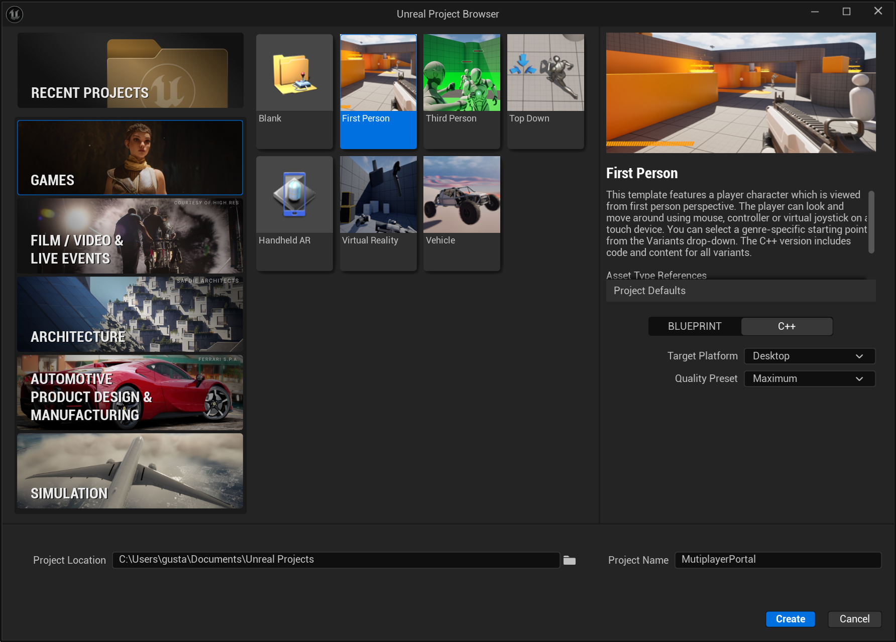
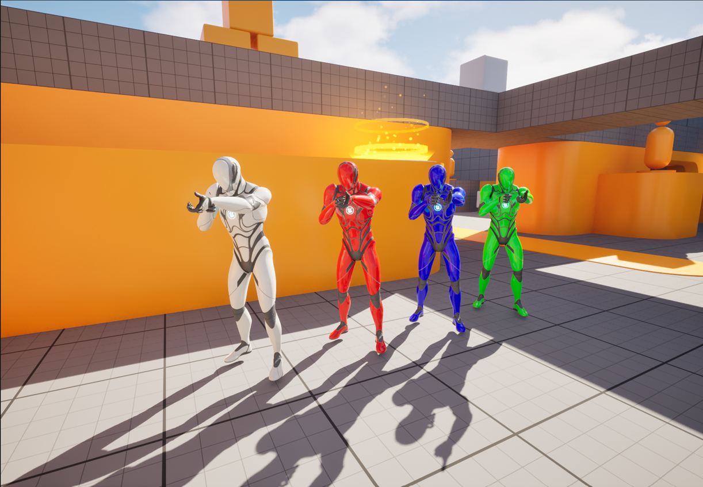

For the second part of the class project, you are going to create a simple first-person multiplayer game.

## First Person Character

For the First Person Character, you should use the **First Person template**:

This template project, already provides a functional First Person Character with skeletal meshes and animations for the first-person and third person views. It also has several gun meshes. 

## Controls

The game should use the following controls:

| Control | Action |
|---|---|
| **W A S D** | Move character |
| **Space** | Jump |
| **Mouse** | Aim |
| **Left mouse button** | Fire gun / Fire blue portal |
| **Right mouse button** | Fire orange portal |
| **Q / E** | Previous / Next weapon |
| **R** | Reload |

## Player Colors

The characters controlled by the players must have different colors: white, red, blue and green.

The color for each player is specified on the following table:

| Player | Color |
|---|---|
| Player 1 | White |
| Player 2 | Red |
| Player 3 | Blue |
| Player 4 | Green |

## Weapons

There are four different weapons: **rifle**, **pistol**, **grenade launcher** and the **portal gun**. With the assault rifle, it is possible to kill the other players instantly with head shots.

Both **rifle** and **pistol** should use **Line Traces** instead of projectiles.

Those guns should appear on the map, for the players to pick them up. When a gun is picked up, it will disappear and will respawn after 60 seconds, except the Portal Gun. The Portal Gun only respawns when the owning player dies.

The weapon cooldowns are the following:

| Gun | Cooldown |
|---|---|
| Rifle | 0.2 seconds |
| Pistol | 2 seconds |
| Grenade Launcher | 5 seconds |

As previously mentioned, the assault rifle might kill the opponent instantly if he is hit on the head. Shotgun has more radial damage, and the rocket launcher even more. The amount of damage taken by each weapon is defined by the students, according to the max HP of the player characters. It is up to the students to balance the weapons power and player characters HP.

Each weapon has a certain number of ammunitions. When that value reaches zero, the character has run out of ammunition and must reload the corresponding weapon.

| Gun | Ammunition |
|---|---|
| Assault rifle | 10 |
| Shotgun | 2 |
| Rocket Launcher | 5 |

Like the weapons, ammunition should be placed along the level, for the players to pick them up. The ammunition will also respawn after 60 seconds.

## Game Start

When the game starts, the players are spawned in random **Player Start Actors** placed on the level. Each level must have at least 4 different **PlayerStart Actors** placed along the map, so each player character can be spawned in a randomly chosen one.

## HUD

As in any First-Person shooter, there must be a HUD with all the information that is relevant: amount of ammo, HP, kills, deaths, and so on.

## Extra Credits

For obtaining the extra credits, the students are required to implement networking on different computers: one computer will act as the host and the others as the clients. The host will host the game, for the clients to join. When all players are ready, the game will start.

::: {.callout-note}
Since this feature is an extra credit, students will not have the help and support of the professor on this task.
:::

## Report

Together with the project, there must be a report in PDF format with a description of all the implemented algorithms and a justification of the choices made. The report shall cite all references (books, websites, etc.) in which the algorithms were based. The report should also explicitly include the objectives achieved and not achieved.

## Evaluation

The evaluation criteria are as follows:

| Criteria | Mark |
|---|---|
| First Person Character | 30% |
| Controls | 5% |
| Game Start | 12.5% |
| Weapons and ammo | 12.5% |
| Damage | 30% |
| Report | 10% |
| Extra Credits | 10% |

## Rules

1. **Deadline for submission:** 27th June 2024
2. The work must be performed by the same students' groups of the previous class project.
3. On 2nd July there will be a public oral presentation, where all the students present their projects. Projects that are not presented, will not be considered.
