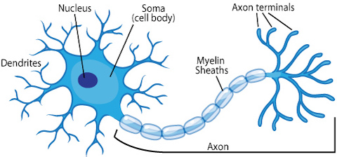
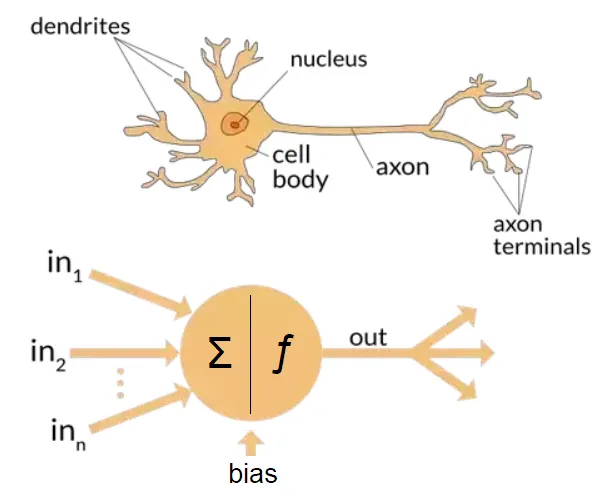
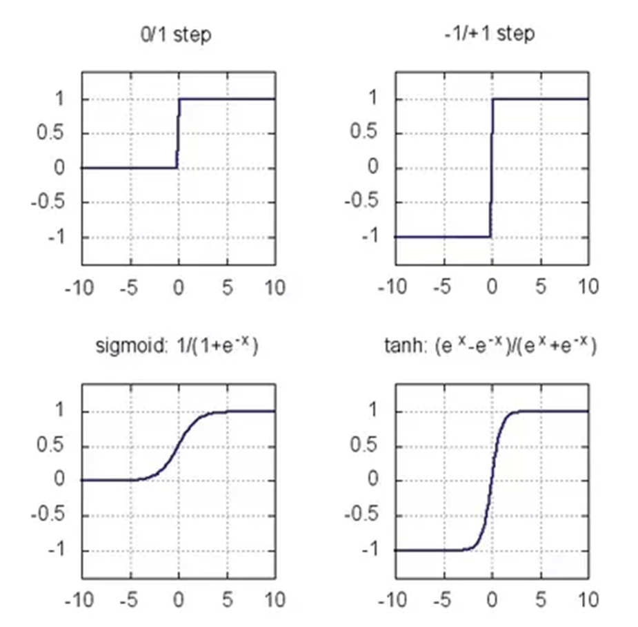
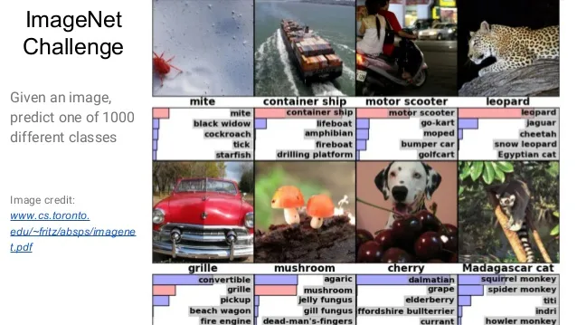

## Buzz Words

::: {.fragment}
AI - Artificial Intelligence
:::

::: {.fragment}
Machine Learning
:::

# Artificial Intelligence

## Approaches to AI

|           | **Human** | **Rational** |
|-----------|-----------|--------------|
| **Think** | The exciting new effort to make computers think… (Haugeland 1985) | The study of computations that make it possible to perceive, reason and act (Winston 1992) |
| **Act**   | The study of how to make computers do things at which at the moment people are better (Rich & Knight 1992) | The study and construction of rational agents (Russell & Norvig 1995) |

::: {.fragment}
"By distinguishing between *human* and **rational** [behavior]{style="color:red"}, we are not suggesting that humans are necessarily 'irrational'… [One merely need note that we are not perfect]{style="color:green"}: not all chess players are grandmasters, and, unfortunately, not everyone gets an A on the exam."
:::

# "Zipped" History of AI

## 1943–1956: Gestation and Birth

::: {.incremental}
- W. McCulloch and W. Pitts proposed a model of artificial neurons
- C. Shannon and A. Turing were already writing programs to play chess (even without access to computers…)
- During the 1950s, A. Newell and H. Simon developed a program capable of proving mathematical theorems
- In 1956 there was a workshop where the name **"Artificial Intelligence"** was born
:::

## 1952–1969: Early Enthusiasm, Great Expectations

::: {.incremental}
- Many problems were solved whose resolution by computers was considered impossible
- A. Samuel developed a program that learned to play checkers at strong amateur level
- The [Lisp]{style="color:blue"} programming language was created in this period
- A. Newell and H. Simon developed the [General Problem Solver]{style="color:red"}, aiming to simulate human reasoning
- Time Sharing (DEC)
- Microworlds — most notable example: **Blocks world**
:::

## 1966–1974: A Dose of Reality

::: {.incremental}
- In 1958, H. Simon predicted a chess champion computer and a major theorem proof within 10 years
- Programs knew nothing about subject matter; succeeded by simple syntactic manipulation
  - "The spirit is willing but the flesh is weak" → "The vodka is good but the meat is rotten"
- Methods for simple problems could not scale to general/difficult problems
- Insufficient computational power
- *Perceptrons* book (Minsky and Papert, 1969) addressed perceptron limitations
- Strong decrease in AI research funding — the **"AI Winter"**
- [Only in 1997 did a computer beat the human chess world champion]{style="color:red"}
:::

## 1969–1979: Knowledge Based Systems

::: {.incremental}
- Realized the necessity of domain knowledge to achieve better results
- [Expert systems]{style="color:blue"}: systems intended to simulate the reasoning of a domain expert
  - Examples: Tendril (molecular structures), MyCin (bacteria identification)
- Strong effort in knowledge representation methods
- Creation of the [Prolog]{style="color:red"} programming language
:::

## 1980–Present: AI Becomes an Industry

::: {.incremental}
- **1980 – Present:** AI starts to pay — expert systems, robotics, vision systems
- **1986 – Present:** Return of neural networks — driven mainly by backpropagation
- **1987 – Present:** AI adopts the scientific method
  - [Building on existing theories rather than proposing brand new ones]{style="color:blue"}
  - [Basing claims on rigorous theorems or hard experimental evidence]{style="color:red"}
  - [Showing relevance to real-world applications rather than toy examples]{style="color:green"}
:::

# Humans Are Inspired by Nature

## Nature as Blueprint

::: {.incremental}
- **Birds** → Flying → Airplanes
- **Horses** → Cars
- **Bio-Inspired Computing**
  - Evolutionary Algorithms — Evolution
  - Cellular Automata — Life
  - Ant Colony Optimization — Ants
  - Particle Swarm Optimization — Birds Flocking
  - **Artificial Neural Networks — Biological Neural Networks**
:::

# The Brain

## The Biological Neuron

{width=40%}

::: {.incremental}
- Neurons are the fundamental unit of nervous system tissue
- Three components of interest:
  - **Dendrites**
  - **Soma**
  - **Axon**
:::

## Structure

{width=40%}

::: {.incremental}
- Each neuron has a cellular body with branches (dendrites) and a longer isolated branch (axon)
- Dendrites connect to other neurons' axons through **synapses**
- A neuron can be connected to hundreds of thousands of other neurons
:::

## Signal Propagation

{width=40%}

::: {.incremental}
- Signals propagate via electrochemical reactions through synapses
- These can raise or diminish the electrical potential of the cell body
- If potential surpasses a threshold, an electrical impulse is sent along the axon
:::

## Scale and Learning

{width=40%}

::: {.incremental}
- ~100 billion neurons, each connected to up to 10,000 others → 100–1,000 trillion synapses
- Frequently used connections become stronger; new connections can form — **this leads to learning**
- Computation is strongly parallel and asynchronous
:::

# Artificial Neural Networks

## From Biology to Math

::: {.incremental}
- Artificial neurons differ from biological ones in several ways
:::

::: {.incremental}
- Perceptrons mimic dendrites, cell bodies and axons with simplified mathematical models: signals are received and forwarded once enough input accumulates
:::

## The Perceptron Model

{width=30%}

::: {.incremental}
- Outgoing signals feed into other neurons, repeating the process
- Some signals are more important (weighted) than others
- Connections can strengthen or weaken
- Modelled as: weighted sum of inputs → activation if bias is exceeded
- This simplified model ignores connection creation/destruction and signal timing
- Yet powerful enough for simple classification tasks
:::

## The Mark I Perceptron

Invented by Frank Rosenblatt — originally mechanical hardware for image recognition (US Navy)



## The Hype Was Real

::: {.incremental}
- A machine that mimics learning from experience?
- Learns from examples instead of hard-coded instructions?
- The *New York Times*, 1958: "the Navy [has] revealed the embryo of an electronic computer… that it expects will be able to walk, talk, see, write, reproduce itself and be conscious of its existence."
:::

## Evolution of NN Architectures

Addressing the limitations of single-layer perceptrons in solving non-linear problems.

::: {.incremental}
- **Limitations:** Single-layer perceptrons cannot solve non-linear problems (e.g. XOR)
- **Need for hidden layers:** Complex data requires multi-layer architectures
- **Training challenges:** Early multi-layer training relied on random weight adjustments
- **Breakthrough:** Continuous activation functions enabled effective training of deep networks
- **Impact:** Modelling more complex relationships, improved overall performance
:::

## Transfer / Activation Functions

{width=60%}

## Transformative Advances

::: {.incremental}
- **Model change:** Binary → continuous output values; neurons can participate in calculus
- **Backpropagation:** Efficient gradient-based training of multiple layers
- **Continuous vs. binary:** Unlike biological neurons, artificial neurons emit continuous signals
- **Terminology note:** "Multilayer perceptron" is a misnomer — they use artificial neurons, not perceptrons
- **Computational costs** limited adoption until hardware and data caught up
- **AlexNet (2012):** Won ImageNet challenge without handcrafted features — deep learning renaissance
:::

## AlexNet

{width=100%}

# Large Language Models & Transformers

## What is a Transformer?

::: {.incremental}
- Introduced in **"Attention Is All You Need"** (Vaswani et al., 2017)
- Replaces recurrent layers with **self-attention mechanisms**
- Parallelisable — unlike RNNs, processes entire sequences at once
- Foundation of virtually all modern LLMs: GPT, BERT, LLaMA, Claude…
:::

## The Attention Mechanism

::: {.incremental}
- Core idea: **not all tokens are equally relevant to each other**
- For each token, compute a weighted combination of all other tokens
- Weights (attention scores) are learned — not hand-crafted
- $\text{Attention}(Q,K,V) = \text{softmax}\!\left(\frac{QK^T}{\sqrt{d_k}}\right)V$
- **Multi-head attention:** run several attention functions in parallel, then concatenate
:::

## Transformer Architecture

::: {.incremental}
- **Encoder:** maps input tokens → contextual representations
- **Decoder:** generates output tokens auto-regressively
- Key components per block:
  - Multi-head self-attention
  - Feed-forward network (MLP)
  - Layer normalisation + residual connections
- **Positional encodings** inject sequence order (no recurrence needed)
:::

## From Transformers to LLMs

::: {.incremental}
- **Pre-training:** predict next token on massive corpora (GPT) *or* mask tokens (BERT)
- **Scale laws:** performance improves predictably with model size, data, and compute
- **Fine-tuning / RLHF:** align the base model to follow instructions and human preferences
- **Emergent capabilities:** chain-of-thought reasoning, in-context learning, tool use — not explicitly trained
:::

## Key LLM Milestones

::: {.incremental}
- **GPT-2 (2019):** language modelling at scale — too dangerous to release (initially)
- **GPT-3 (2020):** 175B parameters; few-shot learning without gradient updates
- **BERT / RoBERTa:** encoder-only; state-of-the-art on classification and NLU tasks
- **AlphaCode / Codex:** code generation and synthesis
- **ChatGPT (2022):** RLHF-tuned GPT — mass adoption milestone
- **GPT-4, Claude, Gemini, LLaMA (2023–2025):** multi-modal, long-context, open-weight variants
:::

## Deep Learning + LLMs: Applied

::: {.incremental}
- **NN approach 1:** Fine-tune a pre-trained language model on domain-specific text
  - Example: RoBERTa for technical document classification
- **NN approach 2:** Use LLMs with structured prompting for information extraction
  - Input: raw document text + schema; Output: structured JSON
- **NN approach 3 — End-to-end multi-modal**
  - Vision encoder (e.g. ViT, ResNet) + LLM decoder
  - Process images *and* text in a single unified model
  - Examples: GPT-4V, LLaVA, Qwen2.5-VL
:::

## Vision-Language Models (VLMs)

::: {.incremental}
- Extend transformers to handle **images as sequences of patch tokens**
- ViT (Vision Transformer): split image into 16×16 patches → token embeddings
- Combine with a language model via cross-attention or projection layers
- Applications: document OCR, chart understanding, scene description, medical imaging
- Modern stacks: **CLIP** (contrastive image-text), **Flamingo**, **LLaVA**, **Qwen2.5-VL**
:::

## Current Experiments: LLM-Based Extraction

::: {.incremental}
- Input documents processed by a VLM OCR backbone (e.g. Nanonets-OCR-s)
- Structured extraction via prompt engineering and schema validation
- Multi-country, multi-document-type pipelines
- Results validated against ground-truth structured records
:::

## Scaling and Efficiency

::: {.incremental}
- Full fine-tuning of LLMs is prohibitively expensive for most organisations
- **LoRA / QLoRA:** low-rank adapters — fine-tune a fraction of parameters
- **Quantisation:** INT4/INT8 weights reduce VRAM by 2–4×
- **Inference optimisation:** KV-cache, flash attention, speculative decoding
- **Local deployment:** llama.cpp, Ollama — run 7–13B models on consumer GPUs
:::

# Future Directions

## What Comes Next?

::: {.incremental}
- **Longer context windows:** from 4K → 128K → 1M+ tokens
- **Agentic systems:** LLMs that plan, call tools, and execute multi-step workflows
- **Mixture of Experts (MoE):** conditional computation — only activate a subset of parameters per token
- **Test-time compute:** more inference steps → better reasoning (o1, DeepSeek-R1 style)
- **Multi-modal fusion:** unified models for text, image, audio, video, and structured data
:::

## Open Research Challenges

::: {.incremental}
- Hallucination and factual grounding
- Reliable tool use and long-horizon planning
- Interpretability and mechanistic understanding
- Data efficiency and continual learning
- Safety, alignment, and robustness at scale
:::

# Questions? {.center}
