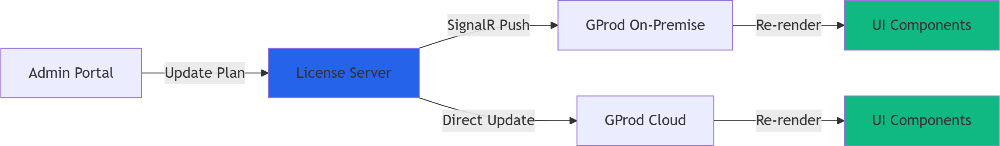

## Overview {.center}


:::: {.columns}
::: {.column width="50%"}
### Challenges {.fragment}
::: {.incremental}
- Annual subscription enforcement
- Prevent illegal copies
- Module-based licensing
- Support on-premise & cloud
- Instant module updates
:::
:::

::: {.column width="50%"}
### Solution {.fragment}
::: {.incremental}
- Hybrid licensing system
- Central validation server
- Real-time module control
- Hardware fingerprinting
- Grace period management
:::
:::

::::

---

## Architecture Overview


### Central License Server (at GETGAIN) {.fragment}
::: {.incremental}
- Stores all customer licenses, expiration dates, enabled modules
- REST API for license validation
- Real-time module enable/disable capability
- Tracks active installations and usage
:::

---

## Deployment Scenarios

:::: {.columns}
::: {.column width="50%"}
### On-Premise Installation
- Installed on client's server
- Local license cache
- Periodic online validation
- Hardware fingerprinting
- Grace period for offline operation
:::

::: {.column width="50%"}
### Cloud Installation
- Hosted on GETGAIN cloud
- Real-time license validation
- No local caching needed
- Direct module control
- Instant updates
:::
::::

::: {.notes}
Both scenarios require annual fees and support module-based licensing
:::

---

## License Token Structure

```json
{
  "licenseId": "550e8400-e29b-41d4-a716-446655440000",
  "customerId": "cust_123456",
  "installationId": "inst_789012",
  "validFrom": "2024-01-01T00:00:00Z",
  "validUntil": "2024-12-31T23:59:59Z",
  "modules": {
    "core": true,
    "resource_management": true,
    "reporting": false,
    "advanced_analytics": false
  },
  "constraints": {
    "maxUsers": 50,
    "maxConcurrentSessions": 10
  },
  "hardwareFingerprint": "hash_of_hardware_ids",
  "signature": "RSA_signature_here"
}
```

---

## Hardware Fingerprinting

### Components Used
- MAC Address (primary network adapter)
- CPU Serial Number
- System UUID
- Disk Serial Number

### Tolerance Strategy
```csharp
public class HardwareFingerprint
{
    public string GenerateFingerprint()
    {
        var components = new[] {
            GetMacAddress(),
            GetCpuId(),
            GetSystemUuid(),
            GetDiskSerial()
        };
        
        // Allow 1-2 component changes
        return CreateTolerantHash(components);
    }
}
```

---

## Module Control Implementation

### Blazor Component Integration

```csharp
@inject ILicenseService LicenseService

<div class="module-container">
    @if (LicenseService.IsModuleEnabled("resource_management"))
    {
        <ResourceManagementModule />
    }
    
    @if (LicenseService.IsModuleEnabled("reporting"))
    {
        <ReportingModule />
    }
    else
    {
        <UpgradePrompt Module="reporting" />
    }
</div>
```

### Real-time Updates
- SignalR connection for instant module changes
- No application restart required

---

## Validation Flow - On-Premise

```{mermaid}
%%{init: {'theme':'dark'}}%%
sequenceDiagram
    participant GProd
    participant Cache
    participant License Server
    
    GProd->>Cache: Check local license
    alt Valid Cache
        Cache-->>GProd: Return cached license
    else Expired/Invalid
        GProd->>License Server: Request validation
        License Server->>License Server: Verify license
        License Server-->>GProd: Return license + modules
        GProd->>Cache: Update cache
    end
    
    GProd->>GProd: Enable/Disable modules
```

---

## Grace Period Management

:::: {.columns}
::: {.column width="60%"}
### Progressive Warnings
```csharp
public enum GracePeriodStatus
{
    Active,           // 0-7 days offline
    Warning,          // 8-14 days offline
    Critical,         // 15-29 days offline
    Expired           // 30+ days offline
}
```
:::

::: {.column width="40%"}
### User Experience
- **Days 1-7**: Normal operation
- **Days 8-14**: Warning banner
- **Days 15-29**: Daily reminders
- **Day 30+**: Read-only mode
:::
::::

---

## Anti-Piracy Measures

### Multiple Layers of Protection

1. **Installation Tracking**
   - Unique installation IDs
   - Concurrent installation limits
   - Activation/deactivation logs

2. **Cryptographic Security**
   - RSA-signed licenses
   - Encrypted local cache (DPAPI)
   - Certificate pinning for API calls

3. **Code Protection**
   - .NET assembly obfuscation
   - Anti-debugging techniques
   - Integrity checks

---

## License Server API

### Key Endpoints

```yaml
POST   /api/license/validate
GET    /api/license/{customerId}/modules
POST   /api/license/activate
POST   /api/license/deactivate
GET    /api/license/heartbeat
PUT    /api/license/{customerId}/update
```

### Response Example
```json
{
  "status": "valid",
  "modules": ["core", "resource_management"],
  "expiresIn": 256,
  "message": "License valid until 2024-12-31"
}
```

---

## Instant Module Updates




### Implementation
- WebSocket connection via SignalR
- Event-driven module state changes
- No restart required

---

## Technology Stack

:::: {.columns}
::: {.column width="50%"}
### Backend
- **ASP.NET Core** - License Server
- **SQL Server** - License Database
- **SignalR** - Real-time updates
- **Redis** - Caching layer
:::

::: {.column width="50%"}
### Frontend Integration
- **Blazor** - GProd application
- **HttpClient** - API communication
- **.NET Cryptography** - License validation
- **DPAPI** - Local encryption
:::
::::

---

## Monitoring & Analytics

### Track Key Metrics
- License validation attempts
- Module usage statistics
- Failed activation attempts
- Geographic distribution
- Suspicious activity patterns

### Alert Triggers
- Multiple installation attempts
- Unusual hardware changes
- Expired license usage
- Geographic anomalies

---

## Migration Strategy

### For Existing Clients

1. **Preparation**
   - Generate licenses for all existing clients
   - Map current features to modules

2. **Rollout**
   - Deploy update with grace period
   - Automatic license activation
   - Monitor activation success

3. **Support**
   - Help desk for activation issues
   - Remote assistance tools
   - Clear documentation

---

## Benefits

:::: {.columns}
::: {.column width="50%"}
### Business Benefits
- ✅ Recurring revenue protection
- ✅ Flexible pricing models
- ✅ Instant plan upgrades
- ✅ Usage analytics
- ✅ Reduced piracy
:::

::: {.column width="50%"}
### Technical Benefits
- ✅ Centralized control
- ✅ Scalable architecture
- ✅ Real-time updates
- ✅ Offline capability
- ✅ Secure implementation
:::
::::

---

## Security Considerations

### Best Practices
- Regular security audits
- Penetration testing
- Key rotation policy
- Secure API communication (TLS 1.3)
- Rate limiting on API endpoints
- Audit logs for all license operations

### Compliance
- GDPR compliant data handling
- Minimal personal data collection
- Clear data retention policies

---

## Support & Maintenance

### Client Support
- Self-service portal for license management
- Automatic renewal notifications
- Clear error messages with action steps

### System Maintenance
- Automated backup procedures
- Health check endpoints
- Performance monitoring
- Regular updates and patches

---

## Questions & Next Steps {.center}

### Next Steps
1. Approve architecture design
2. Set up development environment
3. Begin Phase 1 implementation
4. Create detailed API documentation
5. Prepare client communication

---

## Appendix: Code Examples

### License Validation Service

```csharp
public class LicenseService : ILicenseService
{
    private readonly HttpClient _httpClient;
    private readonly ILocalCache _cache;
    
    public async Task<LicenseInfo> ValidateLicenseAsync()
    {
        // Try local cache first
        var cached = await _cache.GetLicenseAsync();
        if (cached?.IsValid() == true)
            return cached;
        
        // Validate with server
        var response = await _httpClient.PostAsJsonAsync(
            "/api/license/validate",
            new { 
                InstallationId = GetInstallationId(),
                Fingerprint = GetHardwareFingerprint()
            });
            
        if (response.IsSuccessStatusCode)
        {
            var license = await response.Content
                .ReadFromJsonAsync<LicenseInfo>();
            await _cache.StoreLicenseAsync(license);
            return license;
        }
        
        // Fall back to grace period
        return HandleGracePeriod(cached);
    }
}
```

---

## Appendix: Database Schema

```sql
CREATE TABLE Licenses (
    LicenseId UNIQUEIDENTIFIER PRIMARY KEY,
    CustomerId NVARCHAR(100) NOT NULL,
    CreatedDate DATETIME2 NOT NULL,
    ValidFrom DATETIME2 NOT NULL,
    ValidUntil DATETIME2 NOT NULL,
    MaxInstallations INT DEFAULT 1,
    Status NVARCHAR(20) NOT NULL
);

CREATE TABLE LicenseModules (
    LicenseId UNIQUEIDENTIFIER,
    ModuleName NVARCHAR(50),
    IsEnabled BIT,
    EnabledDate DATETIME2,
    FOREIGN KEY (LicenseId) REFERENCES Licenses(LicenseId)
);

CREATE TABLE Installations (
    InstallationId UNIQUEIDENTIFIER PRIMARY KEY,
    LicenseId UNIQUEIDENTIFIER,
    HardwareFingerprint NVARCHAR(256),
    ActivationDate DATETIME2,
    LastHeartbeat DATETIME2,
    IsActive BIT,
    FOREIGN KEY (LicenseId) REFERENCES Licenses(LicenseId)
);
```
