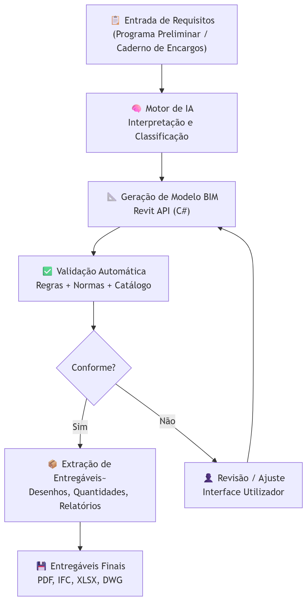
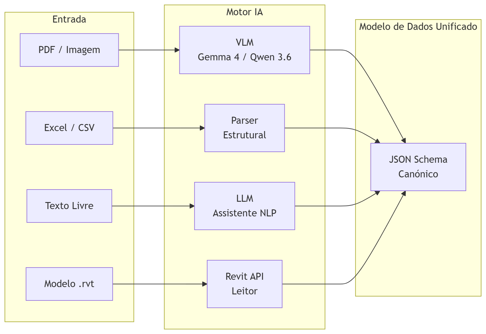
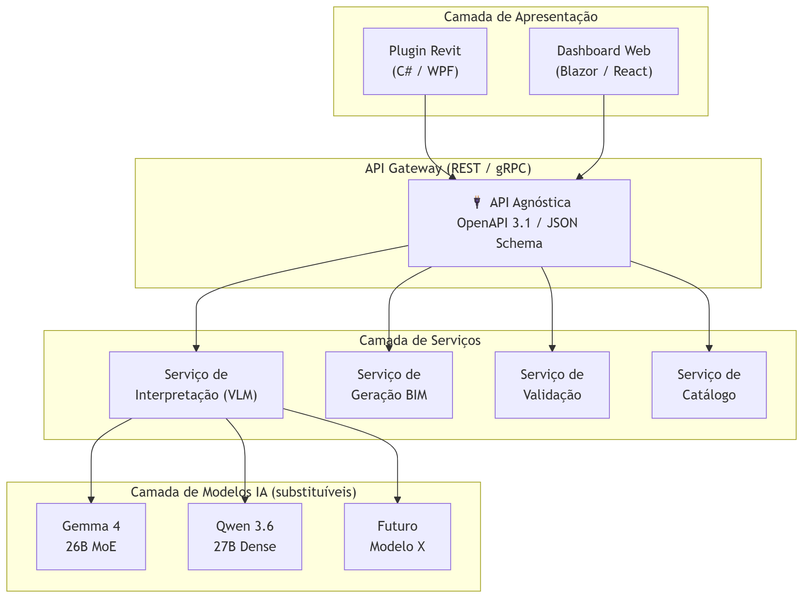
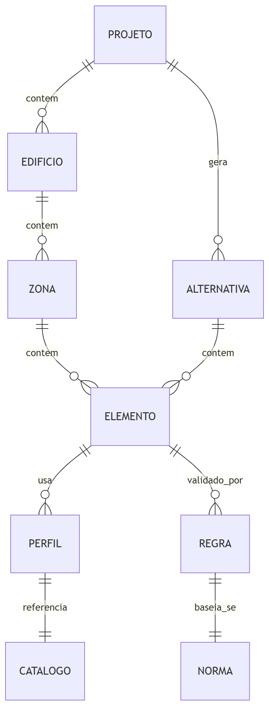
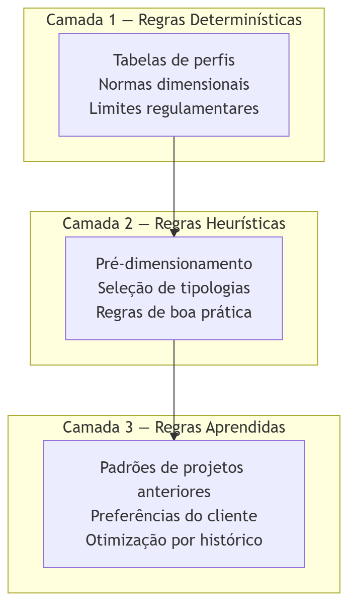
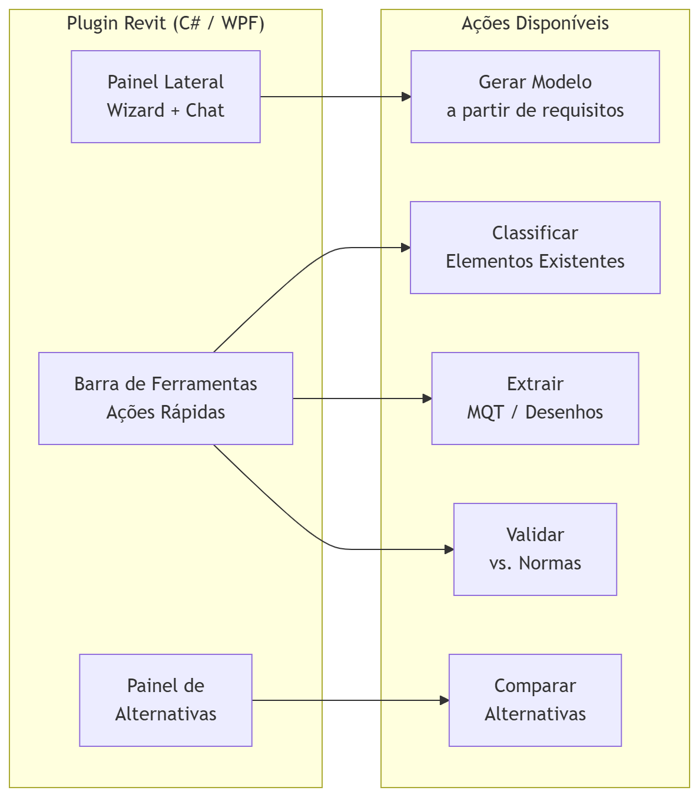

### Agenda

Esta apresentação responde aos 4 pontos solicitados pela Norton:

::: {.incremental}
1. **Fluxo de trabalho** — desde a entrada de requisitos até à extração de entregáveis
2. **Modelo de dados e API** — comunicação com a API e independência tecnológica
3. **Digitalização de regras e catálogo de soluções** — dentro do motor de automação
4. **Experiência do utilizador** — interação com as ferramentas de automação
:::

:::{.fragment}
Complementa a apresentação de portfólio IA da GETGAIN, onde se detalham os projetos de referência e a estratégia anti-alucinação.
:::

---

## 1. Fluxo de Trabalho {.center}

> Desde a entrada de requisitos até à extração de entregáveis

---

### Fluxo de Trabalho — Visão Geral

{fig-align="center"}

---

### Entrada de Requisitos — Como funciona

O sistema aceita requisitos de **múltiplas formas**, adaptando-se ao workflow existente da Norton:

:::{.fragment}
- 📄 **Documentos digitalizados** — PDFs de programas preliminares, cadernos de encargos, especificações de cliente. O VLM (Gemma 4 / Qwen 3.6) extrai dados estruturados automaticamente.
:::

:::{.fragment}
- 📊 **Ficheiros estruturados** — Excel/CSV com parâmetros (vãos, cargas, tipos de perfil, áreas). Importação direta sem OCR.
:::

:::{.fragment}
- 💬 **Linguagem natural** — O utilizador descreve o que precisa em texto livre (ex: "pavilhão logístico 40×80m, 3 naves, cobertura deck, pé-direito 10m"). O LLM interpreta e gera os parâmetros.
:::

:::{.fragment}
- 🏗️ **Modelo Revit existente** — Importação de .rvt para enriquecimento, classificação automática ou geração de alternativas.
:::

---

### Processamento pelo Motor de IA

{fig-align="center"}

:::{.fragment}
Independentemente da entrada, o resultado é sempre um **JSON Schema canónico** — o formato interno que alimenta todas as operações seguintes.
:::

---

### Extração de Entregáveis

A partir do modelo BIM gerado/atualizado, o sistema extrai automaticamente:

:::: {.columns}
::: {.column width="50%"}

:::{.fragment}
### Documentação Técnica

- 📐 Desenhos de vistas (plantas, cortes, alçados) — geração automática via Revit API
- 📋 Mapas de Quantidades de Trabalho (MQT)
- 📊 Comparativo de alternativas (custos, quantidades, pesos)
- 📄 Memória descritiva gerada por LLM com base nos parâmetros do modelo
:::

:::

::: {.column width="50%"}

:::{.fragment}
### Formatos de Saída

| Entregável | Formato |
|-----------|---------|
| Desenhos técnicos | **PDF / DWG** |
| Modelo BIM | **RVT / IFC** |
| Quantidades | **XLSX** |
| Relatórios | **PDF / DOCX** |
| Dados estruturados | **JSON / XML** |
:::

:::
::::

---

## 2. Modelo de Dados e API {.center}

> Comunicação com a API e independência tecnológica

---

### Arquitetura — Independência Tecnológica

{fig-align="center"}


---

### Independência Tecnológica — Princípios

:::{.fragment}
### 🔄 Modelos substituíveis sem alterar o sistema

A API comunica com os modelos de IA através de uma **camada de abstração**. Se amanhã surgir um modelo melhor que o Gemma 4 ou o Qwen 3.6, basta trocar o adaptador — o resto do sistema (API, Revit plugin, validação, catálogo) **não muda**.
:::

:::{.fragment}
### 📐 Contrato de dados via JSON Schema

Todos os serviços comunicam através de **schemas JSON versionados**. O modelo de IA recebe um prompt estruturado e devolve um JSON validado contra o schema — nunca texto livre. Isto garante interoperabilidade entre componentes.
:::

:::{.fragment}
### 🏠 100% On-Premise

Toda a infraestrutura corre dentro do perímetro da Norton. Os modelos são open-source (Apache 2.0) e correm em hardware local. Sem dependência de APIs cloud, sem subscrições, sem envio de dados para fora.
:::

---

### Gemma 4 e Qwen 3.6 — Porquê estes modelos?

:::: {.columns}
::: {.column width="50%"}

### Gemma 4 (Google DeepMind)

- 🏷️ **Licença:** Apache 2.0
- 🧠 **26B MoE** — 3.8B parâmetros ativos por token
- 📄 **OCR e document parsing nativos** — DocVQA, ChartQA
- 📐 **Token budget variável** (70–1120 por imagem) — ajustável por tarefa
- ⚡ **Function calling nativo** com JSON estruturado
- 💾 **24GB VRAM** (RTX 3090/4090)
- 🔧 **Contexto:** 256K tokens

:::

::: {.column width="50%"}

### Qwen 3.6 (Alibaba)

- 🏷️ **Licença:** Apache 2.0
- 🧠 **27B Dense** — todos os parâmetros ativos
- 📄 **Visão multimodal unificada** — text + image early fusion
- 📐 **Thinking Preservation** — mantém cadeia de raciocínio
- ⚡ **77.2% SWE-bench** — forte em código (Revit API)
- 💾 **18GB VRAM** — corre em GPUs mais acessíveis
- 🔧 **Contexto:** 262K nativo, extensível a 1M tokens

:::
::::

:::{.fragment}
**Estratégia:** Ambos os modelos correm on-premise. O sistema seleciona automaticamente o melhor modelo por tarefa — Gemma 4 para OCR/documentos, Qwen 3.6 para raciocínio e geração de código Revit.
:::

---

### Modelo de Dados — Estrutura

{fig-align="center"}

:::{.fragment}
O modelo de dados é **agnóstico ao Revit** — funciona como representação intermédia que pode alimentar qualquer plataforma BIM (Revit, Tekla, ArchiCAD) ou exportar para IFC.
:::

---

## 3. Digitalização de Regras e Catálogo {.center}

> Como são estruturadas as regras e o catálogo de soluções dentro do motor de automação

---

### Catálogo de Soluções — Estrutura

O catálogo é a **base de conhecimento** do motor de automação. Contém as soluções construtivas, perfis, tipologias e regras de negócio da Norton, digitalizadas e versionadas.

:::: {.columns}
::: {.column width="50%"}

:::{.fragment}
### Tipologias Construtivas

- Estruturas primárias (pórticos, treliças)
- Estruturas secundárias (madres, contraventamento)
- Tipos de cobertura (deck, sandwich, fibrocimento)
- Tipos de fachada (painel sandwich, betão, mista)
- Fundações (sapatas, lintéis, estacas)

Cada tipologia tem **parâmetros configuráveis** e **regras de aplicabilidade**.
:::

:::

::: {.column width="50%"}

:::{.fragment}
### Catálogo de Perfis

- Tabelas de perfis: HEB, HEA, IPE, HEM, UPN, L, tubulares
- Propriedades mecânicas: Iy, Iz, Wy, Wz, A, peso/m
- Regras de seleção por vão, carga e tipo de elemento
- Fornecedores preferenciais e prazos de entrega

Todos os dados são **verificáveis** — o sistema valida que "HEB 300" corresponde às dimensões corretas na tabela.
:::

:::
::::

---

### Digitalização de Regras — Abordagem

As regras são digitalizadas em **3 camadas** progressivamente mais complexas:

{fig-align="center"}


---

### Camada 1 — Regras Determinísticas

Regras que **não admitem interpretação** — são factuais e verificáveis.

- ✅ Tabelas de perfis metálicos (dimensões, pesos, propriedades)
- ✅ Regulamento de Estruturas de Aço (Eurocódigo 3)
- ✅ Limites de deformação (L/200, L/250, L/300 conforme uso)
- ✅ Classes de exposição e proteção ao fogo
- ✅ Distâncias mínimas (pilares a empenas, eixos modulares)

:::{.fragment}
**Formato:** YAML/JSON versionados em repositório Git. Cada alteração é rastreável.

```yaml
perfil_heb_300:
  h: 300  # mm
  b: 300  # mm
  peso: 117  # kg/m
  Iy: 25170  # cm4
  classe: "S275"
```
:::

---

### Camada 2 — Regras Heurísticas

Regras de **pré-dimensionamento e boa prática** usadas na Norton — digitalizadas a partir do know-how da equipa.

- ✅ "Para vãos até 20m, pórtico simples em HEB; acima de 20m, considerar treliça"
- ✅ "Madres de cobertura IPE ou perfil enformado a frio, espaçamento 1.5–2.5m"
- ✅ "Contraventamento em Cruz de St. André para naves até 3 módulos"
- ✅ "Cobertura deck para vãos > 25m; sandwich até 15m"

:::{.fragment}
**Formato:** Regras `if/then` em ficheiros de configuração, editáveis pela equipa Norton sem programação.

```yaml
regra_selecao_portico:
  condicao: "vao_m <= 20"
  acao: "portico_simples"
  perfil_sugerido: "HEB"
  alternativa:
    condicao: "vao_m > 20"
    acao: "trelica"
```
:::

---

### Camada 3 — Regras Aprendidas

Regras que emergem da **análise de projetos anteriores** da Norton e das preferências acumuladas.

- ✅ Padrões recorrentes: tipologias mais usadas por tipo de cliente/região
- ✅ Desvios sistemáticos: "a equipa tende a sobredimensionar pilares de empena em 10%"
- ✅ Preferências de fornecedor por tipo de perfil e região geográfica

:::{.fragment}
### Como funciona sem histórico digital?

Na **Fase 0**, fazemos o levantamento dos padrões com a equipa da Norton:

1. Selecionamos 10–15 projetos representativos
2. Digitalizamos as decisões-chave de cada um
3. O sistema identifica padrões recorrentes
4. Os padrões são validados pela equipa antes de serem ativados

A Camada 3 cresce organicamente — cada projeto novo alimenta a base de conhecimento.
:::

---

## 4. Experiência do Utilizador {.center}

> Interação com as ferramentas de automação

---

### Modos de Interação

O sistema oferece **3 modos** de interação, adaptados ao perfil de cada utilizador:

:::: {.columns}
::: {.column width="33%"}

:::{.fragment}
### 🖱️ Modo Guiado

**Para:** Utilizadores menos experientes

Wizard step-by-step dentro do Revit:

1. Tipo de edifício
2. Dimensões e geometria
3. Cargas e condições
4. Seleção de tipologia
5. Geração e revisão

Interface com **dropdowns, sliders e previews 3D** — sem necessidade de conhecer o Revit em profundidade.
:::

:::

::: {.column width="33%"}

:::{.fragment}
### 💬 Modo Conversacional

**Para:** Engenheiros experientes

Chat integrado no Revit:

- "Gera um pavilhão 40×80, 3 naves, HEB"
- "Compara deck vs sandwich para esta cobertura"
- "Adiciona contraventamento à nave central"
- "Exporta MQT desta alternativa"

O LLM interpreta, executa via Revit API e mostra o resultado — **linguagem natural → ação BIM**.
:::

:::

::: {.column width="33%"}

:::{.fragment}
### ⚙️ Modo Paramétrico

**Para:** Power users / automação em lote

API direta com JSON:

```json
{
  "tipo": "pavilhao_logistico",
  "vao_m": 40,
  "comprimento_m": 80,
  "naves": 3,
  "cobertura": "deck",
  "perfil": "HEB"
}
```

Ideal para **geração automática de alternativas** e integração com ferramentas externas.
:::

:::
::::

---

### Interface — Plugin Revit

{fig-align="center"}

---

### Feedback e Transparência

O sistema é **transparente** em todas as decisões — o utilizador nunca recebe um resultado "caixa negra".

:::{.fragment}
### 📋 Rastreabilidade de decisões

Cada elemento gerado inclui um **log de decisão**: que regra foi aplicada, que perfil foi selecionado, porquê, e qual seria a alternativa. O utilizador pode aceitar, rejeitar ou ajustar.
:::

:::{.fragment}
### ⚠️ Níveis de confiança

O sistema indica o **nível de confiança** de cada extração/decisão:

| Nível | Significado | Ação |
|-------|------------|------|
| 🟢 Alta | Regra determinística aplicada | Aceite automático |
| 🟡 Média | Regra heurística + validação | Revisão recomendada |
| 🔴 Baixa | Sem regra aplicável / ambiguidade | Decisão humana obrigatória |
:::

:::{.fragment}
### 🔄 Aprendizagem com feedback

Cada decisão validada ou corrigida pelo utilizador alimenta a **Camada 3** de regras — o sistema melhora com o uso.
:::

---

## Resumo — Os 4 Pontos

:::: {.columns}
::: {.column width="50%"}

### 1. Fluxo de Trabalho

Entrada multi-formato (PDF, Excel, texto, .rvt) → Motor de IA com VLMs (Gemma 4, Qwen 3.6) → JSON Schema canónico → Revit API → Entregáveis (PDF, IFC, XLSX, DWG).

:::{.fragment}
### 2. Modelo de Dados e API

Arquitetura em camadas com API REST agnóstica. Modelos de IA substituíveis sem alterar o sistema. JSON Schema versionados como contrato. 100% on-premise, Apache 2.0, sem dependência cloud.
:::

:::

::: {.column width="50%"}

:::{.fragment}
### 3. Regras e Catálogo

3 camadas: determinísticas (tabelas/normas em YAML), heurísticas (regras if/then editáveis), aprendidas (padrões de projetos). Fase 0 com levantamento de 10–15 projetos representativos.
:::

:::{.fragment}
### 4. Experiência do Utilizador

3 modos (guiado/conversacional/paramétrico). Plugin Revit com painel lateral + chat + ações rápidas. Transparência total com logs de decisão e níveis de confiança.
:::

:::
::::

---

## Próximos Passos {.center}

### Roadmap proposto

1. **Reunião técnica** — alinhar requisitos detalhados com equipa GTEC
2. **Fase 0** — Diagnóstico (3 semanas): levantamento de 10–15 projetos, digitalização do catálogo base, setup da infraestrutura
3. **Fase 1** — Quick wins (3 meses): primeiros 5 módulos operacionais com resultados demonstráveis
4. Proposta técnica e comercial detalhada após a reunião

::: {.fragment}

### Contacto

**Gustavo Reis** — Diretor de I&D

gustavo.reis@getgainsolutions.com

GETGAIN Solutions, Lda. — Marinha Grande, Portugal

:::
