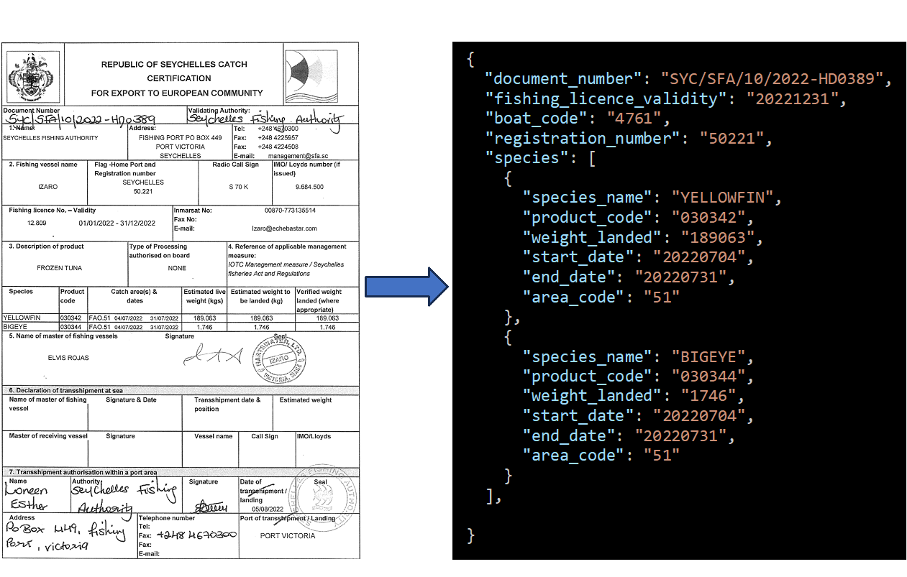
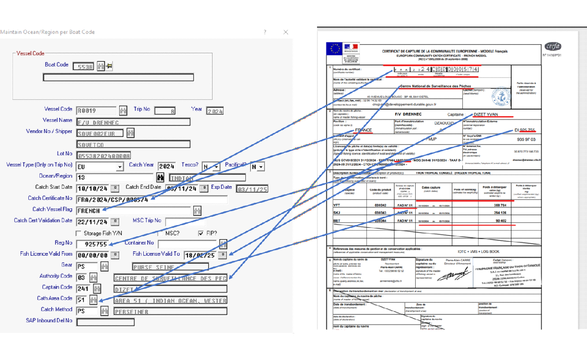
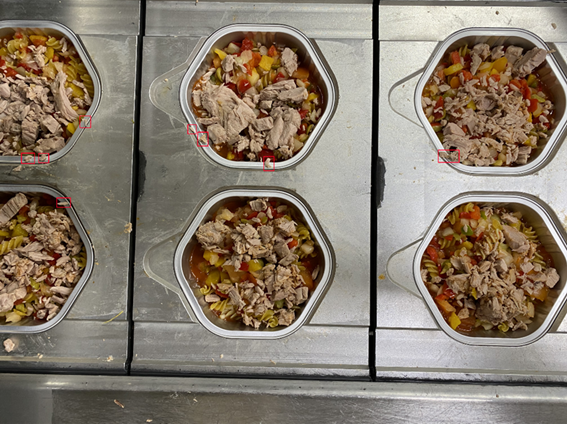
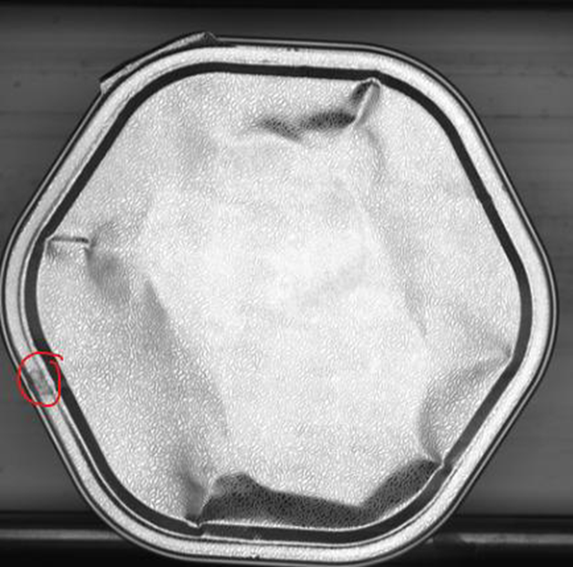

### GETGAIN Solutions, Lda.

Empresa de I&D sediada na Marinha Grande, especializada em **Inteligência Artificial aplicada** a processos industriais.

::: {.incremental}
- Engenheiros Seniores de IA & Machine Learning
- Investigadores com PhD
- Parceria académica com IPLeiria (ESTG)
- Projetos financiados CENTRO2030
:::

---

### Domínios de Atuação

::: {.incremental}
- 📄 Document AI / OCR Inteligente
- 👁️ Visão Computacional Industrial
- 📈 Forecasting & Manutenção Preditiva
- 🏗️ Automação BIM com IA
:::

::: {.notes}
Apresentação confidencial para a Norton Edifícios Industriais. Não divulgar nomes de clientes.
:::

---

## Áreas de Atuação

:::: {.columns}
::: {.column width="50%"}

:::::{.fragment}
### 📄 Document AI

Extração inteligente de dados com VLMs (modelos de linguagem visual), processamento multi-país e multi-formato, validação automática contra bases de dados.

:::::

:::::{.fragment}

### 👁️ Visão Computacional

Controlo de qualidade em linha de produção com câmaras industriais, deteção de defeitos em tempo real, segmentação de zonas e classificação automatizada.
:::::

:::

::: {.column width="50%"}

:::::{.fragment}
### 📈 Forecasting & Manutenção Preditiva

Previsão de procura com PatchTST/N-HiTS, classificação de condição de ativos industriais conforme ISO 10816-3, otimização de inventário.
:::::
:::::{.fragment}

### 🏗️ Automação BIM

Análise de desenhos de engenharia com VLMs locais, plugins Revit API (C#), automação de modelação estrutural, assistentes LLM integrados em ambiente CAD.
:::::
:::
::::

---

### Projeto — Document AI (S3C/DocAI)

:::{.fragment}
**Setor:** Comércio Internacional / Indústria Pesqueira
:::

:::{.fragment}
Pipeline de processamento automático de certificados de captura e documentos comerciais de múltiplos países, com extração de dados estruturados via VLMs.

{fig-align="center"}
:::

---

{fig-align="center"}

---


### Arquitetura e capacidades

- ✅ VLM Nanonets-OCR-s — prompts YAML externalizados e versionados por país/documento
- ✅ Suporte multi-país: Seychelles, Espanha, França — lógica de validação específica por país
- ✅ Multi-documento: Catch Certificates, Waybills, IUU Auth., Health Certificates
- ✅ `ProcessorRegistry` (factory pattern) + herança país × tipo de documento
- ✅ PDFs multi-página (ex: certificados espanhóis com espécies na 2ª página)
- ✅ Validação cruzada com bases de dados e ground truth — métricas por campo
- ✅ Flask REST API para integração com ERP existentes

**Stack:** Python, Flask, Nanonets-OCR-s, HuggingFace, CUDA — deploy on-premise com quantização GGUF/Q4_K_M para GPUs 8GB

---

### Resultados

| Métrica | Valor |
|---------|-------|
| Precisão de extração | **~98%** por campo |
| Velocidade | **10x** mais rápido que manual |
| Templates | **11** prompts (3 países × 4 tipos) |

:::{.fragment}

### Relevância para a Norton

A mesma arquitetura — **VLMs + prompts YAML + JSON schemas + validação automática** — é exatamente o que propomos para a análise de desenhos de engenharia. A tecnologia está **testada e em produção**.
:::

---

### Projeto — Smart Spillage Detection System (SSDS)

:::{.fragment}
**Setor:** Indústria Alimentar / Conserveira
:::

:::{.fragment}
Sistema de inspeção visual automática a 100% das latas em linha de enchimento de conservas, para deteção de derrame e contaminação do rebordo em tempo real à velocidade da linha, adaptável a diferentes formatos de lata e tipos de produto.

{fig-align="center"}
:::

---

{fig-align="center"}

---

{fig-align="center"}

---

### Desafio e abordagem

A contaminação do rebordo resulta de excesso de enchimento, turbulência do líquido de cobertura ou protuberâncias de produto sólido. A recravagem com rebordo contaminado compromete a vedação e a esterilização — risco biológico regulado pelo **Regulamento (CE) 852/2004** e normas **HACCP**.

A inspeção manual por amostragem não garante cobertura de 100% a velocidades de 200–400 latas/minuto.

---

### Pipeline técnico

- ✅ Deteção de latas por **YOLO** — localização robusta de cada contentor independentemente do formato e posição
- ✅ Extração da *rim zone* com geometria adaptativa por formato de contentor (hexagonal/circular)
- ✅ Deteção de spillage por análise HSV com thresholds calibráveis por produto e espécie
- ✅ Bounding boxes com merge espacial e filtragem por dimensão/área
- ✅ Suporte para variabilidade visual: diferentes espécies (sardinha, atum, cavala), cores, texturas e viscosidades
- ✅ Pipeline de validação com imagens anotadas e métricas de precisão
- ✅ Síntese de defeitos (data augmentation) para mitigar desequilíbrio de classes (<2–5% latas contaminadas)

**Stack:** Python, YOLOv8 (Ultralytics), OpenCV, NumPy — deteção deep learning + análise de cor clássica

---

### Resultados

| Métrica | Valor |
|---------|-------|
| Precisão de deteção | **>95%** |
| Tempo de inferência | **<200ms** por lata |
| Operação | **24/7** contínua |
| Cobertura | **100%** das latas (vs. amostragem manual) |

:::{.fragment}
### Abordagem — híbrida e eficiente

YOLO para deteção robusta das latas + CV clássico para análise do rebordo — calibrável por tipo de produto. A mesma filosofia que propomos para a Norton: **funciona com poucos exemplos anotados, constrangido por regras de domínio**.
:::

:::{.fragment}
### Relevância para a Norton

Demonstra a nossa capacidade de construir **sistemas de inspeção visual em ambiente industrial real**, com integração em linha de produção e operação 24/7. Para a Norton, a mesma abordagem YOLO + regras de domínio pode ser aplicada à **deteção e classificação automática de elementos em desenhos técnicos**.
:::

---

### Projeto — Smart Code Verification System (SCVS)

:::{.fragment}
**Setor:** Indústria Alimentar / Conserveira
:::

:::{.fragment}
Sistema de verificação óptica de códigos de produção impressos por jacto de tinta (inkjet) em latas de conserva, com cruzamento automático contra a ordem de produção ativa no MES (Manufacturing Execution System).
:::

---

### Problema

O operador configura manualmente a impressora inkjet com o código de lote, data de validade e referência de produto. Erros de configuração resultam em lotes inteiros com marcação incorreta — recolhas de produto, não-conformidades regulatórias e custos elevados.

:::{.fragment}
### Pipeline técnico

- ✅ OCR especializado: **TrOCR fine-tuned** em fontes inkjet industriais (primário) + **Qwen2.5-VL** como secundário para casos difíceis
- ✅ Pré-processamento: iluminação coaxial, CLAHE, binarização de Sauvola, correção geométrica cilíndrica
- ✅ Motor de validação cruzada: marcação lida × EAN × ordem de produção MES (47 regras)
- ✅ Integração MES multi-protocolo (OPC-UA, REST, ficheiro partilhado)
- ✅ Corpus de treino: 3.000+ imagens inkjet de 4 modelos de impressora

**Stack:** Python, TrOCR, Qwen2.5-VL, OpenCV — integração com sistemas industriais existentes
:::

---

### Resultados SCVS

| Métrica | Valor |
|---------|-------|
| Taxa de leitura OCR | **>99%** |
| Deteção de mismatch | **100%** dos erros de configuração |
| Falsos positivos | **<1%** |
| Integração | **4** modelos de impressora + MES |

:::{.fragment}

### Conformidade regulatória

Regulamento (UE) 1169/2011 (informação alimentar), GS1 Application Identifiers (AI 10/17), ISO 15415 (qualidade de código de barras). O sistema garante rastreabilidade de lote conforme **Regulamento (CE) 178/2002**.

:::

:::{.fragment}
### Relevância para a Norton

Demonstra a nossa experiência em **OCR industrial com validação cruzada contra bases de dados de referência** — exatamente o que é necessário para ler e validar informação de desenhos técnicos contra tabelas de perfis e normas estruturais. A integração MES prova a capacidade de ligar o sistema de IA aos **sistemas existentes do cliente**.
:::

---

### Projeto — Previsão de Procura com Deep Learning

:::{.fragment}
**Setor:** Indústria Alimentar / Distribuição — Clientes internacionais
:::

:::{.fragment}
Sistema de previsão de procura para centenas de SKUs. Implementado para dois clientes: fábrica de atum (procura diária) e distribuidor europeu de produtos do mar (dados semanais, 8 anos de histórico).
:::

---

### Pipeline completo

- ✅ **PatchTST** como modelo primário — patches semanais, quantile loss (P10/P50/P90), treino global multi-SKU
- ✅ **N-HiTS** como modelo challenger — decomposição multi-escala, interpretabilidade nativa
- ✅ **ETS** para ajuste de curto prazo (D+1 a D+14) — captura shifts recentes em ms/SKU
- ✅ Seleção champion/challenger por SKU e horizonte (MASE) com blending automático
- ✅ Covariáveis: promoções, lançamentos, feriados, stockouts, sazonalidade
- ✅ Features estáticas: família de produto, marca, ciclo de vida, tier de preço
- ✅ **FastAPI** serving com modelos em memória — inferência batch em tempo real

**Stack:** Python, PyTorch, PatchTST, N-HiTS, FastAPI

---

### Resultados

| Métrica | Valor |
|---------|-------|
| SKUs modelados | **257** em paralelo |
| Registos processados | **181K+** |
| Redução de erro | **↓30%** vs. baseline |

:::{.fragment}
### Modelo de serving

Treino offline (nightly) → modelos carregados em memória → utilizador clica → features calculadas → inferência batch → ETS adjustment → resposta JSON.

Suporte para modo rápido (só P50) e modo completo (P10/P50/P90 + atribuições).
:::

:::{.fragment}
### Relevância para a Norton

Demonstra maturidade na construção de **pipelines de IA end-to-end em produção** — desde o treino de modelos até ao serving em tempo real com FastAPI. Para o projeto BIM, a mesma arquitetura de serving permite disponibilizar os modelos de análise de desenhos como **serviço interno acessível a qualquer utilizador** da equipa Norton.
:::

---

### Projeto — Manutenção Preditiva de Ativos Industriais

:::{.fragment}
**Setor:** Indústria / Refinação — Projeto financiado CENTRO2030 (RHAQ)
:::

:::{.fragment}
Modelo preditivo de condição de ativos industriais (bombas, compressores, ventiladores) com classificação A/B/C/D conforme **ISO 10816-3**, em parceria com o **ISQ** — Instituto de Soldadura e Qualidade.
:::

---

### Pipeline de desenvolvimento

- ✅ Dataset: **1.766 ativos**, **567.019 registos** de vibração (mm/s) e aceleração (G-s), 6+ anos
- ✅ Engenharia de features: **247 features** por ativo (224 estáticas + 20 temporais + 3 metadados)
- ✅ Deteção de outliers por votação maioritária: Isolation Forest + LOF + Elliptic Envelope — 45 outliers removidos
- ✅ PatchTST com **411.204 parâmetros** — classificação supervisionada com balanceamento de classes
- ✅ Validação rigorosa: train/val/test split, early stopping, métricas por classe

**Stack:** Python, PyTorch, scikit-learn — Norma ISO 10816-3

---

### Resultados

| Métrica | Valor |
|---------|-------|
| Accuracy (teste) | **60.5%** (4 classes) |
| Accuracy (validação) | **71.6%** |
| F1 classe D (paragem) | **0.68** |

:::{.fragment}
### Classes ISO 10816-3

| Classe | Significado |
|--------|------------|
| A | Boas condições |
| B | Pode funcionar longos períodos |
| C | Intervenção deve ser planeada |
| **D** | **Parar imediatamente** |

A classe D (paragem imediata) é a mais crítica — F1=0.68 demonstra capacidade real de deteção.
:::

:::{.fragment}
### Relevância para a Norton

Prova a capacidade de trabalhar com **dados industriais reais, escassos e ruidosos** — exatamente o cenário BIM onde os dados de treino iniciais serão limitados. A abordagem de deteção de outliers, engenharia de features e validação rigorosa aplica-se diretamente à **qualidade dos dados extraídos de desenhos técnicos**.
:::

---

# Proposta — Automação BIM para a Norton

> ⭐ **PROJETO PROPOSTO** — Personalizado para a Norton Edifícios Industriais

Solução de I&D para automação de processos BIM com IA, focada em edifícios logísticos e industriais. Roadmap faseado com **13 funcionalidades** ao longo de ~13 meses.

---

### Fase 1 — Quick Wins (3 meses)

- ✅ Geração automática de vistas/desenhos
- ✅ Criação de eixos e níveis
- ✅ Classificação automática + MQT
- ✅ Inserção de pormenores construtivos
- ✅ Cálculo de volumes de caboucos

**Impacto:** ↓30-40% tempo em tarefas repetitivas

---

### Fase 2 — Avançado (5 meses)

- ✅ Tipologia estrutural paramétrica
- ✅ Modelação de estruturas secundárias
- ✅ Quantidades e custos por alternativa
- ✅ Movimentação de terras (balanço 0)
- ✅ Zonas de drenagem e traçados

**Impacto:** ↓50-60% tempo na comparação de alternativas

---

### Fase 3 — IA Integrada (4 meses)

- ✅ Assistente LLM integrado no Revit
- ✅ Pesquisa e colocação de famílias por NLP
- ✅ Planeamento 4D simplificado

**Impacto:** Aceleração na tomada de decisão e acessibilidade a utilizadores menos experientes


**Tecnologias:** Revit API (C#), VLMs locais (Qwen2.5-VL, **Gemma 4**), LLMs on-premise · **100% processamento local**

---

## Como funciona a IA sem muitos dados de aprendizagem?

> *"Sin muchos datos de aprendizaje la IA alucina"* — Respondemos diretamente a esta preocupação.

### 🧠 VLMs Pré-treinados — Não partimos do zero

Utilizamos modelos com milhares de milhões de parâmetros (Qwen2.5-VL, Nanonets-OCR, **Gemma 4**) **já treinados em milhões de documentos e imagens técnicas**. O conhecimento base para interpretar desenhos de engenharia já existe no modelo — não precisamos de o treinar de raiz.

---

## Como funciona a IA sem muitos dados de aprendizagem?

> *"Sin muchos datos de aprendizaje la IA alucina"* — Respondemos diretamente a esta preocupação.


### 🎯 Few-Shot Prompting — 3 a 5 exemplos bastam

Com poucos exemplos anotados de desenhos reais da Norton, o modelo já extrai dados estruturados. No projeto DocAI, atingimos **~98% de precisão com apenas 3-5 exemplos** representativos por tipo de documento.

---

## Como funciona a IA sem muitos dados de aprendizagem?

> *"Sin muchos datos de aprendizaje la IA alucina"* — Respondemos diretamente a esta preocupação.


### 📐 Schemas Rígidos — O modelo não pode inventar

O output é constrangido a **JSON schemas** com campos obrigatórios e tipos validados. O modelo preenche os campos ou é rejeitado — não há espaço para "alucinação". Mesma abordagem dos prompts YAML externalizados no DocAI.

---

### ✅ Validação contra regras de engenharia

Cross-check automático com tabelas de perfis (HEB, HEA, IPE), normas dimensionais e regras de consistência geométrica. Se o modelo diz "HEB 300" mas as dimensões não correspondem à tabela, o sistema **rejeita e sinaliza**.

:::{.fragment}
### 👤 Human-in-the-Loop — Validação integrada

Nas fases iniciais, cada output passa por validação humana no workflow. Cada correção alimenta melhoria contínua. No projeto ISQ, esta abordagem permitiu refinar **1.766 ativos** até F1=0.68 na classe crítica.
:::

:::{.fragment}
### 🚀 Abordagem Incremental — Valor desde o dia 1

MVP focado num scope limitado (ex: apenas pilares HEB/HEA em edifícios logísticos). Expandimos progressivamente à medida que a base de conhecimento validado cresce. A Fase 1 entrega **quick wins em 3 meses — sem risco**.
:::

---

## Pipeline Anti-Alucinação — Fluxo Técnico

```{mermaid}
%%{init: {'theme':'default'}}%%
flowchart LR
    A["📄 Input
    Desenho Técnico"] --> B["🧠 VLM
    Pré-treinado"]
    B --> C["📐 JSON Schema
    Constrained Output"]
    C --> D["✅ Validação
    Regras Engenharia"]
    D --> E{"Válido?"}
    E -->|Sim| F["💾 Base de Dados"]
    E -->|Não| G["👤 Revisão Humana"]
    G --> H["🔄 Feedback Loop"]
    H --> B
```

:::: {.columns}
::: {.column width="25%" .fragment}

| Métrica | Valor |
|---------|-------|
| Dados para cloud | **0%** |

::::{style="font-size: 0.6em;"}
Processamento 100% local
::::

:::

::: {.column width="25%" .fragment}

| Métrica | Valor |
|---------|-------|
| Exemplos iniciais | **3–5** |

::::{style="font-size: 0.6em;"}
Para iniciar extração com VLM
::::

:::

::: {.column width="25%" .fragment}

| Métrica | Valor |
|---------|-------|
| Outputs validados | **100%** |

::::{style="font-size: 0.6em;"}
Regras de negócio e engenharia
::::

:::

::: {.column width="25%" .fragment}

| Métrica | Valor |
|---------|-------|
| Precisão DocAI | **~98%** |

::::{style="font-size: 0.6em;"}
Com esta mesma abordagem
::::

:::
::::

:::{.fragment}
*Este é exatamente o pipeline que propomos para a análise de desenhos da Norton.*
:::

---

### Gemma 4 — Novo VLM Open-Source para o Projeto Norton

:::{.fragment}

O **Gemma 4** (Google DeepMind, Abril 2026) é o mais recente modelo open-source multimodal, lançado sob **licença Apache 2.0** — sem restrições comerciais.
:::

:::{.fragment}
### Porquê o Gemma 4 para a Norton?

- ✅ **OCR e document parsing nativos** — desempenho competitivo em DocVQA e ChartQA, ideal para interpretar plantas técnicas
- ✅ **Resolução variável configurável** — token budgets de 70 a 1120 por imagem; máximo detalhe para cotas e anotações, modo rápido para processamento em lote
- ✅ **Function calling nativo com JSON estruturado** — encaixa diretamente na arquitetura de schemas constrangidos do nosso pipeline, sem pós-processamento
- ✅ **Corre on-premise numa GPU consumer** — o modelo 26B MoE requer apenas 24GB VRAM (RTX 3090/4090), ativando apenas 3.8B parâmetros por token para latência mínima
- ✅ **Reasoning integrado** — modo thinking step-by-step para tarefas complexas de interpretação de desenhos
:::

---

### Especificações relevantes

| Característica | Valor |
|---------------|-------|
| Licença | **Apache 2.0** (sem restrições) |
| Contexto | **256K tokens** |
| Visão | OCR, PDF parsing, deteção de objetos |
| JSON output | **Nativo** (function calling) |
| VRAM (26B MoE) | **24GB** — GPU consumer |
| Parâmetros ativos | **3.8B** por token (eficiente) |

:::{.fragment}

### Estratégia proposta

Avaliar o Gemma 4 26B MoE como **alternativa/complemento ao Qwen2.5-VL** no pipeline da Norton. A resolução configurável permite cortar custos de inferência em 4× em processamento batch, mantendo precisão máxima para OCR de desenhos individuais.

:::


---

## Stack Tecnológico

:::: {.columns}
::: {.column width="33%" style="font-size: 0.8em;"}

### IA & Machine Learning

- ✅ PyTorch — treino e inferência
- ✅ PatchTST, N-HiTS — séries temporais
- ✅ YOLO — deteção de objetos
- ✅ VLMs — Qwen2.5-VL, Nanonets-OCR-s, **Gemma 4**
- ✅ scikit-learn — feature engineering
- ✅ LLMs fine-tuned por domínio

:::

::: {.column width="33%" style="font-size: 0.8em;" .fragment}

### Desenvolvimento

- ✅ Python — ML, APIs, pipelines
- ✅ C# / .NET — Revit API, Blazor
- ✅ C++ — aplicações de performance
- ✅ Flask / FastAPI — REST APIs
- ✅ Docker — containerização
- ✅ OpenCV — visão computacional

:::

::: {.column width="33%" style="font-size: 0.8em;" .fragment}

### Infraestrutura

- ✅ GPU On-Premise (CUDA 12.x)
- ✅ Quantização GGUF/Q4_K_M
- ✅ Deploy em máquinas 8GB VRAM
- ✅ CI/CD automatizado
- ✅ Monitorização & alertas de drift
- ✅ Deploy Edge / Cloud híbrido

:::
::::

---

## Proposta de Valor para a Norton

:::: {.columns}
::: {.column width="50%"}

### ✅ Experiência real com VLMs e documentos técnicos

Não é teoria — já temos em produção pipelines que extraem dados de documentos técnicos com ~98% de precisão usando exatamente os mesmos VLMs que propomos para os desenhos da Norton. A arquitetura está **testada e validada**.

::::{.fragment}
### ✅ Revit API — já desenvolvemos plugins

Experiência concreta com a Revit API em C# — criação de elementos estruturais, automação de modelação. Não partimos do zero na integração com o ecossistema Autodesk.
::::

:::

::: {.column width="50%"}

::::{.fragment}
### ✅ Processamento 100% local

Toda a computação é on-premise. Experiência a otimizar modelos para GPUs consumer (8GB VRAM) com quantização GGUF. Os desenhos e dados da Norton **nunca saem do perímetro da empresa**.
::::

::::{.fragment}
### ✅ Abordagem faseada — valor desde o mês 1

Roadmap de 13 funcionalidades em 3 fases. A Fase 1 entrega **5 quick wins em 3 meses** com impacto mensurável (↓30-40% tarefas repetitivas). Sem big-bang, sem risco — valor incremental demonstrável.
::::

:::
::::

---

## Próximos Passos {.center}

### Roadmap proposto

1. Reunião de levantamento de requisitos com equipa GTEC
2. Proposta técnica e comercial detalhada
3. **Fase 0** — Diagnóstico e framework (3 semanas)
4. **Fase 1** — Quick wins com resultados em 3 meses

::: {.fragment}

### Contacto

**Gustavo Reis** — Diretor de I&D

gustavo.reis@getgainsolutions.com

GETGAIN Solutions, Lda. — Marinha Grande, Portugal

:::
